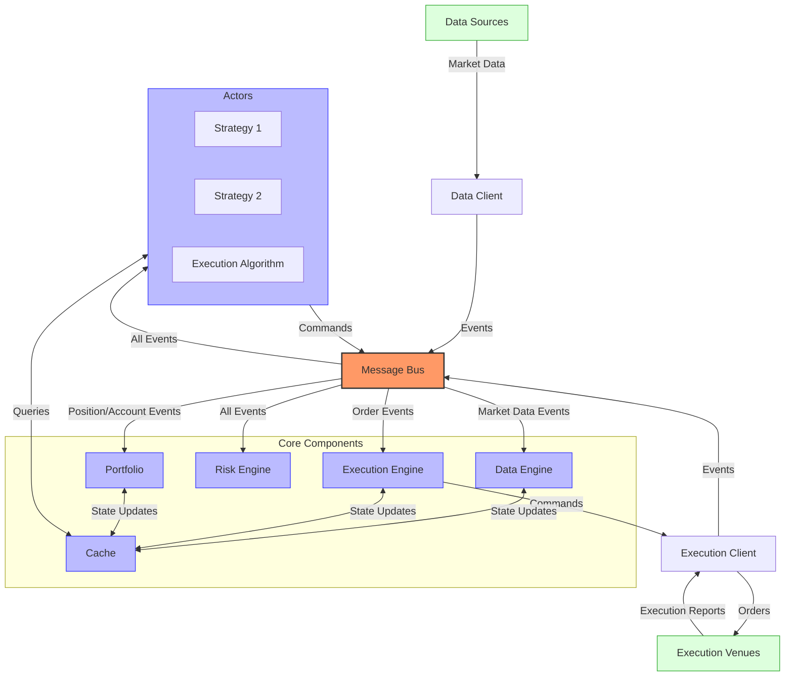
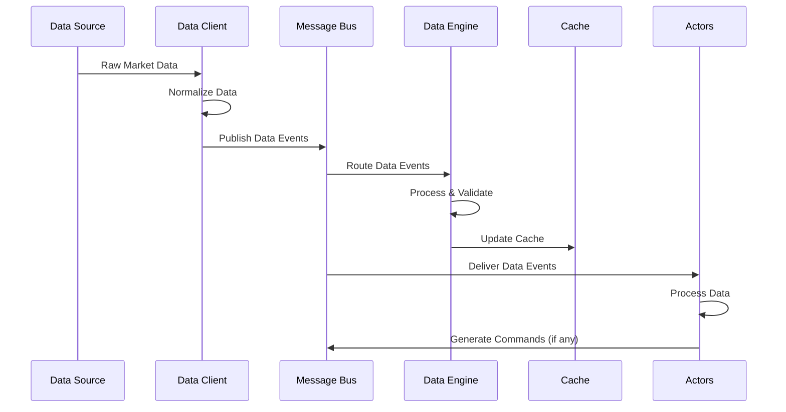
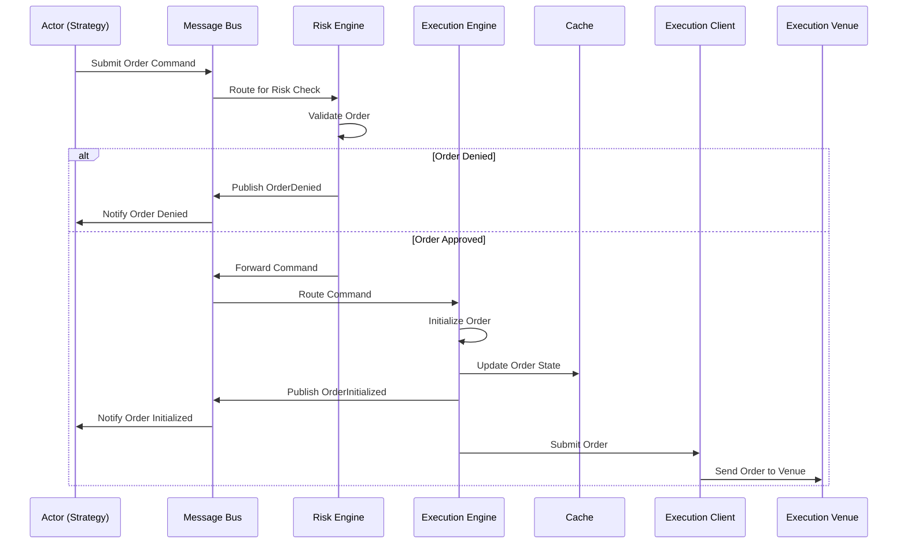
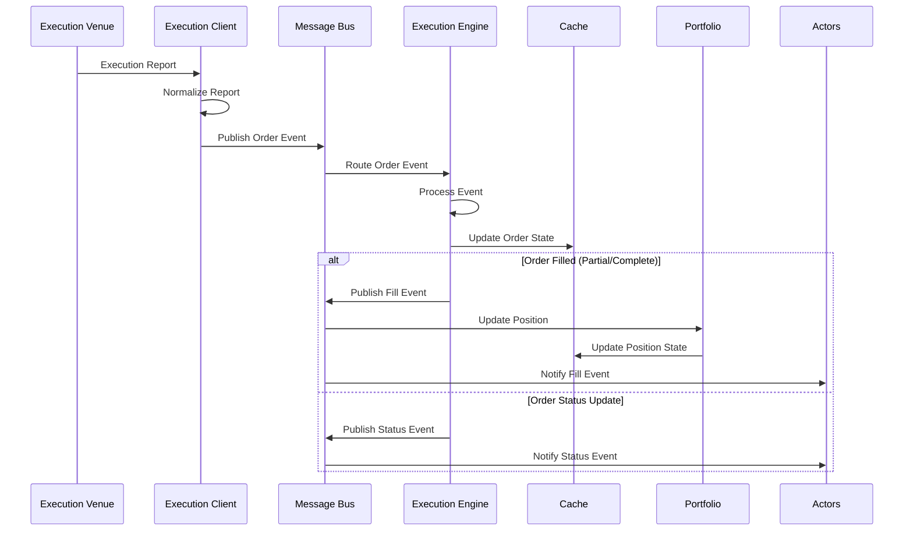
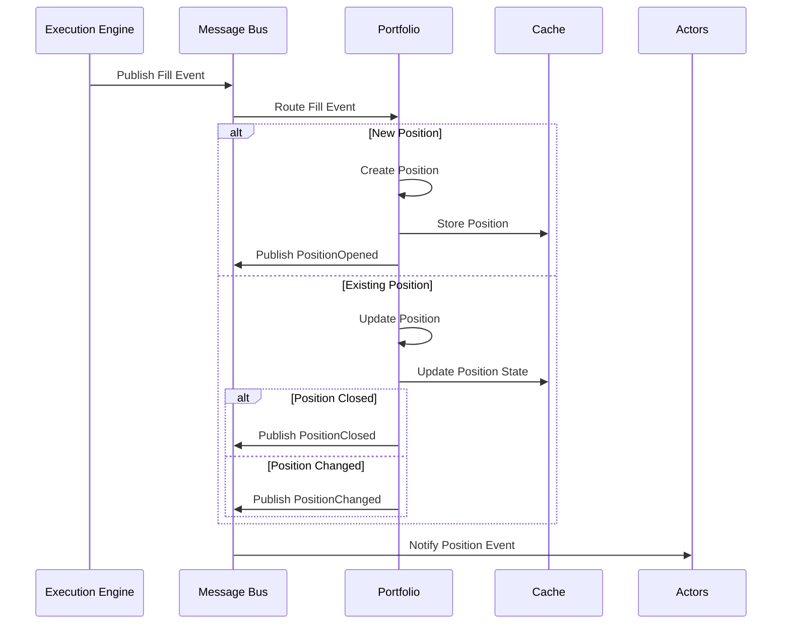
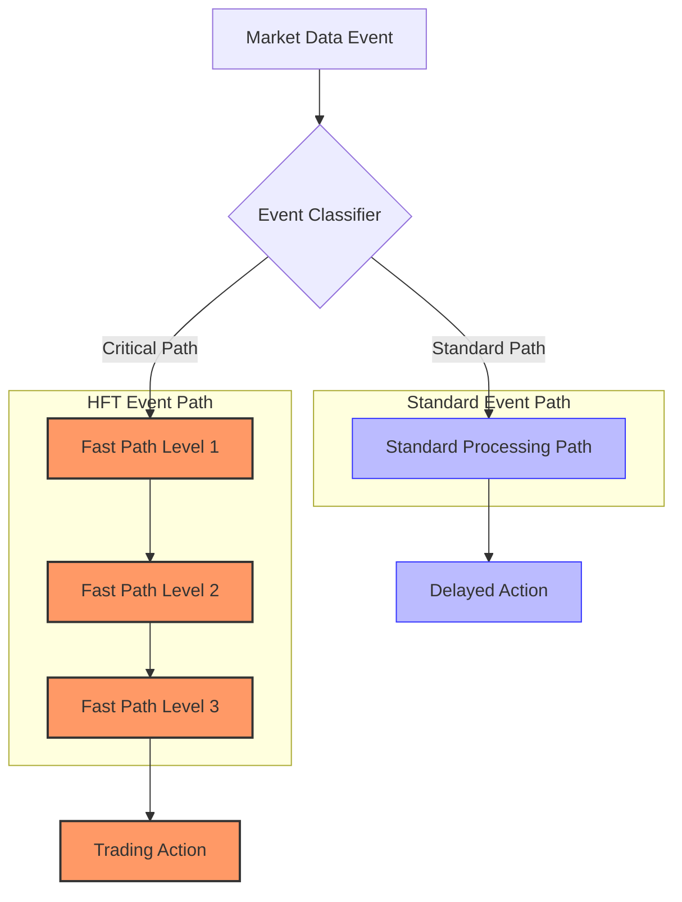

# NautilusTrader Event Flow

## Event Flow Overview

NautilusTrader uses a sophisticated event-driven architecture where events flow through a message bus to various components. This document details the event types, their flow through the system, and how they are processed.

## Rust-Powered Event Processing

NautilusTrader's core event processing infrastructure is implemented in Rust, providing several key advantages:

1. **Performance**: Rust's zero-cost abstractions and lack of garbage collection ensure minimal latency for critical event paths
2. **Memory Safety**: Rust's ownership system prevents data races and memory-related bugs at compile time
3. **Concurrency**: The tokio runtime provides efficient asynchronous I/O with a work-stealing scheduler
4. **Type Safety**: Rust's strong type system ensures events are handled correctly

The event flow uses Rust's asynchronous programming model with tokio, leveraging:

- **Channels**: For efficient message passing between components
- **Tasks**: For concurrent event processing
- **Futures**: For composable asynchronous operations
- **Streams**: For processing sequences of events

## Event Types

NautilusTrader defines a comprehensive set of event types that represent different aspects of the trading system. All events are immutable and timestamped with nanosecond precision.

### Market Data Events

- **Tick**: A price tick representing the latest trade with price, size, and timestamp
- **QuoteTick**: A quote tick representing the latest bid/ask prices and sizes
- **Bar**: A time-based or tick-based bar (OHLCV) with various aggregation options
- **Instrument**: Information about a tradable instrument including specifications and metadata
- **OrderBookDelta**: An incremental update to an order book (adds, updates, or removes)
- **OrderBookSnapshot**: A complete snapshot of an order book at a specific point in time
- **VenueStatusUpdate**: Status information about a trading venue (online, offline, etc.)
- **DataType**: Metadata about available data types for an instrument

### Order Events

- **OrderInitialized**: An order has been initialized in the system but not yet submitted
- **OrderSubmitted**: An order has been submitted to the exchange
- **OrderAccepted**: An order has been accepted by the exchange
- **OrderRejected**: An order has been rejected by the exchange with reason
- **OrderCanceled**: An order has been canceled
- **OrderExpired**: An order has expired (e.g., due to time in force)
- **OrderFilled**: An order has been filled (partially or completely)
- **OrderTriggered**: A conditional order has been triggered
- **OrderPendingUpdate**: An order update has been requested but not yet confirmed
- **OrderPendingCancel**: An order cancellation has been requested but not yet confirmed
- **OrderUpdated**: An order has been updated (e.g., price or quantity changed)
- **OrderDenied**: An order has been denied by the risk engine

### Position Events

- **PositionOpened**: A new position has been opened
- **PositionChanged**: An existing position has changed (size, avg price, etc.)
- **PositionClosed**: A position has been closed
- **PositionEvent**: A generic position event with position state information

### Account Events

- **AccountState**: The current state of an account including balances and margins
- **AccountInquiry**: A request for account information
- **BalanceUpdate**: An update to an account balance
- **MarginUpdate**: An update to account margin requirements

### System Events

- **TimeEvent**: A time-based event (e.g., for scheduled actions)
- **ComponentStateChanged**: A component's state has changed
- **TradingStateChanged**: The trading state has changed (active, halted, reducing)
- **SessionStatus**: Information about a trading session (open, closed, etc.)
- **ConnectionStateChanged**: Connection state to a venue has changed
- **CommandAck**: Acknowledgment of a command
- **CommandDenied**: A command has been denied
- **CommandRejected**: A command has been rejected
- **LogEvent**: A log message event
- **AlertEvent**: An alert notification

## Enhanced Message Bus

NautilusTrader's message bus is a high-performance component that routes events between system components. The Rust implementation provides:

- **Nanosecond Timestamps**: All events are timestamped with nanosecond precision
- **Zero-Copy Passing**: Events can be passed between components with zero copying
- **Back-Pressure Handling**: The message bus handles back-pressure gracefully
- **Prioritization**: Critical events can be prioritized over less important ones
- **Configurable Routing**: Flexible routing rules for different event types
- **Monitoring**: Comprehensive metrics for monitoring message flow and latency

## Event Processing Sequence

### Market Data Processing Pipeline

1. **Data Source** (exchange, historical data) produces raw market data
2. **Data Client** receives and normalizes the data into platform-specific events
3. Events are published to the **Message Bus**
4. **Message Bus** routes events to the **Data Engine** and subscribed components
5. **Data Engine** processes, validates, and enriches the events
6. **Data Engine** updates the **Cache** with the latest market data
7. Subscribed **Actors** (strategies, risk models) receive and process the events
8. **Actors** may generate commands based on the received data
9. Commands are sent back to the **Message Bus** for routing

### Order Submission Workflow

1. **Actor** (strategy, execution algorithm) generates an order command
2. Command is sent to the **Message Bus**
3. **Message Bus** routes the command to the **Risk Engine**
4. **Risk Engine** validates the order against risk rules
5. If denied, an **OrderDenied** event is published
6. If approved, the command is forwarded to the **Execution Engine**
7. **Execution Engine** initializes the order and updates the **Cache**
8. **Execution Engine** publishes an **OrderInitialized** event
9. **Execution Engine** submits the order to the appropriate **Execution Client**
10. **Execution Client** sends the order to the **Execution Venue**

### Execution Report Handling

1. **Execution Venue** sends an execution report
2. **Execution Client** receives and normalizes the report into platform events
3. Events are published to the **Message Bus**
4. **Message Bus** routes events to the **Execution Engine**
5. **Execution Engine** processes the events and updates the **Cache**
6. For fills, the **Execution Engine** publishes fill events
7. **Portfolio** receives fill events and updates positions
8. **Actors** receive notifications and update their internal state

### Position Update Mechanisms

1. **Execution Engine** publishes fill events to the **Message Bus**
2. **Message Bus** routes fill events to the **Portfolio**
3. **Portfolio** processes the fill and determines position impact
4. For new positions, a **PositionOpened** event is published
5. For existing positions, the position is updated
6. If a position is closed, a **PositionClosed** event is published
7. If a position is modified, a **PositionChanged** event is published
8. **Actors** receive position events and update their strategies accordingly

### High-Frequency Event Processing

For high-frequency trading applications, NautilusTrader's event processing system is optimized for ultra-low latency:

Critical event paths use several optimization techniques:

1. **Memory Pre-allocation**: Pre-allocated memory for events to avoid dynamic allocation
2. **Lock-Free Algorithms**: Lock-free data structures for concurrent access
3. **Cache-Friendly Design**: Memory layout optimized for CPU cache efficiency
4. **Zero-Copy Messages**: Messages are passed by reference when possible
5. **Minimal Context Switching**: Processing is contained within the same thread or task
6. **Batched Processing**: Events are processed in batches when appropriate
7. **SIMD Operations**: Vectorized operations for processing multiple events simultaneously

## Conclusion

NautilusTrader's event flow system combines a robust architecture with high-performance implementation. The Rust-powered core provides the reliability and performance required for mission-critical trading applications, while maintaining a clean API for strategy development.

Key advantages of the event system include:

1. **Performance**: Rust implementation ensures minimal latency for critical event paths
2. **Reliability**: Strong type system and ownership model prevent common concurrency bugs
3. **Flexibility**: Configurable routing and message patterns for different requirements
4. **Observability**: Comprehensive monitoring and logging for debugging and optimization
5. **Scalability**: The architecture supports scaling to high event throughputs

This event-driven architecture makes NautilusTrader well-suited for both research and production trading environments, from low-frequency statistical arbitrage to high-frequency market making.
