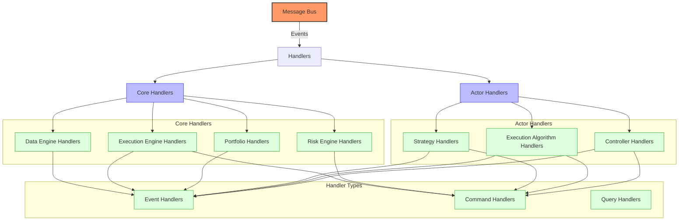
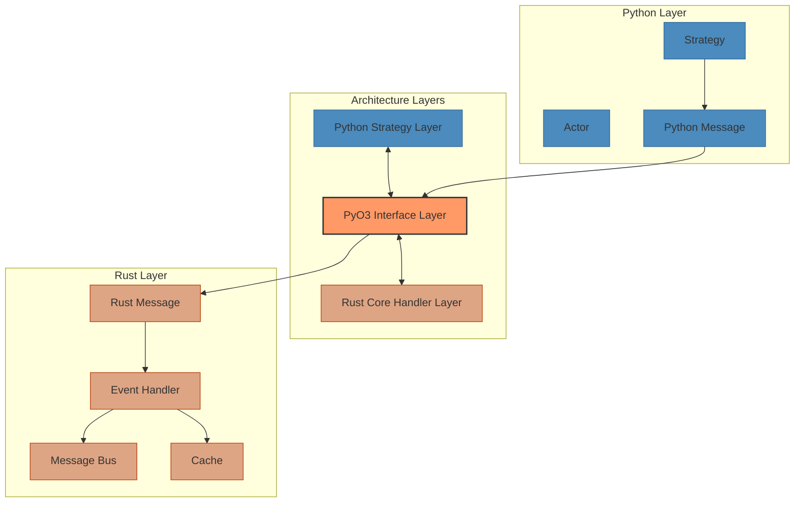
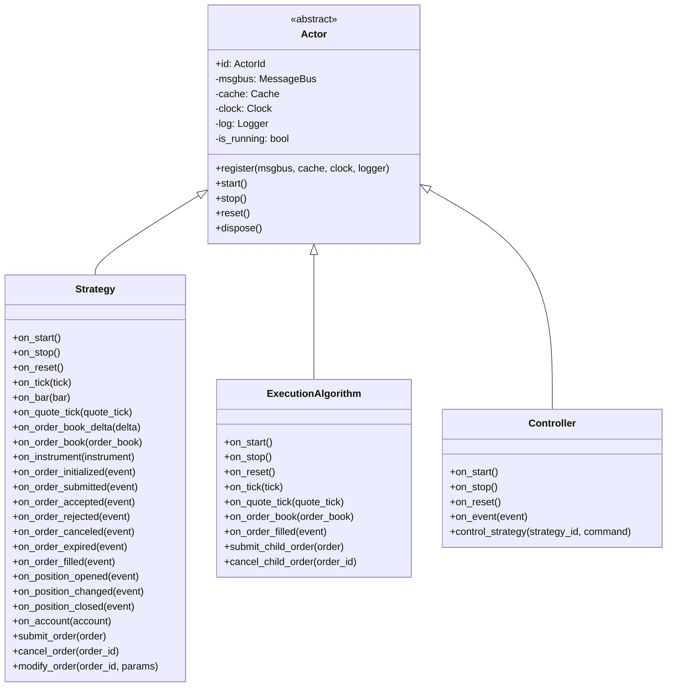
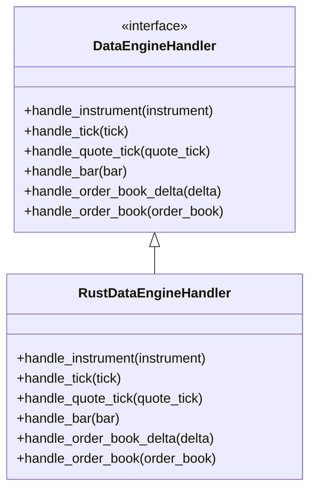
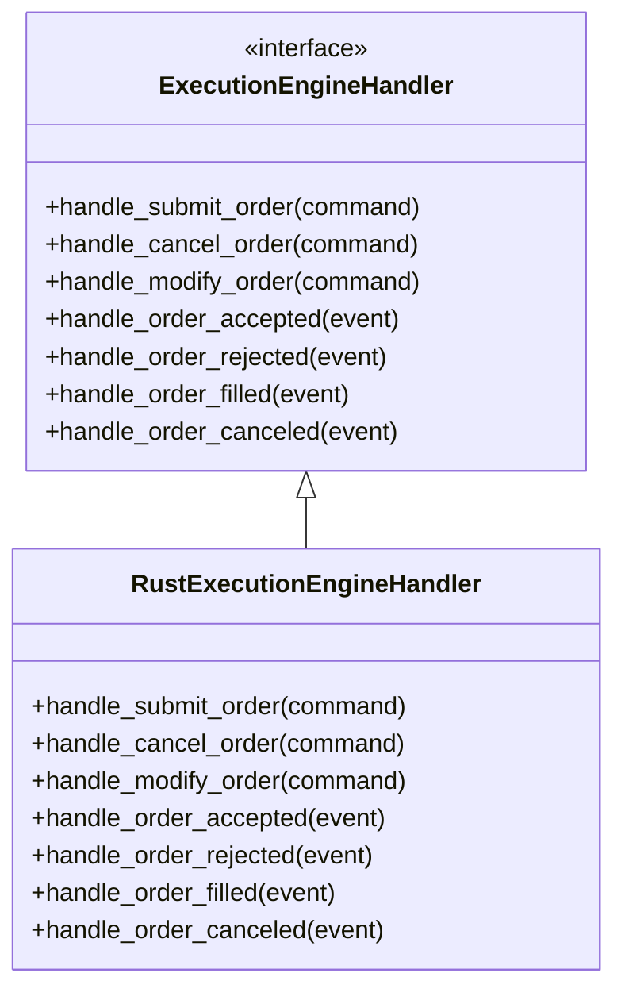
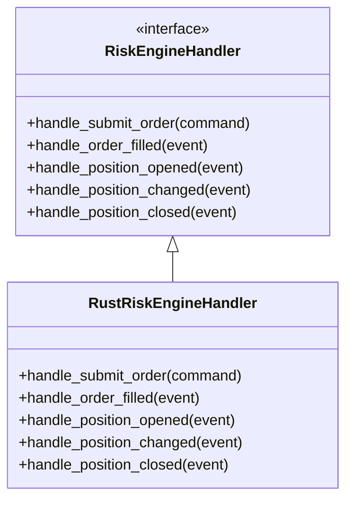
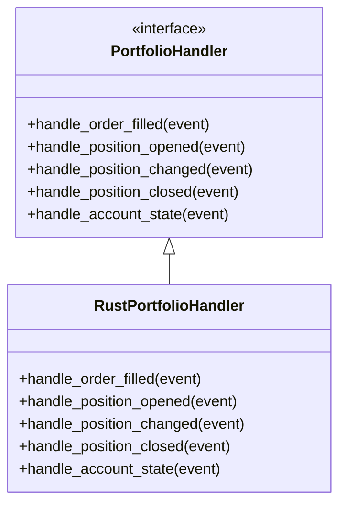

# NautilusTrader Handlers

## Handler Overview

NautilusTrader uses a handler-based architecture where different components handle specific types of events. This document details the handler interfaces, their responsibilities, and how they interact with the rest of the system.



NautilusTrader's handler architecture is designed around a message-based system where components communicate through a central message bus. Handlers are organized into two main categories:

1. **Core Handlers**: Built-in system components that handle fundamental trading operations
2. **Actor Handlers**: User-defined components that implement trading strategies and algorithms

Each handler can process different types of messages:

1. **Events**: Notifications about something that has happened (e.g., market data updates, order fills)
2. **Commands**: Instructions to perform an action (e.g., submit an order, cancel an order)
3. **Queries**: Requests for information (e.g., get current position, get order status)

## Rust-Powered Handler Implementation

NautilusTrader's core handlers are implemented in Rust with Python bindings provided through PyO3. This architecture provides several key advantages:

1. **Performance**: Rust's zero-cost abstractions ensure minimal overhead for event processing
2. **Safety**: Memory and thread safety guarantees at compile time
3. **Concurrency**: Efficient handling of concurrent events without data races
4. **Interoperability**: Seamless integration with Python through PyO3
5. **Consistency**: Unified handler implementation across all core components



## Actor Handlers



### Actor Base Class

The `Actor` class is the base class for all components that handle events in NautilusTrader. It provides the foundation for strategies, execution algorithms, and controllers.

```python
class Actor:
    """
    The base class for all actors in the trading system.
    """

    def __init__(self, actor_id: ActorId):
        self.id = actor_id
        self._msgbus = None
        self._cache = None
        self._clock = None
        self._log = None
        self._is_running = False
        self._config = {}
        self._state = {}

    def register(
        self,
        msgbus: MessageBus,
        cache: Cache,
        clock: Clock,
        logger: Logger,
    ):
        """
        Register the actor with the trading system.
        """
        self._msgbus = msgbus
        self._cache = cache
        self._clock = clock
        self._log = logger

    def start(self):
        """
        Start the actor.
        """
        self._is_running = True
        self._log.info(f"Actor {self.id} started")

    def stop(self):
        """
        Stop the actor.
        """
        self._is_running = False
        self._log.info(f"Actor {self.id} stopped")

    def reset(self):
        """
        Reset the actor to its initial state.
        """
        self._state = {}
        self._log.info(f"Actor {self.id} reset")

    def dispose(self):
        """
        Dispose of the actor.
        """
        self._msgbus = None
        self._cache = None
        self._clock = None
        self._log = None
        self._config = {}
        self._state = {}

    def save_state(self) -> Dict[str, Any]:
        """
        Save the actor's state for persistence.
        """
        return self._state.copy()

    def load_state(self, state: Dict[str, Any]) -> None:
        """
        Load the actor's state from persistence.
        """
        self._state = state.copy()
```

The Actor base class provides:

1. **Lifecycle Management**: Methods for starting, stopping, resetting, and disposing of actors
2. **System Integration**: Registration with core system components (message bus, cache, clock, logger)
3. **State Management**: Mechanisms for saving and loading actor state
4. **Configuration**: Support for actor configuration parameters

### Strategy Handler

The `Strategy` class extends `Actor` and provides the interface for implementing trading strategies. It includes a comprehensive set of event handlers and methods for order management.

```python
class Strategy(Actor):
    """
    The base class for all trading strategies.
    """

    def __init__(self, strategy_id: StrategyId):
        super().__init__(actor_id=strategy_id)
        self._instruments = {}
        self._orders = {}
        self._positions = {}
        self._indicators = {}
        self._trading_state = TradingState.ACTIVE

    # Lifecycle handlers

    def on_start(self):
        """
        Actions to be performed when the strategy starts.
        """
        pass

    def on_stop(self):
        """
        Actions to be performed when the strategy stops.
        """
        pass

    def on_reset(self):
        """
        Actions to be performed when the strategy resets.
        """
        pass

    # Market data handlers

    def on_tick(self, tick: Tick):
        """
        Actions to be performed when a tick is received.
        """
        pass

    def on_bar(self, bar: Bar):
        """
        Actions to be performed when a bar is received.
        """
        pass

    def on_quote_tick(self, quote_tick: QuoteTick):
        """
        Actions to be performed when a quote tick is received.
        """
        pass

    def on_order_book_delta(self, delta: OrderBookDelta):
        """
        Actions to be performed when an order book delta is received.
        """
        pass

    def on_order_book(self, order_book: OrderBook):
        """
        Actions to be performed when an order book is received.
        """
        pass

    def on_instrument(self, instrument: Instrument):
        """
        Actions to be performed when an instrument is received.
        """
        pass

    # Order event handlers

    def on_order_initialized(self, event: OrderInitialized):
        """
        Actions to be performed when an order is initialized.
        """
        pass

    def on_order_submitted(self, event: OrderSubmitted):
        """
        Actions to be performed when an order is submitted.
        """
        pass

    def on_order_accepted(self, event: OrderAccepted):
        """
        Actions to be performed when an order is accepted.
        """
        pass

    def on_order_rejected(self, event: OrderRejected):
        """
        Actions to be performed when an order is rejected.
        """
        pass

    def on_order_canceled(self, event: OrderCanceled):
        """
        Actions to be performed when an order is canceled.
        """
        pass

    def on_order_expired(self, event: OrderExpired):
        """
        Actions to be performed when an order is expired.
        """
        pass

    def on_order_filled(self, event: OrderFilled):
        """
        Actions to be performed when an order is filled.
        """
        pass

    # Position event handlers

    def on_position_opened(self, event: PositionOpened):
        """
        Actions to be performed when a position is opened.
        """
        pass

    def on_position_changed(self, event: PositionChanged):
        """
        Actions to be performed when a position is changed.
        """
        pass

    def on_position_closed(self, event: PositionClosed):
        """
        Actions to be performed when a position is closed.
        """
        pass

    # Account event handlers

    def on_account(self, account: Account):
        """
        Actions to be performed when an account update is received.
        """
        pass

    # Order management methods

    def submit_order(self, order: Order) -> None:
        """
        Submit an order to the execution engine.
        """
        self._msgbus.publish(
            SubmitOrder(
                trader_id=self.trader_id,
                strategy_id=self.id,
                order=order,
                command_id=UUID4(),
                ts_init=self._clock.timestamp_ns(),
            )
        )

    def cancel_order(self, order_id: OrderId) -> None:
        """
        Cancel an order.
        """
        self._msgbus.publish(
            CancelOrder(
                trader_id=self.trader_id,
                strategy_id=self.id,
                order_id=order_id,
                command_id=UUID4(),
                ts_init=self._clock.timestamp_ns(),
            )
        )

    def modify_order(self, order_id: OrderId, modify_params: OrderModifyParams) -> None:
        """
        Modify an order.
        """
        self._msgbus.publish(
            ModifyOrder(
                trader_id=self.trader_id,
                strategy_id=self.id,
                order_id=order_id,
                modify_params=modify_params,
                command_id=UUID4(),
                ts_init=self._clock.timestamp_ns(),
            )
        )
```

The Strategy class provides:

1. **Event Handlers**: Methods for handling various market data and trading events
2. **Order Management**: Methods for submitting, canceling, and modifying orders
3. **Position Tracking**: Mechanisms for tracking and managing positions
4. **Indicator Management**: Support for technical indicators and analysis
5. **State Management**: Persistence of strategy state for recovery

### Strategy Implementation Example

```python
class EMACross(Strategy):
    """
    A simple EMA crossover strategy.
    """

    def __init__(
        self,
        strategy_id: StrategyId,
        instrument_id: InstrumentId,
        bar_type: BarType,
        fast_period: int = 10,
        slow_period: int = 20,
        trade_size: Decimal = Decimal("1.0"),
        position_size_limit: Decimal = Decimal("10.0"),
    ):
        super().__init__(strategy_id=strategy_id)
        self.instrument_id = instrument_id
        self.bar_type = bar_type
        self.fast_period = fast_period
        self.slow_period = slow_period
        self.trade_size = trade_size
        self.position_size_limit = position_size_limit

        # Initialize indicators
        self.fast_ema = ExponentialMovingAverage(fast_period)
        self.slow_ema = ExponentialMovingAverage(slow_period)

        # Initialize state
        self._position_id = None
        self._instrument = None
        self._is_crossed_above = False
        self._is_crossed_below = False

    def on_start(self):
        """
        Actions to be performed when the strategy starts.
        """
        # Log strategy parameters
        self._log.info(
            "Strategy starting",
            strategy_id=self.id,
            instrument_id=self.instrument_id,
            bar_type=self.bar_type,
            fast_period=self.fast_period,
            slow_period=self.slow_period,
            trade_size=self.trade_size,
        )

        # Subscribe to instrument data
        self._msgbus.request(
            endpoint="data.instruments",
            data={"venue": self.instrument_id.venue, "symbol": self.instrument_id.symbol},
            callback=self.on_instrument,
        )

        # Subscribe to bar data
        self._msgbus.subscribe(
            topic=f"data.bar.{self.instrument_id}.{self.bar_type}",
            handler=self.on_bar,
        )

        # Subscribe to order events
        self._msgbus.subscribe(
            topic=f"order.filled.{self.id}.*",
            handler=self.on_order_filled,
        )

        # Subscribe to position events
        self._msgbus.subscribe(
            topic=f"position.opened.{self.id}.*",
            handler=self.on_position_opened,
        )
        self._msgbus.subscribe(
            topic=f"position.changed.{self.id}.*",
            handler=self.on_position_changed,
        )
        self._msgbus.subscribe(
            topic=f"position.closed.{self.id}.*",
            handler=self.on_position_closed,
        )

    def on_instrument(self, instrument: Instrument):
        """
        Actions to be performed when an instrument is received.
        """
        self._log.info(
            "Instrument received",
            instrument_id=instrument.id,
            price_precision=instrument.price_precision,
            size_precision=instrument.size_precision,
        )

        self._instrument = instrument

    def on_bar(self, bar: Bar):
        """
        Actions to be performed when a bar is received.
        """
        # Update indicators
        self.fast_ema.update(bar.close.as_double())
        self.slow_ema.update(bar.close.as_double())

        # Log indicator values
        self._log.debug(
            "Indicators updated",
            bar_timestamp=bar.ts_event,
            close_price=bar.close,
            fast_ema=self.fast_ema.value,
            slow_ema=self.slow_ema.value,
        )

        # Check if we have enough data
        if not self.fast_ema.initialized or not self.slow_ema.initialized:
            return

        # Get current position
        position = self._get_position()

        # Check for crossover (fast EMA crosses above slow EMA)
        if self.fast_ema.value > self.slow_ema.value and self.fast_ema.previous <= self.slow_ema.previous:
            self._is_crossed_above = True
            self._is_crossed_below = False

            # Generate buy signal if no position or short position
            if position is None or position.side == PositionSide.SHORT:
                self._log.info(
                    "BUY signal generated",
                    fast_ema=self.fast_ema.value,
                    slow_ema=self.slow_ema.value,
                    bar_timestamp=bar.ts_event,
                )
                self._execute_buy(bar)

        # Check for crossunder (fast EMA crosses below slow EMA)
        elif self.fast_ema.value < self.slow_ema.value and self.fast_ema.previous >= self.slow_ema.previous:
            self._is_crossed_above = False
            self._is_crossed_below = True

            # Generate sell signal if no position or long position
            if position is None or position.side == PositionSide.LONG:
                self._log.info(
                    "SELL signal generated",
                    fast_ema=self.fast_ema.value,
                    slow_ema=self.slow_ema.value,
                    bar_timestamp=bar.ts_event,
                )
                self._execute_sell(bar)

    def _execute_buy(self, bar: Bar):
        """
        Execute a buy order based on the current market conditions.
        """
        if self._instrument is None:
            self._log.warning("Cannot execute buy: instrument not available")
            return

        # Check if we have a position already
        position = self._get_position()

        # Calculate order quantity
        quantity = self._calculate_buy_quantity(position)
        if quantity <= 0:
            self._log.info("Buy quantity is zero or negative, no order generated")
            return

        # Create and submit the order
        order = order_factory.market(
            instrument_id=self.instrument_id,
            order_side=OrderSide.BUY,
            quantity=quantity,
            time_in_force=TimeInForce.GTC,
            position_id=self._position_id,
            tags=["EMA_CROSS"],
        )

        self._log.info(
            "Submitting BUY order",
            order_id=order.id,
            quantity=quantity,
            price=bar.close,
        )

        self.submit_order(order)

    def _execute_sell(self, bar: Bar):
        """
        Execute a sell order based on the current market conditions.
        """
        if self._instrument is None:
            self._log.warning("Cannot execute sell: instrument not available")
            return

        # Check if we have a position already
        position = self._get_position()

        # Calculate order quantity
        quantity = self._calculate_sell_quantity(position)
        if quantity <= 0:
            self._log.info("Sell quantity is zero or negative, no order generated")
            return

        # Create and submit the order
        order = order_factory.market(
            instrument_id=self.instrument_id,
            order_side=OrderSide.SELL,
            quantity=quantity,
            time_in_force=TimeInForce.GTC,
            position_id=self._position_id,
            tags=["EMA_CROSS"],
        )

        self._log.info(
            "Submitting SELL order",
            order_id=order.id,
            quantity=quantity,
            price=bar.close,
        )

        self.submit_order(order)

    def _calculate_buy_quantity(self, position: Optional[Position]) -> Decimal:
        """
        Calculate the quantity to buy based on the current position.
        """
        if position is None:
            # No position, use standard trade size
            return self.trade_size

        if position.side == PositionSide.SHORT:
            # Close short position and potentially open long position
            return min(abs(position.quantity) + self.trade_size, self.position_size_limit)

        # Already long, potentially increase position
        remaining_size = self.position_size_limit - position.quantity
        if remaining_size <= 0:
            return Decimal(0)  # Already at position limit

        return min(self.trade_size, remaining_size)

    def _calculate_sell_quantity(self, position: Optional[Position]) -> Decimal:
        """
        Calculate the quantity to sell based on the current position.
        """
        if position is None:
            # No position, use standard trade size
            return self.trade_size

        if position.side == PositionSide.LONG:
            # Close long position and potentially open short position
            return min(position.quantity + self.trade_size, self.position_size_limit)

        # Already short, potentially increase position
        remaining_size = self.position_size_limit - abs(position.quantity)
        if remaining_size <= 0:
            return Decimal(0)  # Already at position limit

        return min(self.trade_size, remaining_size)

    def _get_position(self) -> Optional[Position]:
        """
        Get the current position for this strategy and instrument.
        """
        if self._position_id is None:
            return None

        return self._cache.position(self._position_id)

    def on_position_opened(self, event: PositionOpened):
        """
        Actions to be performed when a position is opened.
        """
        self._log.info(
            "Position opened",
            position_id=event.position_id,
            instrument_id=event.instrument_id,
            side=event.side,
            quantity=event.quantity,
            price=event.price,
        )

        self._position_id = event.position_id

    def on_position_changed(self, event: PositionChanged):
        """
        Actions to be performed when a position is changed.
        """
        self._log.info(
            "Position changed",
            position_id=event.position_id,
            quantity=event.quantity,
            price=event.price,
        )

    def on_position_closed(self, event: PositionClosed):
        """
        Actions to be performed when a position is closed.
        """
        self._log.info(
            "Position closed",
            position_id=event.position_id,
            instrument_id=event.instrument_id,
            realized_pnl=event.realized_pnl,
        )

        self._position_id = None

    def on_order_filled(self, event: OrderFilled):
        """
        Actions to be performed when an order is filled.
        """
        self._log.info(
            "Order filled",
            order_id=event.order_id,
            instrument_id=event.instrument_id,
            price=event.price,
            quantity=event.quantity,
            commission=event.commission,
        )
```

This example demonstrates a complete implementation of a moving average crossover strategy with:

1. **Initialization**: Setting up strategy parameters and indicators
2. **Event Subscription**: Subscribing to relevant market data and trading events
3. **Signal Generation**: Detecting crossover signals from indicator values
4. **Order Management**: Creating and submitting orders based on signals
5. **Position Management**: Tracking and managing positions
6. **Risk Management**: Limiting position sizes and managing exposure
7. **Logging**: Comprehensive logging for monitoring and debugging

## Core Handler Types

NautilusTrader's core handlers are organized by functionality:

### Data Engine Handlers



The `DataEngineHandler` processes all market data events and updates the cache with the latest market state. It also generates derived data like bars from raw ticks when needed.

### Execution Engine Handlers



The `ExecutionEngineHandler` processes order-related commands and events, managing the lifecycle of orders from submission to completion.

### Risk Engine Handlers



The `RiskEngineHandler` validates order commands against risk rules and enforces trading limits.

### Portfolio Handlers



The `PortfolioHandler` processes events related to positions, accounts, and fills, maintaining the current portfolio state.

## Performance Optimizations for Handlers

NautilusTrader's handler implementation includes several performance optimizations:

1. **Message Batching**: Handlers can process multiple messages in a batch for improved efficiency
2. **Zero-Copy Messages**: Messages are passed without copying when possible
3. **Single-threaded Processing**: Critical handlers operate in a single thread to avoid synchronization overhead
4. **Lock-Free Data Structures**: Lock-free algorithms for concurrent access to shared state
5. **Memory Pre-allocation**: Pre-allocated memory pools for frequently used event types
6. **SIMD Operations**: Vectorized operations for processing multiple data points simultaneously
7. **Hot Path Optimization**: Critical code paths are highly optimized for minimal latency

## Error Handling in Handlers

Handler error handling is implemented with Rust's robust error handling patterns:

1. **Result Types**: All handler methods return `Result<T, E>` types for explicit error handling
2. **Option Types**: Optional values are explicitly represented with `Option<T>`
3. **Error Propagation**: Errors are propagated up the call stack with the `?` operator
4. **Error Context**: Errors include context information for easier debugging
5. **Graceful Degradation**: Handlers can continue operation in degraded mode after non-critical errors
6. **Circuit Breakers**: Automatic circuit breakers can halt operations when error rates exceed thresholds

## Handler Extension and Customization

NautilusTrader allows extension and customization of handlers in several ways:

1. **Actor Handlers**: Custom strategies and execution algorithms with their own event handlers
2. **Handler Composition**: Combining multiple handlers for complex behavior
3. **Handler Interception**: Intercepting and modifying events before they reach core handlers
4. **Custom Risk Rules**: Adding custom risk rules to the risk engine
5. **Data Processing Extensions**: Adding custom data processing logic to the data engine

## Conclusion

NautilusTrader's handler architecture provides a flexible and efficient way to process events in a trading system. The Rust implementation ensures high performance, while the Python interface makes it easy to develop and customize strategies. This combination of performance and flexibility makes NautilusTrader well-suited for a wide range of trading applications, from high-frequency trading to long-term portfolio management.

Key advantages of the handler architecture include:

1. **Performance**: Rust-powered handlers for critical operations
2. **Safety**: Strong static typing and memory safety
3. **Flexibility**: Easy extension and customization through Python
4. **Modularity**: Clean separation of concerns between different handler types
5. **Reliability**: Robust error handling and recovery mechanisms