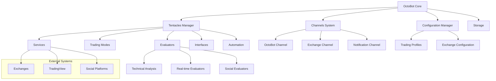

# OctoBot Trading System

## Overview

OctoBot is an open-source, modular cryptocurrency trading bot designed with flexibility and extensibility at its core. It employs a unique architecture based on a plugin system called "tentacles" that allows traders to customize trading strategies, interfaces, and services. OctoBot provides both backtesting capabilities and live trading across multiple exchanges.



## Key Components

### Core Components

1. **OctoBot Core**: The central engine that coordinates all activities and manages the lifecycle of the system.

2. **Channels System**: A publish-subscribe mechanism for asynchronous communication between components. Uses an event-driven approach to propagate information across the system.

3. **Tentacles Manager**: Handles the plugin system, allowing for dynamic loading and unloading of modules (tentacles).

4. **Configuration Manager**: Manages bot settings, exchange credentials, and trading parameters.

5. **Storage**: Handles persistent data storage for trading history, configurations, and backtesting data.

### Tentacles (Plugins)

1. **Evaluators**: 
   - Technical Analysis Evaluators: Process market data using indicators (RSI, MACD, etc.)
   - Real-time Evaluators: Process live market data
   - Social Evaluators: Analyze social media and news sources

2. **Trading Modes**: Implement trading strategies and logic for executing trades

3. **Services**: Connect to external platforms (exchanges, notification services)

4. **Interfaces**: Web UI, Telegram, Discord interfaces for user interaction

5. **Automation**: Configurable event-based automated actions and scenarios

### Key Features

1. **Backtesting Engine**: Test strategies against historical data
2. **Optimization Tool**: Fine-tune strategy parameters
3. **Multi-exchange Support**: Connect to multiple cryptocurrency exchanges
4. **Real-time Data Processing**: Handle live market data feeds
5. **Web Interface**: Configure and monitor trading activities
6. **Telegram Integration**: Remote monitoring and control

## Supported Markets and Instruments

OctoBot supports trading on numerous cryptocurrency exchanges through the CCXT library, including:

- Binance (Spot and Futures)
- Coinbase Pro
- Kraken
- Kucoin
- Bybit
- FTX
- OKX
- And many others

Supported instruments include:
- Spot trading
- Futures trading
- Margin trading (on supported exchanges)

## Performance Characteristics

- **Event-Driven Architecture**: Allows for responsive handling of market events
- **Asynchronous Processing**: Uses Python's asyncio for efficient I/O operations
- **Modular Design**: Components can be enabled/disabled to optimize resource usage
- **Resource Requirements**:
  - CPU: 1 Core/1GHz minimum
  - RAM: 250MB minimum
  - Disk: 1GB minimum
- **Scalability**: Can handle multiple markets and strategies simultaneously
- **Latency**: Typical order execution latency depends on exchange API responsiveness

## Dependencies and Requirements

### Core Dependencies
- Python 3.8+
- CCXT (for exchange connectivity)
- AsyncIO and Async-Channel (for asynchronous operations)
- Websockets (for real-time data)
- Flask (for web interface)
- TA-Lib (for technical analysis)
- NumPy and Pandas (for data processing)

### Optional Dependencies
- Telegram API (for Telegram interface)
- TensorFlow/PyTorch (for AI-based strategies)
- Plotly/Dash (for advanced charting)

## Quick Start Guide

1. **Installation**:
   ```bash
   # Using Docker (recommended)
   docker run -it -p 5001:5001 -v $(pwd)/user:/octobot/user -v $(pwd)/tentacles:/octobot/tentacles drakkarsoftware/octobot:latest
   
   # Or install from PyPI
   pip install OctoBot
   python -m octobot.cli
   ```

2. **Configuration**:
   - Access the web interface at http://localhost:5001
   - Configure exchange API keys
   - Select or customize a trading strategy
   - Configure trading pairs and timeframes

3. **Starting Trading**:
   - Begin with simulation mode to test strategies
   - Monitor performance through the web interface or Telegram
   - When satisfied, enable real trading mode

4. **Customization**:
   - Install additional tentacles for extended functionality
   - Create custom strategies using the tentacles system
   - Configure automation scenarios for event-based actions

5. **Backtesting**:
   - Use the backtesting interface to test strategies against historical data
   - Optimize parameters using the built-in optimizer

OctoBot's modular architecture and tentacles system make it highly adaptable for various trading strategies and market conditions, from technical analysis-based approaches to social sentiment-driven trading. 