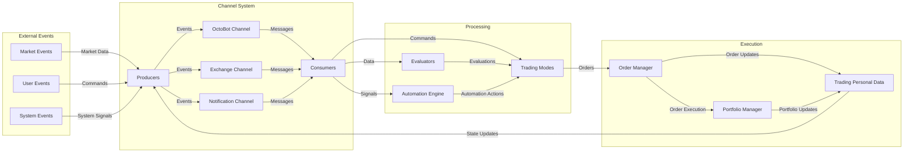
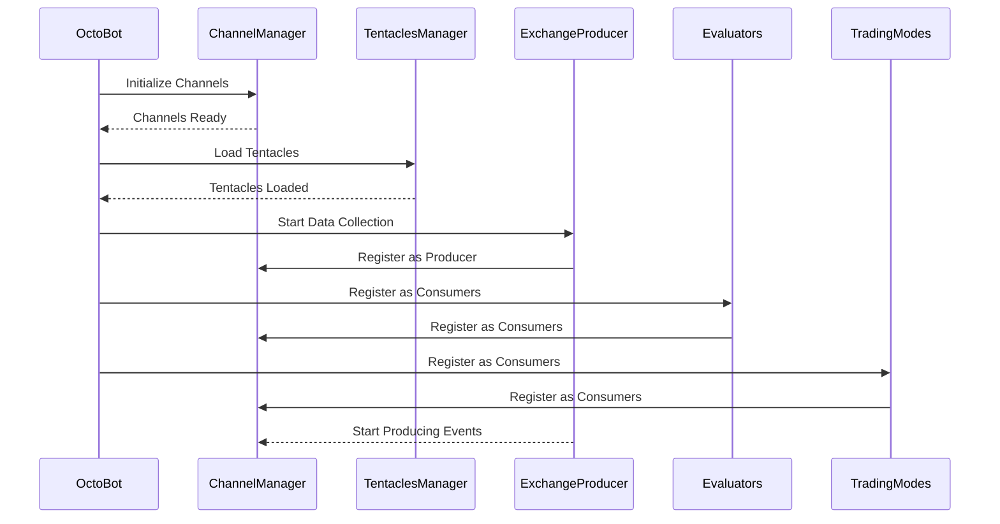
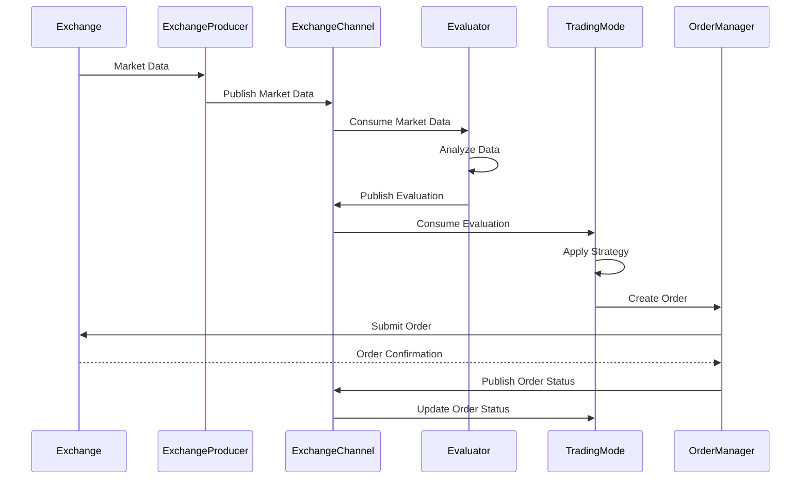
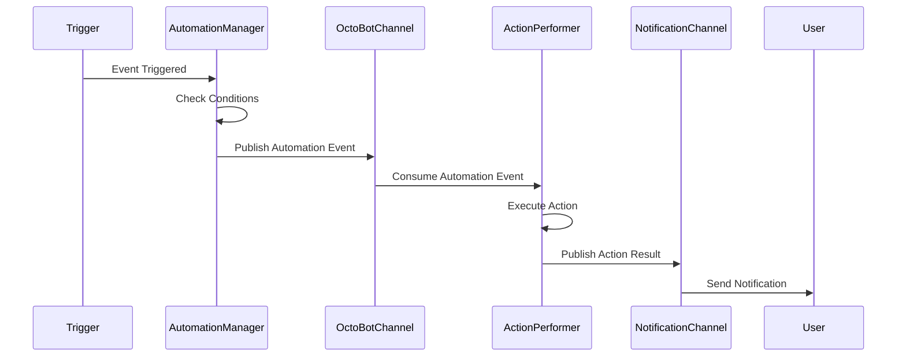
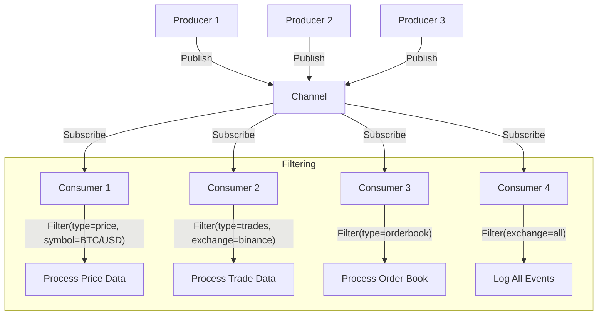
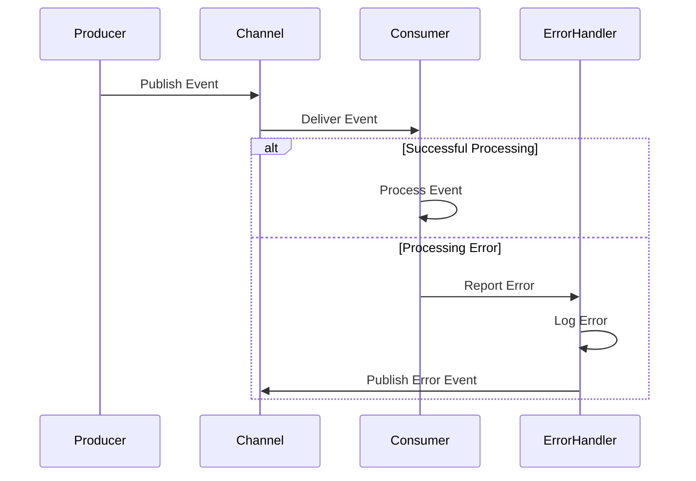

# OctoBot Event Flow

## Event Flow Overview

OctoBot uses an event-driven architecture built around a channel-based message passing system. This document details the event types, their flow through the system, and how they are processed.



## Event Types and Sources

### 1. Market Events
- **Price Updates**: Real-time price changes for trading pairs
- **Order Book Updates**: Changes to the order book (depth)
- **Trade Events**: Executed trades on the exchange
- **Candle Updates**: New candle/OHLCV data
- **Exchange Status Updates**: Exchange maintenance or operational status changes

### 2. User Events
- **Configuration Changes**: Updates to trading parameters
- **Manual Orders**: User-initiated orders through interfaces
- **Command Signals**: Start/stop trading, view portfolio, etc.
- **Strategy Adjustments**: Changes to strategy parameters

### 3. System Events
- **Initialization Events**: System startup and component initialization
- **Error Events**: Exception handling and error propagation
- **Heartbeat Signals**: Regular system health checks
- **Resource Monitoring**: CPU, memory, and network usage monitoring

## Event Processing Sequence

### Initialization Phase


### Market Data Processing Flow


### Automation Event Flow


## Channel-based Communication

OctoBot uses a publish-subscribe pattern implemented through channels. Each channel has producers that create and publish events, and consumers that subscribe to and process these events.

### Key Channels

1. **OctoBot Channel**: 
   - Core channel for system-wide communication
   - Handles high-level events like initialization, shutdown, and system notifications
   - Used for communication between major system components

2. **Exchange Channel**:
   - Handles market data and order-related events
   - Manages communication between exchange clients and trading components
   - Segments data by exchange and symbol

3. **Notification Channel**:
   - Manages alerts and communications to users
   - Handles interface updates (Web UI, Telegram, etc.)

### Producer-Consumer Model



## Event Prioritization and Processing

OctoBot implements an event prioritization system where events are processed based on their importance and the order in which they are received.

### Priority Levels

1. **High Priority (1)**: Critical system events, error handling
2. **Medium Priority (2)**: Order execution, trade management
3. **Normal Priority (3)**: Regular market data, evaluations
4. **Low Priority (4)**: Logging, non-critical updates

Consumers can register with a specific priority level and will receive events according to this priority.

### Asynchronous Processing

OctoBot processes events asynchronously using Python's asyncio framework:

```python
# Example of a consumer in OctoBot
async def example_consumer_callback(self, **kwargs):
    # Process received data
    symbol = kwargs.get("symbol")
    exchange = kwargs.get("exchange")
    price = kwargs.get("price")
    
    # Perform analysis or action based on data
    await self.perform_analysis(symbol, exchange, price)
```

## Error Handling in Event Flow

OctoBot implements robust error handling to ensure that failures in event processing don't crash the entire system.



### Error Recovery Strategies

1. **Isolation**: Errors in one component don't affect others
2. **Retry Mechanism**: Failed operations can be retried with exponential backoff
3. **Graceful Degradation**: System continues with reduced functionality if non-critical components fail
4. **Self-Healing**: Automatic restart of failed components when possible

## Event Persistence and Recovery

For critical events, OctoBot implements persistence mechanisms to ensure that important state can be recovered in case of system restart.

1. **Trading State**: Orders, positions, and portfolio state are persisted
2. **Configuration**: User settings and strategy configurations are saved
3. **Event Logs**: Critical events are logged for audit and recovery

In the event of a system restart, OctoBot can recover its state by:
1. Reloading the last known state
2. Synchronizing with exchanges to get the latest order and position information
3. Reconstructing internal state based on persisted data

This ensures continuity of trading operations even after unexpected shutdowns or system maintenance. 