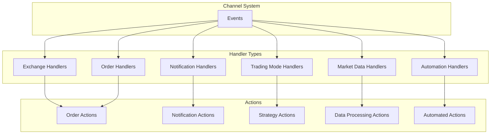
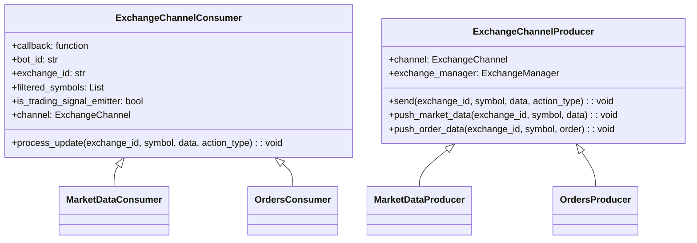
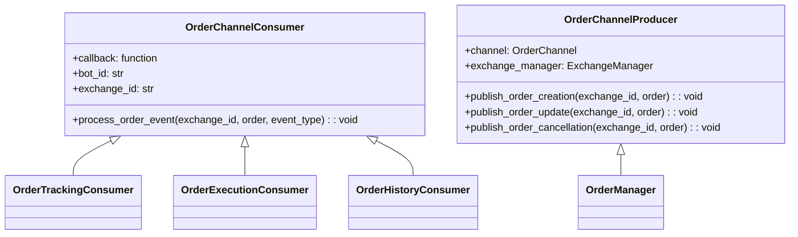
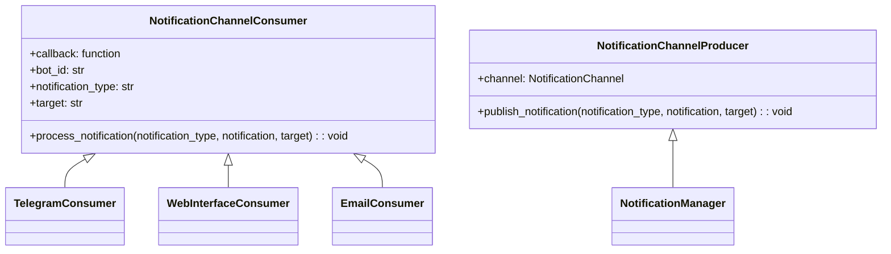
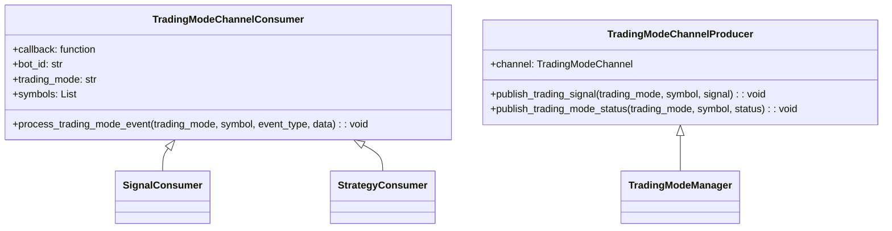
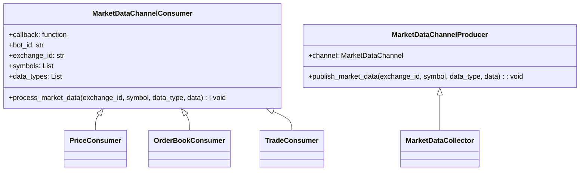
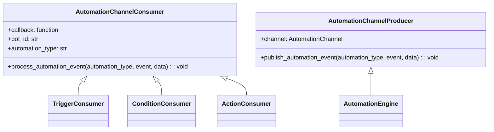
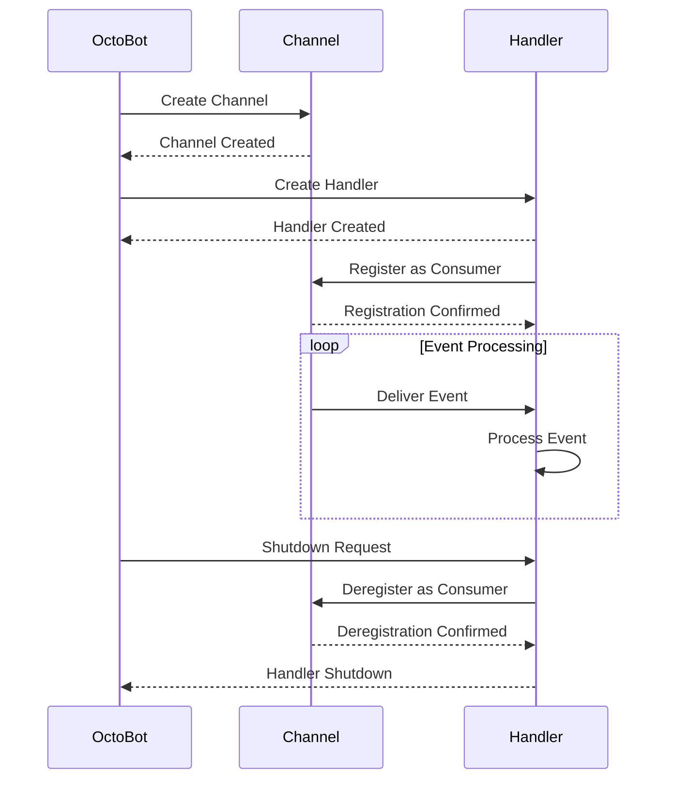

# OctoBot Handlers

## Handler Overview

OctoBot uses a handler-based architecture to process different types of events throughout the system. Handlers are specialized components that listen for specific events and execute corresponding actions. This document details the handler interfaces, their responsibilities, and how they interact with the rest of the system.



## Consumer and Producer Pattern

OctoBot handlers follow a Consumer-Producer pattern where:

1. **Producers** generate events and publish them to channels
2. **Consumers** (handlers) subscribe to channels and process the events

This pattern is implemented using the `OctoBotChannelConsumer` and `OctoBotChannelProducer` classes:

```python
class OctoBotChannelConsumer(consumers.Consumer):
    """
    Consumer adapted for OctoBotChannel
    """
    # Base consumer class for all OctoBot handlers


class OctoBotChannelProducer(producers.Producer):
    """
    Producer adapted for OctoBotChannel
    """
    
    async def run(self) -> None:
        """
        Register the producer and call producer.start()
        """
        await self.channel.register_producer(self)
        await self.start()

    async def send(self, bot_id, subject, action, data=None):
        for consumer in self.channel.get_filtered_consumers(bot_id=bot_id, subject=subject, action=action):
            await consumer.queue.put({
                "bot_id": bot_id,
                "subject": subject,
                "action": action,
                "data": data
            })
```

## Handler Types and Responsibilities

### 1. Exchange Handlers

Exchange handlers manage the communication with cryptocurrency exchanges. They handle connection management, data retrieval, and order submission.



#### Example Exchange Handler

```python
class ExchangeProducer(OctoBotChannelProducer):
    async def start(self):
        # Initialize exchange connection
        await self.exchange_manager.initialize()
        
        # Start receiving exchange data
        await self._start_markets_data_feed()
        
    async def _start_markets_data_feed(self):
        for symbol in self.exchange_manager.get_traded_symbols():
            await self.exchange_manager.subscribe_to_feed(symbol, self._on_market_data)
            
    async def _on_market_data(self, data):
        # Process received market data
        await self.send(
            self.exchange_manager.id,
            "market_data",
            "update",
            data
        )
```

### 2. Order Handlers

Order handlers manage the lifecycle of trading orders, including creation, tracking, and execution.



#### Example Order Handler

```python
class OrderConsumer(OctoBotChannelConsumer):
    async def callback(self, **kwargs):
        exchange_id = kwargs.get("exchange_id")
        order = kwargs.get("order")
        event_type = kwargs.get("event_type")
        
        if event_type == "order_created":
            await self._handle_order_creation(exchange_id, order)
        elif event_type == "order_updated":
            await self._handle_order_update(exchange_id, order)
        elif event_type == "order_canceled":
            await self._handle_order_cancellation(exchange_id, order)
        elif event_type == "order_filled":
            await self._handle_order_fill(exchange_id, order)
            
    async def _handle_order_creation(self, exchange_id, order):
        # Logic to handle new order
        self.logger.info(f"New order created: {order.id} on {exchange_id}")
        # Update portfolio, order tracking, etc.
        
    async def _handle_order_fill(self, exchange_id, order):
        # Logic to handle filled order
        self.logger.info(f"Order filled: {order.id} on {exchange_id}")
        # Update portfolio, create trade record, etc.
```

### 3. Notification Handlers

Notification handlers manage the communication of important events and alerts to the user via various interfaces.



#### Example Notification Handler

```python
class TelegramNotificationConsumer(OctoBotChannelConsumer):
    def __init__(self, callback, bot_instance):
        super().__init__(callback)
        self.telegram_client = bot_instance
        
    async def callback(self, **kwargs):
        notification_type = kwargs.get("notification_type")
        notification = kwargs.get("notification")
        
        if notification_type == "alert":
            await self._send_alert(notification)
        elif notification_type == "status":
            await self._send_status(notification)
        elif notification_type == "error":
            await self._send_error(notification)
            
    async def _send_alert(self, notification):
        message = f"🚨 ALERT: {notification['title']}\n\n{notification['message']}"
        await self.telegram_client.send_message(
            chat_id=notification.get("chat_id"),
            text=message
        )
```

### 4. Trading Mode Handlers

Trading mode handlers implement specific trading strategies and are responsible for generating trading signals and orders based on market evaluations.



#### Example Trading Mode Handler

```python
class DailyTradingModeConsumer(OctoBotChannelConsumer):
    def __init__(self, callback, trading_config):
        super().__init__(callback)
        self.trading_config = trading_config
        self.evaluation_matrix = {}
        
    async def callback(self, **kwargs):
        symbol = kwargs.get("symbol")
        evaluations = kwargs.get("evaluations")
        
        # Update evaluation matrix with new data
        self._update_evaluations(symbol, evaluations)
        
        # Generate trading signal based on evaluations
        signal = self._compute_signal(symbol)
        
        if signal:
            # If signal is generated, create appropriate orders
            await self._create_orders_from_signal(symbol, signal)
            
    def _update_evaluations(self, symbol, evaluations):
        if symbol not in self.evaluation_matrix:
            self.evaluation_matrix[symbol] = {}
            
        for evaluator_name, value in evaluations.items():
            self.evaluation_matrix[symbol][evaluator_name] = value
            
    def _compute_signal(self, symbol):
        # Strategy logic to compute trading signal
        evaluations = self.evaluation_matrix.get(symbol, {})
        
        # Example: Simple average of evaluations
        if evaluations:
            avg_eval = sum(evaluations.values()) / len(evaluations)
            
            if avg_eval > self.trading_config.get("buy_threshold", 0.7):
                return {"type": "buy", "strength": avg_eval}
            elif avg_eval < self.trading_config.get("sell_threshold", -0.7):
                return {"type": "sell", "strength": abs(avg_eval)}
                
        return None
        
    async def _create_orders_from_signal(self, symbol, signal):
        # Order creation logic based on signal
        if signal["type"] == "buy":
            # Create buy order
            pass
        elif signal["type"] == "sell":
            # Create sell order
            pass
```

### 5. Market Data Handlers

Market data handlers process and analyze incoming market data streams, including price updates, order book changes, and trade feeds.



#### Example Market Data Handler

```python
class OrderBookConsumer(OctoBotChannelConsumer):
    def __init__(self, callback, depth=10):
        super().__init__(callback)
        self.order_books = {}
        self.depth = depth
        
    async def callback(self, **kwargs):
        exchange_id = kwargs.get("exchange_id")
        symbol = kwargs.get("symbol")
        data = kwargs.get("data")
        data_type = kwargs.get("data_type")
        
        if data_type == "order_book_update":
            await self._handle_order_book_update(exchange_id, symbol, data)
            
    async def _handle_order_book_update(self, exchange_id, symbol, data):
        # Process order book update
        key = f"{exchange_id}_{symbol}"
        
        if key not in self.order_books:
            # Initialize order book for this symbol
            self.order_books[key] = {
                "bids": {},
                "asks": {}
            }
            
        # Update bids
        for price, volume in data.get("bids", []):
            if volume == 0:
                # Remove price level
                self.order_books[key]["bids"].pop(price, None)
            else:
                # Update price level
                self.order_books[key]["bids"][price] = volume
                
        # Update asks
        for price, volume in data.get("asks", []):
            if volume == 0:
                # Remove price level
                self.order_books[key]["asks"].pop(price, None)
            else:
                # Update price level
                self.order_books[key]["asks"][price] = volume
                
        # Recalculate top of book
        self._update_top_of_book(key)
        
    def _update_top_of_book(self, key):
        # Compute top of book metrics
        bids = self.order_books[key]["bids"]
        asks = self.order_books[key]["asks"]
        
        if bids and asks:
            # Calculate best bid/ask
            best_bid = max(bids.keys())
            best_ask = min(asks.keys())
            
            # Calculate spread
            spread = best_ask - best_bid
            spread_pct = (spread / best_ask) * 100
            
            self.logger.debug(
                f"Top of book updated: {key} - Bid: {best_bid}, Ask: {best_ask}, "
                f"Spread: {spread:.8f} ({spread_pct:.2f}%)"
            )
```

### 6. Automation Handlers

Automation handlers process rule-based triggers and conditions to execute automated actions in the trading system.



#### Example Automation Handler

```python
class PriceAlertConsumer(OctoBotChannelConsumer):
    def __init__(self, callback, alerts_config):
        super().__init__(callback)
        self.alerts_config = alerts_config
        self.triggered_alerts = set()
        
    async def callback(self, **kwargs):
        exchange_id = kwargs.get("exchange_id")
        symbol = kwargs.get("symbol")
        data = kwargs.get("data")
        
        if "price" in data:
            await self._check_price_alerts(exchange_id, symbol, data["price"])
            
    async def _check_price_alerts(self, exchange_id, symbol, current_price):
        key = f"{exchange_id}_{symbol}"
        
        for alert in self.alerts_config.get(key, []):
            alert_id = alert.get("id")
            
            # Skip already triggered alerts
            if alert_id in self.triggered_alerts:
                continue
                
            # Check price conditions
            condition_met = False
            
            if alert.get("condition") == "above" and current_price > alert.get("price"):
                condition_met = True
            elif alert.get("condition") == "below" and current_price < alert.get("price"):
                condition_met = True
                
            if condition_met:
                # Mark alert as triggered
                self.triggered_alerts.add(alert_id)
                
                # Execute alert action
                await self._trigger_alert_action(
                    exchange_id, 
                    symbol, 
                    current_price, 
                    alert
                )
                
    async def _trigger_alert_action(self, exchange_id, symbol, price, alert):
        # Log alert trigger
        self.logger.info(
            f"Price alert triggered: {alert.get('name')} - {symbol} "
            f"on {exchange_id} at price {price}"
        )
        
        # Perform configured action
        action_type = alert.get("action", "notify")
        
        if action_type == "notify":
            # Send notification
            await self.notification_producer.publish_notification(
                "alert",
                {
                    "title": f"Price Alert: {symbol}",
                    "message": f"{symbol} price is {alert.get('condition')} "
                               f"{alert.get('price')} (Current: {price})"
                },
                "all"
            )
        elif action_type == "order":
            # Create order based on alert configuration
            order_config = alert.get("order_config", {})
            # Create order logic here
```

## Error Handling Strategies

OctoBot implements robust error handling strategies to ensure stability and reliability of the trading system:

### 1. Exception Handling in Handlers

Each handler includes comprehensive exception handling to prevent errors from propagating and causing system failures:

```python
async def callback(self, **kwargs):
    try:
        # Process event
        await self._process_event(kwargs)
    except (ConnectionError, TimeoutError) as e:
        # Handle network-related errors
        self.logger.warning(f"Network error in handler: {e}")
        await self._handle_network_error(e)
    except ExchangeAPIError as e:
        # Handle exchange API errors
        self.logger.error(f"Exchange API error: {e}")
        await self._handle_exchange_error(e)
    except Exception as e:
        # Catch all other exceptions
        self.logger.exception(f"Unexpected error in handler: {e}")
        # Report error to tracking system
        await self._report_error(e)
```

### 2. Error Recovery Patterns

Handlers implement different recovery patterns based on the error type:

1. **Retry Pattern**: For transient errors, handlers retry the operation with exponential backoff:

   ```python
   async def _retry_operation(self, operation, *args, max_retries=3, initial_delay=1.0):
       retries = 0
       delay = initial_delay
       
       while retries < max_retries:
           try:
               return await operation(*args)
           except (ConnectionError, TimeoutError) as e:
               retries += 1
               if retries >= max_retries:
                   raise
                   
               self.logger.warning(
                   f"Operation failed, retrying in {delay:.2f}s "
                   f"({retries}/{max_retries}): {e}"
               )
               
               # Exponential backoff
               await asyncio.sleep(delay)
               delay *= 2.0
   ```

2. **Circuit Breaker Pattern**: For protecting against repeated failures:

   ```python
   class CircuitBreaker:
       def __init__(self, failure_threshold=3, reset_timeout=60.0):
           self.failure_count = 0
           self.failure_threshold = failure_threshold
           self.reset_timeout = reset_timeout
           self.state = "closed"  # closed, open, half-open
           self.last_failure_time = 0
           
       async def execute(self, operation, *args):
           current_time = time.time()
           
           # Check if circuit breaker is open
           if self.state == "open":
               if current_time - self.last_failure_time > self.reset_timeout:
                   # Move to half-open state
                   self.state = "half-open"
               else:
                   # Still in cool-down period
                   raise CircuitBreakerOpenError("Circuit breaker is open")
                   
           try:
               result = await operation(*args)
               
               # If successful and in half-open state, reset the circuit
               if self.state == "half-open":
                   self.failure_count = 0
                   self.state = "closed"
                   
               return result
               
           except Exception as e:
               self.failure_count += 1
               self.last_failure_time = current_time
               
               if self.failure_count >= self.failure_threshold:
                   self.state = "open"
                   
               raise
   ```

3. **Fallback Pattern**: For providing alternative behavior when primary operations fail:

   ```python
   async def _get_market_data_with_fallback(self, exchange_id, symbol):
       try:
           # Primary data source
           return await self._get_real_time_data(exchange_id, symbol)
       except Exception as e:
           self.logger.warning(f"Failed to get real-time data: {e}, using fallback")
           
           try:
               # Fallback to cached data
               return await self._get_cached_data(exchange_id, symbol)
           except Exception as e:
               self.logger.error(f"Fallback also failed: {e}")
               
               # Final fallback
               return self._get_default_values(symbol)
   ```

### 3. Error Propagation and Notification

OctoBot implements a standardized error propagation mechanism to ensure errors are properly logged, reported, and communicated to users:

```python
async def _handle_error(self, error, context=None):
    # 1. Log the error
    if context:
        self.logger.error(f"Error in {context}: {error}")
    else:
        self.logger.error(f"Error: {error}")
        
    # 2. Report to error tracking system (if configured)
    if self.error_reporter and isinstance(error, Exception):
        self.error_reporter.capture_exception(error)
        
    # 3. Notify user if appropriate
    if self._should_notify_user(error):
        await self.notification_producer.publish_notification(
            "error",
            {
                "title": "Error Detected",
                "message": str(error),
                "level": self._get_error_level(error),
                "context": context
            },
            "all"
        )
        
    # 4. Take remedial action if needed
    await self._apply_error_recovery(error, context)
```

## Handler Registration and Lifecycle

Handlers in OctoBot follow a clear lifecycle from registration to deregistration:



### Handler Registration Example

```python
async def register_order_handler(self, callback, exchange_id=None, priority_level=1):
    consumer = OrderConsumer(callback)
    
    await self.order_channel.new_consumer(
        callback=consumer.callback,
        size=1000,  # Queue size
        priority_level=priority_level,
        exchange_id=exchange_id or channel_constants.CHANNEL_WILDCARD
    )
    
    self.logger.info(f"Registered order handler for exchange: {exchange_id or 'all'}")
    return consumer
```

## Performance Considerations

OctoBot's handler system is designed with performance in mind, using several optimizations:

1. **Event Filtering**: Handlers can specify filters to only receive relevant events, reducing unnecessary processing:

   ```python
   # Register consumer with specific filters
   await channel.new_consumer(
       callback=consumer.callback,
       exchange_id="binance",
       symbol="BTC/USDT",
       data_type="trade"
   )
   ```

2. **Queue Management**: Handlers use internal queues with configurable sizes to prevent memory issues during high event volumes.

3. **Prioritization**: Critical handlers (like order processing) can be given higher priority than analytics or notification handlers.

4. **Asynchronous Processing**: All handlers operate asynchronously to avoid blocking the main event loop.

5. **Resource Pooling**: For resource-intensive operations, handlers can use shared thread or process pools:

   ```python
   class ComputeIntensiveHandler(OctoBotChannelConsumer):
       def __init__(self, callback, max_workers=4):
           super().__init__(callback)
           self.process_pool = concurrent.futures.ProcessPoolExecutor(max_workers=max_workers)
           
       async def _process_intensive_calculation(self, data):
           loop = asyncio.get_event_loop()
           return await loop.run_in_executor(
               self.process_pool,
               self._cpu_bound_calculation,
               data
           )
           
       def _cpu_bound_calculation(self, data):
           # CPU-intensive calculation
           return result
   ```

By combining these handler patterns and error handling strategies, OctoBot achieves a robust, maintainable, and extensible trading system architecture. 