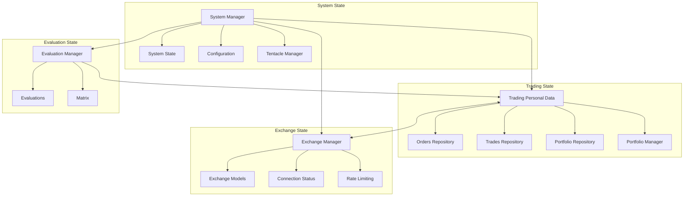
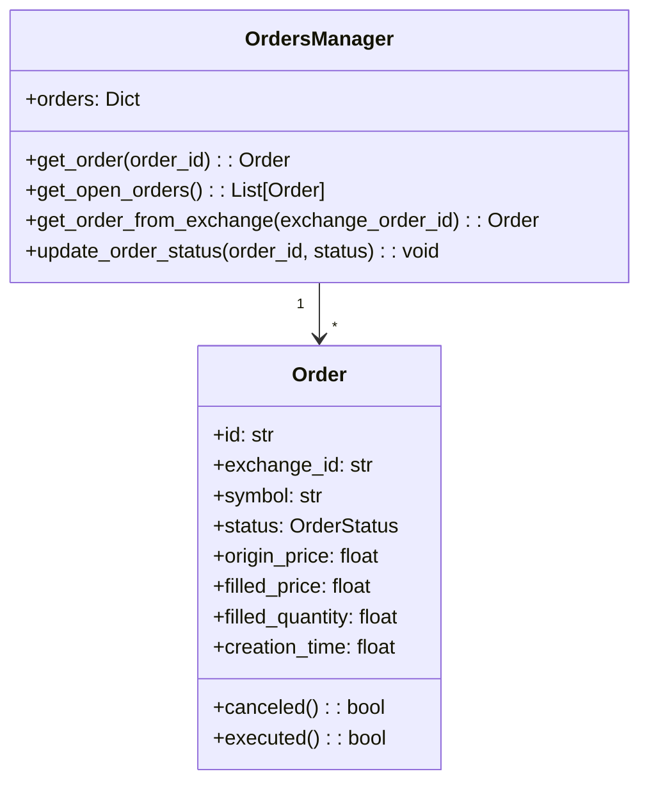
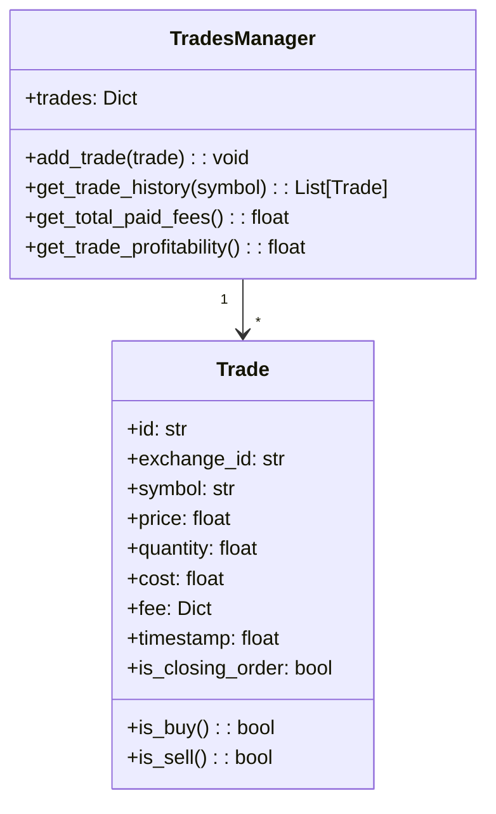
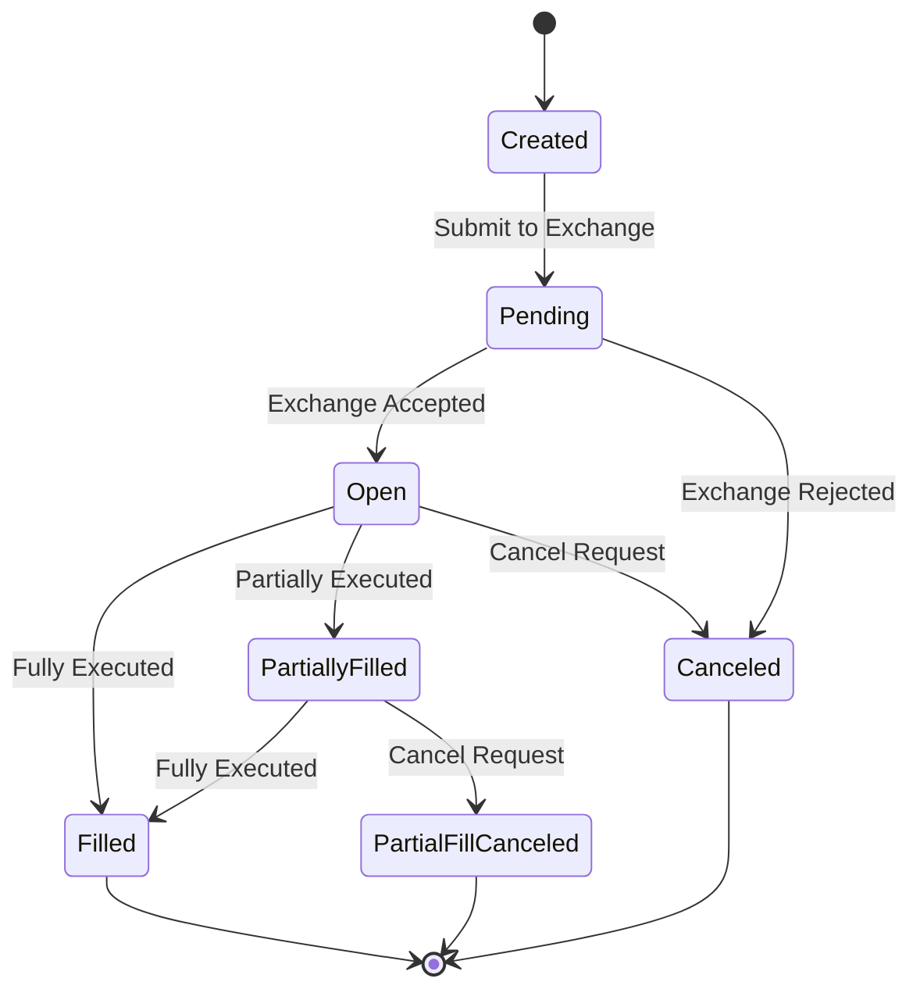
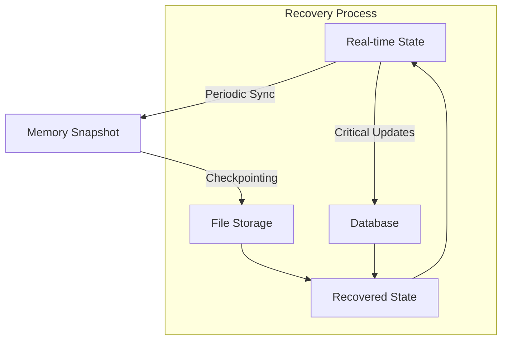
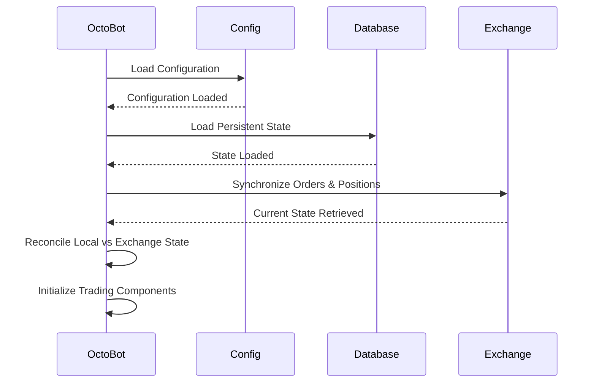

# OctoBot State Management

## State Model Overview

OctoBot's state management system is designed to maintain a consistent view of the trading environment across multiple components. The state model tracks critical information like orders, trades, portfolio balance, and system configuration.



## State Components and Repositories

### 1. Trading Personal Data

The `TradingPersonalData` is the central state repository for all trading-related information:

```python
class TradingPersonalData:
    def __init__(self):
        self.orders_manager = OrdersManager()
        self.trades_manager = TradesManager()
        self.portfolio_manager = PortfolioManager()
        self.positions_manager = PositionsManager()
```

#### Orders Repository

Maintains the state of all orders across exchanges:

- Orders by ID, symbol, and exchange
- Order status (pending, open, closed, canceled)
- Order history and execution details



#### Trades Repository

Tracks executed trades:

- Trade execution details (price, quantity, timestamp)
- Trade history by symbol and exchange
- Profit/loss calculations



#### Portfolio Repository

Manages account balances and positions:

- Currency balances (available, locked)
- Position tracking for margin/futures trading
- Allocation and valuation

### 2. System State

Tracks the overall system state:

- Configuration values
- Running tentacles (active plugins)
- System health and resource usage
- Initialization state

### 3. Exchange State

Maintains connection and status for all configured exchanges:

- Connection status
- Rate limiting information
- Market data caches
- Exchange metadata (supported features, pairs)

### 4. Evaluation State

Stores the results of strategy evaluations:

- Technical indicator values
- Social evaluations
- Composite strategy evaluations
- Trading signal history

## State Transitions and Triggers

OctoBot's state transitions follow clearly defined paths, primarily triggered by events flowing through the channel system.

### Order State Transitions



Each state transition is logged and propagated to interested components through the channel system.

### Example State Transition

```python
# Order state transition example
async def update_order_status(self, order_id, new_status, exchange_data=None):
    order = self.get_order(order_id)
    if order:
        old_status = order.status
        order.status = new_status
        
        # Update related data
        if new_status == OrderStatus.FILLED and old_status != OrderStatus.FILLED:
            await self._process_order_filled(order, exchange_data)
            
        # Notify state change via channels
        await self.exchange_channel.publish_order_update(order)
```

## Persistence Mechanisms

OctoBot implements several persistence mechanisms to ensure state can be recovered and maintained across restarts:

### 1. Database Storage

For critical trading data, OctoBot uses database storage:

- SQLite for portable installations
- PostgreSQL for larger deployments
- Database migrations to handle schema changes

### 2. File-based Storage

Configuration and non-time-sensitive data use file-based storage:

- JSON configuration files
- YAML for tentacle configuration
- CSV for historical data

### 3. Memory Caching

Frequently accessed data is cached in memory:

- LRU caches for market data
- In-memory state for active trading components
- Reference counting for shared resources

### 4. Persistence Strategy

OctoBot employs a multi-tier persistence strategy:



## Recovery Procedures

When recovering from a shutdown or crash, OctoBot follows these procedures:

### 1. State Initialization



### 2. State Reconciliation

When local state differs from exchange state (e.g., after a crash), OctoBot reconciles the differences:

- Open orders are verified against exchange records
- Portfolio balances are updated from exchange
- Completed trades are imported and matched
- Out-of-sync states are logged and corrected

### 3. Interrupted Operation Recovery

For operations interrupted by restart:

- Pending orders are checked and updated
- Long-running operations are either continued or rolled back
- Automation triggers are re-evaluated

## Thread Safety and Concurrency

OctoBot is designed to handle concurrent state access safely through various mechanisms:

### 1. Async/Await Pattern

Most state modifications use the async/await pattern to avoid blocking:

```python
async def update_portfolio(self, currency, value, available=True):
    async with self._portfolio_lock:
        # Update portfolio state safely
        self.portfolio[currency] = value
        # Notify changes
        await self.portfolio_channel.publish_portfolio_update(self.portfolio)
```

### 2. Locking Mechanisms

Critical sections use asyncio locks to prevent race conditions:

```python
class PortfolioManager:
    def __init__(self):
        self._portfolio_lock = asyncio.Lock()
        self._portfolio = {}
```

### 3. Thread-local Storage

For components that must run in separate threads:

```python
import threading

class ThreadLocalState:
    _local = threading.local()
    
    @classmethod
    def get_current_state(cls):
        if not hasattr(cls._local, "state"):
            cls._local.state = {}
        return cls._local.state
```

### 4. Event Ordering

The channel system maintains event ordering to ensure consistent state transitions:

- Events are processed in priority order
- Related events are sequenced correctly
- Consumers process events in the order received

## Examples in Key Components

### Portfolio Manager Example

```python
class PortfolioManager:
    def __init__(self, exchange_manager):
        self.exchange_manager = exchange_manager
        self.portfolio = {}
        self.portfolio_value_holder = PortfolioValueHolder(self)
        self._portfolio_lock = asyncio.Lock()
        
    async def handle_balance_update(self, balance_update):
        async with self._portfolio_lock:
            for currency, values in balance_update.items():
                if currency not in self.portfolio:
                    self.portfolio[currency] = {
                        "available": 0,
                        "total": 0
                    }
                
                if "available" in values:
                    self.portfolio[currency]["available"] = values["available"]
                
                if "total" in values:
                    self.portfolio[currency]["total"] = values["total"]
            
            # Update portfolio valuation
            await self.portfolio_value_holder.update_portfolio_value()
```

### Order Manager Example

```python
class OrderManager:
    def __init__(self, exchange_manager):
        self.exchange_manager = exchange_manager
        self.orders = {}
        self._order_lock = asyncio.Lock()
        
    async def create_order(self, order_type, symbol, quantity, price=None):
        # Create order object
        order = Order(order_type, symbol, quantity, price)
        
        async with self._order_lock:
            self.orders[order.id] = order
            
            try:
                # Submit to exchange
                exchange_order = await self.exchange_manager.create_order(order)
                
                # Update with exchange data
                order.exchange_id = exchange_order.get("id")
                order.status = OrderStatus.OPEN
                
                # Publish order creation event
                await self.exchange_manager.exchange_channel.publish_order_update(order)
                
                return order
                
            except Exception as e:
                # Handle order creation error
                order.status = OrderStatus.CANCELED
                order.error = str(e)
                
                # Publish order error event
                await self.exchange_manager.exchange_channel.publish_order_error(order, e)
                
                raise
```

This state management approach ensures that OctoBot maintains a consistent view of trading operations across all components while safely handling concurrent operations and providing recovery mechanisms for system restarts or failures. 