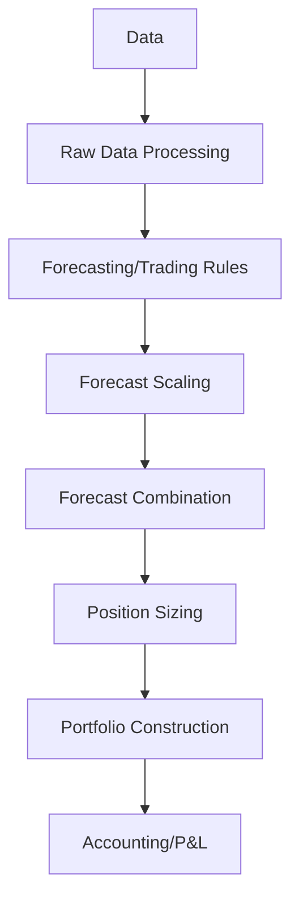

# pysystemtrade Trading System

## System Overview

pysystemtrade is a fully-featured, modular, event-driven trading system framework developed by Robert Carver, author of "Systematic Trading" and "Smart Portfolios". It's designed to implement systematic trading strategies across multiple futures markets with a strong focus on portfolio construction, risk management, and trading rule combination.


### Key Components

pysystemtrade is organized into a hierarchical structure with distinct components:

1. **System** - The core object that orchestrates all components and provides the main API for creating and running trading systems.
2. **Stages** - Modular components each responsible for a specific aspect of the trading process (forecasting, position sizing, risk management, etc.).
3. **Data** - Handles multiple data sources and provides a standardized interface for accessing historical price data.
4. **Config** - Configuration object that defines system behavior and parameters.
5. **Production Framework** - Extends the backtesting system to handle live trading operations.
6. **Risk Management** - Comprehensive risk management at both the instrument and portfolio levels.

### Supported Markets and Instruments

pysystemtrade is primarily designed for:

- Futures markets
- ETFs
- Any tradeable instrument with historical price data
- Multiple asset classes (equities, fixed income, commodities, FX)

### Performance Characteristics

- **Speed**: Moderate - Optimized for practical research rather than high-frequency trading
- **Memory Usage**: Moderate - Uses caching to improve performance but can be memory-intensive for large datasets
- **Scalability**: Medium - Designed for dozens to hundreds of instruments
- **Latency**: Not designed for ultra-low latency applications
- **Concurrency**: Supports multi-threaded operations for certain processes

### Dependencies and Requirements

- **Core Dependencies**:
  - Python 3.6+
  - pandas
  - numpy
  - matplotlib
  - pyyaml
  - arctic (for database storage)
  - ib_insync (for Interactive Brokers integration)
- **Optional Dependencies**:
  - MongoDB (for data storage)
  - psycopg2 (for PostgreSQL support)
  - Flask (for dashboard)

### Quick Start Guide

```python
from sysdata.sim.csv_futures_sim_data import csvFuturesSimData
from systems.provided.example.rules import ewmac_forecast_with_defaults as ewmac
from systems.forecasting import Rules
from systems.basesystem import System
from systems.forecast_scale_cap import ForecastScaleCap
from sysdata.config.configdata import Config

# Load data
data = csvFuturesSimData()

# Create trading rules
my_rules = Rules(dict(ewmac=ewmac))

# Create a configuration
my_config = Config()
my_config.instruments = ["EDOLLAR", "US10", "CORN", "SP500"]
my_config.use_forecast_scale_estimates = True

# Add forecast scaling
fcs = ForecastScaleCap()

# Create and run the system
my_system = System([fcs, my_rules], data, my_config)

# Get forecasts
forecast = my_system.rules.get_raw_forecast("EDOLLAR", "ewmac")
```

## Architecture

pysystemtrade implements a "pipeline" architecture where data flows through multiple independent stages. Each stage performs specific functions and passes data to the next stage:



All stages are connected through the central `System` object, which provides caching and dependency resolution to ensure that calculations are performed efficiently.

## Key Features

- **Modular Design** - Each component is independent and can be replaced or extended
- **Robust Backtesting** - Comprehensive backtesting framework with realistic trading costs
- **Portfolio Optimization** - Advanced portfolio construction and optimization
- **Production Ready** - Complete framework for transitioning from backtesting to live trading
- **Data Storage** - Multiple storage backends (MongoDB, CSV, SQL)
- **Interactive Brokers Integration** - Ready-to-use connection to Interactive Brokers
- **Risk Management** - Sophisticated risk management techniques
- **Reporting** - Detailed performance reporting and analysis

## Use Cases

pysystemtrade is particularly well-suited for:

1. **Medium-frequency Futures Trading** - Trading strategies with holding periods of days to months
2. **Multi-asset Portfolios** - Managing diversified portfolios across different asset classes
3. **Academic Research** - Exploring systematic trading concepts and portfolio theory
4. **Professional Asset Management** - Implementing robust portfolio management systems 