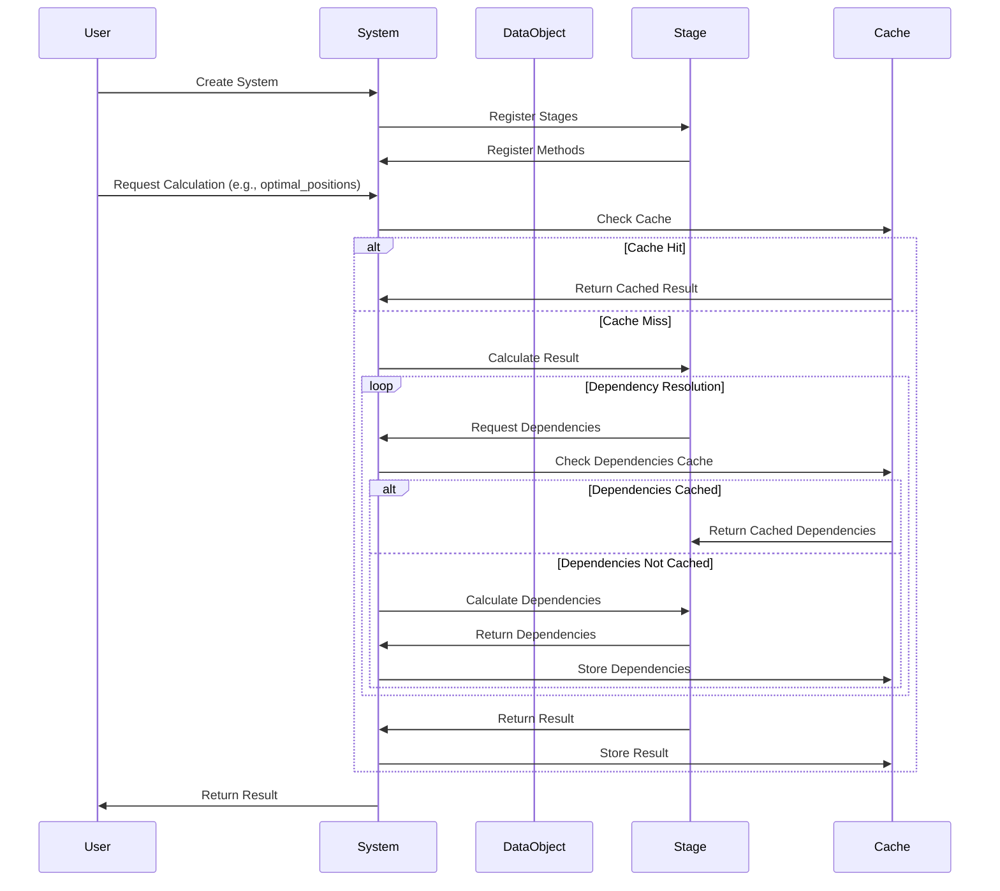
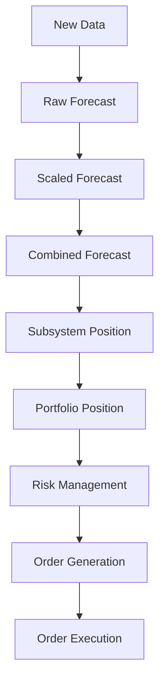

# Event Flow in pysystemtrade

## Detailed Event Flow

pysystemtrade implements a data-driven event flow architecture where calculations are performed on-demand through a dependency resolution mechanism rather than using an explicit event loop. This approach creates an implicit event flow where data changes propagate through the system.



## Event Types and Their Purposes

While pysystemtrade doesn't use explicit event objects, the system implicitly handles several types of "events" or triggers that drive the calculation flow:

### 1. Data Update Events

When new market data arrives, it triggers a cascade of recalculations:

```python
# Update price for an instrument
data.update_prices("EURUSD")

# This implicitly triggers recalculation of any dependent values 
# when they are next requested
system.portfolio.get_notional_position("EURUSD")  # Will use updated data
```

### 2. Trading Rule Calculation Events

Trading rules are evaluated based on updated data:

```python
# This triggers trading rule evaluation for the specified instrument
forecast = system.rules.get_raw_forecast("EURUSD", "ewmac")
```

### 3. Position Change Events

When the suggested position for an instrument changes:

```python
# Calculate new optimal position (triggers event internally)
new_position = system.portfolio.get_notional_position("EURUSD")

# In production, this would trigger an order
```

### 4. Risk Management Events

When risk limits are exceeded:

```python
# Check if position exceeds risk limits (triggers internal risk calculations)
is_safe = system.risk.position_within_limits("EURUSD", proposed_position)
```

## Event Processing Sequence

Although pysystemtrade doesn't have an explicit event loop, the sequence of operations follows a clear pattern:

1. **Data Acquisition**: New market data is received or loaded
2. **Trading Rule Evaluation**: Trading rules generate raw forecasts
3. **Forecast Scaling**: Raw forecasts are scaled and capped
4. **Forecast Combination**: Multiple forecasts are weighted and combined
5. **Position Sizing**: Position sizes are calculated from combined forecasts
6. **Portfolio Construction**: Positions are adjusted for portfolio-level concerns
7. **Risk Management**: Positions are checked against risk limits
8. **Order Generation**: Orders are generated to reach target positions
9. **Execution**: Orders are executed in the market (production only)



## Timing Considerations

The system handles timing in several ways:

1. **Backtest Mode**: Time advances discretely between data points
2. **Production Mode**: Time advances in real-time with scheduled events

In production mode, pysystemtrade uses a message broker system to coordinate timing:

```python
# Register a daily process to run at a specific time
data_process = scheduledProcess(
    function=system_method,
    data=data,
    process_name="run_systems",
    frequency="daily",
    run_on_completion=False,
    execution_time="19:00",
)
```

## Error Handling in the Event Flow

pysystemtrade implements several error-handling mechanisms:

1. **Resilient Data Handling**: Missing data is gracefully handled through padding/interpolation
2. **Calculation Recovery**: If a calculation fails, the system attempts fallback methods
3. **Production Safeguards**: Sanity checks prevent extreme position changes
4. **Logging**: Comprehensive logging of all processes for debugging

```python
# Example of error handling in production code
try:
    optimal_position = system.portfolio.get_notional_position("EURUSD")
except Exception as e:
    # Log error
    log.critical("Error calculating position: %s" % str(e))
    
    # Use previous position as fallback
    optimal_position = previous_position
```

## Practical Example: Full Calculation Flow

This example illustrates the full event flow when calculating a position:

```python
# Create system
my_system = System([Account(), PortfolioRules(), ForecastCombine(), 
                    ForecastScaleCap(), Rules()], data, config)

# Request a position (this triggers the full calculation chain)
position = my_system.portfolio.get_notional_position("EURUSD")

# Under the hood, the following occurs:
# 1. System checks if position is cached
# 2. If not, requests portfolio to calculate position
# 3. Portfolio needs forecast combination, which may not be cached
# 4. Forecast combiner needs individual forecasts, which may not be cached
# 5. Raw forecasts need price data
# 6. Each calculation result is cached for future use
# 7. Final position is returned
```

The calculation flow adaptively handles dependencies, ensuring that only necessary calculations are performed when data changes. 