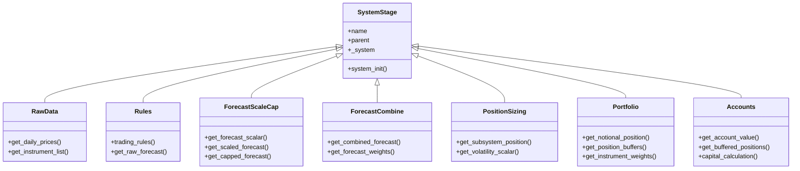

# Handlers in pysystemtrade

## Handler Interfaces and Responsibilities

pysystemtrade uses a modular approach to handling different aspects of the trading process through specialized "stage" objects. While not called "handlers" explicitly, these components serve similar functions as handlers in other trading systems.



### Key Handler Types and Responsibilities

#### 1. Data Handlers

Data handlers manage market data access and processing:

```python
class simData(object):
    def __init__(self):
        self._prices = {}
        
    def get_raw_price(self, instrument_code):
        return self._prices.get(instrument_code)
        
    def get_instrument_list(self):
        return list(self._prices.keys())
```

**Responsibilities**:
- Loading and providing price data
- Ensuring data consistency
- Handling missing data
- Preprocessing data (adjusting for rolls, etc.)

#### 2. Trading Rule Handlers

Trading rule handlers encapsulate trading logic:

```python
class TradingRule(object):
    def __init__(self, function, data=None, other_args=None):
        self._function = function
        self._data = data
        self._other_args = other_args

    def call(self, system, instrument_code):
        # Get data
        if self._data is None:
            data = system.data.daily_prices(instrument_code)
        else:
            data = self._data

        # Call trading rule function with arguments
        return self._function(data, **self._other_args)
```

**Responsibilities**:
- Executing trading logic
- Generating raw forecasts
- Handling different types of indicators
- Maintaining trading rule parameters

#### 3. Risk Management Handlers

Risk handlers ensure the system operates within risk parameters:

```python
class Risk(SystemStage):
    def get_instrument_risk(self, instrument_code):
        # Calculate instrument-specific risk
        position = self.parent.portfolio.get_notional_position(instrument_code)
        price = self.parent.data.get_current_price(instrument_code)
        volatility = self.parent.data.get_daily_percentage_volatility(instrument_code)
        
        value_in_risk = position * price * volatility
        return value_in_risk
```

**Responsibilities**:
- Calculating position-specific risk measures
- Applying risk limits
- Adjusting positions based on risk constraints
- Monitoring overall portfolio risk

#### 4. Order Handlers

Order handlers manage the creation and execution of orders:

```python
class orderHandlerEmulator(object):
    def __init__(self):
        self._orders = []
        
    def create_order(self, instrument_code, trade_qty, order_type="market"):
        order = Order(instrument_code, trade_qty, order_type)
        self._orders.append(order)
        return order
        
    def execute_orders(self):
        for order in self._orders:
            if order.status == "created":
                self._execute_order(order)
```

**Responsibilities**:
- Creating order objects
- Managing order state
- Submitting orders to brokers
- Tracking order execution
- Handling order fills, cancellations, and rejections

#### 5. Position Management Handlers

Position handlers track and manage portfolio positions:

```python
class portfolioPositionHandler(object):
    def __init__(self):
        self._positions = {}
        
    def get_position(self, instrument_code):
        return self._positions.get(instrument_code, 0.0)
        
    def update_position(self, instrument_code, position):
        self._positions[instrument_code] = position
```

**Responsibilities**:
- Tracking current positions
- Updating positions based on trades
- Reconciling positions with broker accounts
- Applying position limits

## Input/Output Specifications

Each handler type has specific input and output formats:

### Data Handlers

**Inputs**:
- Instrument codes (strings)
- Date ranges (datetime objects)
- Data sources (file paths, database connections)

**Outputs**:
- Price series (pandas DataFrame/Series)
- Instrument metadata (dict)
- Market information (dict)

### Trading Rule Handlers

**Inputs**:
- Price data (pandas Series)
- Parameter values (from configuration)
- Current system state (via System object)

**Outputs**:
- Forecast values (float, typically between -20 and +20)
- Signal metadata (dict)

### Risk Management Handlers

**Inputs**:
- Current positions (dict)
- Market volatility (pandas Series)
- Risk parameters (from configuration)

**Outputs**:
- Risk-adjusted positions (dict)
- Risk metrics (dict)
- Limit violations (boolean/exceptions)

## Error Handling Strategies

pysystemtrade implements several error handling strategies:

### 1. Graceful Degradation

Systems can continue operating with incomplete data:

```python
def get_forecast(self, instrument_code, rule_name):
    try:
        forecast = self.get_raw_forecast(instrument_code, rule_name)
    except Exception as e:
        # Log error
        self.log.warning("Error calculating forecast for %s with rule %s: %s" %
                        (instrument_code, rule_name, str(e)))
        
        # Return neutral forecast
        forecast = 0.0
        
    return forecast
```

### 2. Data Validation

Input data is validated before processing:

```python
def update_price(self, instrument_code, price_series):
    # Validate price data
    if price_series.isna().any():
        raise ValueError("Price series contains NaN values")
    
    if len(price_series) == 0:
        raise ValueError("Empty price series")
    
    # Proceed with update if validation passes
    self._prices[instrument_code] = price_series
```

### 3. Exception Catching and Logging

Comprehensive exception catching with detailed logging:

```python
try:
    position = system.portfolio.get_notional_position(instrument_code)
except Exception as e:
    # Log with context information
    log = system.log.setup(component="portfolio")
    log.critical("Error calculating position for %s: %s" %
                (instrument_code, str(e)), instrument_code=instrument_code)
    
    # Fall back to previous position or zero
    position = previous_position if 'previous_position' in locals() else 0.0
```

### 4. Transaction Safety

Critical operations use transaction-like patterns:

```python
# Save old state for rollback
old_positions = copy.deepcopy(self._positions)

try:
    # Attempt to update multiple positions
    for instrument, new_position in updated_positions.items():
        self._positions[instrument] = new_position
    
    # Commit by writing to persistent storage
    self._write_positions_to_db()
    
except Exception as e:
    # Rollback to previous state
    self._positions = old_positions
    log.error("Failed to update positions, rolled back to previous state: %s" % str(e))
```

## Performance Considerations

The handlers are optimized for performance in several ways:

### 1. Caching System

Calculations are cached to avoid redundant processing:

```python
@stage_cache
def get_combined_forecast(self, instrument_code):
    # This function's results will be cached
    # and only recalculated when inputs change
    forecast_weights = self.get_forecast_weights(instrument_code)
    raw_forecasts = self.get_raw_forecasts(instrument_code)
    
    # Expensive calculation
    combined_forecast = (forecast_weights * raw_forecasts).sum()
    
    return combined_forecast
```

### 2. Vectorized Operations

Operations are vectorized where possible:

```python
def calculate_position_sizes(self, forecasts, volatilities):
    # Vectorized operations on pandas DataFrames
    # Instead of looping through each instrument
    position_sizes = forecasts * self.IDM / volatilities
    return position_sizes
```

### 3. Lazy Evaluation

Calculations are only performed when needed:

```python
# Results are only calculated when explicitly requested
# not when the system is initialized
position = system.portfolio.get_notional_position("EURUSD")
```

### 4. Parallel Processing

Some operations can be parallelized:

```python
from concurrent.futures import ProcessPoolExecutor

def calculate_forecasts_parallel(self, instruments, rule_name):
    results = {}
    
    with ProcessPoolExecutor(max_workers=4) as executor:
        futures = {executor.submit(self.get_forecast, inst, rule_name): inst 
                  for inst in instruments}
        
        for future in futures:
            instrument = futures[future]
            try:
                forecast = future.result()
                results[instrument] = forecast
            except Exception as e:
                self.log.error("Error calculating forecast for %s: %s" % 
                              (instrument, str(e)))
                
    return results
```

## Edge Cases and Their Handling

pysystemtrade handles several common edge cases:

### 1. Missing Data

```python
def get_price_with_fallback(self, instrument_code):
    price = self.data.get_daily_prices(instrument_code)
    
    if price.empty:
        # Fall back to alternative data source
        self.log.warning("No price data for %s, using backup source" % instrument_code)
        price = self.backup_data.get_daily_prices(instrument_code)
        
    if price.empty:
        # Still no data, raise exception
        raise Exception("No price data available for %s" % instrument_code)
        
    return price
```

### 2. Extreme Market Conditions

```python
def apply_volatility_override(self, instruments):
    for instrument in instruments:
        vol = self.get_daily_percentage_volatility(instrument)
        
        # Check for extreme volatility
        if vol > self.extreme_vol_threshold:
            self.log.warning("Extreme volatility for %s: %.2f%%, applying override" % 
                            (instrument, vol * 100))
            
            # Reduce positions in extreme volatility
            current_position = self.get_position(instrument)
            reduced_position = current_position * 0.5
            self.update_position(instrument, reduced_position)
```

### 3. Conflicting Signals

```python
def resolve_conflicting_forecasts(self, forecasts):
    # If we have forecasts pointing in opposite directions
    if any(f > 0 for f in forecasts.values()) and any(f < 0 for f in forecasts.values()):
        # Use a conservative approach - reduce overall forecast
        net_forecast = sum(forecasts.values())
        reduced_forecast = net_forecast * 0.5
        
        self.log.info("Conflicting forecasts detected, reducing net forecast from %.2f to %.2f" % 
                     (net_forecast, reduced_forecast))
        
        return reduced_forecast
    else:
        # No conflict, return regular combined forecast
        return sum(forecasts.values())
```

### 4. Insufficient Capital

```python
def adjust_positions_for_capital(self, ideal_positions, available_capital):
    total_required_margin = sum(self.get_required_margin(inst, pos) 
                               for inst, pos in ideal_positions.items())
    
    if total_required_margin > available_capital:
        scaling_factor = available_capital / total_required_margin
        
        self.log.warning("Insufficient capital: required margin %.2f exceeds available capital %.2f. Scaling positions by %.2f" % 
                        (total_required_margin, available_capital, scaling_factor))
        
        # Scale all positions proportionally
        scaled_positions = {inst: pos * scaling_factor 
                          for inst, pos in ideal_positions.items()}
        
        return scaled_positions
    else:
        return ideal_positions
```

These examples demonstrate how pysystemtrade's handlers manage various aspects of the trading process, from data handling to position management, with careful attention to error handling, performance optimization, and edge case management. 