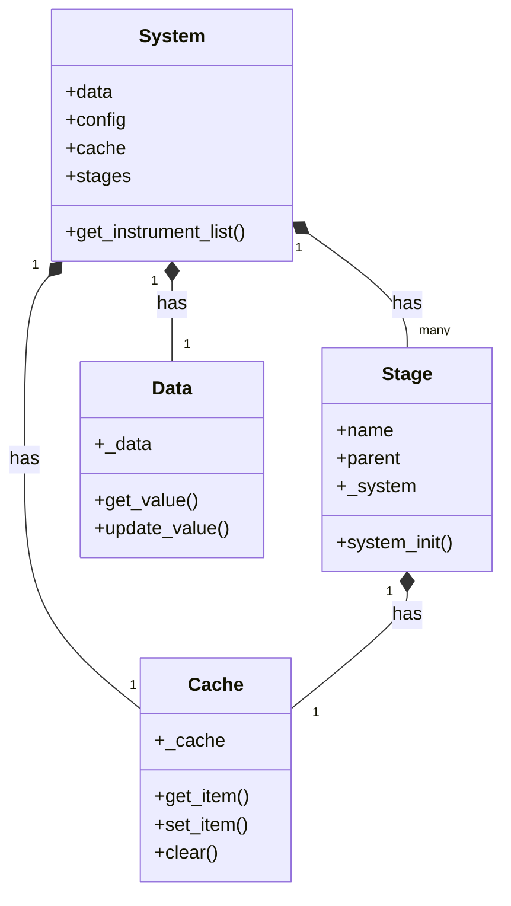
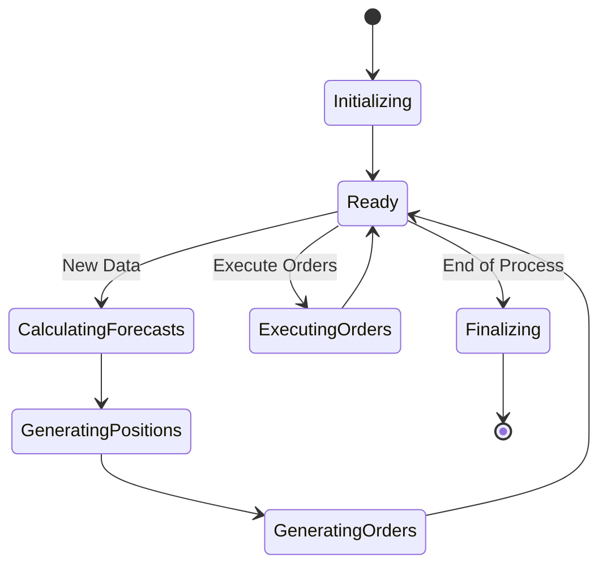

# State Management in pysystemtrade

## State Model Description

pysystemtrade implements a comprehensive state management system that maintains trading system state during backtesting and live trading. The state model spans multiple layers, from instrument-specific data to portfolio-wide calculations.



The state model is organized around the central `System` object, which maintains:

1. **Data State** - Historical and current market data
2. **Configuration State** - System parameters and settings
3. **Calculation Cache** - Cached intermediate and final calculations
4. **Position State** - Current and optimal positions
5. **Order State** - Queue of orders to be executed
6. **Execution State** - Status of order execution

## State Transitions and Triggers

State transitions in pysystemtrade are primarily data-driven rather than event-driven. The main state transitions occur when:

1. **New Data Triggers**:
   - New market data becomes available
   - Price updates arrive from exchange
   - New trading day begins

2. **Calculation Triggers**:
   - Trading rules generate new forecasts
   - Forecast combinations change
   - Position limits are adjusted
   
3. **Execution Triggers**:
   - Orders are generated
   - Orders are executed
   - Orders are cancelled or modified



## Persistence Mechanisms

pysystemtrade offers multiple persistence mechanisms for maintaining state:

### 1. In-Memory Storage

During backtesting, state is primarily held in memory:

```python
# State is stored in system cache
system.cache.set_item("optimal_positions", "EURUSD", position_value)

# Later retrieved
position = system.cache.get_item("optimal_positions", "EURUSD")
```

### 2. Database Storage

For production, state is typically stored in databases:

```python
# MongoDB for time series data
mongo_data = arcticData(mongodb_host, mongo_db)
mongo_data.write_price("EURUSD", price_df)

# SQL for order and position state
position_data = sqlPositionData(db_connection)
position_data.update_position("EURUSD", new_position)
```

### 3. Checkpoint Files

For recovery purposes, system state can be saved to checkpoint files:

```python
# Save system state
system.pickle_cache("systems_state.pkl")

# Restore system state
restored_system = unpickle_cache("systems_state.pkl")
```

### 4. Production Log Files

In production, all actions are logged for audit and recovery:

```python
log = get_logger("portfolio")
log.info("Setting new position for %s to %s" % (instrument_code, new_position))
```

## Recovery Procedures

pysystemtrade implements several recovery mechanisms:

### 1. System State Recovery

If a system crashes during operation, the state can be recovered:

```python
# Attempt to load saved system state
try:
    system = unpickle_cache("systems_state.pkl")
except:
    # If recovery fails, initialize a new system
    system = System([...], data, config)
    
    # Reconcile with actual positions from broker
    actual_positions = get_broker_positions()
    system.accounts.update_positions(actual_positions)
```

### 2. Order Recovery

Orders in progress can be recovered and reconciled:

```python
# Get orders that were in-flight when system crashed
in_flight_orders = broker_orders_api.get_orders_with_status("submitted")

# Reconcile with local order state
for order in in_flight_orders:
    if order.id not in local_order_state:
        # Add to local state
        local_order_state.add(order)
```

### 3. Position Reconciliation

Regular checks ensure system state matches actual positions:

```python
# Get actual positions from broker
broker_positions = broker_api.get_positions()

# Compare with system's understanding of positions
for instrument, position in broker_positions.items():
    expected_position = system.portfolio.get_position(instrument)
    if position != expected_position:
        # Reconcile difference
        system.portfolio.adjust_position(instrument, position)
        log.warning("Position mismatch for %s: expected %f, actual %f" % 
                   (instrument, expected_position, position))
```

## Thread Safety and Concurrency Considerations

pysystemtrade uses several mechanisms to ensure thread safety:

### 1. Locking Mechanisms

When multiple processes access shared resources:

```python
from sysproduction.locks.locks import lock_object

# Acquire a lock before updating positions
try:
    with lock_object("optimal_position"):
        # Update positions safely
        update_optimal_positions(data)
finally:
    # Lock is automatically released when block exits
    pass
```

### 2. Process Isolation

Separate processes handle different functions:

```python
# One process handles data collection
data_process = multiprocessing.Process(target=collect_data_function)

# Another handles order execution
execution_process = multiprocessing.Process(target=execute_orders_function)

# Start processes
data_process.start()
execution_process.start()
```

### 3. Message Queue Communication

Processes communicate via message queues:

```python
# Producer puts message on queue
data_queue.put({"instrument": "EURUSD", "price": 1.1234})

# Consumer receives message
message = data_queue.get(block=True, timeout=5)
```

## State Consistency Guarantees

pysystemtrade provides several mechanisms to ensure state consistency:

1. **Transaction Logging**: All state changes are logged before and after
2. **Two-Phase Commits**: Critical state changes follow a two-phase commit protocol
3. **Idempotent Operations**: Operations can be safely repeated without side effects
4. **State Verification**: Periodic checks verify state consistency
5. **Reconciliation**: Regular reconciliation with external sources (broker, exchange)

This comprehensive approach ensures that the system can maintain a consistent state during normal operation and recover correctly after failures. 