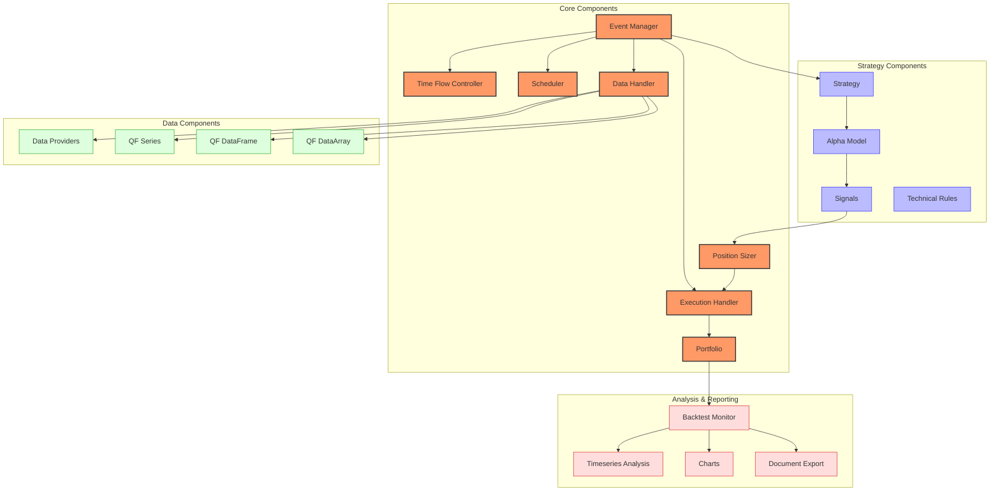

# QF-Lib Trading System

## Overview

QF-Lib is a Python library that provides high-quality tools for quantitative finance with a focus on backtesting investment strategies. It employs an event-driven architecture that simulates market events such as daily market opening or closing, allowing users to test and evaluate custom investment strategies with realistic market conditions.



## Key Components and Their Relationships

QF-Lib is organized around several interconnected components:

### Event System
- **EventManager**: Central component that manages the event queue and dispatches events to registered components
- **Scheduler**: Responsible for generating time events (market open, market close, etc.)
- **TimeFlowController**: Controls the flow of time in the simulation

### Data Management
- **DataHandler**: Ensures that strategies don't have access to future data in backtest mode
- **Data Providers**: Interfaces for various data sources (Bloomberg, Quandl, Haver Analytics, etc.)
- **Containers**: Extended pandas Series, DataFrame, and numpy DataArray with specialized financial calculations

### Strategy Components
- **Strategy**: Abstract base class for implementing trading strategies
- **AlphaModel**: Generates trading signals for the strategy
- **PositionSizer**: Converts strategy signals to concrete orders

### Execution and Portfolio
- **ExecutionHandler**: Handles order execution, slippage, and commissions
- **Portfolio**: Tracks positions, transactions, and portfolio value
- **Broker**: Simulates broker behavior for order execution

### Analysis and Reporting
- **BacktestMonitor**: Observes and records backtest progress
- **DocumentExporting**: Creates PDF reports with backtest analysis
- **Charts**: Visualizes strategy performance and metrics

## Supported Markets and Instruments

QF-Lib is designed to work with various financial instruments across different markets:

- **Equities**: Stocks and ETFs from global markets
- **Fixed Income**: Bonds and notes
- **Alternatives**: Commodities, real estate
- **Custom Assets**: Support for user-defined assets

The library can work with data from multiple providers:
- Bloomberg
- Quandl
- Haver Analytics
- Portara
- Custom data sources

## Performance Characteristics

QF-Lib provides solid performance for backtesting:

- **Execution Speed**: Moderate to fast, depending on strategy complexity
- **Memory Usage**: Efficient data structures minimize memory consumption
- **Event Processing**: Event-driven architecture helps maintain chronological accuracy
- **Scalability**: Can handle multiple assets and complex strategies 

Performance metrics:
- Can process several years of daily data in seconds to minutes
- Efficiently handles multiple assets simultaneously
- Memory usage scales linearly with the number of assets and time period length

## Dependencies and Requirements

QF-Lib relies on the following dependencies:

### Core Dependencies
- Python 3.7 or higher
- pandas: Data processing
- numpy: Numerical computation
- matplotlib: Charting
- scipy: Statistical functions
- TA-Lib: Technical indicators (optional)

### Additional Dependencies
- WeasyPrint: PDF generation for reports
- pykalman: Kalman filtering
- statsmodels: Statistical models

### Data Provider Dependencies
- pdblp: Bloomberg API (optional)
- quandl: Quandl data access (optional)

### System Requirements
- OS: Windows, Linux, macOS
- RAM: 4GB+ recommended (8GB+ for larger datasets)
- CPU: Multi-core processor recommended for complex strategies

## Quick Start Guide

### Installation

```bash
pip install qf-lib
```

For Bloomberg or Haver Analytics support, additional installation steps may be required. See the [installation guide](https://qf-lib.readthedocs.io/en/latest/installation.html).

### Simple Strategy Example

```python
from datetime import datetime

import matplotlib.pyplot as plt
import pandas as pd

from qf_lib.backtesting.alpha_model.alpha_model import AlphaModel
from qf_lib.backtesting.alpha_model.exposure_enum import Exposure
from qf_lib.backtesting.alpha_model.signal import Signal
from qf_lib.backtesting.data_handler.data_handler import DataHandler
from qf_lib.backtesting.trading_session.backtest_trading_session_builder import BacktestTradingSessionBuilder
from qf_lib.common.enums.price_field import PriceField
from qf_lib.common.tickers.tickers import QuandlTicker
from qf_lib.common.utils.dateutils.string_to_date import str_to_date
from qf_lib.documents_utils.document_exporting.pdf_exporter import PDFExporter

# Define a simple alpha model using moving averages
class MovingAverageCrossover(AlphaModel):
    def __init__(self, ticker, fast_window=10, slow_window=50):
        self.ticker = ticker
        self.fast_window = fast_window
        self.slow_window = slow_window
    
    def calculate_signal(self, data_handler: DataHandler, current_time: datetime) -> Signal:
        # Get historical prices
        close_prices = data_handler.historical_price(self.ticker, PriceField.Close, 
                                                     self.slow_window + 1, current_time)
        
        # Calculate moving averages
        fast_ma = close_prices.rolling(window=self.fast_window).mean().iloc[-1]
        slow_ma = close_prices.rolling(window=self.slow_window).mean().iloc[-1]
        
        # Generate signal
        if fast_ma > slow_ma:
            return Signal(self.ticker, Exposure.LONG, fraction_at_risk=0.1, confidence=0.6)
        else:
            return Signal(self.ticker, Exposure.SHORT, fraction_at_risk=0.1, confidence=0.6)

# Setup backtest
def main():
    start_date = str_to_date("2010-01-01")
    end_date = str_to_date("2020-01-01")
    
    # Define ticker(s)
    aapl = QuandlTicker("WIKI/AAPL", "AAPL")
    
    # Create backtesting session
    backtest_builder = BacktestTradingSessionBuilder().\
        set_start_date(start_date).\
        set_end_date(end_date).\
        set_initial_cash(10000).\
        set_data_frequency("daily")
    
    # Build and start the backtest session
    backtest = backtest_builder.build(aapl)
    
    # Create the alpha model
    alpha_model = MovingAverageCrossover(aapl)
    
    # Register the alpha model with the backtest
    backtest.start_trading(alpha_model)
    
    # Generate a PDF report with the results
    pdf_exporter = PDFExporter()
    pdf_exporter.export_pdf("backtest_results.pdf", backtest.get_results())
    
    # Show the equity curve
    plt.figure(figsize=(12, 6))
    backtest.get_results().portfolio_value.plot()
    plt.title("Equity Curve")
    plt.grid(True)
    plt.show()

if __name__ == "__main__":
    main()
```

## Unique Strengths

QF-Lib stands out with several key strengths:

1. **Comprehensive Event System**: Sophisticated event-driven architecture that accurately simulates market events
2. **Advanced Containers**: Extended pandas and numpy containers optimized for financial calculations
3. **Look-Ahead Prevention**: Rigorous safeguards against look-ahead bias in backtests
4. **Document Generation**: Built-in PDF report generation with customizable templates
5. **Multi-Data Provider Support**: Works with various data sources through a unified interface
6. **Extensive Technical Analysis**: Rich set of indicators and analytical tools
7. **Detailed Backtesting Results**: In-depth analysis of strategy performance and trades

## Limitations

Current limitations of QF-Lib include:

1. **Learning Curve**: Complex architecture requires significant learning time
2. **Performance vs. Feature Tradeoff**: Comprehensive features can impact computational performance in some cases
3. **Limited High-Frequency Support**: Primarily designed for daily and intraday backtesting, not tick-level analysis
4. **Documentation Complexity**: Documentation may be challenging for beginners
5. **Data Provider Dependencies**: Some features require commercial data providers

## Use Case Examples

QF-Lib is particularly well-suited for:

1. **Academic Research**: Ideal for quantitative finance research with advanced statistical measures
2. **Professional Strategy Development**: Build and test sophisticated trading strategies
3. **Portfolio Optimization**: Optimize portfolio weights based on various objective functions
4. **Performance Attribution**: Analyze strategy performance with detailed attribution reports
5. **Risk Management**: Implement and test complex risk management systems

## Additional Resources

For more detailed information, refer to the following:

- [Event Flow](./event-flow.md): Detailed explanation of QF-Lib's event-driven architecture
- [State Management](./state-management.md): How state is managed throughout the system
- [Handlers](./handlers.md): Guide to creating and using different handlers

## System Requirements

- **CPU**: Dual-core processor or better
- **RAM**: 4GB minimum, 8GB+ recommended
- **Storage**: 100MB for installation, additional space for data storage
- **OS**: Compatible with Windows, macOS, and Linux
- **Python**: Version 3.7 or higher 