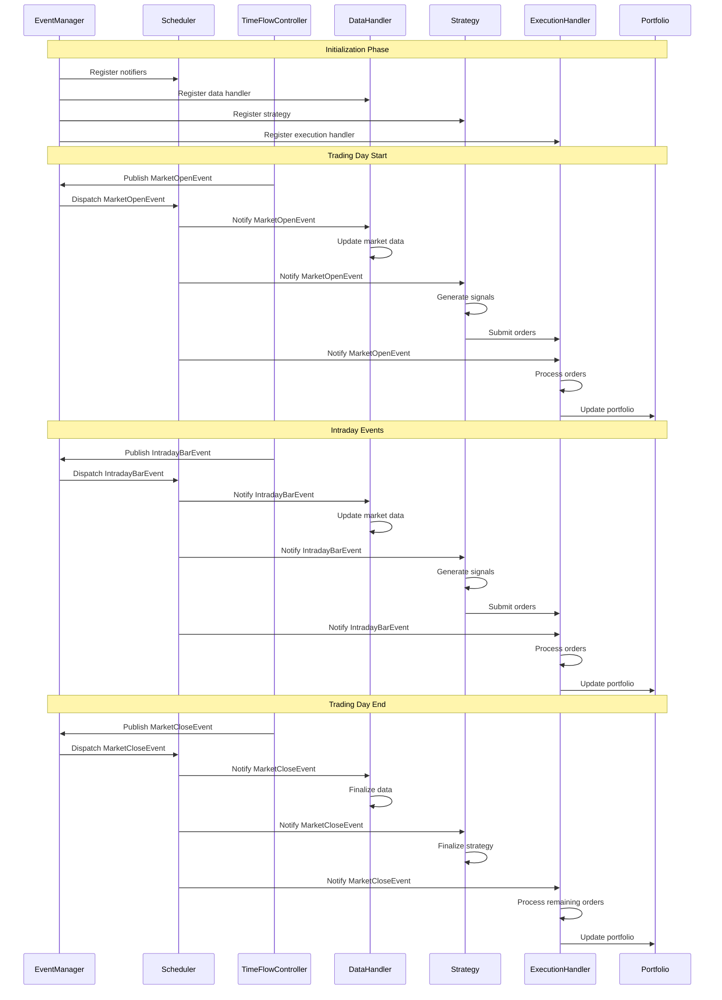
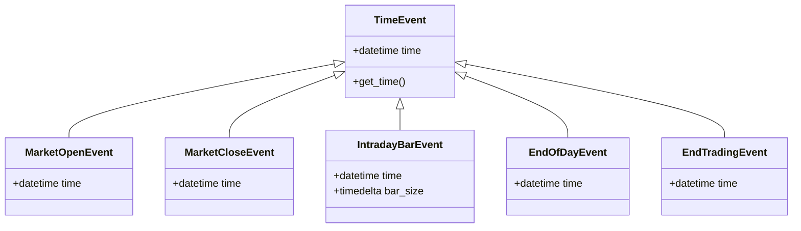
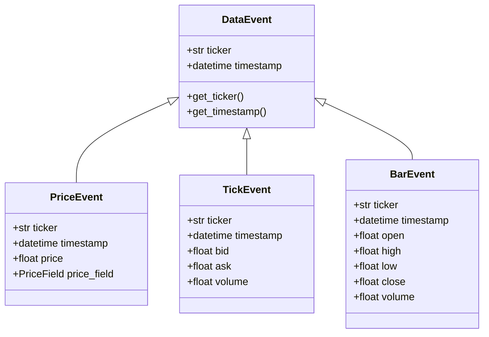
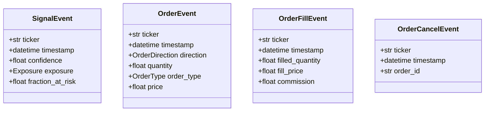

# QF-Lib Event Flow

## Event Flow Overview

QF-Lib implements a sophisticated event-driven architecture where the simulation of market events and strategy execution are coordinated through a central event dispatching system. The architecture allows for precise control over the sequence of events that occur during the trading day, ensuring accurate simulation of market conditions.



## Event Types and Their Purposes

QF-Lib uses various event types to model different market occurrences and trigger appropriate responses in system components. Each event type serves a specific purpose in the simulation:

### Time Events



1. **MarketOpenEvent**
   - Signals the opening of the market for a trading day
   - Triggers initial market data loading and strategy initialization
   - Allows specific opening operations like executing overnight orders

2. **MarketCloseEvent**
   - Signals the closing of the market for a trading day
   - Triggers finalization of data and positions for the day
   - Enables actions like generating end-of-day reports

3. **IntradayBarEvent**
   - Represents the update of bar data during a trading day
   - Triggers intraday strategy updates and order processing
   - Used for strategies that operate on fixed time intervals (e.g., 5-minute bars)

4. **EndOfDayEvent**
   - Marks the end of a trading day after market close
   - Used for end-of-day processing like portfolio valuation and risk calculation
   - May trigger overnight position adjustment

5. **EndTradingEvent**
   - Signals the end of the entire trading or backtesting period
   - Triggers final cleanup and report generation
   - Used to terminate the trading session

### Data Events



1. **PriceEvent**
   - Represents a price update for a specific ticker
   - Contains the new price value and the price field (e.g., open, high, low, close)
   - Triggers updates to position values and potentially signals

2. **TickEvent**
   - Represents a tick update with bid/ask prices
   - Used in high-frequency strategies or those requiring level 1 market data
   - Triggers execution decisions based on the latest market quotes

3. **BarEvent**
   - Represents OHLCV (Open, High, Low, Close, Volume) data for a specific time period
   - Used as a fundamental input to many technical analysis strategies
   - May trigger indicator recalculation and signal generation

### Signal and Order Events



1. **SignalEvent**
   - Represents a trading signal generated by a strategy
   - Contains information like exposure direction, confidence, and risk factor
   - Triggers order generation through position sizing

2. **OrderEvent**
   - Represents an order to be executed
   - Contains details like ticker, direction, quantity, and order type
   - Triggers execution handler to process the order

3. **OrderFillEvent**
   - Represents a filled order
   - Contains fill details like quantity, price, and commission
   - Triggers portfolio updates and may signal strategy for follow-up actions

4. **OrderCancelEvent**
   - Represents a request to cancel an existing order
   - Used to remove orders that are no longer desired
   - Triggers cleanup in the execution handler

## Event Processing Flow

The event processing flow in QF-Lib is managed by several key components working together to ensure proper sequencing and handling of events.

### Event Manager and Dispatching

The EventManager is the central hub for event processing, taking events from various sources and routing them to the appropriate handlers:

```python
class EventManager:
    """
    Manages the flow of events in the system.
    """
    
    def __init__(self):
        # Dictionary mapping event types to notifiers
        self._notifiers = {}
        
        # Queue for events
        self._events_queue = queue.PriorityQueue()
    
    def register_notifiers(self, notifiers):
        """
        Register event notifiers.
        Each notifier handles notifications for a specific event type.
        """
        for notifier in notifiers:
            event_type = notifier.get_event_type()
            self._notifiers[event_type] = notifier
    
    def publish(self, event):
        """
        Add an event to the queue for later processing.
        """
        self._events_queue.put(event)
    
    def dispatch_next_event(self):
        """
        Dispatch the next event from the queue to appropriate notifiers.
        """
        if self._events_queue.empty():
            # Return a special event when queue is empty
            return EmptyQueueEvent()
        
        # Get next event
        event = self._events_queue.get()
        
        # Get event type
        event_type = type(event)
        
        # Find appropriate notifier
        notifier = self._get_notifier(event_type)
        
        # Notify if a notifier is found
        if notifier:
            notifier.notify(event)
        
        return event
    
    def _get_notifier(self, event_type):
        """
        Get the appropriate notifier for an event type.
        """
        # Direct match
        if event_type in self._notifiers:
            return self._notifiers[event_type]
        
        # Try to find a notifier for a parent class
        for registered_type, notifier in self._notifiers.items():
            if issubclass(event_type, registered_type):
                return notifier
        
        return None
```

### Event Notifiers and Listeners

QF-Lib uses notifiers and listeners to connect events with their handlers:

```python
class EventNotifier:
    """
    Notifies listeners about events.
    """
    
    def __init__(self, event_type):
        self._event_type = event_type
        self._listeners = []
    
    def get_event_type(self):
        """
        Get the event type that this notifier handles.
        """
        return self._event_type
    
    def add_listener(self, listener):
        """
        Add a listener to be notified of events.
        """
        self._listeners.append(listener)
    
    def remove_listener(self, listener):
        """
        Remove a listener from the notification list.
        """
        if listener in self._listeners:
            self._listeners.remove(listener)
    
    def notify(self, event):
        """
        Notify all listeners about an event.
        """
        for listener in self._listeners:
            listener.on_event(event)

class EventListener:
    """
    Base class for objects that listen for events.
    """
    
    def on_event(self, event):
        """
        Handle an event.
        This generic method dispatches to more specific handlers.
        """
        # Get the specific handler method name
        event_type = type(event).__name__
        handler_name = f"on_{snake_case(event_type)}"
        
        # Check if a specific handler exists
        if hasattr(self, handler_name):
            handler = getattr(self, handler_name)
            handler(event)
        else:
            # Default handling
            self.on_default_event(event)
    
    def on_default_event(self, event):
        """
        Default event handler for events with no specific handler.
        """
        pass  # Default implementation does nothing
```

### The Scheduler Component

The Scheduler manages subscriptions to different event types:

```python
class Scheduler:
    """
    Manages event subscriptions and delivers events to subscribers.
    """
    
    def __init__(self):
        # Dictionary mapping event types to listeners
        self._subscriptions = {}
    
    def subscribe(self, event_type, listener):
        """
        Subscribe a listener to an event type.
        """
        if event_type not in self._subscriptions:
            self._subscriptions[event_type] = []
        
        if listener not in self._subscriptions[event_type]:
            self._subscriptions[event_type].append(listener)
    
    def unsubscribe(self, event_type, listener):
        """
        Unsubscribe a listener from an event type.
        """
        if event_type in self._subscriptions:
            if listener in self._subscriptions[event_type]:
                self._subscriptions[event_type].remove(listener)
    
    def process_event(self, event):
        """
        Process an event by notifying all subscribers.
        """
        event_type = type(event)
        
        # Notify listeners for this exact event type
        if event_type in self._subscriptions:
            for listener in self._subscriptions[event_type]:
                listener.on_event(event)
        
        # Also notify listeners subscribed to parent classes
        for subscribed_type, listeners in self._subscriptions.items():
            if issubclass(event_type, subscribed_type) and subscribed_type != event_type:
                for listener in listeners:
                    listener.on_event(event)
```

### Time Flow Controller

The TimeFlowController manages the progression of time in the simulation:

```python
class TimeFlowController:
    """
    Controls the flow of time in the system.
    Generates time-based events based on a time range and frequency.
    """
    
    def __init__(self, start_date, end_date, time_frame=TimeFrame.DAILY, event_manager=None):
        self.start_date = start_date
        self.end_date = end_date
        self.time_frame = time_frame
        self.event_manager = event_manager
        
        # Current simulation time
        self.current_time = None
        
        # Calendar for determining trading days
        self.calendar = TradingCalendar()
    
    def start(self):
        """
        Start the time flow simulation.
        """
        self.current_time = self.start_date
        
        # Notify simulation start
        if self.event_manager:
            self.event_manager.publish(
                StartTradingEvent(self.current_time)
            )
        
        # Process each day in the range
        while self.current_time <= self.end_date:
            self.process_day(self.current_time)
            
            # Move to next day
            self.current_time += timedelta(days=1)
        
        # Notify simulation end
        if self.event_manager:
            self.event_manager.publish(
                EndTradingEvent(self.current_time)
            )
    
    def process_day(self, date):
        """
        Process a single day.
        """
        # Skip non-trading days
        if not self.calendar.is_trading_day(date):
            return
        
        # Market open
        market_open_time = self.calendar.get_market_open_time(date)
        market_open_datetime = datetime.combine(date, market_open_time)
        
        if self.event_manager:
            self.event_manager.publish(
                MarketOpenEvent(market_open_datetime)
            )
        
        # Intraday bars (for finer time frames)
        if self.time_frame < TimeFrame.DAILY:
            self.process_intraday_bars(date)
        
        # Market close
        market_close_time = self.calendar.get_market_close_time(date)
        market_close_datetime = datetime.combine(date, market_close_time)
        
        if self.event_manager:
            self.event_manager.publish(
                MarketCloseEvent(market_close_datetime)
            )
        
        # End of day
        end_of_day_datetime = datetime.combine(date, time(23, 59, 59))
        
        if self.event_manager:
            self.event_manager.publish(
                EndOfDayEvent(end_of_day_datetime)
            )
    
    def process_intraday_bars(self, date):
        """
        Process intraday bars based on the selected time frame.
        """
        market_open = self.calendar.get_market_open_time(date)
        market_close = self.calendar.get_market_close_time(date)
        
        current_time = market_open
        
        # Calculate bar size
        if self.time_frame == TimeFrame.MINUTE:
            bar_size = timedelta(minutes=1)
        elif self.time_frame == TimeFrame.MINUTE_5:
            bar_size = timedelta(minutes=5)
        elif self.time_frame == TimeFrame.MINUTE_15:
            bar_size = timedelta(minutes=15)
        elif self.time_frame == TimeFrame.HOUR:
            bar_size = timedelta(hours=1)
        else:
            # Default to 1 hour if not recognized
            bar_size = timedelta(hours=1)
        
        # Generate intraday bar events
        while current_time < market_close:
            current_datetime = datetime.combine(date, current_time)
            
            if self.event_manager:
                self.event_manager.publish(
                    IntradayBarEvent(current_datetime, bar_size)
                )
            
            # Move to next bar
            current_time = (
                datetime.combine(date, current_time) + bar_size
            ).time()
```

## Event Loop Execution

The central event loop drives the simulation by dispatching events and ensuring they're processed in the correct order:

```python
class BacktestEngine:
    """
    Engine that runs a backtest simulation.
    """
    
    def __init__(self, config):
        # Create core components
        self.event_manager = EventManager()
        self.scheduler = Scheduler()
        
        # Time control
        start_date = config.get('start_date')
        end_date = config.get('end_date')
        time_frame = config.get('time_frame', TimeFrame.DAILY)
        
        self.time_flow_controller = TimeFlowController(
            start_date, end_date, time_frame, self.event_manager
        )
        
        # Data handling
        data_provider = create_data_provider(config.get('data_provider'))
        self.data_handler = DataHandler(data_provider, self.scheduler)
        
        # Portfolio management
        initial_cash = config.get('initial_cash', 100000)
        self.portfolio = Portfolio(initial_cash)
        
        # Execution handling
        self.execution_handler = ExecutionHandler(
            self.data_handler, self.portfolio
        )
        
        # Strategy
        strategy_config = config.get('strategy')
        self.strategy = create_strategy(
            strategy_config, self.data_handler, self.execution_handler
        )
        
        # Connect components
        self._connect_components()
    
    def _connect_components(self):
        """
        Connect all components to ensure proper event flow.
        """
        # Create notifiers for different event types
        time_event_notifier = EventNotifier(TimeEvent)
        data_event_notifier = EventNotifier(DataEvent)
        signal_event_notifier = EventNotifier(SignalEvent)
        order_event_notifier = EventNotifier(OrderEvent)
        
        # Register notifiers with event manager
        self.event_manager.register_notifiers([
            time_event_notifier,
            data_event_notifier,
            signal_event_notifier,
            order_event_notifier
        ])
        
        # Subscribe components to events
        # Data handler listens for time events
        time_event_notifier.add_listener(self.data_handler)
        
        # Strategy listens for time events and data events
        time_event_notifier.add_listener(self.strategy)
        data_event_notifier.add_listener(self.strategy)
        
        # Execution handler listens for order events and time events
        order_event_notifier.add_listener(self.execution_handler)
        time_event_notifier.add_listener(self.execution_handler)
    
    def run(self):
        """
        Run the backtest simulation.
        """
        # Start time flow
        self.time_flow_controller.start()
        
        # Process events until done
        while True:
            event = self.event_manager.dispatch_next_event()
            
            # Check if we're done
            if isinstance(event, EndTradingEvent):
                break
            elif isinstance(event, EmptyQueueEvent):
                # No more events to process, this means we need to
                # generate more events or end the simulation
                pass
```

## Event-Driven System Components

The different components in QF-Lib interact through events to create a complete trading system simulation:

### Data Handler

```python
class DataHandler(EventListener):
    """
    Handles market data and responds to time events.
    """
    
    def __init__(self, data_provider, scheduler):
        self.data_provider = data_provider
        self.scheduler = scheduler
        
        # Current time in the simulation
        self.current_time = None
        
        # Data cache
        self._data_cache = {}
        
        # Set of tickers that we're watching
        self._watched_tickers = set()
        
        # Subscribe to events
        scheduler.subscribe(MarketOpenEvent, self)
        scheduler.subscribe(MarketCloseEvent, self)
        scheduler.subscribe(IntradayBarEvent, self)
    
    def on_market_open(self, event):
        """
        Handle market open event.
        """
        self.current_time = event.time
        self.update_market_data()
    
    def on_market_close(self, event):
        """
        Handle market close event.
        """
        self.current_time = event.time
        self.update_market_data()
    
    def on_intraday_bar(self, event):
        """
        Handle intraday bar event.
        """
        self.current_time = event.time
        self.update_market_data()
    
    def update_market_data(self):
        """
        Update market data for all watched tickers.
        """
        for ticker in self._watched_tickers:
            self._update_ticker_data(ticker)
    
    def _update_ticker_data(self, ticker):
        """
        Update data for a specific ticker.
        """
        data = self.data_provider.get_data(ticker, self.current_time)
        
        if data is not None:
            self._data_cache[ticker] = data
    
    def get_price(self, ticker, price_field=PriceField.CLOSE):
        """
        Get the current price for a ticker.
        """
        # Ensure we're watching this ticker
        if ticker not in self._watched_tickers:
            self._watched_tickers.add(ticker)
            self._update_ticker_data(ticker)
        
        # Get data from cache
        if ticker in self._data_cache:
            data = self._data_cache[ticker]
            
            # Filter data to prevent look-ahead bias
            valid_data = data[data.index <= self.current_time]
            
            if not valid_data.empty:
                return valid_data[price_field.value].iloc[-1]
        
        return None
```

### Strategy Component

```python
class Strategy(EventListener):
    """
    Base class for trading strategies.
    """
    
    def __init__(self, data_handler, execution_handler):
        self.data_handler = data_handler
        self.execution_handler = execution_handler
        
        # Current time in the simulation
        self.current_time = None
    
    def on_market_open(self, event):
        """
        Handle market open event.
        """
        self.current_time = event.time
        self.on_market_open_logic()
    
    def on_market_close(self, event):
        """
        Handle market close event.
        """
        self.current_time = event.time
        self.on_market_close_logic()
    
    def on_intraday_bar(self, event):
        """
        Handle intraday bar event.
        """
        self.current_time = event.time
        self.on_intraday_bar_logic()
    
    def on_market_open_logic(self):
        """
        Logic to execute at market open.
        """
        # Implement in subclass
        pass
    
    def on_market_close_logic(self):
        """
        Logic to execute at market close.
        """
        # Implement in subclass
        pass
    
    def on_intraday_bar_logic(self):
        """
        Logic to execute on intraday bar.
        """
        # Implement in subclass
        pass
    
    def generate_signals(self, tickers):
        """
        Generate trading signals for a list of tickers.
        """
        signals = []
        
        for ticker in tickers:
            signal = self.generate_signal(ticker)
            if signal:
                signals.append(signal)
        
        return signals
    
    def generate_signal(self, ticker):
        """
        Generate a trading signal for a ticker.
        """
        # Implement in subclass
        return None
    
    def submit_signals(self, signals):
        """
        Submit signals to be executed.
        """
        for signal in signals:
            # Convert signal to order
            order = self.convert_signal_to_order(signal)
            
            # Submit order
            if order:
                self.execution_handler.submit_order(order)
    
    def convert_signal_to_order(self, signal):
        """
        Convert a signal to an order.
        """
        # Implement in subclass
        return None
```

### Execution Handler

```python
class ExecutionHandler(EventListener):
    """
    Handles order execution and responds to time events.
    """
    
    def __init__(self, data_handler, portfolio):
        self.data_handler = data_handler
        self.portfolio = portfolio
        
        # Current time in the simulation
        self.current_time = None
        
        # Order management
        self._orders_queue = []
        self._executed_orders = {}
        
        # Default models
        self.slippage_model = ZeroSlippageModel()
        self.commission_model = ZeroCommissionModel()
    
    def on_market_open(self, event):
        """
        Handle market open event.
        """
        self.current_time = event.time
        self.process_orders()
    
    def on_market_close(self, event):
        """
        Handle market close event.
        """
        self.current_time = event.time
        self.process_orders()
    
    def on_intraday_bar(self, event):
        """
        Handle intraday bar event.
        """
        self.current_time = event.time
        self.process_orders()
    
    def submit_order(self, order):
        """
        Submit an order for execution.
        """
        # Add timestamp
        order.timestamp = self.current_time
        
        # Add to queue
        self._orders_queue.append(order)
        
        return True
    
    def process_orders(self):
        """
        Process all orders in the queue.
        """
        for order in self._orders_queue:
            self._process_order(order)
        
        # Clear queue
        self._orders_queue = []
    
    def _process_order(self, order):
        """
        Process a single order.
        """
        # Get current market price
        price = self.data_handler.get_price(order.ticker)
        
        if price is None:
            # No price available, can't execute
            return
        
        # Apply slippage model
        executed_price = self.slippage_model.apply_slippage(
            price, order.direction, order.quantity
        )
        
        # Calculate commission
        commission = self.commission_model.calculate_commission(
            executed_price, order.quantity
        )
        
        # Create transaction
        transaction = Transaction(
            ticker=order.ticker,
            quantity=order.quantity * order.direction.value,
            price=executed_price,
            commission=commission,
            timestamp=self.current_time
        )
        
        # Update portfolio
        self.portfolio.process_transaction(transaction)
        
        # Record executed order
        order_id = id(order)
        self._executed_orders[order_id] = {
            'order': order,
            'execution_price': executed_price,
            'commission': commission,
            'execution_time': self.current_time
        }
```

## Event Flow Control and Error Handling

QF-Lib includes mechanisms for controlling event flow and handling errors to ensure robustness:

### Event Throttling

```python
class EventThrottler:
    """
    Throttles events to prevent overloading the system.
    """
    
    def __init__(self, max_events_per_second=1000):
        self.max_events_per_second = max_events_per_second
        self.last_event_time = None
        self.event_count = 0
        self.current_window_start = None
    
    def should_process_event(self):
        """
        Determine if an event should be processed based on throttling rules.
        """
        current_time = time.time()
        
        # Initialize time tracking
        if self.last_event_time is None:
            self.last_event_time = current_time
            self.current_window_start = current_time
            self.event_count = 1
            return True
        
        # Check if we're in a new time window
        if current_time - self.current_window_start >= 1.0:
            # Reset for new window
            self.current_window_start = current_time
            self.event_count = 1
            return True
        
        # Check if we've hit the limit
        if self.event_count >= self.max_events_per_second:
            # We need to throttle
            return False
        
        # We can process this event
        self.event_count += 1
        return True
```

### Error Handling in Event Loop

```python
class RobustEventLoop:
    """
    Robust event loop with error handling.
    """
    
    def __init__(self, event_manager, logger=None):
        self.event_manager = event_manager
        self.logger = logger or logging.getLogger(__name__)
        self.running = False
        self.error_handlers = {}
    
    def register_error_handler(self, event_type, handler):
        """
        Register an error handler for a specific event type.
        """
        self.error_handlers[event_type] = handler
    
    def handle_event_error(self, event, error):
        """
        Handle an error that occurred during event processing.
        """
        event_type = type(event)
        
        # Try to find a specific handler
        if event_type in self.error_handlers:
            handler = self.error_handlers[event_type]
            handler(event, error)
            return True
        
        # Try to find a handler for a parent type
        for registered_type, handler in self.error_handlers.items():
            if issubclass(event_type, registered_type):
                handler(event, error)
                return True
        
        # No specific handler, use default handling
        self.logger.error(f"Error processing event {event}: {error}")
        return False
    
    def run(self):
        """
        Run the event loop until completion or interruption.
        """
        self.running = True
        
        try:
            while self.running:
                # Get next event
                event = self.event_manager.dispatch_next_event()
                
                # Check for end of processing
                if isinstance(event, EndTradingEvent):
                    self.running = False
                    break
                
                # Check for empty queue
                if isinstance(event, EmptyQueueEvent):
                    # No more events to process
                    time.sleep(0.001)  # Prevent CPU spinning
                    continue
                
                try:
                    # Process the event
                    self.process_event(event)
                except Exception as e:
                    # Handle error
                    handled = self.handle_event_error(event, e)
                    
                    if not handled:
                        # Error wasn't handled, decide what to do
                        # In this case, we'll continue processing
                        pass
        
        except KeyboardInterrupt:
            # Handle user interruption
            self.logger.info("Event loop interrupted by user")
            self.running = False
        
        finally:
            # Cleanup
            self.on_exit()
    
    def process_event(self, event):
        """
        Process a single event.
        Default implementation just dispatches via event manager.
        """
        # The event manager has already dispatched the event,
        # so there's nothing more to do here
        pass
    
    def on_exit(self):
        """
        Perform cleanup when exiting the event loop.
        """
        self.logger.info("Event loop exited")
```

## Event Ordering and Priority

QF-Lib ensures that events are processed in the correct order using a priority queue system:

```python
class PrioritizedEvent:
    """
    An event with a priority for ordered processing.
    """
    
    def __init__(self, event, priority=0):
        self.event = event
        self.priority = priority
        self.timestamp = time.time()
    
    def __lt__(self, other):
        # First compare by priority (lower number = higher priority)
        if self.priority != other.priority:
            return self.priority < other.priority
        
        # Then compare by timestamp (earlier = higher priority)
        return self.timestamp < other.timestamp

class PrioritizedEventManager(EventManager):
    """
    Event manager that respects event priorities.
    """
    
    def __init__(self):
        # Use a priority queue for events
        self._events_queue = queue.PriorityQueue()
        self._notifiers = {}
        
        # Default priorities for different event types
        self._default_priorities = {
            MarketOpenEvent: 10,
            IntradayBarEvent: 20,
            MarketCloseEvent: 30,
            DataEvent: 40,
            SignalEvent: 50,
            OrderEvent: 60,
            OrderFillEvent: 70,
            EndOfDayEvent: 80,
            EndTradingEvent: 90
        }
    
    def publish(self, event, priority=None):
        """
        Add an event to the queue with a priority.
        """
        # Determine priority
        if priority is None:
            event_type = type(event)
            
            # Find best matching default priority
            best_match = None
            best_match_priority = None
            
            for registered_type, default_priority in self._default_priorities.items():
                if issubclass(event_type, registered_type):
                    if best_match is None or issubclass(registered_type, best_match):
                        best_match = registered_type
                        best_match_priority = default_priority
            
            priority = best_match_priority or 50  # Default to middle priority
        
        # Wrap in prioritized event
        prioritized_event = PrioritizedEvent(event, priority)
        
        # Add to queue
        self._events_queue.put(prioritized_event)
    
    def dispatch_next_event(self):
        """
        Dispatch the next event from the queue based on priority.
        """
        if self._events_queue.empty():
            # Return a special event when queue is empty
            return EmptyQueueEvent()
        
        # Get next event
        prioritized_event = self._events_queue.get()
        event = prioritized_event.event
        
        # Get event type
        event_type = type(event)
        
        # Find appropriate notifier
        notifier = self._get_notifier(event_type)
        
        # Notify if a notifier is found
        if notifier:
            notifier.notify(event)
        
        return event
```

## Summary

QF-Lib's event flow system provides several key advantages:

1. **Flexible Event Framework**: Allows modeling of various market conditions and strategy responses
2. **Clear Separation of Concerns**: Each component has well-defined responsibilities within the event flow
3. **Controlled Time Progression**: Time events drive the simulation in a deterministic way
4. **Extensible Architecture**: New event types and handlers can be added to support new requirements
5. **Robust Error Handling**: Event-level error recovery keeps the system running despite issues

This architecture allows QF-Lib to accurately simulate market conditions and strategy execution while maintaining flexibility and extensibility. 