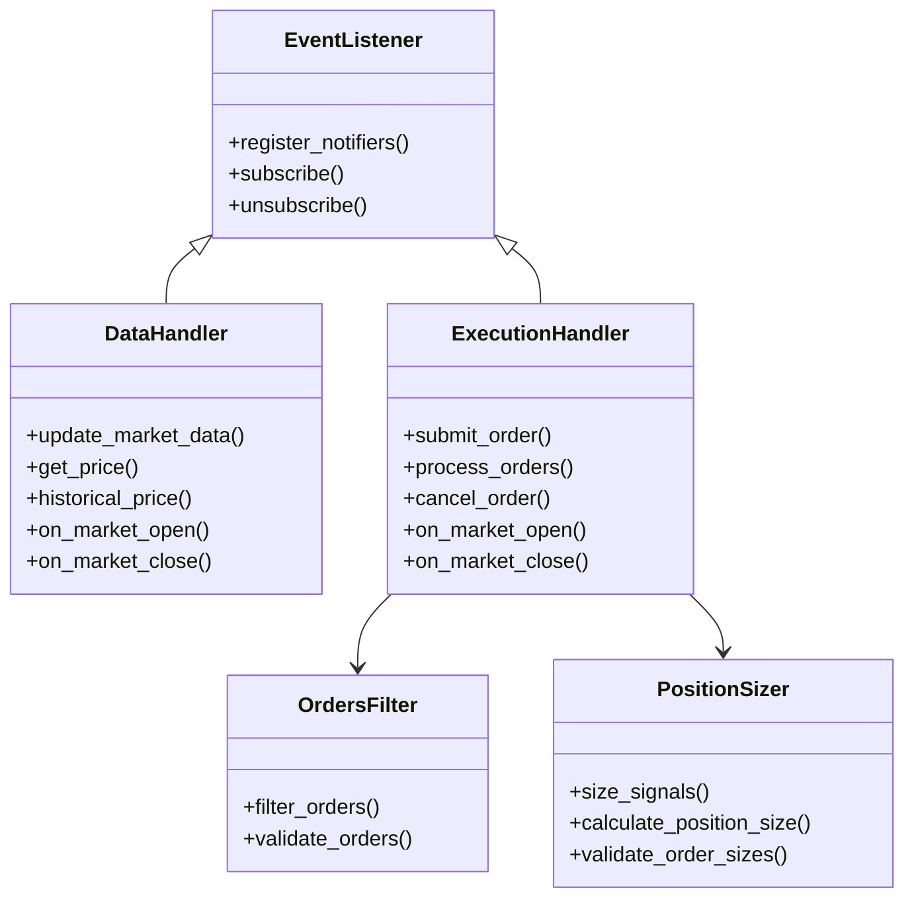

# QF-Lib Handlers

## Handler Interface and Responsibilities

QF-Lib uses a variety of handler components that process different aspects of the trading system. Each handler has a specific role in the event-driven architecture, with well-defined interfaces and responsibilities.

### Core Handler Types



### 1. DataHandler Interface

The DataHandler is responsible for providing market data to other components while ensuring no look-ahead bias occurs during backtesting.

```python
class DataHandler(EventListener):
    """
    DataHandler is a wrapper for data providers that ensures strategies
    cannot access future data during backtesting.
    """
    
    def __init__(self, data_provider, scheduler):
        self.data_provider = data_provider
        self.current_time = None
        self._watched_tickers = set()
        self._data_cache = {}
        
        # Register with scheduler to receive time events
        self.scheduler = scheduler
        scheduler.subscribe(MarketOpenEvent, self)
        scheduler.subscribe(MarketCloseEvent, self)
        scheduler.subscribe(IntradayBarEvent, self)
    
    def on_market_open(self, event):
        """Handle market open events by updating market data."""
        self.current_time = event.time
        self.update_market_data()
    
    def on_market_close(self, event):
        """Handle market close events by finalizing daily data."""
        self.current_time = event.time
        self.update_market_data()
    
    def on_new_bar(self, event):
        """Handle new bar events for intraday trading."""
        self.current_time = event.time
        self.update_market_data()
    
    def update_market_data(self):
        """Update the latest market data for all watched tickers."""
        for ticker in self._watched_tickers:
            self._update_ticker_data(ticker)
    
    def get_price(self, ticker, price_field=PriceField.Close):
        """
        Get the current price for a ticker.
        Ensures no future data is used in backtests.
        """
        if ticker not in self._watched_tickers:
            self._watched_tickers.add(ticker)
            self._update_ticker_data(ticker)
        
        if ticker in self._data_cache:
            ticker_data = self._data_cache[ticker]
            # Filter data to prevent look-ahead bias
            valid_data = ticker_data[ticker_data.index <= self.current_time]
            if not valid_data.empty:
                return valid_data[price_field].iloc[-1]
        
        return None
    
    def historical_price(self, ticker, price_field, n_bars, current_time=None):
        """
        Get historical price data for a ticker.
        Ensures no future data is used in backtests.
        """
        if current_time is None:
            current_time = self.current_time
        
        if ticker not in self._watched_tickers:
            self._watched_tickers.add(ticker)
            self._update_ticker_data(ticker)
        
        if ticker in self._data_cache:
            ticker_data = self._data_cache[ticker]
            # Filter data to prevent look-ahead bias
            valid_data = ticker_data[ticker_data.index <= current_time]
            if not valid_data.empty:
                return valid_data[price_field].tail(n_bars)
        
        return None
    
    def _update_ticker_data(self, ticker):
        """Update data for a specific ticker from the data provider."""
        data = self.data_provider.get_data(ticker)
        if data is not None:
            self._data_cache[ticker] = data
```

### 2. ExecutionHandler Interface

The ExecutionHandler processes orders generated by strategies, applying slippage models, commission costs, and execution rules.

```python
class ExecutionHandler(EventListener):
    """
    ExecutionHandler processes orders and generates fill events.
    It handles the interaction between orders and actual market transactions.
    """
    
    def __init__(self, data_handler, portfolio, slippage_model=None, commission_model=None):
        self.data_handler = data_handler
        self.portfolio = portfolio
        self.slippage_model = slippage_model or ZeroSlippageModel()
        self.commission_model = commission_model or ZeroCommissionModel()
        
        self._orders_queue = []
        self._pending_orders = {}
        self._executed_orders = {}
        
        # Register with event manager
        self.event_manager = event_manager
        self.event_manager.register_listener(self)
    
    def submit_order(self, order):
        """
        Submit an order for execution.
        Returns True if the order was accepted, False otherwise.
        """
        # Validate order
        if not self._validate_order(order):
            return False
        
        # Add to orders queue
        self._orders_queue.append(order)
        return True
    
    def process_orders(self):
        """Process all pending orders."""
        for order in self._orders_queue:
            self._process_order(order)
        
        # Clear processed orders
        self._orders_queue = []
    
    def _process_order(self, order):
        """Process a single order."""
        # Get current market price
        current_price = self.data_handler.get_price(order.ticker, PriceField.Close)
        
        if current_price is None:
            # No price available, can't execute
            return
        
        # Apply slippage model
        executed_price = self.slippage_model.apply_slippage(
            current_price, order.direction, order.quantity
        )
        
        # Calculate commission
        commission = self.commission_model.calculate_commission(
            executed_price, order.quantity
        )
        
        # Create transaction
        transaction = Transaction(
            ticker=order.ticker,
            quantity=order.quantity * order.direction.value,
            price=executed_price,
            commission=commission,
            timestamp=self.data_handler.current_time
        )
        
        # Update portfolio
        self.portfolio.process_transaction(transaction)
        
        # Record executed order
        order_id = id(order)
        self._executed_orders[order_id] = order
    
    def cancel_order(self, order):
        """Cancel a pending order."""
        if order in self._orders_queue:
            self._orders_queue.remove(order)
            return True
        return False
    
    def on_market_open(self, event):
        """Handle market open event."""
        # Process orders that should be executed at market open
        self.process_open_orders()
    
    def on_market_close(self, event):
        """Handle market close event."""
        # Process any remaining orders for the day
        self.process_orders()
```

### 3. PositionSizer Interface

The PositionSizer converts signals from strategies into concrete order sizes based on portfolio constraints and risk parameters.

```python
class PositionSizer:
    """
    PositionSizer determines the size of positions based on signals,
    portfolio value, and risk parameters.
    """
    
    def __init__(self, portfolio, risk_manager=None):
        self.portfolio = portfolio
        self.risk_manager = risk_manager or DefaultRiskManager()
    
    def size_signals(self, signals):
        """
        Convert a list of signals to properly sized orders.
        Returns a list of Order objects.
        """
        orders = []
        
        for signal in signals:
            # Calculate position size
            position_size = self.calculate_position_size(signal)
            
            # Apply risk limits
            position_size = self.risk_manager.apply_position_limits(
                signal.ticker, position_size, self.portfolio
            )
            
            if position_size > 0:
                # Create order
                order_direction = OrderDirection.BUY if signal.exposure == Exposure.LONG else OrderDirection.SELL
                
                order = Order(
                    ticker=signal.ticker,
                    quantity=position_size,
                    direction=order_direction,
                    execution_style=ExecutionStyle.MARKET,
                    timestamp=None  # Will be set by execution handler
                )
                
                orders.append(order)
        
        return orders
    
    def calculate_position_size(self, signal):
        """Calculate the recommended position size for a signal."""
        # Get portfolio value
        portfolio_value = self.portfolio.current_value
        
        # Calculate position size based on signal confidence and fraction at risk
        position_size = portfolio_value * signal.confidence * signal.fraction_at_risk
        
        # Round to nearest tradable size
        position_size = self._round_to_tradable_size(position_size, signal.ticker)
        
        return position_size
    
    def _round_to_tradable_size(self, size, ticker):
        """Round the position size to a tradable quantity."""
        # For simplicity, just round to nearest integer
        # In real implementation, this would consider lot sizes, etc.
        return int(size)
```

### 4. OrdersFilter Interface

OrdersFilters validate and potentially modify orders before execution to ensure they meet various requirements.

```python
class OrdersFilter:
    """
    OrdersFilter validates and potentially modifies orders before execution.
    Multiple filters can be chained together.
    """
    
    def filter_orders(self, orders, portfolio):
        """
        Filter a list of orders according to filter criteria.
        Returns a filtered list of orders.
        """
        raise NotImplementedError("Subclasses must implement filter_orders")

class VolumeOrdersFilter(OrdersFilter):
    """
    Filters orders based on volume constraints to avoid excessive market impact.
    """
    
    def __init__(self, data_handler, max_volume_percentage=0.1):
        self.data_handler = data_handler
        self.max_volume_percentage = max_volume_percentage
    
    def filter_orders(self, orders, portfolio):
        """
        Filter orders to ensure they don't exceed volume constraints.
        """
        filtered_orders = []
        
        for order in orders:
            # Get market volume
            volume = self.data_handler.get_price(order.ticker, PriceField.Volume)
            
            if volume is None or volume == 0:
                # No volume data available, skip this order
                continue
            
            # Calculate max allowed quantity
            max_quantity = int(volume * self.max_volume_percentage)
            
            if order.quantity > max_quantity:
                # Adjust order quantity
                adjusted_order = copy.copy(order)
                adjusted_order.quantity = max_quantity
                filtered_orders.append(adjusted_order)
            else:
                # Order is within constraints
                filtered_orders.append(order)
        
        return filtered_orders
```

## Handler Registration Process

QF-Lib employs a registration process to connect handlers with the event system and other components. This ensures that events flow to the correct handlers and component dependencies are properly resolved.

### EventManager Registration

Handlers register with the EventManager to receive notifications about relevant events:

```python
class EventManager:
    """
    EventManager dispatches events to registered listeners.
    """
    
    def __init__(self):
        self._notifiers = {}
        self._events_queue = queue.PriorityQueue()
    
    def register_notifiers(self, notifiers):
        """
        Register event notifiers.
        Each notifier handles notifications for a specific event type.
        """
        for notifier in notifiers:
            event_type = notifier.get_event_type()
            self._notifiers[event_type] = notifier
    
    def publish(self, event):
        """
        Add an event to the queue for later processing.
        """
        self._events_queue.put(event)
    
    def dispatch_next_event(self):
        """
        Dispatch the next event from the queue.
        """
        if self._events_queue.empty():
            # Special case for empty queue
            return EmptyQueueEvent()
        
        event = self._events_queue.get()
        event_type = type(event)
        
        notifier = self._get_notifier(event_type)
        if notifier:
            notifier.notify(event)
        
        return event
    
    def _get_notifier(self, event_type):
        """
        Get the appropriate notifier for an event type.
        """
        if event_type in self._notifiers:
            return self._notifiers[event_type]
        
        # Try to find a notifier for a parent class
        for registered_type, notifier in self._notifiers.items():
            if issubclass(event_type, registered_type):
                return notifier
        
        return None
```

### Example: Registering DataHandler for TimeEvents

```python
def initialize_trading_session(config):
    """Initialize a trading session with all required handlers."""
    # Create event manager
    event_manager = EventManager()
    
    # Create scheduler
    scheduler = Scheduler()
    
    # Create data handler
    data_provider = create_data_provider(config['data_provider'])
    data_handler = DataHandler(data_provider, scheduler)
    
    # Create portfolio
    portfolio = Portfolio(config['initial_cash'])
    
    # Create execution handler
    slippage_model = create_slippage_model(config['slippage_model'])
    commission_model = create_commission_model(config['commission_model'])
    execution_handler = ExecutionHandler(
        data_handler, portfolio, slippage_model, commission_model
    )
    
    # Register event notifiers
    event_manager.register_notifiers([
        TimeEventNotifier(scheduler),
        EmptyQueueEventNotifier(),
        EndTradingEventNotifier()
    ])
    
    # Subscribe handlers to events
    scheduler.subscribe(MarketOpenEvent, data_handler)
    scheduler.subscribe(MarketOpenEvent, execution_handler)
    scheduler.subscribe(MarketCloseEvent, data_handler)
    scheduler.subscribe(MarketCloseEvent, execution_handler)
    
    # Create trading session
    trading_session = TradingSession(
        event_manager=event_manager,
        data_handler=data_handler,
        portfolio=portfolio,
        execution_handler=execution_handler,
        scheduler=scheduler
    )
    
    return trading_session
```

### Strategy Registration

Strategies are registered with the trading session, which connects them to the necessary handlers:

```python
def register_strategy(trading_session, strategy, position_sizer=None, orders_filters=None):
    """Register a strategy with the trading session."""
    # Create position sizer if not provided
    if position_sizer is None:
        position_sizer = DefaultPositionSizer(trading_session.portfolio)
    
    # Create orders filters if not provided
    if orders_filters is None:
        orders_filters = [
            VolumeOrdersFilter(trading_session.data_handler)
        ]
    
    # Connect strategy to data handler
    strategy.data_handler = trading_session.data_handler
    
    # Connect strategy to execution handler via position sizer and filters
    strategy.position_sizer = position_sizer
    strategy.orders_filters = orders_filters
    strategy.execution_handler = trading_session.execution_handler
    
    # Register strategy with scheduler
    trading_session.scheduler.subscribe(MarketOpenEvent, strategy)
    trading_session.scheduler.subscribe(MarketCloseEvent, strategy)
    
    # Set strategy in trading session
    trading_session.strategy = strategy
    
    return trading_session
```

## Different Handler Types and Their Patterns

QF-Lib implements various handler types, each following specific patterns optimized for its role in the system.

### 1. DataHandler Patterns

#### Look-Ahead Prevention Pattern

The DataHandler uses a time-filtering pattern to prevent look-ahead bias:

```python
def get_historical_data(self, ticker, field, start_date, end_date):
    """
    Get historical data ensuring no look-ahead bias.
    """
    # Get raw data from provider
    data = self.data_provider.get_data(ticker, field, start_date, end_date)
    
    # Filter data based on current simulation time
    if self.current_time is not None:
        # In backtest mode, ensure no future data is used
        data = data[data.index <= self.current_time]
    
    return data
```

#### Caching Pattern

To improve performance, DataHandler implements a caching pattern:

```python
def get_data(self, ticker, field):
    """
    Get data with caching for performance.
    """
    cache_key = (ticker, field)
    
    if cache_key in self._cache:
        return self._cache[cache_key]
    
    # Data not in cache, fetch it
    data = self.data_provider.get_data(ticker, field)
    
    # Store in cache
    self._cache[cache_key] = data
    
    return data
```

### 2. ExecutionHandler Patterns

#### Order State Machine Pattern

The ExecutionHandler implements a state machine for order processing:

```python
class Order:
    """
    Represents an order in the system.
    """
    
    class Status(Enum):
        CREATED = 0
        SUBMITTED = 1
        ACCEPTED = 2
        REJECTED = 3
        FILLED = 4
        PARTIALLY_FILLED = 5
        CANCELED = 6
    
    def __init__(self, ticker, quantity, direction, execution_style):
        self.ticker = ticker
        self.quantity = quantity
        self.direction = direction
        self.execution_style = execution_style
        self.status = self.Status.CREATED
        self.filled_quantity = 0
        self.execution_price = None
        self.creation_time = None
        self.execution_time = None

class OrderExecutor:
    """
    Executes orders following the state machine pattern.
    """
    
    def process_order(self, order):
        """
        Process an order through its state machine.
        """
        if order.status == Order.Status.CREATED:
            # Move to SUBMITTED state
            order.status = Order.Status.SUBMITTED
            
            # Validate order
            if self._validate_order(order):
                order.status = Order.Status.ACCEPTED
            else:
                order.status = Order.Status.REJECTED
                return
        
        if order.status == Order.Status.ACCEPTED:
            # Execute the order
            execution_result = self._execute_order(order)
            
            if execution_result.fully_executed:
                order.status = Order.Status.FILLED
                order.filled_quantity = order.quantity
            elif execution_result.partially_executed:
                order.status = Order.Status.PARTIALLY_FILLED
                order.filled_quantity = execution_result.filled_quantity
            else:
                # Couldn't execute at all
                order.status = Order.Status.REJECTED
```

#### Chain of Responsibility Pattern

The OrdersFilter system implements a chain of responsibility pattern:

```python
class OrdersFilterChain:
    """
    Chain of responsibility for order filtering.
    """
    
    def __init__(self, filters=None):
        self.filters = filters or []
    
    def add_filter(self, filter):
        """
        Add a filter to the chain.
        """
        self.filters.append(filter)
    
    def filter_orders(self, orders, portfolio):
        """
        Apply all filters in sequence.
        """
        filtered_orders = orders
        
        for order_filter in self.filters:
            filtered_orders = order_filter.filter_orders(filtered_orders, portfolio)
        
        return filtered_orders
```

### 3. PositionSizer Patterns

#### Strategy Pattern

The PositionSizer uses the strategy pattern to support different sizing algorithms:

```python
class SizingStrategy:
    """
    Abstract base class for position sizing strategies.
    """
    
    def calculate_position_size(self, signal, portfolio):
        """
        Calculate position size based on a signal and portfolio.
        """
        raise NotImplementedError("Subclasses must implement calculate_position_size")

class PercentOfEquitySizer(SizingStrategy):
    """
    Sizes positions based on a percentage of portfolio equity.
    """
    
    def __init__(self, percent=0.02):
        self.percent = percent
    
    def calculate_position_size(self, signal, portfolio):
        """
        Calculate position size as a percentage of portfolio equity.
        """
        equity = portfolio.current_value
        return equity * self.percent * signal.confidence

class PositionSizer:
    """
    Uses a strategy pattern to determine position sizes.
    """
    
    def __init__(self, portfolio, sizing_strategy=None):
        self.portfolio = portfolio
        self.sizing_strategy = sizing_strategy or PercentOfEquitySizer()
    
    def size_signals(self, signals):
        """
        Size a list of signals using the current sizing strategy.
        """
        orders = []
        
        for signal in signals:
            # Calculate size using strategy
            size = self.sizing_strategy.calculate_position_size(signal, self.portfolio)
            
            # Create order
            order = Order(
                ticker=signal.ticker,
                quantity=size,
                direction=OrderDirection.BUY if signal.exposure == Exposure.LONG else OrderDirection.SELL,
                execution_style=ExecutionStyle.MARKET
            )
            
            orders.append(order)
        
        return orders
```

## Performance Optimizations

QF-Lib includes several performance optimizations in its handlers to ensure efficient operation during backtesting and live trading.

### 1. Data Handler Optimizations

```python
class OptimizedDataHandler(DataHandler):
    """
    DataHandler with performance optimizations.
    """
    
    def __init__(self, data_provider, scheduler):
        super().__init__(data_provider, scheduler)
        
        # Pre-fetch optimization
        self._prefetch_window = 20
        self._prefetch_cache = {}
        
        # Data resampling for faster processing
        self._resampled_data = {}
    
    def prefetch_data(self, tickers, start_date, end_date):
        """
        Prefetch data for performance optimization.
        """
        for ticker in tickers:
            data = self.data_provider.get_data(ticker, start_date, end_date)
            self._data_cache[ticker] = data
    
    def get_resampled_data(self, ticker, field, frequency):
        """
        Get data resampled to a specific frequency for faster processing.
        """
        cache_key = (ticker, field, frequency)
        
        if cache_key in self._resampled_data:
            return self._resampled_data[cache_key]
        
        # Get the raw data
        raw_data = self.get_data(ticker, field)
        
        # Resample to the desired frequency
        resampled = raw_data.resample(frequency).last()
        
        # Cache the resampled data
        self._resampled_data[cache_key] = resampled
        
        return resampled
```

### 2. ExecutionHandler Optimizations

```python
class BatchExecutionHandler(ExecutionHandler):
    """
    ExecutionHandler optimized for batch processing.
    """
    
    def __init__(self, data_handler, portfolio, slippage_model=None, commission_model=None):
        super().__init__(data_handler, portfolio, slippage_model, commission_model)
        
        # Batch processing optimization
        self._order_batches = {}
    
    def submit_order(self, order):
        """
        Submit an order, grouping by ticker for batch processing.
        """
        if order.ticker not in self._order_batches:
            self._order_batches[order.ticker] = []
        
        self._order_batches[order.ticker].append(order)
        return True
    
    def process_orders(self):
        """
        Process orders in batches for better performance.
        """
        for ticker, orders in self._order_batches.items():
            # Get price data once per ticker
            price = self.data_handler.get_price(ticker)
            
            # Process all orders for this ticker
            for order in orders:
                self._process_order_with_price(order, price)
        
        # Clear processed orders
        self._order_batches = {}
```

## Error Handling Strategies

QF-Lib implements comprehensive error handling strategies to ensure robustness during backtesting and live trading.

### 1. Exception Handling in DataHandler

```python
class RobustDataHandler(DataHandler):
    """
    DataHandler with robust error handling.
    """
    
    def get_price(self, ticker, price_field=PriceField.Close):
        """
        Get price with error handling.
        """
        try:
            return super().get_price(ticker, price_field)
        except Exception as e:
            self.logger.error(f"Error getting price for {ticker}: {e}")
            
            # Fall back to backup data provider if available
            if hasattr(self, 'backup_data_provider'):
                try:
                    return self.backup_data_provider.get_price(ticker, price_field)
                except Exception as backup_e:
                    self.logger.error(f"Backup provider also failed: {backup_e}")
            
            # Return None if all else fails
            return None
    
    def _update_ticker_data(self, ticker):
        """
        Update ticker data with error handling.
        """
        try:
            super()._update_ticker_data(ticker)
        except Exception as e:
            self.logger.error(f"Error updating data for {ticker}: {e}")
            
            # Flag this ticker as problematic
            if not hasattr(self, '_problematic_tickers'):
                self._problematic_tickers = set()
            
            self._problematic_tickers.add(ticker)
```

### 2. Fault Tolerance in ExecutionHandler

```python
class FaultTolerantExecutionHandler(ExecutionHandler):
    """
    ExecutionHandler with fault tolerance mechanisms.
    """
    
    def __init__(self, data_handler, portfolio, slippage_model=None, commission_model=None):
        super().__init__(data_handler, portfolio, slippage_model, commission_model)
        
        # Error tracking
        self._error_counts = {}
        self._max_errors = 3
        self._error_cooldown = 30  # minutes
    
    def _process_order(self, order):
        """
        Process an order with fault tolerance.
        """
        ticker = order.ticker
        
        # Check if this ticker has had too many errors
        if self._should_skip_ticker(ticker):
            self.logger.warning(f"Skipping order for {ticker} due to previous errors")
            return
        
        try:
            # Normal processing
            super()._process_order(order)
            
            # Reset error count on success
            if ticker in self._error_counts:
                del self._error_counts[ticker]
                
        except Exception as e:
            self.logger.error(f"Error processing order for {ticker}: {e}")
            
            # Increment error count
            if ticker not in self._error_counts:
                self._error_counts[ticker] = {
                    'count': 0,
                    'last_error': None
                }
            
            self._error_counts[ticker]['count'] += 1
            self._error_counts[ticker]['last_error'] = datetime.now()
    
    def _should_skip_ticker(self, ticker):
        """
        Determine if a ticker should be skipped due to errors.
        """
        if ticker not in self._error_counts:
            return False
        
        error_info = self._error_counts[ticker]
        
        if error_info['count'] >= self._max_errors:
            # Check if we're still in cooldown
            cooldown_time = error_info['last_error'] + timedelta(minutes=self._error_cooldown)
            
            if datetime.now() < cooldown_time:
                return True
            else:
                # Reset after cooldown
                error_info['count'] = 0
                return False
        
        return False
```

### 3. Recovery Mechanisms

```python
class RecoverableExecutionHandler(ExecutionHandler):
    """
    ExecutionHandler with recovery mechanisms.
    """
    
    def __init__(self, data_handler, portfolio, slippage_model=None, commission_model=None):
        super().__init__(data_handler, portfolio, slippage_model, commission_model)
        
        # Pending orders journal for recovery
        self._orders_journal = OrdersJournal()
    
    def submit_order(self, order):
        """
        Submit an order and journal it for recovery.
        """
        result = super().submit_order(order)
        
        if result:
            # Journal the order
            self._orders_journal.add_pending_order(order)
        
        return result
    
    def _process_order(self, order):
        """
        Process an order and update journal.
        """
        try:
            super()._process_order(order)
            
            # Mark as processed in journal
            self._orders_journal.mark_order_processed(order)
            
        except Exception as e:
            self.logger.error(f"Error processing order: {e}")
            
            # Mark as failed in journal
            self._orders_journal.mark_order_failed(order, str(e))
    
    def recover_from_journal(self):
        """
        Recover pending orders from journal.
        """
        pending_orders = self._orders_journal.get_pending_orders()
        
        if pending_orders:
            self.logger.info(f"Recovering {len(pending_orders)} pending orders from journal")
            
            for order in pending_orders:
                # Re-submit the order
                self._orders_queue.append(order)
```

## Handler Extension Mechanisms

QF-Lib provides several mechanisms for extending and customizing handlers to meet specific needs.

### 1. Handler Composition

```python
class CompositeDataHandler(DataHandler):
    """
    DataHandler that composes multiple data sources.
    """
    
    def __init__(self, scheduler):
        self.data_handlers = []
        self.scheduler = scheduler
        
        # Subscribe to events
        scheduler.subscribe(MarketOpenEvent, self)
        scheduler.subscribe(MarketCloseEvent, self)
    
    def add_data_handler(self, data_handler):
        """
        Add a data handler to the composite.
        """
        self.data_handlers.append(data_handler)
    
    def get_price(self, ticker, price_field=PriceField.Close):
        """
        Get price from the first handler that has the data.
        """
        for handler in self.data_handlers:
            price = handler.get_price(ticker, price_field)
            if price is not None:
                return price
        
        return None
    
    def on_market_open(self, event):
        """
        Propagate market open event to all handlers.
        """
        for handler in self.data_handlers:
            handler.on_market_open(event)
    
    def on_market_close(self, event):
        """
        Propagate market close event to all handlers.
        """
        for handler in self.data_handlers:
            handler.on_market_close(event)
```

### 2. Handler Decoration

```python
class LoggingHandlerDecorator:
    """
    Decorator that adds logging to any handler.
    """
    
    def __init__(self, handler, logger=None):
        self.handler = handler
        self.logger = logger or logging.getLogger(__name__)
        
        # Store original methods
        self._original_methods = {}
        
        # Decorate methods
        self._decorate_methods()
    
    def _decorate_methods(self):
        """
        Decorate handler methods with logging.
        """
        for method_name in dir(self.handler):
            # Skip private methods
            if method_name.startswith('_'):
                continue
            
            method = getattr(self.handler, method_name)
            
            # Only decorate callable methods
            if callable(method):
                self._original_methods[method_name] = method
                setattr(self.handler, method_name, self._create_decorated_method(method_name, method))
    
    def _create_decorated_method(self, method_name, method):
        """
        Create a decorated method with logging.
        """
        def decorated(*args, **kwargs):
            self.logger.debug(f"Calling {self.handler.__class__.__name__}.{method_name}")
            
            try:
                result = method(*args, **kwargs)
                return result
            except Exception as e:
                self.logger.error(f"Error in {self.handler.__class__.__name__}.{method_name}: {e}")
                raise
        
        return decorated
    
    def restore_original_methods(self):
        """
        Restore the original methods.
        """
        for method_name, method in self._original_methods.items():
            setattr(self.handler, method_name, method)
```

### 3. Plugin Architecture

```python
class PluggableExecutionHandler(ExecutionHandler):
    """
    ExecutionHandler with a plugin architecture.
    """
    
    def __init__(self, data_handler, portfolio, slippage_model=None, commission_model=None):
        super().__init__(data_handler, portfolio, slippage_model, commission_model)
        
        # Initialize plugin system
        self._plugins = []
    
    def register_plugin(self, plugin):
        """
        Register a plugin with the handler.
        """
        self._plugins.append(plugin)
        plugin.initialize(self)
    
    def _process_order(self, order):
        """
        Process an order with plugin hooks.
        """
        # Pre-process hooks
        for plugin in self._plugins:
            if hasattr(plugin, 'pre_process_order'):
                order = plugin.pre_process_order(order)
                
                if order is None:
                    # Plugin cancelled the order
                    return
        
        # Normal processing
        super()._process_order(order)
        
        # Post-process hooks
        for plugin in self._plugins:
            if hasattr(plugin, 'post_process_order'):
                plugin.post_process_order(order)
```

## Summary

QF-Lib's handler system provides a robust foundation for implementing trading strategies with several key advantages:

1. **Clear Interfaces**: Well-defined handler interfaces with specific responsibilities
2. **Flexible Registration**: Event-based registration connects handlers to the event flow
3. **Optimization Patterns**: Performance optimizations for efficient backtesting
4. **Error Handling**: Comprehensive error handling and recovery mechanisms
5. **Extensibility**: Multiple extension mechanisms for customization

This architecture allows QF-Lib to handle a wide range of trading strategies while maintaining high performance and reliability. 