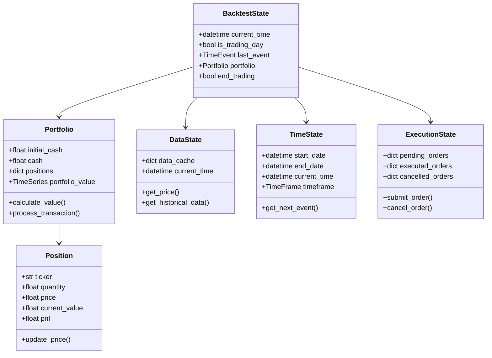
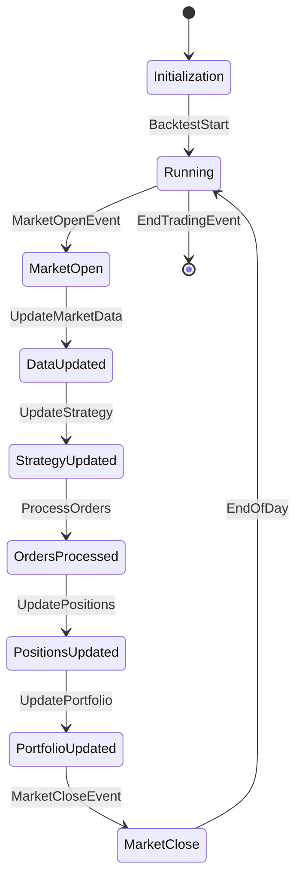

# QF-Lib State Management

## State Model Description

QF-Lib employs a comprehensive state management system to track and maintain the state of various components during backtesting and live trading. The state encompasses everything from portfolio values and positions to strategy parameters and market data.

### Key State Components

The state in QF-Lib is distributed across several core components, each responsible for a specific aspect of the overall system state:



## State Transitions and Triggers

QF-Lib's state transitions are driven by the event system, with events triggering changes in the state of various components. The central TimeFlowController regulates these state transitions by managing the flow of time and determining when state updates should occur.

### Key State Transitions



### State Transition Triggers

State transitions in QF-Lib are driven by a variety of event types, each representing a specific trigger in the system:

1. **Time Events**
   - `MarketOpenEvent`: Triggers the transition to market open state
   - `MarketCloseEvent`: Triggers the transition to market close state
   - `IntradayBarEvent`: Triggers intraday updates to data and positions
   - `EndOfDayEvent`: Signals the end of the trading day
   - `EndTradingEvent`: Signals the end of the trading/backtesting period

2. **Data Events**
   - `DataEvent`: Represents new data becoming available
   - `TickEvent`: Represents a new tick update (for higher frequency strategies)

3. **Signal Events**
   - `SignalEvent`: Represents a trading signal generated by a strategy

4. **Order Events**
   - `OrderEvent`: Represents an order submitted to the execution handler
   - `FillEvent`: Represents an order that has been filled

5. **Portfolio Events**
   - `PortfolioUpdateEvent`: Signals that the portfolio has been updated
   - `PositionChangeEvent`: Indicates that a position has changed

### Example: Market Open to Market Close Transition

```python
def process_market_day(self, date):
    """Process a single market day."""
    # Check if it's a trading day
    if not self.is_trading_day(date):
        return
    
    # 1. Market Open State
    market_open_event = MarketOpenEvent(date)
    self.event_manager.publish(market_open_event)
    
    # Process all events until intraday events are done
    self._process_intraday_events(date)
    
    # 2. Market Close State
    market_close_event = MarketCloseEvent(date)
    self.event_manager.publish(market_close_event)
    
    # 3. End of Day State
    end_of_day_event = EndOfDayEvent(date)
    self.event_manager.publish(end_of_day_event)
```

## Persistence Mechanisms

QF-Lib provides several mechanisms for persisting state during both backtesting and live trading to ensure data integrity and enable analysis.

### 1. In-Memory State Persistence

During a backtest run, QF-Lib maintains the state in memory to maximize performance:

```python
class BacktestState:
    """
    Maintains the state of the backtest in memory.
    """
    
    def __init__(self, initial_cash):
        self.current_time = None
        self.is_trading_day = False
        self.last_event = None
        self.portfolio = Portfolio(initial_cash)
        self.end_trading = False
        
        # In-memory time series data
        self.portfolio_values = TimeSeries()
        self.position_values = {}
        self.metrics = {}
        
    def update_portfolio_value(self):
        """
        Update the portfolio value time series.
        """
        current_value = self.portfolio.calculate_value()
        self.portfolio_values.add_point(self.current_time, current_value)
        
        # Update position values
        for ticker, position in self.portfolio.positions.items():
            if ticker not in self.position_values:
                self.position_values[ticker] = TimeSeries()
            
            self.position_values[ticker].add_point(
                self.current_time, position.current_value
            )
```

### 2. Backtest Results Persistence

After a backtest completes, QF-Lib can persist the results to various formats for analysis:

```python
class BacktestResultsSerializer:
    """
    Handles serialization of backtest results to various formats.
    """
    
    def __init__(self, backtest_state):
        self.backtest_state = backtest_state
    
    def to_dataframe(self):
        """
        Convert the backtest results to a pandas DataFrame.
        """
        portfolio_df = self.backtest_state.portfolio_values.to_dataframe()
        
        # Add position values as columns
        for ticker, position_ts in self.backtest_state.position_values.items():
            portfolio_df[f"position_{ticker}"] = position_ts.to_dataframe()
        
        return portfolio_df
    
    def to_csv(self, path):
        """
        Save the backtest results to a CSV file.
        """
        df = self.to_dataframe()
        df.to_csv(path)
    
    def to_json(self, path):
        """
        Save the backtest results to a JSON file.
        """
        df = self.to_dataframe()
        df.to_json(path, orient='records')
    
    def to_pdf_report(self, path, config=None):
        """
        Generate a PDF report with backtest results and charts.
        """
        from qf_lib.analysis.reporting.pdf_reporter import PDFReporter
        
        reporter = PDFReporter(config or {})
        reporter.generate_report(self.backtest_state, path)
```

### 3. Database Persistence

For more robust persistence, especially in live trading, QF-Lib can save state to a database:

```python
class DatabasePersistence:
    """
    Handles persistence of state to a database.
    """
    
    def __init__(self, db_config):
        self.engine = create_db_engine(db_config)
        self.session = create_db_session(self.engine)
        
        # Create tables if they don't exist
        self._create_tables()
    
    def save_portfolio_state(self, portfolio, timestamp):
        """
        Save the portfolio state to the database.
        """
        portfolio_record = PortfolioRecord(
            timestamp=timestamp,
            cash=portfolio.cash,
            value=portfolio.calculate_value()
        )
        
        self.session.add(portfolio_record)
        
        # Save positions
        for ticker, position in portfolio.positions.items():
            position_record = PositionRecord(
                portfolio_id=portfolio_record.id,
                ticker=ticker,
                quantity=position.quantity,
                price=position.price,
                value=position.current_value
            )
            
            self.session.add(position_record)
        
        self.session.commit()
    
    def load_portfolio_state(self, timestamp):
        """
        Load the portfolio state from the database.
        """
        portfolio_record = self.session.query(PortfolioRecord).filter(
            PortfolioRecord.timestamp <= timestamp
        ).order_by(PortfolioRecord.timestamp.desc()).first()
        
        if not portfolio_record:
            return None
        
        portfolio = Portfolio(portfolio_record.cash)
        
        # Load positions
        position_records = self.session.query(PositionRecord).filter(
            PositionRecord.portfolio_id == portfolio_record.id
        ).all()
        
        for record in position_records:
            portfolio.add_position(
                record.ticker,
                record.quantity,
                record.price
            )
        
        return portfolio
```

### 4. Checkpoint Persistence for Recovery

QF-Lib can create checkpoints during backtesting and live trading for recovery purposes:

```python
class CheckpointManager:
    """
    Manages checkpoints for recovery.
    """
    
    def __init__(self, checkpoint_dir, checkpoint_interval=timedelta(minutes=10)):
        self.checkpoint_dir = checkpoint_dir
        self.checkpoint_interval = checkpoint_interval
        self.last_checkpoint_time = None
        
        # Create checkpoint directory if it doesn't exist
        os.makedirs(checkpoint_dir, exist_ok=True)
    
    def should_create_checkpoint(self, current_time):
        """
        Determine if a checkpoint should be created.
        """
        if self.last_checkpoint_time is None:
            return True
        
        return current_time - self.last_checkpoint_time >= self.checkpoint_interval
    
    def create_checkpoint(self, backtest_state):
        """
        Create a checkpoint of the current state.
        """
        current_time = backtest_state.current_time
        
        if not self.should_create_checkpoint(current_time):
            return
        
        # Format checkpoint filename
        timestamp_str = current_time.strftime("%Y%m%d_%H%M%S")
        checkpoint_path = os.path.join(
            self.checkpoint_dir, f"checkpoint_{timestamp_str}.pkl"
        )
        
        # Serialize state to file
        with open(checkpoint_path, 'wb') as f:
            pickle.dump(backtest_state, f)
        
        self.last_checkpoint_time = current_time
    
    def list_checkpoints(self):
        """
        List available checkpoints.
        """
        checkpoint_files = glob.glob(
            os.path.join(self.checkpoint_dir, "checkpoint_*.pkl")
        )
        
        checkpoints = []
        for checkpoint_file in checkpoint_files:
            # Extract timestamp from filename
            filename = os.path.basename(checkpoint_file)
            match = re.match(r"checkpoint_(\d+)_(\d+).pkl", filename)
            
            if match:
                date_str, time_str = match.groups()
                timestamp_str = f"{date_str}_{time_str}"
                timestamp = datetime.strptime(timestamp_str, "%Y%m%d_%H%M%S")
                
                checkpoints.append({
                    'path': checkpoint_file,
                    'timestamp': timestamp
                })
        
        return sorted(checkpoints, key=lambda x: x['timestamp'])
    
    def load_latest_checkpoint(self):
        """
        Load the latest checkpoint.
        """
        checkpoints = self.list_checkpoints()
        
        if not checkpoints:
            return None
        
        latest_checkpoint = checkpoints[-1]
        
        with open(latest_checkpoint['path'], 'rb') as f:
            backtest_state = pickle.load(f)
        
        return backtest_state
    
    def load_checkpoint_by_timestamp(self, target_timestamp):
        """
        Load a checkpoint closest to the specified timestamp.
        """
        checkpoints = self.list_checkpoints()
        
        if not checkpoints:
            return None
        
        # Find checkpoint closest to target timestamp
        closest_checkpoint = min(
            checkpoints,
            key=lambda x: abs(x['timestamp'] - target_timestamp)
        )
        
        with open(closest_checkpoint['path'], 'rb') as f:
            backtest_state = pickle.load(f)
        
        return backtest_state
```

## Recovery Procedures

QF-Lib implements several recovery mechanisms to handle disruptions and maintain system integrity.

### 1. Backtest Recovery

```python
class BacktestRecovery:
    """
    Handles recovery for backtest runs.
    """
    
    def __init__(self, checkpoint_manager):
        self.checkpoint_manager = checkpoint_manager
    
    def recover_from_latest_checkpoint(self):
        """
        Recover the backtest from the latest checkpoint.
        """
        # Load the latest checkpoint
        backtest_state = self.checkpoint_manager.load_latest_checkpoint()
        
        if backtest_state is None:
            raise ValueError("No checkpoints available for recovery")
        
        # Create a new backtest session from the recovered state
        backtest = Backtest()
        backtest.set_state(backtest_state)
        
        return backtest
    
    def recover_to_specific_date(self, target_date):
        """
        Recover the backtest to a specific date.
        """
        # Convert date to datetime
        if isinstance(target_date, date):
            target_timestamp = datetime.combine(target_date, time.min)
        else:
            target_timestamp = target_date
        
        # Load checkpoint closest to target date
        backtest_state = self.checkpoint_manager.load_checkpoint_by_timestamp(
            target_timestamp
        )
        
        if backtest_state is None:
            raise ValueError("No checkpoints available for recovery")
        
        # If checkpoint is after target date, we need to find an earlier one
        if backtest_state.current_time > target_timestamp:
            checkpoints = self.checkpoint_manager.list_checkpoints()
            
            # Find checkpoints before target date
            earlier_checkpoints = [
                cp for cp in checkpoints 
                if cp['timestamp'] < target_timestamp
            ]
            
            if not earlier_checkpoints:
                raise ValueError(
                    "No checkpoints available before the target date"
                )
            
            # Use the latest checkpoint before target date
            latest_earlier_checkpoint = max(
                earlier_checkpoints,
                key=lambda x: x['timestamp']
            )
            
            with open(latest_earlier_checkpoint['path'], 'rb') as f:
                backtest_state = pickle.load(f)
        
        # Create a new backtest session from the recovered state
        backtest = Backtest()
        backtest.set_state(backtest_state)
        
        return backtest
```

### 2. Live Trading Recovery

```python
class LiveTradingRecovery:
    """
    Handles recovery for live trading.
    """
    
    def __init__(self, db_persistence, checkpoint_manager):
        self.db_persistence = db_persistence
        self.checkpoint_manager = checkpoint_manager
    
    def recover_live_session(self):
        """
        Recover a live trading session after a disruption.
        """
        # Try to load the latest checkpoint first
        backtest_state = self.checkpoint_manager.load_latest_checkpoint()
        
        if backtest_state is not None:
            # Create a new live trading session from checkpoint
            live_session = LiveTrading()
            live_session.set_state(backtest_state)
            
            return live_session
        
        # If no checkpoint is available, try to reconstruct from database
        current_time = datetime.now()
        portfolio = self.db_persistence.load_portfolio_state(current_time)
        
        if portfolio is None:
            raise ValueError("Unable to recover live session")
        
        # Create a new live trading session with the recovered portfolio
        live_session = LiveTrading()
        live_session.setup_with_portfolio(portfolio)
        
        return live_session
    
    def verify_positions(self, live_session):
        """
        Verify that the positions in the live session match the actual
        positions at the broker.
        """
        # Get positions from live session
        session_positions = live_session.portfolio.positions
        
        # Get actual positions from broker
        broker_adapter = live_session.broker_adapter
        broker_positions = broker_adapter.get_positions()
        
        # Find discrepancies
        discrepancies = []
        
        for ticker, session_pos in session_positions.items():
            if ticker not in broker_positions:
                discrepancies.append({
                    'ticker': ticker,
                    'session_quantity': session_pos.quantity,
                    'broker_quantity': 0
                })
            elif abs(session_pos.quantity - broker_positions[ticker]) > 1e-6:
                discrepancies.append({
                    'ticker': ticker,
                    'session_quantity': session_pos.quantity,
                    'broker_quantity': broker_positions[ticker]
                })
        
        for ticker, broker_qty in broker_positions.items():
            if ticker not in session_positions:
                discrepancies.append({
                    'ticker': ticker,
                    'session_quantity': 0,
                    'broker_quantity': broker_qty
                })
        
        return discrepancies
    
    def reconcile_positions(self, live_session, discrepancies):
        """
        Reconcile position discrepancies between the session and broker.
        """
        for discrepancy in discrepancies:
            ticker = discrepancy['ticker']
            broker_quantity = discrepancy['broker_quantity']
            
            # Update session position to match broker
            if broker_quantity == 0:
                if ticker in live_session.portfolio.positions:
                    live_session.portfolio.remove_position(ticker)
            else:
                # Get current price
                data_handler = live_session.data_handler
                current_price = data_handler.get_price(ticker)
                
                # Update or add position
                if ticker in live_session.portfolio.positions:
                    live_session.portfolio.update_position(
                        ticker, broker_quantity, current_price
                    )
                else:
                    live_session.portfolio.add_position(
                        ticker, broker_quantity, current_price
                    )
        
        # Save reconciled state
        self.checkpoint_manager.create_checkpoint(live_session.get_state())
        
        return live_session
```

## Thread Safety and Concurrency Considerations

QF-Lib is designed to be thread-safe in critical sections, particularly important for live trading or multi-strategy backtesting.

### 1. Concurrency in DataHandler

The DataHandler uses locks to prevent race conditions when updating data:

```python
class ThreadSafeDataHandler(DataHandler):
    """
    Thread-safe version of DataHandler.
    """
    
    def __init__(self, data_provider, scheduler):
        super().__init__(data_provider, scheduler)
        
        # Thread safety
        self._data_lock = threading.RLock()
    
    def update_market_data(self):
        """
        Update the latest market data for all watched tickers.
        Thread-safe implementation.
        """
        with self._data_lock:
            for ticker in self._watched_tickers:
                self._update_ticker_data(ticker)
    
    def get_price(self, ticker, price_field=PriceField.Close):
        """
        Get the current price for a ticker.
        Thread-safe implementation.
        """
        if ticker not in self._watched_tickers:
            with self._data_lock:
                if ticker not in self._watched_tickers:
                    self._watched_tickers.add(ticker)
                    self._update_ticker_data(ticker)
        
        with self._data_lock:
            if ticker in self._data_cache:
                ticker_data = self._data_cache[ticker]
                # Filter data to prevent look-ahead bias
                valid_data = ticker_data[ticker_data.index <= self.current_time]
                if not valid_data.empty:
                    return valid_data[price_field].iloc[-1]
        
        return None
```

### 2. Concurrency in Portfolio

The Portfolio class ensures thread safety for position updates:

```python
class ThreadSafePortfolio(Portfolio):
    """
    Thread-safe version of Portfolio.
    """
    
    def __init__(self, initial_cash):
        super().__init__(initial_cash)
        
        # Thread safety
        self._portfolio_lock = threading.RLock()
    
    def process_transaction(self, transaction):
        """
        Process a transaction and update the portfolio.
        Thread-safe implementation.
        """
        with self._portfolio_lock:
            ticker = transaction.ticker
            quantity = transaction.quantity
            price = transaction.price
            commission = transaction.commission
            
            # Update cash
            self.cash -= (quantity * price + commission)
            
            # Update position
            if ticker in self.positions:
                position = self.positions[ticker]
                position.update(quantity, price)
                
                if position.quantity == 0:
                    del self.positions[ticker]
            else:
                self.positions[ticker] = Position(ticker, quantity, price)
    
    def calculate_value(self, prices=None):
        """
        Calculate the current portfolio value.
        Thread-safe implementation.
        """
        with self._portfolio_lock:
            total_value = self.cash
            
            for ticker, position in self.positions.items():
                if prices and ticker in prices:
                    price = prices[ticker]
                else:
                    price = position.price
                
                position_value = position.quantity * price
                total_value += position_value
            
            return total_value
```

### 3. Event Manager Concurrency

The EventManager handles concurrent event processing using thread-safe queues:

```python
class ThreadSafeEventManager(EventManager):
    """
    Thread-safe version of EventManager.
    """
    
    def __init__(self):
        self._notifiers = {}
        self._events_queue = queue.PriorityQueue()  # Already thread-safe
        
        # Thread safety for notifiers dict
        self._notifiers_lock = threading.RLock()
    
    def register_notifiers(self, notifiers):
        """
        Register event notifiers.
        Thread-safe implementation.
        """
        with self._notifiers_lock:
            for notifier in notifiers:
                event_type = notifier.get_event_type()
                self._notifiers[event_type] = notifier
    
    def publish(self, event):
        """
        Add an event to the queue for later processing.
        Thread-safe implementation.
        """
        self._events_queue.put(event)  # PriorityQueue is thread-safe
    
    def dispatch_next_event(self):
        """
        Dispatch the next event from the queue.
        Thread-safe implementation.
        """
        if self._events_queue.empty():
            # Special case for empty queue
            return EmptyQueueEvent()
        
        event = self._events_queue.get()
        event_type = type(event)
        
        with self._notifiers_lock:
            notifier = self._get_notifier(event_type)
            
        if notifier:
            notifier.notify(event)
        
        return event
    
    def _get_notifier(self, event_type):
        """
        Get the appropriate notifier for an event type.
        Thread-safe implementation.
        """
        with self._notifiers_lock:
            if event_type in self._notifiers:
                return self._notifiers[event_type]
            
            # Try to find a notifier for a parent class
            for registered_type, notifier in self._notifiers.items():
                if issubclass(event_type, registered_type):
                    return notifier
            
            return None
```

### 4. Multi-Strategy Execution

QF-Lib allows running multiple strategies concurrently using thread-safe handlers:

```python
class MultiStrategyTrader:
    """
    Executes multiple strategies concurrently.
    """
    
    def __init__(self):
        self.strategies = []
        self.event_manager = ThreadSafeEventManager()
        self.data_handler = ThreadSafeDataHandler()
        self.portfolio = ThreadSafePortfolio()
        self.execution_handler = ThreadSafeExecutionHandler()
        
        # Thread pool for strategy execution
        self.thread_pool = concurrent.futures.ThreadPoolExecutor()
    
    def add_strategy(self, strategy):
        """
        Add a strategy to the trader.
        """
        self.strategies.append(strategy)
        
        # Connect strategy to handlers
        strategy.data_handler = self.data_handler
        strategy.execution_handler = self.execution_handler
        strategy.portfolio = self.portfolio
    
    def run_strategies(self, event):
        """
        Run all strategies concurrently on an event.
        """
        futures = []
        
        for strategy in self.strategies:
            future = self.thread_pool.submit(strategy.on_event, event)
            futures.append(future)
        
        # Wait for all strategies to complete
        for future in concurrent.futures.as_completed(futures):
            try:
                future.result()
            except Exception as e:
                # Handle strategy execution errors
                logger.error(f"Strategy execution error: {e}")
    
    def run_trading_session(self, start_date, end_date):
        """
        Run a trading session with multiple strategies.
        """
        current_date = start_date
        
        while current_date <= end_date:
            # Check if it's a trading day
            if self.is_trading_day(current_date):
                # Create market open event
                event = MarketOpenEvent(current_date)
                
                # Publish event
                self.event_manager.publish(event)
                
                # Run all strategies concurrently
                self.run_strategies(event)
                
                # Process orders after all strategies have run
                self.execution_handler.process_orders()
                
                # Create market close event
                event = MarketCloseEvent(current_date)
                
                # Publish event
                self.event_manager.publish(event)
                
                # Run all strategies concurrently
                self.run_strategies(event)
                
                # Process orders after all strategies have run
                self.execution_handler.process_orders()
            
            current_date += timedelta(days=1)
```

## Memory Management and Resource Cleanup

QF-Lib implements careful memory management and resource cleanup to prevent memory leaks and ensure efficient operation:

```python
class ResourceManager:
    """
    Manages resources and ensures proper cleanup.
    """
    
    def __init__(self):
        self._resources = {}
        self._resources_lock = threading.RLock()
    
    def register_resource(self, resource_id, resource, cleanup_function=None):
        """
        Register a resource for management.
        """
        with self._resources_lock:
            self._resources[resource_id] = {
                'resource': resource,
                'cleanup_function': cleanup_function
            }
    
    def get_resource(self, resource_id):
        """
        Get a managed resource.
        """
        with self._resources_lock:
            if resource_id in self._resources:
                return self._resources[resource_id]['resource']
            return None
    
    def cleanup_resource(self, resource_id):
        """
        Clean up a specific resource.
        """
        with self._resources_lock:
            if resource_id in self._resources:
                resource_info = self._resources[resource_id]
                
                if resource_info['cleanup_function']:
                    try:
                        resource_info['cleanup_function'](resource_info['resource'])
                    except Exception as e:
                        logger.error(f"Error cleaning up resource {resource_id}: {e}")
                
                del self._resources[resource_id]
    
    def cleanup_all_resources(self):
        """
        Clean up all managed resources.
        """
        with self._resources_lock:
            resource_ids = list(self._resources.keys())
        
        for resource_id in resource_ids:
            self.cleanup_resource(resource_id)
```

## Summary

QF-Lib's state management system provides a robust foundation for trading applications with several key advantages:

1. **Comprehensive State Model**: Covers all aspects of the trading system from portfolio positions to data handling
2. **Event-Driven Transitions**: State transitions are triggered by well-defined events
3. **Multiple Persistence Options**: From in-memory to database storage for different use cases
4. **Checkpoint and Recovery**: Robust mechanisms for handling disruptions
5. **Thread Safety**: Concurrency support for multi-strategy and live trading applications
6. **Resource Management**: Careful memory management and cleanup for efficient operation

These capabilities allow QF-Lib to handle complex trading strategies while maintaining data integrity and system reliability. 