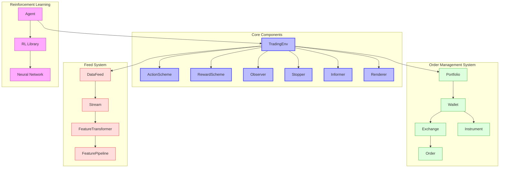

# TensorTrade Overview

TensorTrade is an open source Python framework for building, training, evaluating, and deploying robust trading algorithms using reinforcement learning. The framework focuses on being highly composable and extensible, to allow the system to scale from simple trading strategies on a single CPU, to complex investment strategies run on a distribution of HPC machines.

## Purpose and Design Philosophy

TensorTrade was designed with the following principles in mind:

- **User Friendliness**: Provides an API designed for human beings, not machines, with consistent and simple interfaces that minimize cognitive load
- **Modularity**: Offers a conglomeration of fully configurable modules that can be plugged together with minimal restrictions
- **Easy Extensibility**: Makes it simple to add new modules as classes and functions, with existing modules providing ample examples

The framework is particularly well-suited for:
- Developing and testing reinforcement learning-based trading strategies
- Experimenting with different reward functions and action spaces
- Integrating with popular RL libraries like Ray, Stable Baselines, and Tensorforce
- Educational purposes for learning algorithmic trading with RL
- Research in financial applications of reinforcement learning

## Architecture Overview



The architecture of TensorTrade follows a modular design where:

1. The **TradingEnv** is the central component that implements the OpenAI Gym interface and coordinates all other components
2. The **Core Components** define how the agent interacts with the environment:
   - **ActionScheme**: Interprets and applies the agent's actions to the environment
   - **RewardScheme**: Computes the reward for each time step based on the agent's performance
   - **Observer**: Generates the next observation for the agent
   - **Stopper**: Determines whether or not the episode is over
   - **Informer**: Generates useful monitoring information at each time step
   - **Renderer**: Renders a view of the environment and interactions
3. The **Order Management System (OMS)** handles trading operations:
   - **Portfolio**: Manages a collection of wallets across exchanges
   - **Wallet**: Tracks balances of specific instruments on specific exchanges
   - **Exchange**: Provides an interface to trading venues (real or simulated)
   - **Order**: Represents trading orders with various types and parameters
   - **Instrument**: Defines tradable assets with precision and symbol information
4. The **Feed System** manages data flow:
   - **DataFeed**: Combines multiple data streams into a single feed
   - **Stream**: Provides time-series data from various sources
   - **FeatureTransformer**: Transforms raw data into useful features
   - **FeaturePipeline**: Chains multiple transformers together
5. The **Reinforcement Learning** components handle the learning process:
   - **Agent**: Learns to make trading decisions through interaction with the environment
   - **RL Library**: External libraries like Ray, Stable Baselines, or Tensorforce
   - **Model**: Neural network architecture that powers the agent's decision-making

## Key Components

### TradingEnv

The `TradingEnv` class is the central component that implements the OpenAI Gym interface and coordinates all other components. It:

- Manages the interaction between the agent and the trading environment
- Steps through time, processing actions and generating observations
- Tracks the state of the trading system
- Computes rewards based on the agent's performance
- Determines when episodes end
- Provides rendering capabilities for visualization

### ActionScheme

The `ActionScheme` interprets and applies the agent's actions to the environment. TensorTrade provides several built-in action schemes:

- **DiscreteActions**: Maps discrete action spaces to trading operations
- **ContinuousActions**: Maps continuous action spaces to trading operations
- **BSH (Buy-Sell-Hold)**: Simple scheme for basic buy, sell, or hold actions
- **MACD (Multiple Asset-Currency Discrete)**: Allows trading multiple assets
- **ManagedRiskOrders**: Incorporates risk management into order execution

### RewardScheme

The `RewardScheme` computes the reward for each time step based on the agent's performance. TensorTrade provides several built-in reward schemes:

- **SimpleProfit**: Rewards based on net profit
- **RiskAdjustedReturns**: Rewards based on risk-adjusted metrics like Sharpe ratio
- **PBR (Position-Based Return)**: Rewards based on unrealized and realized returns
- **ScaledReturns**: Scales returns to a more suitable range for learning

### Order Management System

The Order Management System (OMS) handles all trading operations:

- **Portfolio**: Manages a collection of wallets across exchanges
- **Wallet**: Tracks balances of specific instruments on specific exchanges
- **Exchange**: Provides an interface to trading venues (real or simulated)
- **Order**: Represents trading orders with various types (market, limit, stop)
- **Instrument**: Defines tradable assets with precision and symbol information

### Feed System

The Feed System manages data flow through the environment:

- **DataFeed**: Combines multiple data streams into a single feed
- **Stream**: Provides time-series data from various sources
- **FeatureTransformer**: Transforms raw data into useful features
- **FeaturePipeline**: Chains multiple transformers together

## Supported Markets and Instruments

TensorTrade primarily focuses on cryptocurrency markets but can be extended to other markets:

- **Cryptocurrencies**: Bitcoin, Ethereum, and other digital assets
- **Simulated Markets**: Custom-generated price data for testing
- **Extensible**: Can be extended to support other markets like stocks, forex, etc.

## Reinforcement Learning Integration

TensorTrade is designed to work with popular reinforcement learning libraries:

- **Ray RLlib**: Distributed reinforcement learning framework
- **Stable Baselines**: Reliable implementations of RL algorithms
- **Tensorforce**: Flexible deep reinforcement learning framework
- **Custom Agents**: Support for custom-built reinforcement learning agents

TensorTrade supports various RL algorithms including:
- PPO (Proximal Policy Optimization)
- DQN (Deep Q-Network)
- A2C (Advantage Actor-Critic)
- SAC (Soft Actor-Critic)
- And many others through the supported RL libraries

## Data Sources

TensorTrade can obtain data from:

- CSV files
- Pandas DataFrames
- Custom data sources through the Stream API
- Simulated data generators
- Exchange APIs (through custom integrations)

## Quick Start Guide

### Installation

```bash
pip install tensortrade
```

### Basic Strategy Example

```python
import numpy as np
import pandas as pd

from tensortrade.feed.core import DataFeed, Stream
from tensortrade.oms.instruments import Instrument, ExchangePair
from tensortrade.oms.exchanges import Exchange
from tensortrade.oms.services.execution.simulated import execute_order
from tensortrade.oms.wallets import Wallet, Portfolio
from tensortrade.agents import DQNAgent
from tensortrade.env.default import TradingEnv, default_reward_scheme, default_action_scheme

# Define the instruments and exchange
USD = Instrument("USD", precision=2)
BTC = Instrument("BTC", precision=8)
exchange = Exchange("bitfinex", service=execute_order)(
    Stream.source(list(range(100)), dtype="float").rename("USD-BTC")
)

# Create the wallets and portfolio
cash = Wallet(exchange, 10000 * USD)
asset = Wallet(exchange, 0 * BTC)
portfolio = Portfolio(USD, [cash, asset])

# Create the feed
feed = DataFeed([
    Stream.source(np.random.random(100), dtype="float").rename("random"),
    Stream.source(np.random.randint(0, 10, 100), dtype="int").rename("integers")
])

# Create the environment
env = TradingEnv(
    feed=feed,
    portfolio=portfolio,
    action_scheme=default_action_scheme(cash, asset),
    reward_scheme=default_reward_scheme(),
    window_size=10
)

# Create and train the agent
agent = DQNAgent(env)
agent.train(n_episodes=10, n_steps=100)

# Test the agent
agent.test(n_episodes=1)
```

### Using Ray for Distributed Training

```python
import ray
from ray import tune
from ray.tune.registry import register_env

# Define environment creation function
def create_env(config):
    # Create environment as shown above
    return env

# Register the environment
register_env("TradingEnv", create_env)

# Run training
analysis = tune.run(
    "PPO",
    stop={"episode_reward_mean": 500},
    config={
        "env": "TradingEnv",
        "env_config": {"window_size": 25},
        "framework": "torch",
        "num_workers": 4,
        "lr": 1e-5
    }
)
```

## Dependencies

TensorTrade has the following key dependencies:

- Python 3.6+
- NumPy and Pandas for data manipulation
- OpenAI Gym for the reinforcement learning environment interface
- TensorFlow, PyTorch, or other deep learning frameworks (depending on the RL library used)
- Ray, Stable Baselines, or Tensorforce for reinforcement learning algorithms

## Further Resources

- [Official Documentation](https://www.tensortrade.org/)
- [GitHub Repository](https://github.com/tensortrade-org/tensortrade)
- [Examples](https://github.com/tensortrade-org/tensortrade/tree/master/examples)
- [Medium Tutorial](https://medium.com/@notadamking/trade-smarter-w-reinforcement-learning-a5e91163f315)
