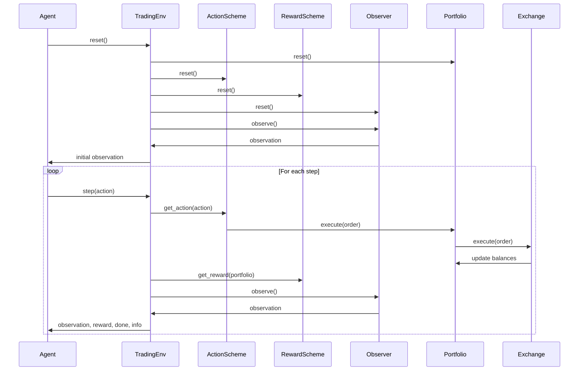
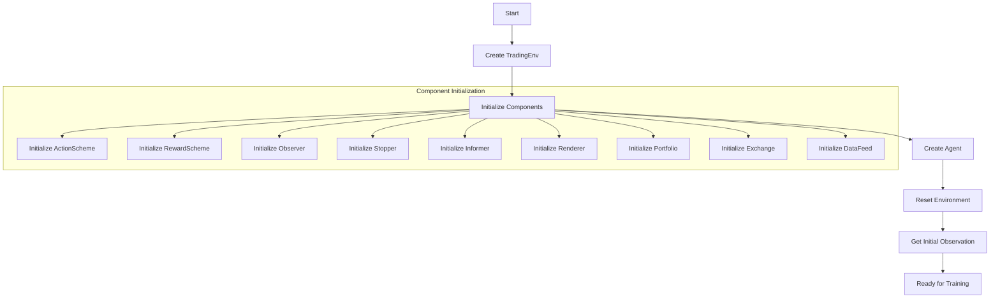
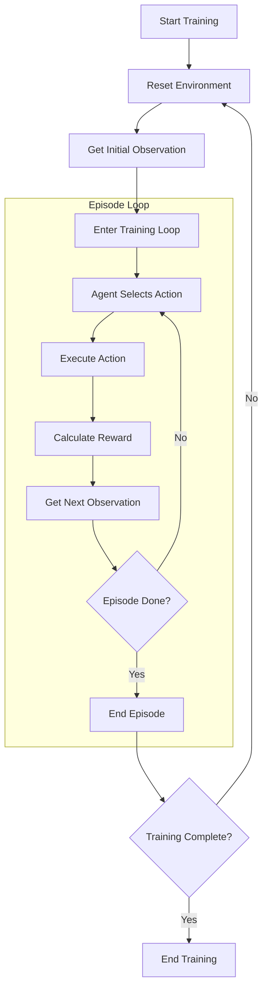
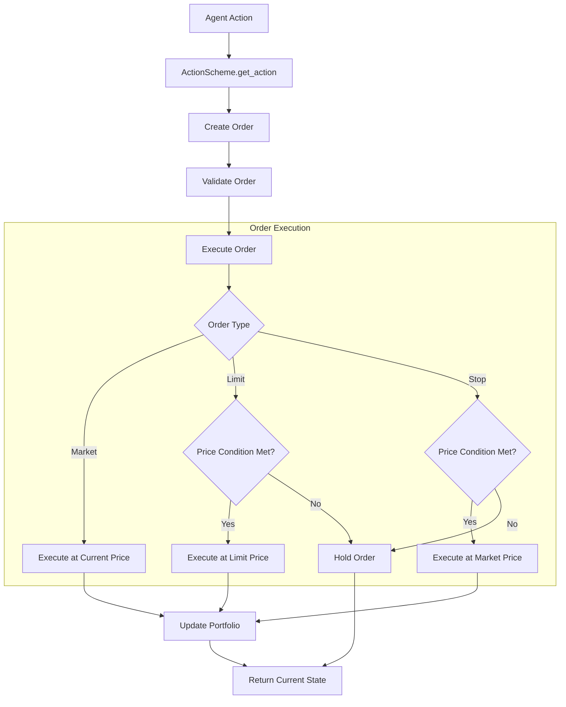
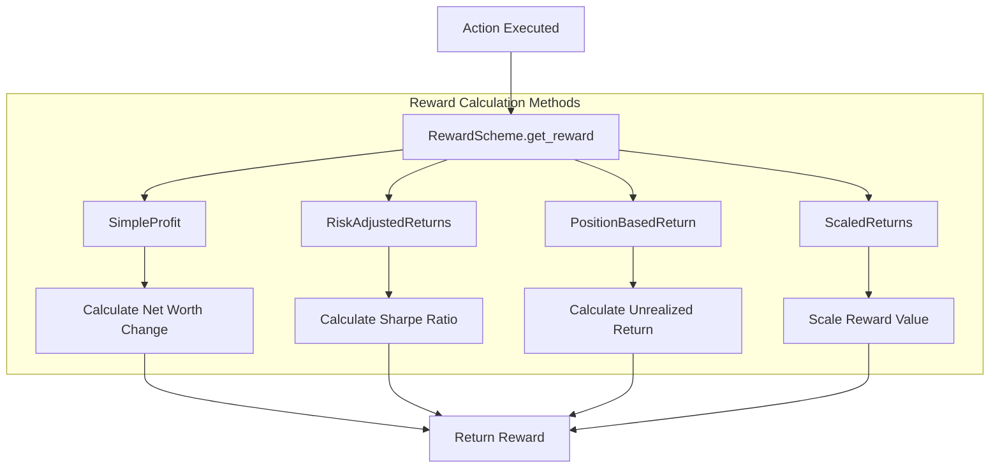
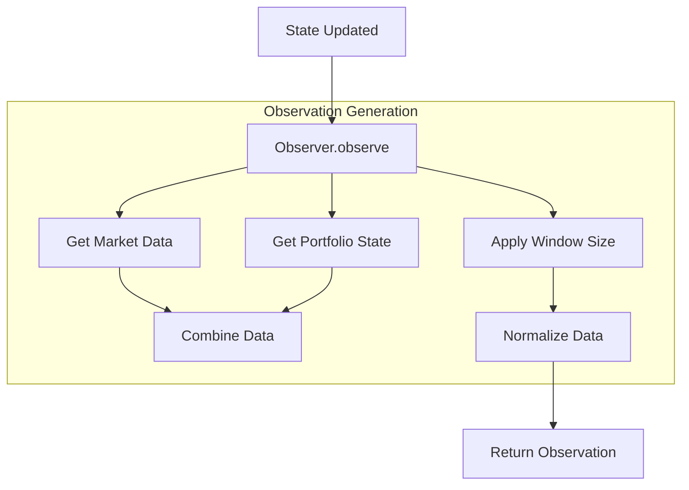
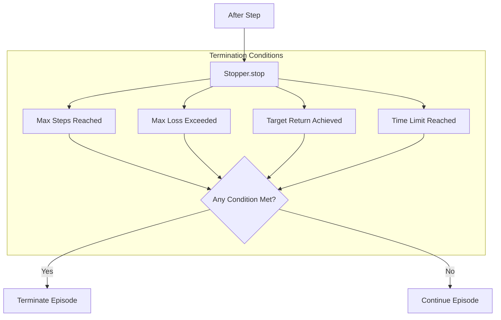
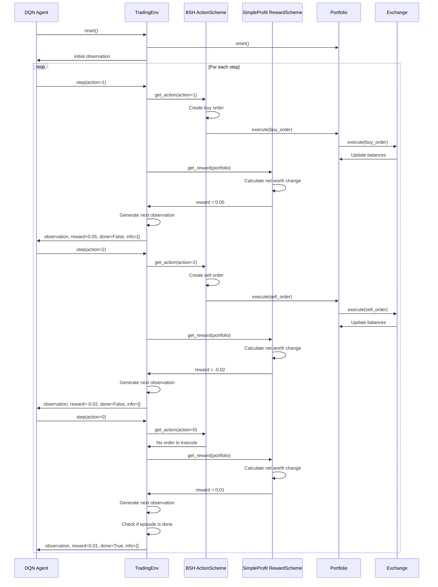

# TensorTrade Event Flow

This document details the event flow and processing sequence in the TensorTrade framework. Understanding this flow is crucial for developing effective trading strategies and properly utilizing the framework's reinforcement learning capabilities.

## High-Level Event Flow

## Detailed Event Processing Sequence

TensorTrade follows a reinforcement learning paradigm where an agent interacts with a trading environment to learn optimal trading strategies. The following sections detail this flow.

### 1. Initialization Phase

During initialization:

1. The `TradingEnv` is created with all necessary components
2. Each component is initialized with its configuration parameters
3. The reinforcement learning agent is created and connected to the environment
4. The environment is reset to its initial state
5. The initial observation is generated and provided to the agent

### 2. Training Loop

The training loop follows these steps:

1. Reset the environment to start a new episode
2. Get the initial observation
3. For each step in the episode:
   - The agent selects an action based on the current observation
   - The action is executed in the environment
   - A reward is calculated based on the outcome of the action
   - The next observation is generated
   - The agent updates its policy based on the experience (observation, action, reward, next observation)
4. When the episode ends (either by reaching a terminal state or maximum steps), a new episode begins
5. Training continues until a specified number of episodes or a performance threshold is reached

### 3. Action Execution Flow

Action execution follows these steps:

1. The agent selects an action (which could be a discrete index or continuous values)
2. The `ActionScheme` interprets this action and creates the corresponding order(s)
3. The order is validated to ensure it can be executed (e.g., sufficient funds)
4. The order is executed based on its type:
   - Market orders are executed immediately at the current price
   - Limit orders are executed if the price condition is met
   - Stop orders are executed if the stop price is reached
5. The portfolio is updated to reflect the changes in balances
6. The current state is returned to the environment

### 4. Reward Calculation Flow

Reward calculation follows these steps:

1. After an action is executed, the `RewardScheme` calculates the reward
2. Different reward schemes use different methods:
   - `SimpleProfit`: Calculates the change in net worth
   - `RiskAdjustedReturns`: Uses risk-adjusted metrics like Sharpe ratio
   - `PBR (Position-Based Return)`: Considers both unrealized and realized returns
   - `ScaledReturns`: Scales returns to a more suitable range for learning
3. The calculated reward is returned to the environment and passed to the agent

### 5. Observation Generation Flow

Observation generation follows these steps:

1. After the state is updated, the `Observer` generates a new observation
2. The observation typically includes:
   - Market data (prices, volumes, etc.)
   - Portfolio state (balances, positions, etc.)
   - Technical indicators or other features
3. The data is processed according to the window size (historical context)
4. The data is normalized to facilitate learning
5. The observation is returned to the environment and passed to the agent

### 6. Episode Termination Flow

Episode termination follows these steps:

1. After each step, the `Stopper` checks if the episode should end
2. Termination conditions can include:
   - Maximum number of steps reached
   - Maximum loss exceeded
   - Target return achieved
   - Time limit reached
3. If any termination condition is met, the episode ends
4. Otherwise, the episode continues

## Event Timing Considerations

Understanding the timing of events in TensorTrade is crucial for accurate strategy development:

1. **Data Synchronization**: All data streams in a `DataFeed` are synchronized to ensure consistent timing across different sources.

2. **Action Execution**: Actions are executed based on the current state of the environment, which includes the latest market data and portfolio state.

3. **Reward Calculation**: Rewards are calculated after actions are executed, based on the resulting state of the portfolio.

4. **Observation Generation**: Observations are generated after the state is updated, providing the agent with the latest information.

5. **Episode Termination**: Episode termination is checked after each step, based on the current state of the environment.

## Error Handling in the Event Flow

TensorTrade implements several error handling mechanisms:

1. **Order Validation**: Orders are validated before execution to ensure they can be executed (e.g., sufficient funds).

2. **Action Clipping**: Actions from the agent can be clipped to ensure they are within valid ranges.

3. **Exception Handling**: Exceptions during execution are caught and handled to prevent the environment from crashing.

4. **Logging**: Detailed logging is available to help diagnose issues during execution.

## Example Event Flow

Here's a concrete example of the event flow for a simple reinforcement learning trading strategy:

This example demonstrates how a DQN agent interacts with a TensorTrade environment using a simple Buy-Sell-Hold action scheme and a SimpleProfit reward scheme. The agent makes decisions based on the observations it receives, and the environment executes these actions and provides rewards based on the outcomes.
