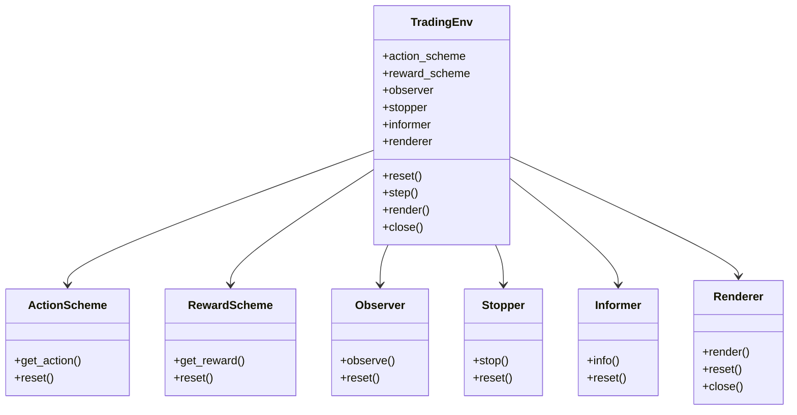
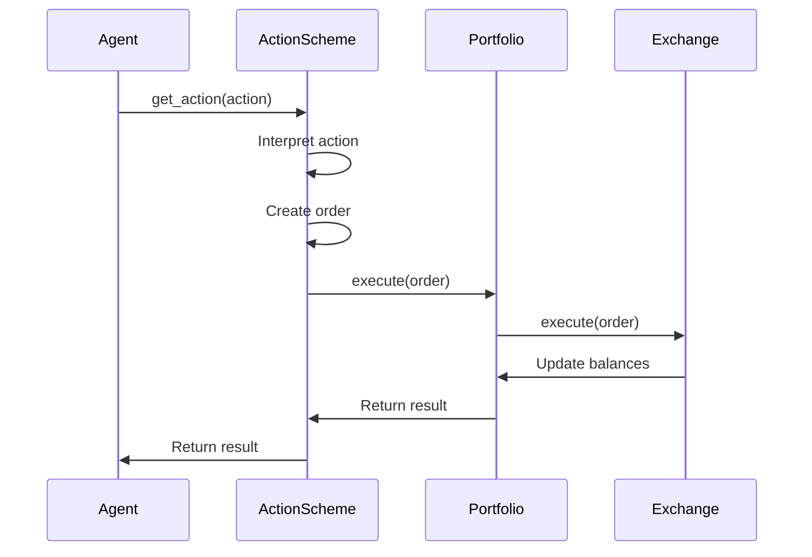
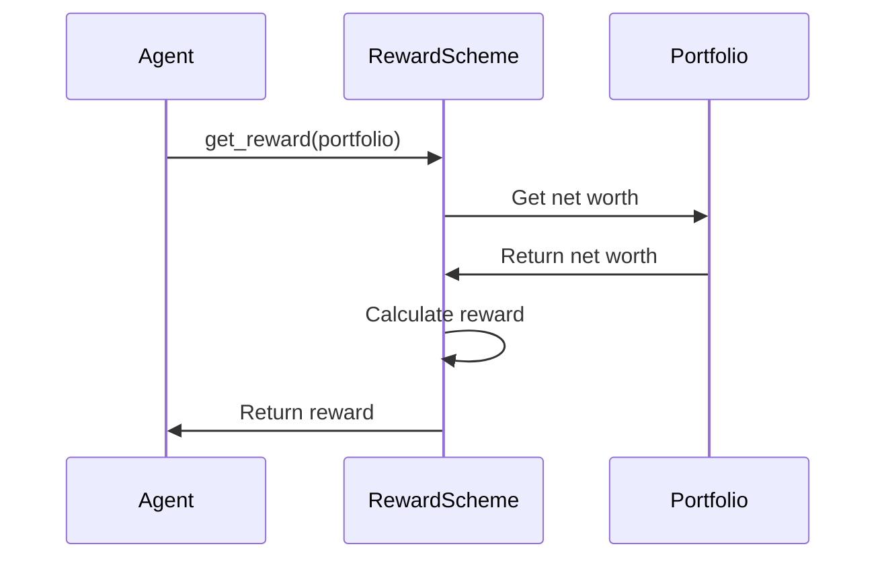
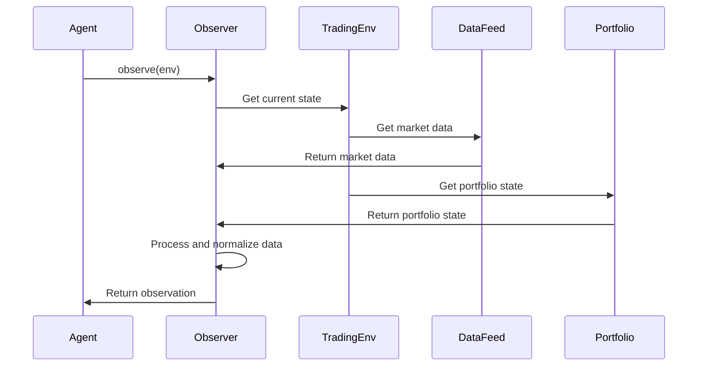

# TensorTrade Handlers

This document provides comprehensive documentation of the handlers and interfaces in TensorTrade. Understanding these components is essential for developing effective trading strategies and extending the framework's functionality.

## Handler Overview



## Core Handlers

### ActionScheme Handler

The `ActionScheme` class is responsible for interpreting the agent's actions and executing them in the environment.

#### Interface

```python
class ActionScheme(Component, ABC):
    @abstractmethod
    def get_action(self, action: Any) -> Order:
        """Get the order to be executed on the exchange based on the action."""
        raise NotImplementedError()
        
    def reset(self) -> None:
        """Reset the action scheme."""
        pass
```

#### Key Properties

- **Action Space**: Defines the structure of actions the agent can take
- **Portfolio**: Reference to the portfolio for executing orders
- **Exchange**: Reference to the exchange for executing orders

#### Responsibilities

- Interpreting actions from the agent
- Creating orders based on actions
- Executing orders on the exchange
- Managing the action space

#### Example Usage

```python
from tensortrade.env.default.actions import BSH

# Create a Buy-Sell-Hold action scheme
action_scheme = BSH(
    cash=cash_wallet,
    asset=asset_wallet
)

# Use in environment
env = TradingEnv(
    action_scheme=action_scheme,
    # other parameters
)

# Agent selects action 1 (Buy)
action = 1
order = action_scheme.get_action(action)
```

### RewardScheme Handler

The `RewardScheme` class is responsible for calculating rewards based on the agent's actions and the resulting state.

#### Interface

```python
class RewardScheme(Component, ABC):
    @abstractmethod
    def get_reward(self, portfolio: 'Portfolio') -> float:
        """Calculate the reward based on the portfolio performance."""
        raise NotImplementedError()
        
    def reset(self) -> None:
        """Reset the reward scheme."""
        pass
```

#### Key Properties

- **Portfolio**: Reference to the portfolio for calculating rewards
- **Exchange**: Reference to the exchange for market data
- **Reward Scale**: Factor to scale rewards

#### Responsibilities

- Calculating rewards based on portfolio performance
- Providing feedback to the agent
- Guiding the learning process

#### Example Usage

```python
from tensortrade.env.default.rewards import SimpleProfit

# Create a simple profit reward scheme
reward_scheme = SimpleProfit()

# Use in environment
env = TradingEnv(
    reward_scheme=reward_scheme,
    # other parameters
)

# Calculate reward after action
reward = reward_scheme.get_reward(portfolio)
```

### Observer Handler

The `Observer` class is responsible for generating observations for the agent based on the current state of the environment.

#### Interface

```python
class Observer(Component, ABC):
    @abstractmethod
    def observe(self, env: 'TradingEnv') -> np.ndarray:
        """Generate an observation from the environment."""
        raise NotImplementedError()
        
    def reset(self) -> None:
        """Reset the observer."""
        pass
```

#### Key Properties

- **Window Size**: Number of time steps to include in observations
- **Feed**: Reference to the data feed
- **Portfolio**: Reference to the portfolio
- **Renderer**: Optional renderer for visualization

#### Responsibilities

- Generating observations for the agent
- Processing market data and portfolio state
- Normalizing data for the agent
- Defining the observation space

#### Example Usage

```python
from tensortrade.env.default.observers import ObservationHistory

# Create an observation history observer
observer = ObservationHistory(
    window_size=10,
    features=['close', 'volume']
)

# Use in environment
env = TradingEnv(
    observer=observer,
    # other parameters
)

# Generate observation
observation = observer.observe(env)
```

### Stopper Handler

The `Stopper` class is responsible for determining when an episode should end.

#### Interface

```python
class Stopper(Component, ABC):
    @abstractmethod
    def stop(self, env: 'TradingEnv') -> bool:
        """Determine if the episode should end."""
        raise NotImplementedError()
        
    def reset(self) -> None:
        """Reset the stopper."""
        pass
```

#### Key Properties

- **Max Steps**: Maximum number of steps per episode
- **Max Loss**: Maximum allowed loss before stopping
- **Target Return**: Target return to achieve

#### Responsibilities

- Determining when episodes should end
- Preventing excessive losses
- Limiting episode length
- Detecting achievement of goals

#### Example Usage

```python
from tensortrade.env.default.stoppers import MaxLossStopper

# Create a max loss stopper
stopper = MaxLossStopper(
    max_allowed_loss=0.5  # 50% loss
)

# Use in environment
env = TradingEnv(
    stopper=stopper,
    # other parameters
)

# Check if episode should end
done = stopper.stop(env)
```

### Informer Handler

The `Informer` class is responsible for providing additional information about the environment state.

#### Interface

```python
class Informer(Component, ABC):
    @abstractmethod
    def info(self, env: 'TradingEnv') -> dict:
        """Generate information about the environment."""
        raise NotImplementedError()
        
    def reset(self) -> None:
        """Reset the informer."""
        pass
```

#### Key Properties

- **Portfolio**: Reference to the portfolio
- **Feed**: Reference to the data feed
- **Renderer**: Optional renderer for visualization

#### Responsibilities

- Providing additional information about the environment
- Tracking performance metrics
- Logging data for analysis
- Supporting debugging and visualization

#### Example Usage

```python
from tensortrade.env.default.informers import TensorBoardInformer

# Create a TensorBoard informer
informer = TensorBoardInformer(
    log_dir="./tensorboard_logs",
    performance_keys=["net_worth", "returns", "sharpe"]
)

# Use in environment
env = TradingEnv(
    informer=informer,
    # other parameters
)

# Get information
info = informer.info(env)
```

### Renderer Handler

The `Renderer` class is responsible for visualizing the environment state.

#### Interface

```python
class Renderer(Component, ABC):
    @abstractmethod
    def render(self, env: 'TradingEnv', **kwargs) -> None:
        """Render the environment."""
        raise NotImplementedError()
        
    def reset(self) -> None:
        """Reset the renderer."""
        pass
        
    def close(self) -> None:
        """Close the renderer."""
        pass
```

#### Key Properties

- **Mode**: Rendering mode (e.g., human, rgb_array)
- **Portfolio**: Reference to the portfolio
- **Feed**: Reference to the data feed
- **Window Size**: Number of time steps to display

#### Responsibilities

- Visualizing the environment state
- Displaying performance metrics
- Supporting debugging and analysis
- Providing visual feedback during training

#### Example Usage

```python
from tensortrade.env.default.renderers import PlotlyTradingChart

# Create a Plotly renderer
renderer = PlotlyTradingChart(
    display=True,
    save_format="html",
    path="./visualizations"
)

# Use in environment
env = TradingEnv(
    renderer=renderer,
    # other parameters
)

# Render the environment
env.render()
```

## Specialized Handlers

### BSH (Buy-Sell-Hold) Action Scheme

The `BSH` action scheme is a simple discrete action scheme that allows the agent to buy, sell, or hold.

#### Interface

```python
class BSH(ActionScheme):
    def __init__(self, cash: 'Wallet', asset: 'Wallet'):
        """Initialize the BSH action scheme."""
        super().__init__()
        self.cash = cash
        self.asset = asset
        
    def get_action(self, action: int) -> Order:
        """Get the order to be executed based on the action."""
        # Implementation details
```

#### Responsibilities

- Interpreting discrete actions (0=hold, 1=buy, 2=sell)
- Creating market orders for buy and sell actions
- Managing the cash and asset wallets

#### Example Usage

```python
from tensortrade.env.default.actions import BSH

# Create a BSH action scheme
action_scheme = BSH(
    cash=cash_wallet,
    asset=asset_wallet
)

# Use in environment
env = TradingEnv(
    action_scheme=action_scheme,
    # other parameters
)
```

### SimpleProfit Reward Scheme

The `SimpleProfit` reward scheme calculates rewards based on the change in net worth.

#### Interface

```python
class SimpleProfit(RewardScheme):
    def __init__(self, window_size: int = 1):
        """Initialize the SimpleProfit reward scheme."""
        super().__init__()
        self.window_size = window_size
        
    def get_reward(self, portfolio: 'Portfolio') -> float:
        """Calculate the reward based on the change in net worth."""
        # Implementation details
```

#### Responsibilities

- Tracking the portfolio's net worth over time
- Calculating the change in net worth
- Providing a simple reward signal based on profit/loss

#### Example Usage

```python
from tensortrade.env.default.rewards import SimpleProfit

# Create a SimpleProfit reward scheme
reward_scheme = SimpleProfit(
    window_size=1  # Compare with previous step
)

# Use in environment
env = TradingEnv(
    reward_scheme=reward_scheme,
    # other parameters
)
```

### ObservationHistory Observer

The `ObservationHistory` observer generates observations based on the history of market data and portfolio state.

#### Interface

```python
class ObservationHistory(Observer):
    def __init__(self, window_size: int, features: List[str] = None):
        """Initialize the ObservationHistory observer."""
        super().__init__()
        self.window_size = window_size
        self.features = features or []
        
    def observe(self, env: 'TradingEnv') -> np.ndarray:
        """Generate an observation from the environment."""
        # Implementation details
```

#### Responsibilities

- Collecting historical market data
- Processing portfolio state
- Combining data into a structured observation
- Normalizing data for the agent

#### Example Usage

```python
from tensortrade.env.default.observers import ObservationHistory

# Create an ObservationHistory observer
observer = ObservationHistory(
    window_size=10,
    features=['close', 'volume', 'net_worth']
)

# Use in environment
env = TradingEnv(
    observer=observer,
    # other parameters
)
```

### MaxLossStopper Stopper

The `MaxLossStopper` ends episodes when the portfolio loses a specified percentage of its initial value.

#### Interface

```python
class MaxLossStopper(Stopper):
    def __init__(self, max_allowed_loss: float = 0.5):
        """Initialize the MaxLossStopper."""
        super().__init__()
        self.max_allowed_loss = max_allowed_loss
        
    def stop(self, env: 'TradingEnv') -> bool:
        """Determine if the episode should end due to excessive loss."""
        # Implementation details
```

#### Responsibilities

- Tracking the portfolio's value
- Calculating the percentage loss
- Ending episodes when the loss exceeds the threshold

#### Example Usage

```python
from tensortrade.env.default.stoppers import MaxLossStopper

# Create a MaxLossStopper
stopper = MaxLossStopper(
    max_allowed_loss=0.3  # 30% loss
)

# Use in environment
env = TradingEnv(
    stopper=stopper,
    # other parameters
)
```

### TensorBoardInformer Informer

The `TensorBoardInformer` logs information to TensorBoard for visualization and analysis.

#### Interface

```python
class TensorBoardInformer(Informer):
    def __init__(self, log_dir: str, performance_keys: List[str] = None):
        """Initialize the TensorBoardInformer."""
        super().__init__()
        self.log_dir = log_dir
        self.performance_keys = performance_keys or []
        
    def info(self, env: 'TradingEnv') -> dict:
        """Generate information and log to TensorBoard."""
        # Implementation details
```

#### Responsibilities

- Collecting performance metrics
- Logging data to TensorBoard
- Providing information for analysis
- Supporting debugging and visualization

#### Example Usage

```python
from tensortrade.env.default.informers import TensorBoardInformer

# Create a TensorBoardInformer
informer = TensorBoardInformer(
    log_dir="./tensorboard_logs",
    performance_keys=["net_worth", "returns", "sharpe"]
)

# Use in environment
env = TradingEnv(
    informer=informer,
    # other parameters
)
```

### PlotlyTradingChart Renderer

The `PlotlyTradingChart` renderer visualizes the trading environment using Plotly.

#### Interface

```python
class PlotlyTradingChart(Renderer):
    def __init__(self, display: bool = True, save_format: str = None, path: str = None):
        """Initialize the PlotlyTradingChart renderer."""
        super().__init__()
        self.display = display
        self.save_format = save_format
        self.path = path
        
    def render(self, env: 'TradingEnv', **kwargs) -> None:
        """Render the environment using Plotly."""
        # Implementation details
```

#### Responsibilities

- Visualizing price data
- Displaying portfolio performance
- Showing trade executions
- Supporting interactive exploration

#### Example Usage

```python
from tensortrade.env.default.renderers import PlotlyTradingChart

# Create a PlotlyTradingChart renderer
renderer = PlotlyTradingChart(
    display=True,
    save_format="html",
    path="./visualizations"
)

# Use in environment
env = TradingEnv(
    renderer=renderer,
    # other parameters
)
```

## Handler Interaction Patterns

### Action Scheme and Portfolio Interaction



### Reward Scheme and Portfolio Interaction



### Observer and Environment Interaction



## Edge Cases and Their Handling

### 1. Insufficient Funds

When an agent attempts to execute an order with insufficient funds:

```python
def get_action(self, action: int) -> Order:
    if action == 1:  # Buy
        # Check if there are sufficient funds
        balance = self.cash.balance
        price = self.exchange.current_price(self.pair)
        
        if balance.as_float() < price:
            # Not enough funds, return None or a smaller order
            return None
        
        # Create buy order
        return self.buy(amount=balance)
```

### 2. Invalid Actions

When an agent selects an invalid action:

```python
def get_action(self, action: int) -> Order:
    if action < 0 or action > 2:
        # Invalid action, default to hold
        return None
    
    # Process valid action
    if action == 0:  # Hold
        return None
    elif action == 1:  # Buy
        return self.buy()
    else:  # Sell
        return self.sell()
```

### 3. Missing Data

When market data is missing:

```python
def observe(self, env: 'TradingEnv') -> np.ndarray:
    try:
        # Get market data
        data = env.feed.next()
        
        # Process data
        processed_data = self._process_data(data)
        
        return processed_data
    except Exception as e:
        # Handle missing data
        print(f"Error processing data: {e}")
        # Return last observation or zeros
        return np.zeros(self.observation_space.shape)
```

### 4. Episode Termination

When an episode needs to be terminated due to excessive loss:

```python
def stop(self, env: 'TradingEnv') -> bool:
    # Get initial net worth
    initial_net_worth = env.portfolio.initial_net_worth
    
    # Get current net worth
    current_net_worth = env.portfolio.net_worth
    
    # Calculate loss percentage
    loss_percentage = (initial_net_worth - current_net_worth) / initial_net_worth
    
    # Check if loss exceeds threshold
    if loss_percentage > self.max_allowed_loss:
        return True
    
    return False
```

## Conclusion

TensorTrade provides a comprehensive set of handlers that enable the development of sophisticated reinforcement learning-based trading strategies. By understanding these handlers and their interactions, developers can create more effective and realistic trading agents while leveraging the full capabilities of reinforcement learning.
