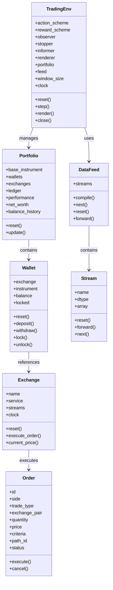
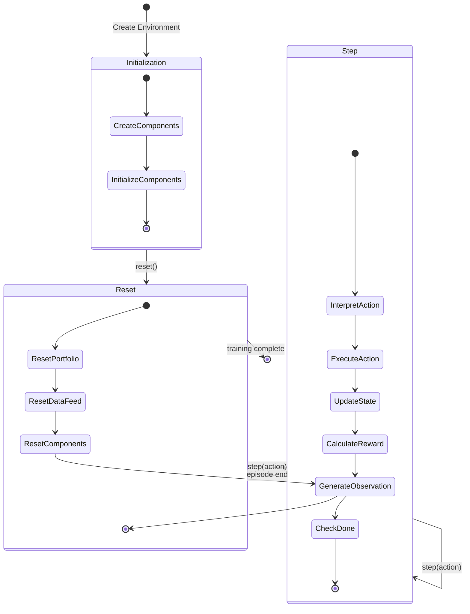

# TensorTrade State Management

This document details how TensorTrade manages state throughout the reinforcement learning trading process. Understanding the state model is essential for developing effective trading strategies and properly utilizing the framework's capabilities.

## State Model Overview



## Core State Components

TensorTrade maintains several key state components throughout the reinforcement learning process:

### 1. Environment State

The `TradingEnv` class maintains the overall state of the trading environment, including:

- **Action Scheme**: Interprets and applies the agent's actions
- **Reward Scheme**: Computes rewards based on performance
- **Observer**: Generates observations for the agent
- **Stopper**: Determines when episodes end
- **Informer**: Provides additional information during training
- **Renderer**: Visualizes the environment state
- **Portfolio**: Tracks trading positions and balances
- **Data Feed**: Provides market data
- **Window Size**: Number of time steps to include in observations
- **Clock**: Tracks the current time step

### 2. Portfolio State

The `Portfolio` class represents the trader's holdings across different exchanges:

- **Base Instrument**: The reference instrument for calculating net worth
- **Wallets**: Collection of wallets across different exchanges
- **Exchanges**: References to the exchanges being used
- **Ledger**: Record of all transactions
- **Performance**: Performance metrics (returns, drawdowns, etc.)
- **Net Worth**: Total value of all holdings in the base instrument
- **Balance History**: Historical record of balances

### 3. Wallet State

The `Wallet` class represents holdings of a specific instrument on a specific exchange:

- **Exchange**: The exchange where the wallet is located
- **Instrument**: The instrument held in the wallet
- **Balance**: The current balance of the instrument
- **Locked**: Amount of the instrument that is locked (e.g., in open orders)

### 4. Exchange State

The `Exchange` class represents a trading venue:

- **Name**: Identifier for the exchange
- **Service**: Service for executing orders
- **Streams**: Price and volume data streams
- **Clock**: Synchronization with the environment clock

### 5. Order State

The `Order` class represents trading orders with states including:

- **ID**: Unique identifier for the order
- **Side**: Buy or sell
- **Trade Type**: Market, limit, etc.
- **Exchange Pair**: The trading pair on the exchange
- **Quantity**: Amount to trade
- **Price**: Price for the order
- **Criteria**: Conditions for execution
- **Path ID**: Identifier for linked orders
- **Status**: Current status of the order (open, filled, cancelled, etc.)

### 6. Data Feed State

The `DataFeed` class manages market data:

- **Streams**: Collection of data streams
- **Current Index**: Current position in the data

### 7. Stream State

The `Stream` class represents a time series of data:

- **Name**: Identifier for the stream
- **Data Type**: Type of data in the stream
- **Array**: The actual data
- **Current Index**: Current position in the data

## State Transitions



### Key State Transitions

1. **Initialization to Reset**:
   - Environment is created with all components
   - Components are initialized with their parameters
   - Environment is reset to start the first episode

2. **Reset to Step**:
   - Portfolio is reset to initial state
   - Data feed is reset to the beginning
   - All components are reset
   - Initial observation is generated
   - Agent receives the initial observation

3. **Step to Step**:
   - Agent selects an action
   - Action is interpreted and executed
   - State is updated based on the action
   - Reward is calculated
   - Next observation is generated
   - Agent receives the next observation, reward, done flag, and info

4. **Step to Reset**:
   - Episode ends (terminal state reached or maximum steps)
   - Environment is reset to start a new episode

## State Persistence Mechanisms

TensorTrade provides several mechanisms for state persistence:

### 1. In-Memory State

During training and evaluation, state is maintained in memory:

```python
# Example of in-memory state management
env = TradingEnv(...)
state = env.reset()

for _ in range(100):
    action = agent.select_action(state)
    state, reward, done, info = env.step(action)
    
    if done:
        state = env.reset()
```

### 2. Checkpoint Saving

When using reinforcement learning libraries like Ray or Stable Baselines, checkpoints can be saved to persist the agent's state:

```python
# Example of checkpoint saving with Ray
from ray import tune

analysis = tune.run(
    "PPO",
    config={
        "env": "TradingEnv",
        # other config parameters
    },
    checkpoint_freq=10,
    checkpoint_at_end=True
)

# Get the best checkpoint
best_checkpoint = analysis.get_best_checkpoint(
    trial=analysis.get_best_trial("episode_reward_mean"),
    metric="episode_reward_mean"
)
```

### 3. Model Saving

Trained models can be saved and loaded:

```python
# Example of model saving with Stable Baselines
from stable_baselines3 import PPO

model = PPO("MlpPolicy", env)
model.learn(total_timesteps=10000)
model.save("ppo_trading_model")

# Later, load the model
loaded_model = PPO.load("ppo_trading_model")
```

### 4. Custom State Saving

Custom state saving can be implemented by extending the framework:

```python
# Example of custom state saving
class StateSavingTradingEnv(TradingEnv):
    def save_state(self, path):
        state = {
            "portfolio": self.portfolio.to_dict(),
            "feed_index": self.feed.index,
            "clock": self.clock.to_dict()
        }
        with open(path, "wb") as f:
            pickle.dump(state, f)
    
    def load_state(self, path):
        with open(path, "rb") as f:
            state = pickle.load(f)
        
        self.portfolio.from_dict(state["portfolio"])
        self.feed.index = state["feed_index"]
        self.clock.from_dict(state["clock"])
```

## State Recovery Procedures

TensorTrade implements several mechanisms for state recovery:

### 1. Environment Reset

The `reset()` method resets the environment to its initial state:

```python
# Reset the environment
state = env.reset()
```

### 2. Checkpoint Loading

Checkpoints can be loaded to recover the agent's state:

```python
# Example of checkpoint loading with Ray
from ray.rllib.agents.ppo import PPOTrainer

agent = PPOTrainer(config=config)
agent.restore(checkpoint_path)
```

### 3. Model Loading

Saved models can be loaded:

```python
# Example of model loading with Stable Baselines
from stable_baselines3 import PPO

model = PPO.load("ppo_trading_model")
```

### 4. Custom State Loading

Custom state loading can be implemented:

```python
# Example of custom state loading
env = StateSavingTradingEnv(...)
env.load_state("trading_state.pkl")
```

## Thread Safety and Concurrency

TensorTrade is designed to work with reinforcement learning libraries that may use multiple threads or processes:

1. **Ray**: When using Ray for distributed training, each worker has its own copy of the environment, avoiding concurrency issues.

2. **Vectorized Environments**: When using vectorized environments (e.g., with Stable Baselines), each environment instance is independent.

3. **Synchronization**: The framework does not provide explicit synchronization mechanisms, so users should be careful when implementing custom concurrent access to shared resources.

## State Access Patterns

### Accessing State in Custom Components

Custom components can access the environment state:

```python
# Example of a custom reward scheme
class CustomRewardScheme(RewardScheme):
    def get_reward(self, portfolio: Portfolio):
        # Access portfolio state
        net_worth = portfolio.net_worth
        previous_net_worth = portfolio.performance.net_worth.iloc[-2] if len(portfolio.performance.net_worth) > 1 else net_worth
        
        # Calculate reward based on change in net worth
        return (net_worth - previous_net_worth) / previous_net_worth
```

### Accessing State in Custom Action Schemes

Custom action schemes can access and modify the environment state:

```python
# Example of a custom action scheme
class CustomActionScheme(ActionScheme):
    def __init__(self, portfolio):
        super().__init__()
        self.portfolio = portfolio
    
    def get_action(self, action: int) -> Order:
        # Access portfolio state
        wallet = self.portfolio.get_wallet(self.exchange, self.instrument)
        balance = wallet.balance
        
        # Create order based on action and current state
        if action == 0:  # Buy
            return self.buy(amount=balance * 0.1)
        elif action == 1:  # Sell
            return self.sell(amount=balance * 0.1)
        else:  # Hold
            return None
```

### Accessing State in Custom Observers

Custom observers can access the environment state to generate observations:

```python
# Example of a custom observer
class CustomObserver(Observer):
    def observe(self, env: TradingEnv) -> np.ndarray:
        # Access environment state
        portfolio = env.portfolio
        feed = env.feed
        
        # Generate observation based on current state
        prices = feed.price_history[-self.window_size:]
        balances = [wallet.balance for wallet in portfolio.wallets]
        
        # Combine and normalize
        observation = np.concatenate([prices, balances])
        return observation
```

## State Management Examples

### Managing Multiple Assets

```python
# Example of managing multiple assets
from tensortrade.oms.instruments import USD, BTC, ETH
from tensortrade.oms.wallets import Wallet, Portfolio
from tensortrade.oms.exchanges import Exchange
from tensortrade.oms.services.execution.simulated import execute_order

# Create exchange
exchange = Exchange("binance", service=execute_order)

# Create wallets for multiple assets
cash = Wallet(exchange, 10000 * USD)
btc = Wallet(exchange, 0 * BTC)
eth = Wallet(exchange, 0 * ETH)

# Create portfolio with multiple assets
portfolio = Portfolio(USD, [cash, btc, eth])
```

### Managing State Across Episodes

```python
# Example of managing state across episodes
class EpisodeStatistics:
    def __init__(self):
        self.returns = []
        self.lengths = []
    
    def update(self, episode_return, episode_length):
        self.returns.append(episode_return)
        self.lengths.append(episode_length)
    
    def get_mean_return(self):
        return np.mean(self.returns) if self.returns else 0

# Use in training loop
stats = EpisodeStatistics()
for episode in range(100):
    state = env.reset()
    episode_return = 0
    episode_length = 0
    
    while True:
        action = agent.select_action(state)
        state, reward, done, info = env.step(action)
        
        episode_return += reward
        episode_length += 1
        
        if done:
            break
    
    stats.update(episode_return, episode_length)
    print(f"Episode {episode}: Return = {episode_return}, Length = {episode_length}")
```

### Managing State with Custom Components

```python
# Example of managing state with custom components
from tensortrade.env.default.renderers import PlotlyTradingChart
from tensortrade.env.default.informers import TensorBoardInformer

# Create custom renderer to visualize state
renderer = PlotlyTradingChart(
    display=True,
    save_format="html",
    path="./visualizations"
)

# Create custom informer to log state
informer = TensorBoardInformer(
    log_dir="./tensorboard_logs",
    performance_keys=["net_worth", "returns", "sharpe"]
)

# Use custom components in environment
env = TradingEnv(
    # other parameters
    renderer=renderer,
    informer=informer
)
```

## Conclusion

TensorTrade provides a comprehensive state management system that enables the development of reinforcement learning-based trading strategies. By understanding how the framework manages and transitions state, developers can create more effective and realistic trading agents while leveraging the full capabilities of reinforcement learning.
