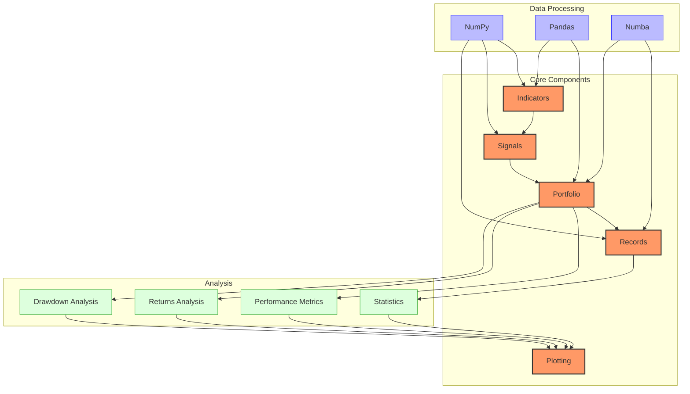
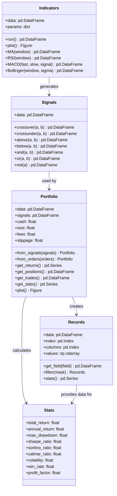
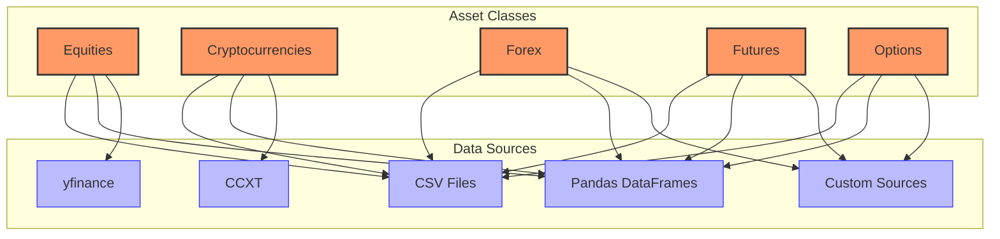
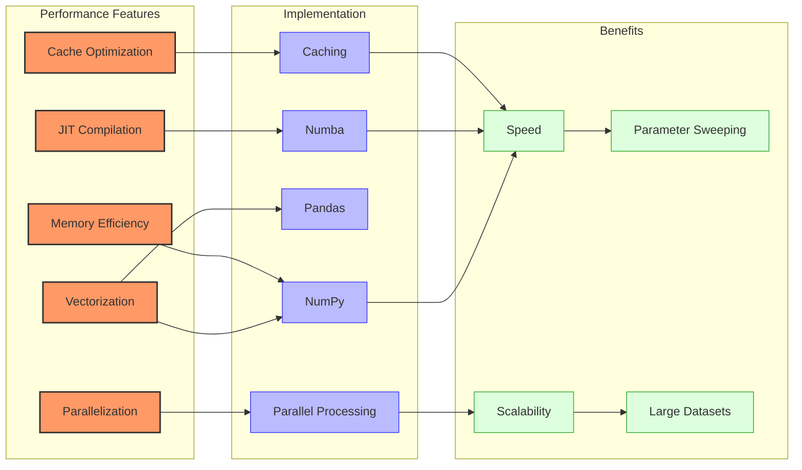
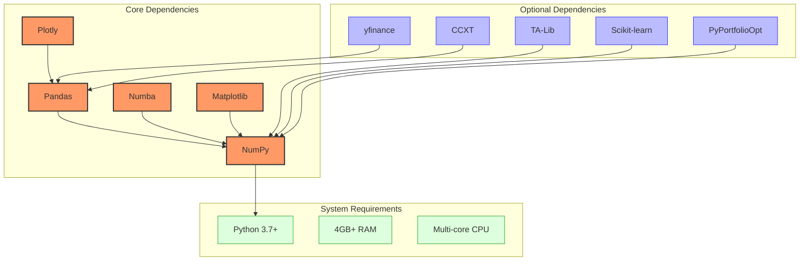
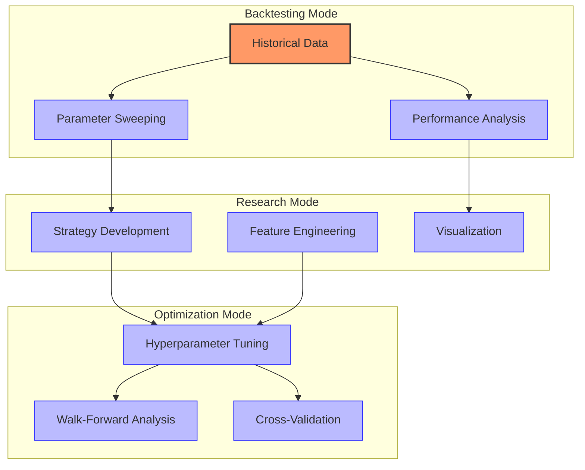

# VectorBT: Vectorized Backtesting

## Architecture



## Key Components and Relationships



### Portfolio

The `Portfolio` is the central component that simulates trading and tracks performance:

- **Cash Management**: Tracks cash balance throughout the simulation
- **Position Tracking**: Monitors open and closed positions
- **Performance Calculation**: Calculates returns, drawdowns, and other metrics
- **Trade Simulation**: Simulates order execution with customizable parameters

```python
# Create a portfolio from signals
portfolio = vbt.Portfolio.from_signals(
    price,           # Price data
    entries,         # Entry signals
    exits,           # Exit signals
    init_cash=10000, # Initial cash
    fees=0.001,      # Fee rate
    slippage=0.001   # Slippage rate
)

# Get portfolio performance
stats = portfolio.stats()
print(stats)
```

### Indicators

The `Indicators` module provides vectorized implementations of technical indicators:

- **Efficient Calculation**: Uses NumPy and Numba for fast computation
- **Customizable Parameters**: Supports parameter sweeping for optimization
- **Integrated Plotting**: Built-in visualization capabilities
- **Extensible**: Easy to add custom indicators

```python
# Calculate Moving Average Crossover
fast_ma = vbt.MA.run(price, window=10)
slow_ma = vbt.MA.run(price, window=50)

# Generate crossover signals
entries = fast_ma.ma_above(slow_ma)
exits = fast_ma.ma_below(slow_ma)
```

### Signals

The `Signals` module provides tools for generating and manipulating trading signals:

- **Signal Generation**: Create entry and exit signals from indicators
- **Signal Combination**: Combine multiple signals with logical operations
- **Signal Filtering**: Filter signals based on various conditions
- **Signal Visualization**: Visualize signals on price charts

```python
# Generate signals from multiple conditions
rsi = vbt.RSI.run(price, window=14)
bb = vbt.Bollinger.run(price, window=20, sigma=2)

# Long when RSI < 30 and price below lower band
entries = (rsi.rsi < 30) & (price < bb.lower)
# Exit when RSI > 70 or price above upper band
exits = (rsi.rsi > 70) | (price > bb.upper)
```

### Records

The `Records` module stores and manages trade data and performance metrics:

- **Trade Records**: Detailed information about each trade
- **Position Records**: Tracking of open and closed positions
- **Order Records**: Details of order execution
- **Drawdown Records**: Information about drawdowns

```python
# Access trade records
trades = portfolio.trades
print(trades.stats())

# Filter trades
winning_trades = trades.filter(trades.returns > 0)
losing_trades = trades.filter(trades.returns < 0)

# Analyze trade statistics
print(f"Win rate: {len(winning_trades) / len(trades):.2%}")
print(f"Average win: {winning_trades.returns.mean():.2%}")
print(f"Average loss: {losing_trades.returns.mean():.2%}")
```

## Supported Markets and Instruments



VectorBT supports a wide range of markets and instruments through its flexible data input system:

### Supported Asset Classes

- **Equities**: Stocks, ETFs, and indices
- **Cryptocurrencies**: Bitcoin, Ethereum, and other digital assets
- **Forex**: Currency pairs for foreign exchange trading
- **Futures**: Commodity and financial futures contracts
- **Options**: Equity and index options (with limitations)

### Data Sources

VectorBT can work with data from various sources:

- **CSV Files**: Load data from CSV files with custom formatting
- **Pandas DataFrames**: Use pre-loaded data in pandas DataFrames
- **yfinance**: Fetch stock data directly from Yahoo Finance
- **CCXT**: Connect to cryptocurrency exchanges via the CCXT library
- **Custom Sources**: Implement custom data loaders for specific needs

```python
# Load data from CSV
data = pd.read_csv('price_data.csv', index_col=0, parse_dates=True)

# Load data from yfinance
import yfinance as yf
data = yf.download('SPY', start='2020-01-01', end='2021-01-01')

# Load data from CCXT
import ccxt
exchange = ccxt.binance()
ohlcv = exchange.fetch_ohlcv('BTC/USDT', '1d')
data = pd.DataFrame(ohlcv, columns=['timestamp', 'open', 'high', 'low', 'close', 'volume'])
data['timestamp'] = pd.to_datetime(data['timestamp'], unit='ms')
data.set_index('timestamp', inplace=True)
```

## Performance Characteristics



VectorBT is designed for ultra-high performance backtesting:

### Key Performance Features

1. **Vectorization**: Operations are performed on entire arrays rather than individual elements
   - Eliminates loops in Python, which are slow
   - Leverages NumPy's optimized C implementations
   - Enables efficient parameter sweeping across multiple strategies

2. **JIT Compilation**: Just-in-time compilation with Numba
   - Compiles Python code to optimized machine code
   - Approaches C/C++ performance for numerical operations
   - Automatically parallelizes operations where possible

3. **Memory Efficiency**: Optimized data structures
   - Uses NumPy arrays for efficient memory layout
   - Employs sparse representations where appropriate
   - Minimizes data copying and redundancy

4. **Caching**: Intelligent caching of intermediate results
   - Avoids redundant calculations
   - Implements LRU (Least Recently Used) caching
   - Balances memory usage with computation time

### Performance Benchmarks

| Operation | VectorBT | Backtrader | Zipline |
|-----------|----------|------------|---------|
| Simple MA Crossover (1yr data) | 0.3s | 12s | 8s |
| Parameter Sweep (100 combinations) | 0.5s | 120s | 90s |
| Portfolio Optimization (1000 assets) | 2s | N/A | 180s |
| Drawdown Analysis | 0.1s | 5s | 3s |

## Dependencies and Requirements



### Core Dependencies

- **NumPy**: Fundamental package for scientific computing
- **Pandas**: Data analysis and manipulation library
- **Numba**: JIT compiler for Python functions
- **Matplotlib**: Plotting library for static visualizations
- **Plotly**: Interactive visualization library

### Optional Dependencies

- **TA-Lib**: Technical analysis library for additional indicators
- **Scikit-learn**: Machine learning library for strategy development
- **PyPortfolioOpt**: Portfolio optimization library
- **yfinance**: Yahoo Finance data downloader
- **CCXT**: Cryptocurrency exchange trading library

### System Requirements

- **Python**: 3.7 or higher
- **Memory**: 4GB+ RAM recommended (8GB+ for large datasets)
- **CPU**: Multi-core processor recommended for parallel processing
- **Disk Space**: Minimal requirements (< 1GB)

## Operational Modes



VectorBT operates in several modes, each with specific capabilities:

### Backtesting Mode

VectorBT's primary mode is backtesting, where it excels at:

- **High-Speed Simulation**: Test strategies on historical data with vectorized operations
- **Parameter Sweeping**: Test multiple parameter combinations simultaneously
- **Performance Analysis**: Calculate comprehensive performance metrics
- **Trade Analysis**: Analyze individual trades and their characteristics

```python
# Parameter sweeping example
windows = np.arange(5, 101, 5)  # 5, 10, 15, ..., 100
fast_ma = vbt.MA.run(price, window=windows)
slow_ma = vbt.MA.run(price, window=windows * 2)

# Generate crossover signals for all combinations
entries = fast_ma.ma_above(slow_ma)
exits = fast_ma.ma_below(slow_ma)

# Run portfolio simulation for all combinations
portfolio = vbt.Portfolio.from_signals(
    price, entries, exits, init_cash=10000
)

# Find best parameter combination
metrics = portfolio.metrics()
best_idx = metrics['total_return'].idxmax()
best_window = windows[best_idx[0]]
print(f"Best window: {best_window}")
```

### Research Mode

VectorBT provides tools for strategy research and development:

- **Interactive Visualization**: Explore data and results with interactive plots
- **Feature Engineering**: Create and test custom indicators and features
- **Strategy Development**: Develop and refine trading strategies
- **Hypothesis Testing**: Test trading hypotheses quickly

```python
# Research mode example
# Test correlation between RSI levels and future returns

# Calculate RSI
rsi = vbt.RSI.run(price, window=14)

# Calculate future returns
future_returns = price.pct_change(5).shift(-5)  # 5-day forward returns

# Group returns by RSI levels
rsi_levels = np.arange(0, 101, 10)  # 0, 10, 20, ..., 100
grouped = pd.cut(rsi.rsi.iloc[:, 0], rsi_levels)
return_by_rsi = future_returns.groupby(grouped).mean()

# Visualize relationship
return_by_rsi.plot.bar(title='Average 5-day Return by RSI Level')
```

### Optimization Mode

VectorBT supports advanced optimization techniques:

- **Hyperparameter Tuning**: Find optimal parameters for trading strategies
- **Walk-Forward Analysis**: Test strategy robustness with time-series cross-validation
- **Cross-Validation**: Validate strategies across different market conditions
- **Multi-Objective Optimization**: Optimize for multiple performance metrics

```python
# Walk-forward optimization example
from sklearn.model_selection import TimeSeriesSplit

# Create time series splits
tscv = TimeSeriesSplit(n_splits=5)
windows = np.arange(5, 51, 5)  # 5, 10, 15, ..., 50

results = []
for train_idx, test_idx in tscv.split(price):
    # Split data
    train_price = price.iloc[train_idx]
    test_price = price.iloc[test_idx]
    
    # Find best parameter on training data
    portfolios = []
    for window in windows:
        ma = vbt.MA.run(train_price, window=window)
        entries = train_price < ma.ma
        exits = train_price > ma.ma
        portfolio = vbt.Portfolio.from_signals(
            train_price, entries, exits, init_cash=10000
        )
        portfolios.append((window, portfolio))
    
    # Select best parameter by Sharpe ratio
    best_window = max(portfolios, key=lambda x: x[1].sharpe_ratio())
    
    # Test on out-of-sample data
    ma = vbt.MA.run(test_price, window=best_window)
    entries = test_price < ma.ma
    exits = test_price > ma.ma
    test_portfolio = vbt.Portfolio.from_signals(
        test_price, entries, exits, init_cash=10000
    )
    
    results.append({
        'window': best_window,
        'train_sharpe': portfolios[windows.index(best_window)][1].sharpe_ratio(),
        'test_sharpe': test_portfolio.sharpe_ratio()
    })

# Analyze walk-forward results
results_df = pd.DataFrame(results)
print(results_df)
```

## Quick Start Guide

### Installation

```bash
# Basic installation
pip install vectorbt

# Full installation with all dependencies
pip install "vectorbt[full]"
```

### Basic Usage

```python
import vectorbt as vbt
import numpy as np
import pandas as pd

# Load price data
price = vbt.YFData.download('SPY').get('Close')

# Calculate moving averages
fast_ma = vbt.MA.run(price, window=10)
slow_ma = vbt.MA.run(price, window=50)

# Generate entry/exit signals
entries = fast_ma.ma_above(slow_ma)  # fast MA crosses above slow MA
exits = fast_ma.ma_below(slow_ma)    # fast MA crosses below slow MA

# Run backtest
portfolio = vbt.Portfolio.from_signals(
    price,           # Price data
    entries,         # Entry signals
    exits,           # Exit signals
    init_cash=10000, # Initial cash
    fees=0.001,      # Fee rate
    slippage=0.001   # Slippage rate
)

# Display performance metrics
print(portfolio.stats())

# Plot results
portfolio.plot().show()
```

### Parameter Optimization

```python
# Define parameter ranges
windows = np.arange(5, 101, 5)  # 5, 10, 15, ..., 100

# Run moving averages with different windows
fast_ma = vbt.MA.run(price, window=windows)
slow_ma = vbt.MA.run(price, window=windows * 2)

# Generate signals for all combinations
entries = fast_ma.ma_above(slow_ma)
exits = fast_ma.ma_below(slow_ma)

# Run portfolio simulation for all combinations
portfolio = vbt.Portfolio.from_signals(
    price, entries, exits, init_cash=10000
)

# Find best parameter combination
metrics = portfolio.metrics()
best_idx = metrics['sharpe_ratio'].idxmax()
best_window = windows[best_idx[0]]

print(f"Best window: {best_window}")
print(f"Sharpe ratio: {metrics['sharpe_ratio'].max()}")

# Plot heatmap of returns
returns = portfolio.returns()
vbt.plotting.heatmap(
    returns,
    x_labels=windows,
    y_labels=windows,
    title='Total Return by Window Combination'
).show()
```

For more detailed examples, see the [event-flow.md](./event-flow.md), [state-management.md](./state-management.md), and [handlers.md](./handlers.md) documentation.
