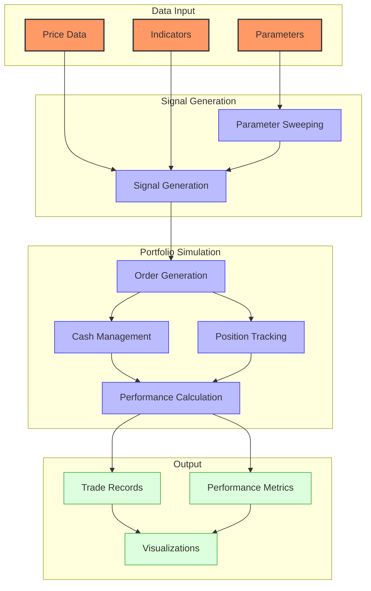
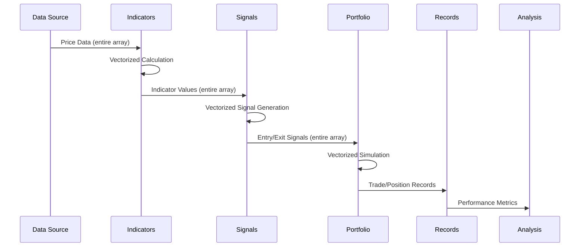
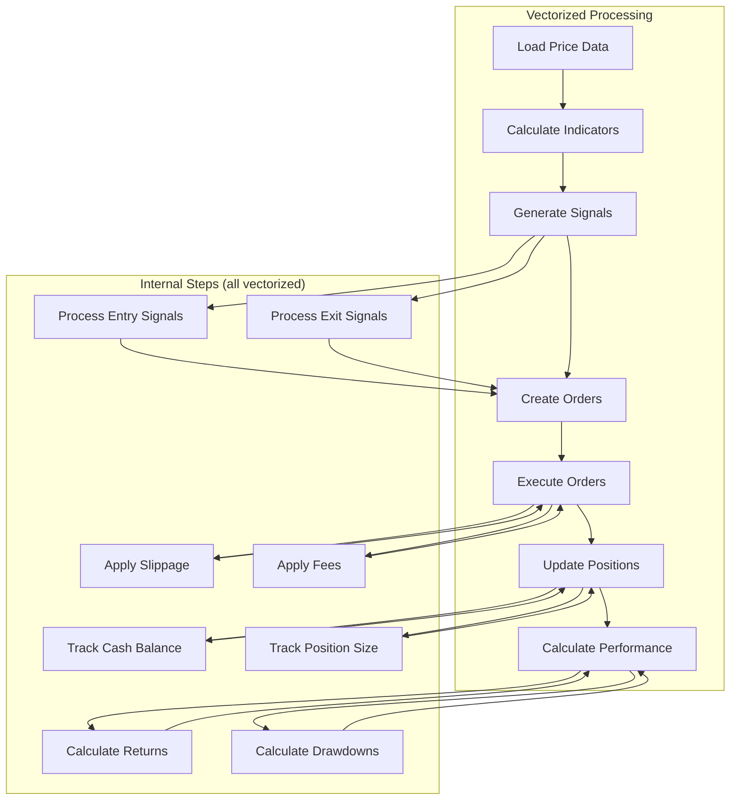
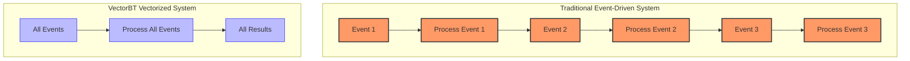

# VectorBT Event Flow

## Event Flow Overview

VectorBT uses a vectorized approach to event processing rather than a traditional event-driven architecture. This document details how data flows through the system and how events are processed in a vectorized manner.



Unlike traditional event-driven systems, VectorBT processes entire arrays of data at once using NumPy's vectorized operations. This approach offers significant performance advantages but requires a different mental model for understanding how events flow through the system.

## Vectorized Event Processing



### Key Differences from Event-Driven Systems

1. **Batch Processing vs. Sequential Processing**
   - Traditional systems: Process events one at a time in sequence
   - VectorBT: Processes entire arrays of events simultaneously

2. **Time Handling**
   - Traditional systems: Events trigger actions at specific timestamps
   - VectorBT: Time is an array dimension, processed all at once

3. **State Management**
   - Traditional systems: Maintain mutable state that changes with each event
   - VectorBT: Calculates state transitions for all timestamps at once

4. **Performance Characteristics**
   - Traditional systems: Limited by sequential processing speed
   - VectorBT: Leverages parallel processing capabilities of NumPy/Numba

## Data Flow Stages

### 1. Data Input

```python
# Load price data
import pandas as pd
import vectorbt as vbt

# Price data as a pandas DataFrame with DatetimeIndex
price = pd.read_csv('price_data.csv', index_col=0, parse_dates=True)['close']

# Or download from external source
price = vbt.YFData.download('SPY').get('Close')
```

### 2. Indicator Calculation

```python
# Calculate indicators using vectorized operations
fast_ma = vbt.MA.run(price, window=10)
slow_ma = vbt.MA.run(price, window=50)
rsi = vbt.RSI.run(price, window=14)

# Parameter sweeping (calculating multiple parameter combinations at once)
windows = [5, 10, 20, 50, 100]
mas = vbt.MA.run(price, window=windows)
```

### 3. Signal Generation

```python
# Generate entry/exit signals using vectorized operations
entries = fast_ma.ma_above(slow_ma)  # Boolean array of entry signals
exits = fast_ma.ma_below(slow_ma)    # Boolean array of exit signals

# Combine multiple signal conditions
entries = entries & (rsi.rsi < 30)    # Entry when MA crossover AND RSI < 30
exits = exits | (rsi.rsi > 70)        # Exit when MA crossunder OR RSI > 70
```

### 4. Portfolio Simulation

```python
# Run portfolio simulation using vectorized operations
portfolio = vbt.Portfolio.from_signals(
    price,           # Price data
    entries,         # Entry signals
    exits,           # Exit signals
    init_cash=10000, # Initial cash
    fees=0.001,      # Fee rate
    slippage=0.001   # Slippage rate
)
```

### 5. Results Analysis

```python
# Access trade records
trades = portfolio.trades

# Calculate performance metrics
metrics = portfolio.stats()

# Visualize results
portfolio.plot().show()
```

## Event Types

While VectorBT doesn't use traditional events, we can conceptualize the following "event types" that are processed in vectorized form:

### Market Data Events

Market data in VectorBT is represented as pandas DataFrames or Series with a DatetimeIndex:

```python
# Price data with DatetimeIndex
price = pd.Series(
    [100, 101, 102, 101, 100, 101, 102, 103, 104, 105],
    index=pd.date_range('2020-01-01', periods=10, freq='D')
)
```

### Signal Events

Signals in VectorBT are Boolean arrays indicating entry and exit points:

```python
# Entry signals (True when condition is met)
entries = pd.Series(
    [False, True, False, False, True, False, False, True, False, False],
    index=price.index
)

# Exit signals (True when condition is met)
exits = pd.Series(
    [False, False, True, False, False, True, False, False, True, False],
    index=price.index
)
```

### Order Events

Orders in VectorBT are generated internally based on signals and portfolio parameters:

```python
# Orders are generated internally from signals
portfolio = vbt.Portfolio.from_signals(price, entries, exits)

# Access order records
orders = portfolio.orders
print(orders.records_arr)
```

### Trade Events

Trades in VectorBT are calculated from order executions:

```python
# Trades are calculated from orders
trades = portfolio.trades

# Access trade records
print(trades.records_arr)
```

## Event Processing Sequence



### 1. Data Loading and Preprocessing

VectorBT loads entire price datasets into memory as pandas DataFrames or Series:

```python
# Load and preprocess data
price = vbt.YFData.download('SPY').get('Close')

# Resample to desired frequency if needed
price_daily = price.resample('D').last()

# Handle missing values
price_daily = price_daily.fillna(method='ffill')
```

### 2. Indicator Calculation

Indicators are calculated for the entire dataset at once:

```python
# Calculate indicators for entire dataset
sma = vbt.MA.run(price, window=20)
rsi = vbt.RSI.run(price, window=14)
bb = vbt.Bollinger.run(price, window=20, sigma=2)
```

### 3. Signal Generation

Signals are generated for the entire dataset at once:

```python
# Generate signals for entire dataset
entries = (price < bb.lower) & (rsi.rsi < 30)
exits = (price > bb.upper) | (rsi.rsi > 70)
```

### 4. Portfolio Simulation

The portfolio simulation processes all signals at once:

```python
# Simulate portfolio for entire dataset
portfolio = vbt.Portfolio.from_signals(
    price,
    entries,
    exits,
    init_cash=10000,
    fees=0.001,
    slippage=0.001
)
```

Internally, this performs the following steps (all vectorized):
1. Process entry signals to generate buy orders
2. Process exit signals to generate sell orders
3. Apply slippage to execution prices
4. Apply fees to transactions
5. Track cash balance throughout the simulation
6. Track position sizes throughout the simulation
7. Calculate returns and other performance metrics

### 5. Results Analysis

Results are analyzed for the entire simulation at once:

```python
# Calculate performance metrics for entire simulation
stats = portfolio.stats()

# Analyze trades
trades = portfolio.trades
winning_trades = trades.win_rate()
avg_win = trades.avg_winning()
avg_loss = trades.avg_losing()

# Analyze drawdowns
drawdowns = portfolio.drawdowns()
max_drawdown = drawdowns.max_drawdown()
```

## Timing Considerations

Since VectorBT processes events in a vectorized manner, traditional timing considerations like event ordering and latency are handled differently:

### Event Ordering

In VectorBT, event ordering is determined by the index of the input data:

```python
# Events are ordered by the DatetimeIndex
price = pd.Series(
    [100, 101, 102, 103],
    index=pd.DatetimeIndex(['2020-01-01', '2020-01-02', '2020-01-03', '2020-01-04'])
)
```

### Execution Timing

VectorBT simulates order execution based on the following rules:

1. **Signal Timing**: Signals are generated at each timestamp in the index
2. **Order Generation**: Orders are generated when signals are True
3. **Execution Timing**: Orders are executed at the next available price
4. **Fill Timing**: Fills are processed immediately after execution

```python
# By default, signals at time t use price at time t+1 for execution
portfolio = vbt.Portfolio.from_signals(
    price,
    entries,
    exits,
    signal_mode='next'  # Use next bar's price for execution (default)
)

# Alternatively, use the same bar's price for execution
portfolio = vbt.Portfolio.from_signals(
    price,
    entries,
    exits,
    signal_mode='same'  # Use same bar's price for execution
)
```

### Lookback and Lookahead Bias

VectorBT helps prevent lookahead bias through careful signal processing:

```python
# Prevent lookahead bias by using shifted data
price_lag1 = price.shift(1)  # Use previous bar's price for signal generation

# Or use the .run() method's lookback parameter
sma = vbt.MA.run(price, window=20, lookback=True)  # Indicators only use data up to current bar
```

## Error Handling in the Event Flow

VectorBT implements several error handling mechanisms:

### Input Validation

```python
# VectorBT validates inputs before processing
try:
    portfolio = vbt.Portfolio.from_signals(
        price,
        entries,
        exits,
        init_cash=-10000  # Invalid negative initial cash
    )
except ValueError as e:
    print(f"Input validation error: {e}")
```

### Signal Consistency Checks

```python
# VectorBT checks for signal consistency
try:
    portfolio = vbt.Portfolio.from_signals(
        price,
        entries,
        exits.shift(1)  # Misaligned exit signals
    )
except ValueError as e:
    print(f"Signal consistency error: {e}")
```

### Numerical Stability

```python
# VectorBT handles numerical stability issues
portfolio = vbt.Portfolio.from_signals(
    price,
    entries,
    exits,
    init_cash=1e-10  # Very small initial cash
)
# Will use numerical stabilization techniques internally
```

## Event Flow Monitoring and Debugging

VectorBT provides several tools for monitoring and debugging the event flow:

### Logging

```python
import logging

# Enable VectorBT logging
logging.basicConfig(level=logging.INFO)
logger = logging.getLogger('vectorbt')
```

### Visualization

```python
# Visualize signals and price data
entries.vbt.signals.plot_as_entry_markers(price)
exits.vbt.signals.plot_as_exit_markers(price)

# Visualize portfolio performance
portfolio.plot()

# Visualize trades
portfolio.trades.plot()
```

### Inspection

```python
# Inspect indicator calculations
print(sma.ma)

# Inspect signal generation
print(entries)
print(exits)

# Inspect order execution
print(portfolio.orders.records_arr)

# Inspect trade details
print(portfolio.trades.records_arr)
```

### Debugging

```python
# Debug specific time periods
debug_period = slice('2020-01-01', '2020-01-10')
print(price[debug_period])
print(entries[debug_period])
print(exits[debug_period])

# Debug specific parameter combinations
debug_window = 20
debug_ma = vbt.MA.run(price, window=debug_window)
debug_entries = price < debug_ma.ma
print(debug_entries)
```

## Comparison with Traditional Event-Driven Systems



### Key Differences

| Aspect | Traditional Event-Driven | VectorBT Vectorized |
|--------|--------------------------|---------------------|
| Processing Model | Sequential | Parallel |
| Event Handling | One at a time | All at once |
| State Management | Mutable state | Immutable arrays |
| Performance | Limited by event loop | Limited by vectorization |
| Memory Usage | Lower (streaming) | Higher (all in memory) |
| Debugging | Step through events | Analyze arrays |
| Flexibility | More flexible logic | More constrained logic |
| Scalability | Limited by sequential processing | Limited by memory |

### Advantages of Vectorized Approach

1. **Performance**: Orders of magnitude faster for backtesting
2. **Parameter Sweeping**: Test multiple parameters simultaneously
3. **Simplicity**: Less complex state management
4. **Reproducibility**: Deterministic results

### Limitations of Vectorized Approach

1. **Memory Usage**: Requires all data to be in memory
2. **Complex Logic**: Some trading logic is harder to express vectorially
3. **Live Trading**: Not directly applicable to event-by-event live trading
4. **Custom Indicators**: May require Numba knowledge for optimal performance
