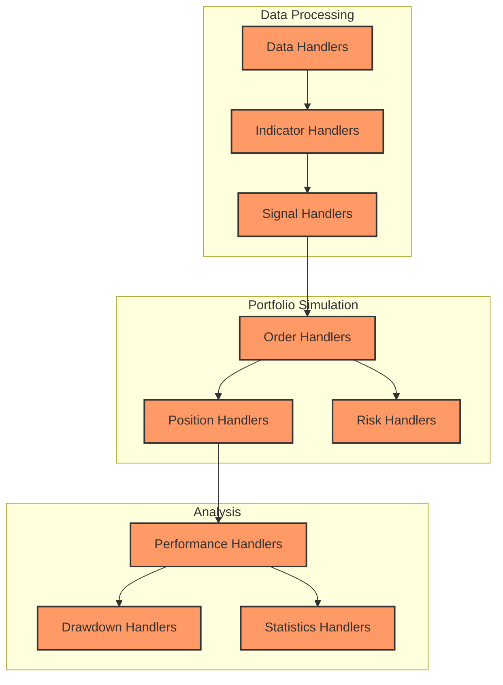
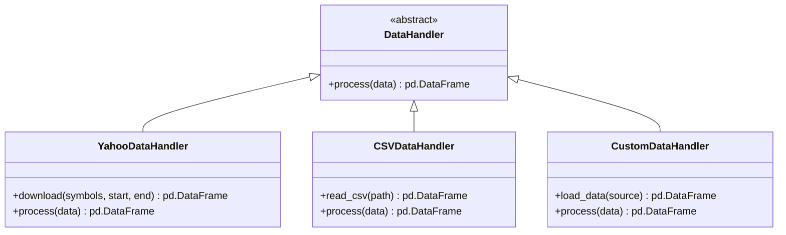
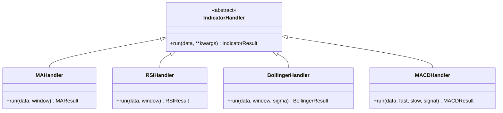
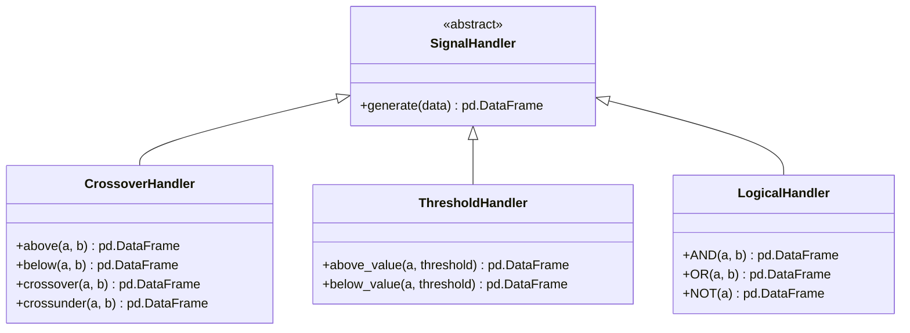
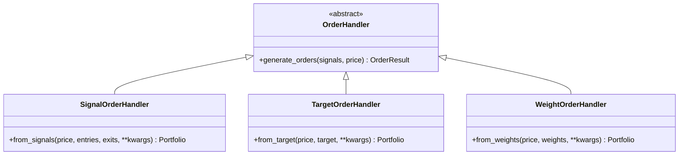
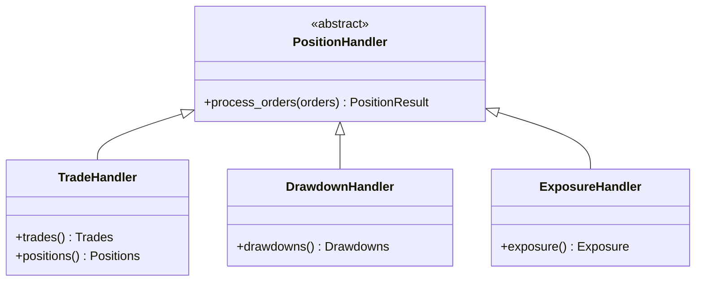
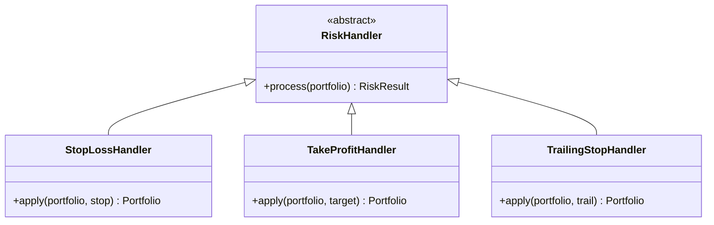
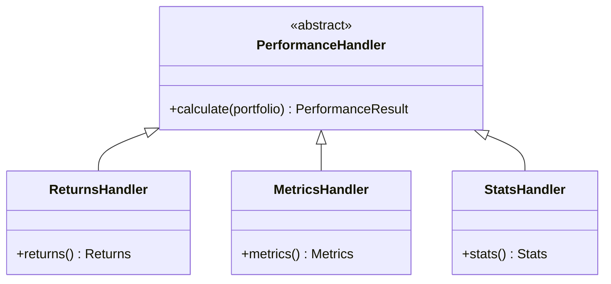

# VectorBT Handlers

## Handler Overview

VectorBT uses a different approach to handlers compared to traditional event-driven trading systems. Instead of processing events sequentially, VectorBT uses vectorized operations to process all events at once. This document details the handler interfaces, their responsibilities, and how they interact with the rest of the system.



In VectorBT, handlers are implemented as classes with methods that operate on arrays of data. These handlers are responsible for processing different aspects of the trading system, from data preparation to performance analysis.

## Data Handlers



Data handlers in VectorBT are responsible for loading and preprocessing market data:

### YahooDataHandler

```python
# Using the Yahoo Finance data handler
import vectorbt as vbt

# Download data from Yahoo Finance
data = vbt.YFData.download(
    symbols=['AAPL', 'MSFT', 'AMZN'],
    start='2020-01-01',
    end='2021-01-01'
)

# Process data
ohlcv = data.get(['Open', 'High', 'Low', 'Close', 'Volume'])
```

### CSVDataHandler

```python
# Using the CSV data handler
import pandas as pd

# Load data from CSV
data = pd.read_csv(
    'price_data.csv',
    index_col=0,
    parse_dates=True
)

# Process data
if 'Adj Close' in data.columns:
    price = data['Adj Close']
else:
    price = data['Close']
```

### CustomDataHandler

```python
# Creating a custom data handler
import pandas as pd
import numpy as np

class CryptoDataHandler:
    def __init__(self, exchange):
        self.exchange = exchange
        
    def download(self, symbol, timeframe, start, end):
        # Download data from crypto exchange
        # ...
        return data
        
    def process(self, data):
        # Process cryptocurrency data
        # ...
        return processed_data

# Using the custom data handler
crypto_handler = CryptoDataHandler('binance')
btc_data = crypto_handler.download('BTC/USDT', '1d', '2020-01-01', '2021-01-01')
processed_btc_data = crypto_handler.process(btc_data)
```

## Indicator Handlers



Indicator handlers in VectorBT are responsible for calculating technical indicators:

### MAHandler

```python
# Using the Moving Average handler
ma = vbt.MA.run(price, window=20)

# Access the MA values
ma_values = ma.ma

# Plot the MA
ma.plot().show()
```

### RSIHandler

```python
# Using the RSI handler
rsi = vbt.RSI.run(price, window=14)

# Access the RSI values
rsi_values = rsi.rsi

# Plot the RSI
rsi.plot().show()
```

### BollingerHandler

```python
# Using the Bollinger Bands handler
bb = vbt.Bollinger.run(price, window=20, sigma=2)

# Access the Bollinger Bands values
middle_band = bb.middle
upper_band = bb.upper
lower_band = bb.lower

# Plot the Bollinger Bands
bb.plot().show()
```

### MACDHandler

```python
# Using the MACD handler
macd = vbt.MACD.run(price, fast=12, slow=26, signal=9)

# Access the MACD values
macd_line = macd.macd
signal_line = macd.signal
histogram = macd.hist

# Plot the MACD
macd.plot().show()
```

## Signal Handlers



Signal handlers in VectorBT are responsible for generating trading signals:

### CrossoverHandler

```python
# Using the Crossover handler
fast_ma = vbt.MA.run(price, window=10)
slow_ma = vbt.MA.run(price, window=50)

# Generate crossover signals
entries = fast_ma.ma_above(slow_ma)  # Fast MA crosses above slow MA
exits = fast_ma.ma_below(slow_ma)    # Fast MA crosses below slow MA

# Alternative syntax
entries = fast_ma.ma.vbt.signals.crossed_above(slow_ma.ma)
exits = fast_ma.ma.vbt.signals.crossed_below(slow_ma.ma)
```

### ThresholdHandler

```python
# Using the Threshold handler
rsi = vbt.RSI.run(price, window=14)

# Generate threshold signals
entries = rsi.rsi < 30  # RSI below 30 (oversold)
exits = rsi.rsi > 70    # RSI above 70 (overbought)

# Alternative syntax
entries = rsi.rsi.vbt.signals.below_value(30)
exits = rsi.rsi.vbt.signals.above_value(70)
```

### LogicalHandler

```python
# Using the Logical handler
rsi = vbt.RSI.run(price, window=14)
bb = vbt.Bollinger.run(price, window=20, sigma=2)

# Generate combined signals
entries = (rsi.rsi < 30) & (price < bb.lower)  # RSI oversold AND price below lower band
exits = (rsi.rsi > 70) | (price > bb.upper)    # RSI overbought OR price above upper band

# Alternative syntax
entries = pd.Series.vbt.signals.AND(rsi.rsi < 30, price < bb.lower)
exits = pd.Series.vbt.signals.OR(rsi.rsi > 70, price > bb.upper)
```

## Order Handlers



Order handlers in VectorBT are responsible for generating and processing orders:

### SignalOrderHandler

```python
# Using the Signal Order handler
portfolio = vbt.Portfolio.from_signals(
    price,           # Price data
    entries,         # Entry signals
    exits,           # Exit signals
    size=1.0,        # Order size
    price=price,     # Execution price
    fees=0.001,      # Fee rate
    slippage=0.001   # Slippage rate
)
```

### TargetOrderHandler

```python
# Using the Target Order handler
target_size = pd.Series([1, 0, 2, 0, 1], index=price.index)

portfolio = vbt.Portfolio.from_target(
    price,           # Price data
    target_size,     # Target position size
    price=price,     # Execution price
    fees=0.001,      # Fee rate
    slippage=0.001   # Slippage rate
)
```

### WeightOrderHandler

```python
# Using the Weight Order handler
weights = pd.DataFrame({
    'AAPL': [0.6, 0.5, 0.4, 0.3, 0.2],
    'MSFT': [0.4, 0.5, 0.6, 0.7, 0.8]
}, index=pd.date_range('2020-01-01', periods=5, freq='M'))

portfolio = vbt.Portfolio.from_weights(
    prices,          # Price data for multiple assets
    weights,         # Target weights
    price=prices,    # Execution price
    fees=0.001,      # Fee rate
    slippage=0.001   # Slippage rate
)
```

## Position Handlers



Position handlers in VectorBT are responsible for tracking and managing positions:

### TradeHandler

```python
# Using the Trade handler
trades = portfolio.trades
positions = portfolio.positions

# Access trade information
trade_records = trades.records
trade_count = trades.count()
winning_trades = trades.winning()
losing_trades = trades.losing()

# Access position information
position_records = positions.records
position_count = positions.count()
open_positions = positions.open()
closed_positions = positions.closed()
```

### DrawdownHandler

```python
# Using the Drawdown handler
drawdowns = portfolio.drawdowns()

# Access drawdown information
max_drawdown = drawdowns.max()
drawdown_duration = drawdowns.duration()
underwater_periods = drawdowns.underwater()
```

### ExposureHandler

```python
# Using the Exposure handler
exposure = portfolio.exposure()

# Access exposure information
avg_exposure = exposure.mean()
max_exposure = exposure.max()
exposure_duration = (exposure > 0).sum() / len(exposure)
```

## Risk Handlers



Risk handlers in VectorBT are responsible for managing risk:

### StopLossHandler

```python
# Using the Stop Loss handler
portfolio = vbt.Portfolio.from_signals(
    price,
    entries,
    exits,
    sl_stop=0.05,  # 5% stop loss
    sl_exit=True   # Exit position when stop loss is hit
)
```

### TakeProfitHandler

```python
# Using the Take Profit handler
portfolio = vbt.Portfolio.from_signals(
    price,
    entries,
    exits,
    tp_stop=0.10,  # 10% take profit
    tp_exit=True   # Exit position when take profit is hit
)
```

### TrailingStopHandler

```python
# Using the Trailing Stop handler
portfolio = vbt.Portfolio.from_signals(
    price,
    entries,
    exits,
    sl_stop=0.05,   # 5% trailing stop
    sl_trail=True,  # Enable trailing stop
    sl_exit=True    # Exit position when trailing stop is hit
)
```

## Performance Handlers



Performance handlers in VectorBT are responsible for calculating performance metrics:

### ReturnsHandler

```python
# Using the Returns handler
returns = portfolio.returns()

# Access returns information
total_return = returns.total()
annual_return = returns.annual()
daily_returns = returns.daily()
monthly_returns = returns.resample('M')
```

### MetricsHandler

```python
# Using the Metrics handler
metrics = portfolio.metrics()

# Access metrics information
sharpe_ratio = metrics['sharpe_ratio']
sortino_ratio = metrics['sortino_ratio']
calmar_ratio = metrics['calmar_ratio']
omega_ratio = metrics['omega_ratio']
```

### StatsHandler

```python
# Using the Stats handler
stats = portfolio.stats()

# Access stats information
start_value = stats['start_value']
end_value = stats['end_value']
total_return = stats['total_return']
max_drawdown = stats['max_drawdown']
```

## Input/Output Specifications

### Data Input

VectorBT accepts various data inputs:

```python
# Price data as pandas Series
price = pd.Series(
    [100, 101, 102, 103, 104],
    index=pd.date_range('2020-01-01', periods=5, freq='D')
)

# Price data as pandas DataFrame (for multiple assets)
prices = pd.DataFrame({
    'AAPL': [150, 151, 152, 153, 154],
    'MSFT': [250, 251, 252, 253, 254]
}, index=pd.date_range('2020-01-01', periods=5, freq='D'))

# Signal data as boolean Series
entries = pd.Series(
    [True, False, True, False, True],
    index=pd.date_range('2020-01-01', periods=5, freq='D')
)

# Signal data as boolean DataFrame (for multiple assets)
entries = pd.DataFrame({
    'AAPL': [True, False, True, False, True],
    'MSFT': [False, True, False, True, False]
}, index=pd.date_range('2020-01-01', periods=5, freq='D'))
```

### Command Output

VectorBT generates various outputs:

```python
# Portfolio object
portfolio = vbt.Portfolio.from_signals(price, entries, exits)

# Order records
orders = portfolio.orders.records

# Trade records
trades = portfolio.trades.records

# Position records
positions = portfolio.positions.records

# Performance metrics
metrics = portfolio.metrics()

# Statistics
stats = portfolio.stats()

# Visualizations
fig = portfolio.plot()
```

## Error Handling Strategies

VectorBT implements several error handling strategies:

### Input Validation

```python
# VectorBT validates inputs before processing
try:
    portfolio = vbt.Portfolio.from_signals(
        price,
        entries,
        exits,
        init_cash=-10000  # Invalid negative initial cash
    )
except ValueError as e:
    print(f"Input validation error: {e}")
```

### Signal Consistency Checks

```python
# VectorBT checks for signal consistency
try:
    portfolio = vbt.Portfolio.from_signals(
        price,
        entries,
        exits.shift(1)  # Misaligned exit signals
    )
except ValueError as e:
    print(f"Signal consistency error: {e}")
```

### Numerical Stability

```python
# VectorBT handles numerical stability issues
portfolio = vbt.Portfolio.from_signals(
    price,
    entries,
    exits,
    init_cash=1e-10  # Very small initial cash
)
# Will use numerical stabilization techniques internally
```

### Exception Handling

```python
# Handle exceptions in VectorBT
try:
    # Potentially problematic operation
    portfolio = vbt.Portfolio.from_signals(price, entries, exits)
    
    # Access potentially missing data
    if portfolio.trades.count() > 0:
        avg_trade = portfolio.trades.pnl().mean()
    else:
        avg_trade = 0
        
except Exception as e:
    print(f"Error: {e}")
    # Fallback behavior
    portfolio = vbt.Portfolio.from_signals(price, entries, exits, init_cash=10000)
```

## Performance Considerations

VectorBT is designed for high performance:

### Vectorization

```python
# Vectorized operations are much faster than loops
# Instead of:
results = []
for window in range(5, 101, 5):
    ma = calculate_ma(price, window)
    result = calculate_performance(price, ma)
    results.append(result)
    
# Use vectorization:
windows = np.arange(5, 101, 5)
mas = vbt.MA.run(price, window=windows)
results = calculate_performance_vectorized(price, mas)
```

### Numba JIT Compilation

```python
# VectorBT uses Numba for JIT compilation
# Enable parallel processing
vbt.settings.numba['parallel'] = True

# Set number of threads
vbt.settings.numba['max_threads'] = 8

# Custom Numba-compiled function
@njit
def custom_indicator(price, window):
    result = np.empty_like(price)
    # Implementation...
    return result
```

### Caching

```python
# VectorBT uses caching to avoid redundant calculations
# Enable caching
vbt.settings.caching['enabled'] = True

# Set cache size
vbt.settings.caching['max_size'] = 1000

# Clear cache
vbt.settings.caching.clear()
```

### Memory Optimization

```python
# VectorBT optimizes memory usage
# Use smaller data types when possible
price = price.astype(np.float32)  # Use float32 instead of float64

# Use sparse representations for boolean arrays
entries_sparse = entries.astype('sparse')
exits_sparse = exits.astype('sparse')
```

## Edge Cases and Their Handling

VectorBT handles various edge cases:

### Empty Data

```python
# Handle empty data
empty_price = pd.Series([], dtype=float)

try:
    portfolio = vbt.Portfolio.from_signals(empty_price, entries, exits)
except ValueError as e:
    print(f"Empty data error: {e}")
    # Handle empty data case
```

### NaN Values

```python
# Handle NaN values
price_with_nans = price.copy()
price_with_nans.iloc[2] = np.nan

# Fill NaN values
price_filled = price_with_nans.fillna(method='ffill')

# Or let VectorBT handle NaNs
portfolio = vbt.Portfolio.from_signals(
    price_with_nans,
    entries,
    exits,
    ffill_price=True  # Forward fill price
)
```

### Boundary Conditions

```python
# Handle boundary conditions
# Entry at the last bar
entries_boundary = pd.Series(
    [False, False, False, False, True],
    index=price.index
)

# VectorBT handles this gracefully
portfolio = vbt.Portfolio.from_signals(price, entries_boundary, exits)
```

### Overlapping Signals

```python
# Handle overlapping signals
entries_overlap = pd.Series(
    [True, True, False, True, False],
    index=price.index
)

exits_overlap = pd.Series(
    [False, True, True, False, True],
    index=price.index
)

# VectorBT handles overlapping signals based on signal_mode
portfolio = vbt.Portfolio.from_signals(
    price,
    entries_overlap,
    exits_overlap,
    signal_mode='override'  # Override previous signals
)
```

### Custom Handler Implementation

To implement custom handlers in VectorBT, you can create custom classes or functions:

```python
# Custom indicator handler
class CustomIndicator(vbt.indicators.Indicator):
    def __init__(self, close, param1, param2, **kwargs):
        self.close = close
        self.param1 = param1
        self.param2 = param2
        
        # Run indicator
        super().__init__(**kwargs)
        
    def _run(self):
        # Calculate indicator values
        result = np.empty_like(self.close)
        # Implementation...
        
        # Return outputs
        return {'custom': result}
        
# Use custom indicator
custom_ind = CustomIndicator.run(price, param1=10, param2=20)
custom_values = custom_ind.custom

# Custom signal handler
def custom_signal_generator(price, indicator1, indicator2):
    # Generate custom signals
    entries = (indicator1 > indicator2) & (indicator1.pct_change() > 0)
    exits = (indicator1 < indicator2) | (indicator1.pct_change() < -0.05)
    return entries, exits

# Use custom signal handler
entries, exits = custom_signal_generator(price, fast_ma.ma, slow_ma.ma)
portfolio = vbt.Portfolio.from_signals(price, entries, exits)
```
