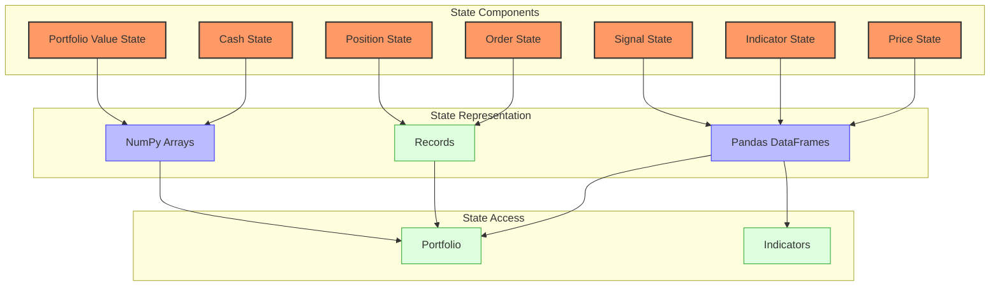
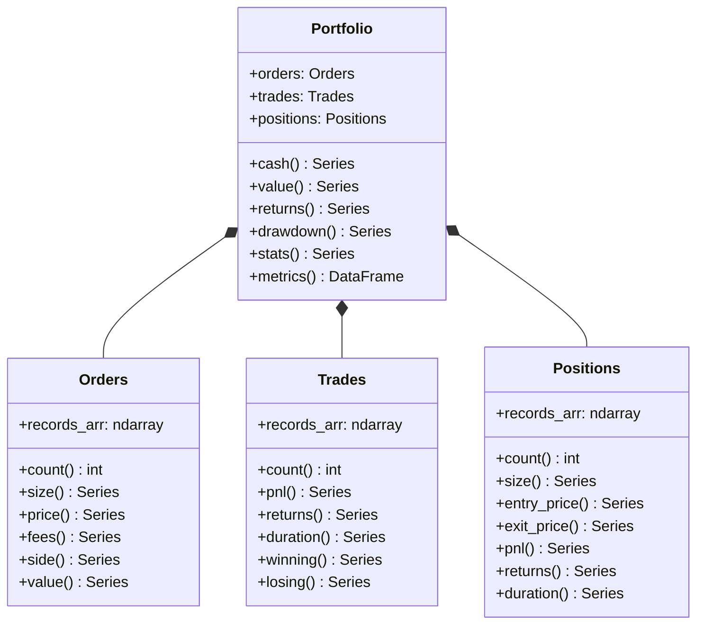
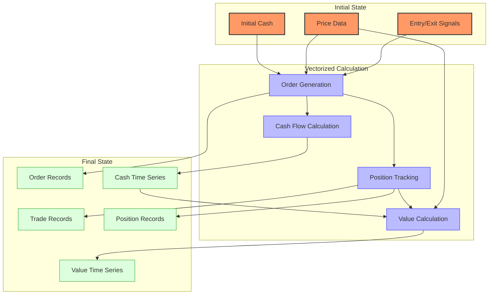

# VectorBT State Management

## State Model Overview

VectorBT uses a unique approach to state management that differs significantly from traditional event-driven trading systems. Instead of maintaining mutable state that changes with each event, VectorBT uses immutable arrays to represent state across all time points simultaneously.



This vectorized approach to state management offers significant performance advantages but requires a different mental model for understanding how state is represented and transformed.

## State Components

### Price State

Price state in VectorBT is represented as pandas Series or DataFrames:

```python
# Price state as a pandas Series
price = pd.Series(
    [100, 101, 102, 103, 104],
    index=pd.date_range('2020-01-01', periods=5, freq='D')
)

# Price state as a pandas DataFrame (for multiple assets)
prices = pd.DataFrame({
    'AAPL': [150, 151, 152, 153, 154],
    'MSFT': [250, 251, 252, 253, 254]
}, index=pd.date_range('2020-01-01', periods=5, freq='D'))
```

### Indicator State

Indicator state is stored in indicator objects with accessor properties:

```python
# Calculate moving average
ma = vbt.MA.run(price, window=10)

# Access indicator state
ma_values = ma.ma  # pandas Series with MA values
```

### Signal State

Signal state is represented as boolean arrays:

```python
# Signal state as boolean arrays
entries = price > ma.ma  # Boolean Series for entry signals
exits = price < ma.ma    # Boolean Series for exit signals
```

### Order State

Order state is stored in record arrays within the Portfolio object:

```python
# Create portfolio
portfolio = vbt.Portfolio.from_signals(price, entries, exits)

# Access order state
orders = portfolio.orders
order_records = orders.records_arr  # NumPy record array with order details
```

The order records contain fields like:
- `id`: Unique order identifier
- `col`: Column index (for multi-asset portfolios)
- `idx`: Index position (timestamp)
- `size`: Order size
- `price`: Execution price
- `fees`: Order fees
- `side`: Order side (0 for buy, 1 for sell)

### Position State

Position state is derived from order state and stored in the Portfolio object:

```python
# Access position state
positions = portfolio.positions
position_records = positions.records_arr  # NumPy record array with position details
```

The position records contain fields like:
- `id`: Unique position identifier
- `col`: Column index (for multi-asset portfolios)
- `entry_idx`: Entry index position
- `exit_idx`: Exit index position
- `entry_price`: Entry price
- `exit_price`: Exit price
- `size`: Position size
- `entry_fees`: Entry fees
- `exit_fees`: Exit fees
- `pnl`: Profit/loss
- `return`: Return percentage
- `status`: Position status (0 for open, 1 for closed)

### Cash State

Cash state is represented as arrays tracking cash balance over time:

```python
# Access cash state
cash = portfolio.cash()  # Cash balance at each timestamp
```

### Portfolio Value State

Portfolio value state tracks the total portfolio value over time:

```python
# Access portfolio value state
value = portfolio.value()  # Portfolio value at each timestamp
```

## State Representation



### NumPy Arrays

VectorBT uses NumPy arrays for efficient numerical computations:

```python
# NumPy arrays for state representation
import numpy as np

# Create a simple price array
price_array = np.array([100, 101, 102, 103, 104])

# Create a record array for orders
order_dtype = np.dtype([
    ('id', np.int64),
    ('col', np.int64),
    ('idx', np.int64),
    ('size', np.float64),
    ('price', np.float64),
    ('fees', np.float64),
    ('side', np.int64)
])

orders_array = np.array([
    (0, 0, 1, 1.0, 101.0, 0.1, 0),
    (1, 0, 3, 1.0, 103.0, 0.1, 1)
], dtype=order_dtype)
```

### Record Arrays

VectorBT uses NumPy record arrays for structured data like orders and trades:

```python
# Access record arrays
order_records = portfolio.orders.records_arr
trade_records = portfolio.trades.records_arr
position_records = portfolio.positions.records_arr

# Filter records
winning_trades = trade_records[trade_records['return'] > 0]
losing_trades = trade_records[trade_records['return'] < 0]
```

### Pandas DataFrames

VectorBT uses pandas DataFrames for time series data:

```python
# Convert record arrays to DataFrames
orders_df = portfolio.orders.records
trades_df = portfolio.trades.records
positions_df = portfolio.positions.records

# Time series data as DataFrames
cash_df = portfolio.cash()
value_df = portfolio.value()
returns_df = portfolio.returns()
```

## State Transitions

In VectorBT, state transitions are calculated vectorially for all time points at once, rather than sequentially updating state with each event.



### Order Generation

Orders are generated from entry and exit signals:

```python
# Generate orders from signals
portfolio = vbt.Portfolio.from_signals(
    price,
    entries,
    exits,
    size=1.0,  # Fixed size orders
    price=price,  # Use price for execution
    fees=0.001,  # Fee rate
    slippage=0.001  # Slippage rate
)
```

### Cash Flow Calculation

Cash flows are calculated from orders:

```python
# Calculate cash flows
cash_flow = portfolio.cash_flow()

# Initial cash
init_cash = portfolio.init_cash

# Cash balance over time
cash = portfolio.cash()
```

### Position Tracking

Positions are tracked based on orders:

```python
# Track positions
positions = portfolio.positions

# Position size over time
size = portfolio.size()

# Position value over time
position_value = size * price
```

### Value Calculation

Portfolio value is calculated from cash and positions:

```python
# Calculate portfolio value
value = portfolio.value()

# Calculate returns
returns = portfolio.returns()

# Calculate drawdowns
drawdown = portfolio.drawdown()
```

## State Transitions and Triggers

In VectorBT, state transitions are triggered by signals and calculated vectorially:

```python
# Entry signals trigger buy orders
entries = fast_ma.ma_above(slow_ma)

# Exit signals trigger sell orders
exits = fast_ma.ma_below(slow_ma)

# Portfolio simulation calculates all state transitions
portfolio = vbt.Portfolio.from_signals(price, entries, exits)
```

### Signal-Based Transitions

```python
# Different types of signal-based transitions
# 1. Simple entry/exit signals
portfolio1 = vbt.Portfolio.from_signals(price, entries, exits)

# 2. Entry/exit with stop-loss and take-profit
portfolio2 = vbt.Portfolio.from_signals(
    price,
    entries,
    exits,
    sl_stop=0.05,  # 5% stop-loss
    tp_stop=0.10   # 10% take-profit
)

# 3. Entry/exit with trailing stop
portfolio3 = vbt.Portfolio.from_signals(
    price,
    entries,
    exits,
    sl_trail=True,  # Trailing stop
    sl_stop=0.05    # 5% trailing stop
)
```

### Order-Based Transitions

```python
# Order-based transitions
# 1. Create order records manually
order_records = np.array([
    (0, 0, 1, 1.0, 101.0, 0.1, 0),  # Buy at index 1
    (1, 0, 3, 1.0, 103.0, 0.1, 1)   # Sell at index 3
], dtype=order_dtype)

# 2. Create portfolio from orders
portfolio = vbt.Portfolio.from_orders(
    price,
    order_records=order_records,
    init_cash=10000
)
```

### Time-Based Transitions

```python
# Time-based transitions
# 1. Rebalancing at fixed intervals
weights = pd.DataFrame({
    'AAPL': [0.6, 0.5, 0.4, 0.3, 0.2],
    'MSFT': [0.4, 0.5, 0.6, 0.7, 0.8]
}, index=pd.date_range('2020-01-01', periods=5, freq='M'))

# 2. Create portfolio with rebalancing
portfolio = vbt.Portfolio.from_weights(
    prices,
    weights,
    init_cash=10000
)
```

## Persistence Mechanisms

VectorBT provides several mechanisms for persisting state:

### Saving to Disk

```python
# Save portfolio state to disk
import pickle

# Save portfolio object
with open('portfolio.pkl', 'wb') as f:
    pickle.dump(portfolio, f)

# Load portfolio object
with open('portfolio.pkl', 'rb') as f:
    portfolio = pickle.load(f)
```

### Exporting to CSV

```python
# Export state components to CSV
portfolio.orders.records.to_csv('orders.csv')
portfolio.trades.records.to_csv('trades.csv')
portfolio.positions.records.to_csv('positions.csv')
portfolio.cash().to_csv('cash.csv')
portfolio.value().to_csv('value.csv')
```

### Caching

VectorBT uses caching to avoid redundant calculations:

```python
# Enable caching
vbt.settings.caching['enabled'] = True

# Set cache size
vbt.settings.caching['max_size'] = 1000

# Clear cache
vbt.settings.caching.clear()
```

## Recovery Procedures

VectorBT's immutable state model simplifies recovery:

### Checkpoint Recovery

```python
# Save checkpoint
import pickle

with open('portfolio_checkpoint.pkl', 'wb') as f:
    pickle.dump(portfolio, f)

# Recover from checkpoint
with open('portfolio_checkpoint.pkl', 'rb') as f:
    portfolio = pickle.load(f)
```

### Partial Recovery

```python
# Extract state components for partial recovery
orders_records = portfolio.orders.records_arr
trades_records = portfolio.trades.records_arr

# Recreate portfolio with partial state
new_portfolio = vbt.Portfolio.from_orders(
    price,
    order_records=orders_records,
    init_cash=10000
)
```

### State Reconstruction

```python
# Reconstruct state from signals
portfolio = vbt.Portfolio.from_signals(
    price,
    entries,
    exits,
    init_cash=10000
)
```

## Thread Safety and Concurrency Considerations

VectorBT's immutable state model provides natural thread safety:

### Immutable State

```python
# VectorBT objects are generally immutable
ma = vbt.MA.run(price, window=10)
portfolio = vbt.Portfolio.from_signals(price, entries, exits)

# Operations create new objects rather than modifying existing ones
returns = portfolio.returns()  # Creates new Series, doesn't modify portfolio
```

### Parallel Processing

VectorBT leverages Numba for parallel processing:

```python
# Enable parallel processing
vbt.settings.numba['parallel'] = True

# Set number of threads
vbt.settings.numba['max_threads'] = 8
```

### Thread Safety Considerations

```python
# Thread-safe operations (create new objects)
def process_in_thread(price, window):
    ma = vbt.MA.run(price, window=window)
    entries = price > ma.ma
    exits = price < ma.ma
    portfolio = vbt.Portfolio.from_signals(price, entries, exits)
    return portfolio.stats()

# Potentially unsafe operations (modify global state)
def unsafe_operation():
    vbt.settings.caching['enabled'] = True  # Modifies global state
```

## State Inspection and Debugging

VectorBT provides tools for inspecting and debugging state:

### State Inspection

```python
# Inspect portfolio state
print(portfolio)

# Inspect order records
print(portfolio.orders.records)

# Inspect trade records
print(portfolio.trades.records)

# Inspect position records
print(portfolio.positions.records)

# Inspect cash flow
print(portfolio.cash_flow())

# Inspect portfolio value
print(portfolio.value())
```

### State Visualization

```python
# Visualize portfolio state
portfolio.plot().show()

# Visualize trades
portfolio.trades.plot().show()

# Visualize drawdowns
portfolio.drawdown().vbt.plot().show()

# Visualize cash and value
fig = plt.figure(figsize=(12, 8))
ax1 = fig.add_subplot(2, 1, 1)
ax2 = fig.add_subplot(2, 1, 2)
portfolio.cash().vbt.plot(ax=ax1, title='Cash')
portfolio.value().vbt.plot(ax=ax2, title='Value')
plt.tight_layout()
plt.show()
```

### Debugging Tools

```python
# Debug specific time periods
debug_period = slice('2020-01-01', '2020-01-10')
print(portfolio.cash()[debug_period])
print(portfolio.value()[debug_period])

# Debug specific trades
debug_trades = portfolio.trades.records[portfolio.trades.records['pnl'] < 0]
print(debug_trades)

# Debug specific positions
debug_positions = portfolio.positions.records[portfolio.positions.records['status'] == 0]  # Open positions
print(debug_positions)
```
