# VeighNa Trading System

## Overview

VeighNa (previously known as VN.PY) is a Python-based quantitative trading platform that provides a comprehensive framework for developing, testing, and deploying trading strategies. It offers a modular architecture with multiple specialized applications for different trading scenarios, including CTA strategies, algorithmic trading, options trading, and more.

VeighNa is designed to be user-friendly while still offering advanced features for professional traders. It provides both a graphical user interface (VeighNa Trader) and a programmatic interface for strategy development and execution. The system is particularly popular in the Chinese trading community and supports a wide range of Chinese and international markets.

## Architecture

```mermaid
graph TD
    subgraph "Core Components"
        ME[Main Engine] --- EE[Event Engine]
        ME --- UI[GUI Interface]
        ME --- DB[Database]
    end
    
    subgraph "Gateways"
        ME --- GFUT[Futures Gateways]
        ME --- GSTK[Stock Gateways]
        ME --- GOPT[Options Gateways]
        ME --- GFEX[Forex Gateways]
        ME --- GCRY[Crypto Gateways]
    end
    
    subgraph "Applications"
        ME --- ACTA[CTA Strategy]
        ME --- ASPD[Spread Trading]
        ME --- AALG[Algorithmic Trading]
        ME --- AOPT[Option Master]
        ME --- APRT[Portfolio Strategy]
        ME --- ASCT[Script Trader]
        ME --- ADAT[Data Recorder/Manager]
        ME --- ARSK[Risk Manager]
    end
    
    EE --- GFUT
    EE --- GSTK
    EE --- GOPT
    EE --- GFEX
    EE --- GCRY
    
    EE --- ACTA
    EE --- ASPD
    EE --- AALG
    EE --- AOPT
    EE --- APRT
    EE --- ASCT
    EE --- ADAT
    EE --- ARSK
    
    classDef core fill:#f9f,stroke:#333,stroke-width:2px;
    classDef gateway fill:#bbf,stroke:#33f,stroke-width:1px;
    classDef app fill:#bfb,stroke:#3a3,stroke-width:1px;
    
    class ME,EE,UI,DB core;
    class GFUT,GSTK,GOPT,GFEX,GCRY gateway;
    class ACTA,ASPD,AALG,AOPT,APRT,ASCT,ADAT,ARSK app;
```



VeighNa's architecture consists of several key components:

1. **Core Engine** - The central component that coordinates all activities
2. **Event Engine** - Event-driven architecture for handling market data and trading events
3. **Gateway** - Interfaces to various trading venues (exchanges, brokers)
4. **Applications** - Specialized modules for different trading scenarios
5. **GUI** - Graphical user interface for user interaction

## Key Components and Relationships

### Core Engine

The `MainEngine` is the central component that coordinates all activities:
- Manages gateways for market data and trading
- Handles event distribution
- Coordinates application modules
- Manages data persistence
- Maintains global state of orders, trades, positions, and accounts

### Event Engine

The `EventEngine` implements an event-driven architecture:
- Processes events in a separate thread
- Distributes events to registered handlers
- Supports both synchronous and asynchronous event processing
- Provides event queuing and prioritization
- Manages timer events for periodic actions

### Gateway

Gateways provide interfaces to various trading venues:
- Connect to exchanges and brokers
- Handle market data subscription and processing
- Execute trading orders
- Manage account information
- Support multiple connection protocols (TCP, WebSocket, etc.)

VeighNa supports numerous gateways including:
- Chinese markets: CTP, TORA, XTP, KSGOLD
- International markets: Interactive Brokers, TD Ameritrade
- Cryptocurrency: Binance, OKEx, Huobi, Coinbase

### Applications

VeighNa provides multiple specialized applications:
- **CTA Strategy**: For trend-following and mean-reversion strategies
- **Spread Trading**: For multi-contract spread trading
- **Algorithmic Trading**: For smart order execution
- **Option Master**: For options trading with volatility analysis
- **Portfolio Strategy**: For multi-instrument portfolio strategies
- **Script Trader**: For script-based trading strategies
- **Data Recorder**: For recording market data
- **Data Manager**: For managing historical data
- **Risk Manager**: For risk control and management
- **RPC Service**: For remote procedure calls
- **Chart Wizard**: For real-time chart visualization

### GUI

The VeighNa Trader GUI provides:
- Market data display
- Order management
- Position monitoring
- Strategy configuration and monitoring
- Performance analysis
- Indicator visualization
- Trading operation panels

## Supported Markets and Instruments

VeighNa supports a wide range of markets and instruments through its gateway system:

- **Chinese Markets**: 
  - Stock (SSE, SZSE)
  - Futures (CFFEX, SHFE, DCE, CZCE, INE)
  - Options (Stock options, commodity options, index options)

- **Global Markets**: 
  - US Stocks and Options (NYSE, NASDAQ)
  - Forex (various platforms)
  - International Futures (CME, EUREX, SGX)

- **Cryptocurrency**: 
  - Spot markets (Binance, OKEx, Huobi, Coinbase)
  - Futures and perpetual contracts
  - Margin trading

## Performance Characteristics

- **Execution Speed**: Millisecond-level response times for market data processing
- **Memory Efficiency**: Optimized for long-running processes with minimal memory leaks
- **Concurrency**: Multi-threaded event processing with thread-safe state management
- **Scalability**: Modular design allows for scaling specific components
- **Reliability**: Designed for 24/7 operation with automatic error recovery

## Dependencies and Requirements

- **Python**: 3.7 or higher
- **GUI**: PyQt5 for GUI components
- **Data Analysis**: NumPy, pandas for data analysis
- **Technical Analysis**: TA-Lib for technical analysis
- **Database**: SQLite (default) or MySQL for data storage
- **Networking**: requests, websocket-client for API connectivity
- **Visualization**: pyqtgraph for charting

## Quick Start Guide

### Installation

```bash
# Install VeighNa
pip install vnpy

# Install gateway modules
pip install vnpy_ctp  # CTP gateway for Chinese futures
pip install vnpy_ib   # Interactive Brokers gateway
pip install vnpy_binance  # Binance gateway for crypto

# Install application modules
pip install vnpy_ctastrategy  # CTA strategy module
pip install vnpy_spreadtrading  # Spread trading module
pip install vnpy_algotrading  # Algorithmic trading module
```

### Basic Usage

```python
from vnpy.event import EventEngine
from vnpy.trader.engine import MainEngine
from vnpy.trader.ui import MainWindow, create_qapp

# Import gateway and app modules
from vnpy_ctp import CtpGateway
from vnpy_ctastrategy import CtaStrategyApp

# Create application
qapp = create_qapp()
event_engine = EventEngine()
main_engine = MainEngine(event_engine)

# Add gateway and apps
main_engine.add_gateway(CtpGateway)
main_engine.add_app(CtaStrategyApp)

# Create and show main window
main_window = MainWindow(main_engine, event_engine)
main_window.showMaximized()

# Run application
qapp.exec()
```

### Creating a Simple Strategy

```python
from vnpy.trader.utility import BarGenerator, ArrayManager
from vnpy_ctastrategy import (
    CtaTemplate,
    StopOrder,
    TickData,
    BarData,
    TradeData,
    OrderData
)

class SimpleMAStrategy(CtaTemplate):
    """
    Simple moving average crossover strategy.
    """
    
    # Strategy parameters
    fast_window = 10
    slow_window = 20
    
    # Strategy variables
    fast_ma0 = 0.0
    fast_ma1 = 0.0
    slow_ma0 = 0.0
    slow_ma1 = 0.0
    
    def __init__(self, cta_engine, strategy_name, vt_symbol, setting):
        """
        Initialize the strategy.
        """
        super().__init__(cta_engine, strategy_name, vt_symbol, setting)
        
        # Create bar generator and array manager
        self.bg = BarGenerator(self.on_bar)
        self.am = ArrayManager()
    
    def on_init(self):
        """
        Callback when strategy is initialized.
        """
        self.write_log("Strategy initialized")
        self.load_bar(10)  # Load 10 days of bar data
    
    def on_start(self):
        """
        Callback when strategy is started.
        """
        self.write_log("Strategy started")
    
    def on_stop(self):
        """
        Callback when strategy is stopped.
        """
        self.write_log("Strategy stopped")
    
    def on_tick(self, tick: TickData):
        """
        Callback when new tick data is received.
        """
        self.bg.update_tick(tick)
    
    def on_bar(self, bar: BarData):
        """
        Callback when new bar data is received.
        """
        am = self.am
        am.update_bar(bar)
        
        if not am.inited:
            return
        
        # Calculate moving averages
        fast_ma = am.sma(self.fast_window, array=True)
        self.fast_ma0 = fast_ma[-1]
        self.fast_ma1 = fast_ma[-2]
        
        slow_ma = am.sma(self.slow_window, array=True)
        self.slow_ma0 = slow_ma[-1]
        self.slow_ma1 = slow_ma[-2]
        
        # Generate trading signals
        cross_over = (self.fast_ma0 > self.slow_ma0 and
                      self.fast_ma1 <= self.slow_ma1)
        
        cross_below = (self.fast_ma0 < self.slow_ma0 and
                       self.fast_ma1 >= self.slow_ma1)
        
        # Trading logic
        if cross_over:
            if self.pos < 0:
                self.cover()
            self.buy()
        
        elif cross_below:
            if self.pos > 0:
                self.sell()
            self.short()
```

For more detailed examples, see the [event-flow.md](./event-flow.md), [state-management.md](./state-management.md), and [handlers.md](./handlers.md) documentation.
