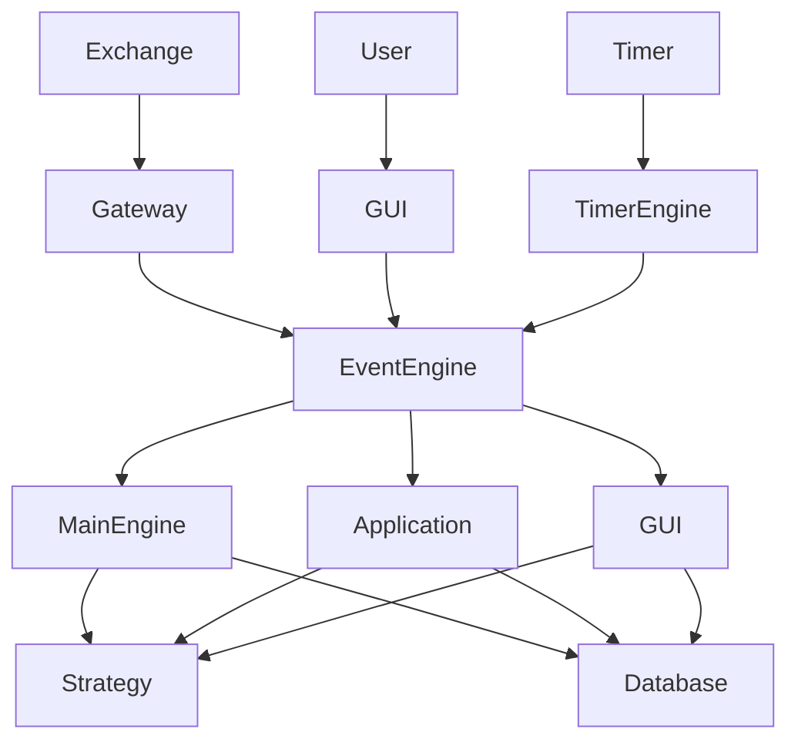

# VeighNa Event Flow

## Event Flow Overview

VeighNa uses an event-driven architecture where events flow through an event engine to various handlers. This document details the event types, their flow through the system, and how they are processed.


## Event Types

VeighNa defines a comprehensive set of event types that represent different aspects of the trading system:

### Market Data Events

- **TickEvent**: A price tick representing the latest market data
- **BarEvent**: A time-based bar (OHLCV)
- **OrderBookEvent**: An order book snapshot

### Trading Events

- **OrderEvent**: An order has been created, modified, or canceled
- **TradeEvent**: A trade has been executed
- **PositionEvent**: A position has been opened, modified, or closed
- **AccountEvent**: An account's balance or margin has changed

### System Events

- **LogEvent**: A log message has been generated
- **TimerEvent**: A timer has fired
- **ContractEvent**: Contract information has been received
- **ConnectEvent**: A connection has been established or lost

## Event Processing Sequence

### Market Data Flow

1. **Gateway** receives market data from the exchange
2. Gateway creates a `TickEvent` and sends it to the `EventEngine`
3. `EventEngine` distributes the event to registered handlers
4. Handlers (e.g., strategies, GUI components) process the event
5. Strategies may generate trading signals based on the event
6. Trading signals are converted to `OrderEvent`s and sent to the `EventEngine`
7. `EventEngine` distributes the `OrderEvent` to the appropriate gateway
8. Gateway submits the order to the exchange

```
Exchange → Gateway → TickEvent → EventEngine → Handlers → OrderEvent → Gateway → Exchange
```

### Order Flow

1. **Strategy** or **User** generates an order request
2. Order request is converted to an `OrderEvent` and sent to the `EventEngine`
3. `EventEngine` distributes the event to registered handlers
4. Gateway receives the event and submits the order to the exchange
5. Exchange processes the order and sends a response
6. Gateway receives the response and creates an `OrderEvent` with the updated status
7. `EventEngine` distributes the updated event to registered handlers
8. Handlers update their state based on the event

```
Strategy/User → OrderEvent → EventEngine → Gateway → Exchange
                                                       ↓
Handlers ← EventEngine ← OrderEvent ← Gateway ← Exchange Response
```

## Detailed Event Flow Diagram



## Event Engine Implementation

The `EventEngine` is the core component that handles event distribution:

```python
class EventEngine:
    """
    Event-driven engine for handling various events.
    """
    
    def __init__(self, interval: int = 1):
        """
        Initialize event engine.
        
        Args:
            interval: Interval in milliseconds for timer event.
        """
        self._interval = interval
        self._queue = Queue()
        self._active = False
        self._thread = Thread(target=self._run)
        self._timer = Thread(target=self._run_timer)
        self._handlers = defaultdict(list)
        self._general_handlers = []
    
    def _run(self):
        """
        Run event processing loop.
        """
        while self._active:
            try:
                event = self._queue.get(block=True, timeout=1)
                self._process(event)
            except Empty:
                pass
    
    def _process(self, event: Event):
        """
        Process an event.
        """
        # Call event type handlers
        if event.type in self._handlers:
            for handler in self._handlers[event.type]:
                try:
                    handler(event)
                except Exception as e:
                    logging.exception(f"Error processing event {event.type}: {e}")
        
        # Call general handlers
        for handler in self._general_handlers:
            try:
                handler(event)
            except Exception as e:
                logging.exception(f"Error processing event {event.type}: {e}")
    
    def _run_timer(self):
        """
        Run timer event loop.
        """
        while self._active:
            sleep(self._interval / 1000)
            event = Event(EVENT_TIMER)
            self.put(event)
    
    def start(self):
        """
        Start event engine.
        """
        self._active = True
        self._thread.start()
        self._timer.start()
    
    def stop(self):
        """
        Stop event engine.
        """
        self._active = False
        self._timer.join()
        self._thread.join()
    
    def put(self, event: Event):
        """
        Put an event into the queue.
        """
        self._queue.put(event)
    
    def register(self, type_: str, handler: Callable):
        """
        Register a handler for a specific event type.
        """
        handler_list = self._handlers[type_]
        if handler not in handler_list:
            handler_list.append(handler)
    
    def unregister(self, type_: str, handler: Callable):
        """
        Unregister a handler for a specific event type.
        """
        handler_list = self._handlers[type_]
        if handler in handler_list:
            handler_list.remove(handler)
        
        if not handler_list:
            del self._handlers[type_]
    
    def register_general(self, handler: Callable):
        """
        Register a general handler for all event types.
        """
        if handler not in self._general_handlers:
            self._general_handlers.append(handler)
    
    def unregister_general(self, handler: Callable):
        """
        Unregister a general handler.
        """
        if handler in self._general_handlers:
            self._general_handlers.remove(handler)
```

## Timing Considerations

VeighNa's event processing is designed to handle real-time trading scenarios:

1. **Event Prioritization**: Critical events (e.g., trades, order updates) are processed first
2. **Timer Events**: Regular timer events ensure periodic processing
3. **Thread Safety**: Event processing is thread-safe
4. **Latency Monitoring**: Event processing latency can be monitored

### Timer Events

VeighNa uses timer events to trigger periodic actions:

```python
def _run_timer(self):
    """
    Run timer event loop.
    """
    while self._active:
        sleep(self._interval / 1000)
        event = Event(EVENT_TIMER)
        self.put(event)
```

Timer events are used for:
- Updating GUI displays
- Checking for order timeouts
- Running periodic strategy calculations
- Saving state to disk

## Error Handling in the Event Flow

VeighNa implements robust error handling throughout the event flow:

1. **Exception Catching**: All event handlers catch and log exceptions
2. **Logging**: Errors are logged with appropriate context
3. **Graceful Degradation**: The system continues to operate even if some handlers fail
4. **Retry Mechanisms**: Critical operations can be retried

### Error Handling Example

```python
def _process(self, event: Event):
    """
    Process an event.
    """
    # Call event type handlers
    if event.type in self._handlers:
        for handler in self._handlers[event.type]:
            try:
                handler(event)
            except Exception as e:
                logging.exception(f"Error processing event {event.type}: {e}")
    
    # Call general handlers
    for handler in self._general_handlers:
        try:
            handler(event)
        except Exception as e:
            logging.exception(f"Error processing event {event.type}: {e}")
```

## Event Flow Monitoring and Debugging

VeighNa provides several tools for monitoring and debugging the event flow:

1. **Logging**: Comprehensive logging of events and their processing
2. **GUI Monitoring**: Real-time monitoring of events through the GUI
3. **Event Statistics**: Statistics on event processing times and counts
4. **Debug Mode**: Enhanced logging and checks in debug mode

### Enabling Detailed Logging

```python
from vnpy.trader.utility import set_log_level, LogLevel

# Set log level to DEBUG for detailed event logging
set_log_level(LogLevel.DEBUG)
```

This configuration will log all events and their processing, which can be useful for debugging and monitoring the event flow.
