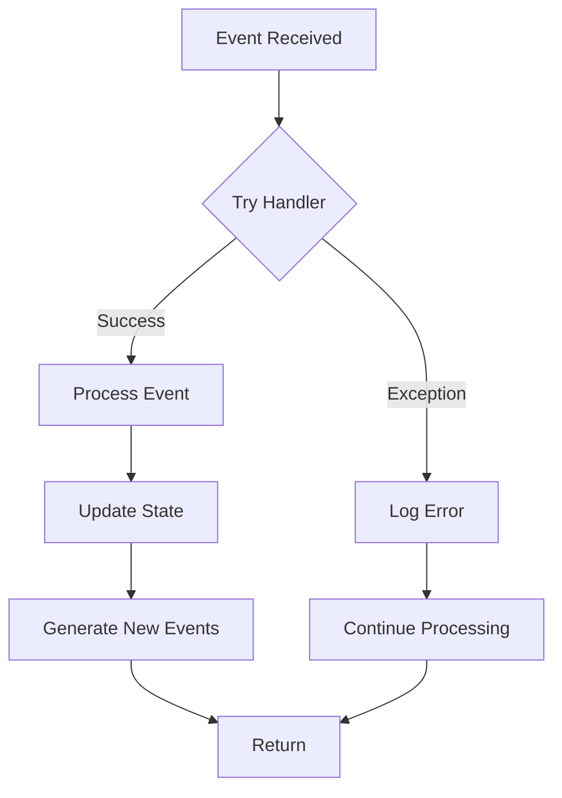

# VeighNa Handlers

## Handler Overview

VeighNa implements a comprehensive event handler system that processes various events in the trading platform. Handlers are registered with the `EventEngine` to process specific types of events, allowing for modular and extensible functionality.

This document details the handler interfaces, their responsibilities, error handling strategies, performance considerations, and edge cases.

## Handler Interfaces and Responsibilities

### Core Handler Types

VeighNa uses several types of handlers for different purposes:

1. **Event-type Handlers**: Process specific event types (e.g., TickEvent, OrderEvent)
2. **General Handlers**: Process all events regardless of type
3. **Gateway Handlers**: Process gateway-specific events
4. **Strategy Handlers**: Process events for a specific trading strategy
5. **GUI Handlers**: Process events for updating GUI components

### Event-type Handlers

Event-type handlers are registered for specific event types:

```python
def register_event_handler():
    """
    Register event handlers with event engine.
    """
    event_engine = self.event_engine
    
    event_engine.register(EVENT_TICK, self.process_tick_event)
    event_engine.register(EVENT_ORDER, self.process_order_event)
    event_engine.register(EVENT_TRADE, self.process_trade_event)
    event_engine.register(EVENT_POSITION, self.process_position_event)
    event_engine.register(EVENT_ACCOUNT, self.process_account_event)
    event_engine.register(EVENT_CONTRACT, self.process_contract_event)
    event_engine.register(EVENT_LOG, self.process_log_event)
```

Each handler function is designed to process a specific type of event:

```python
def process_tick_event(self, event: Event):
    """
    Process a tick event.
    """
    tick = event.data
    
    # Update tick data in cache
    self.ticks[tick.vt_symbol] = tick
    
    # Update market data
    self.update_market_data(tick)
    
    # Notify strategies
    self.notify_strategies(EVENT_TICK, tick)
```

### General Handlers

General handlers process all events regardless of type:

```python
def register_general_handler():
    """
    Register general handler with event engine.
    """
    self.event_engine.register_general(self.process_all_events)

def process_all_events(self, event: Event):
    """
    Process all events regardless of type.
    """
    # Log the event
    self.log_event(event)
    
    # Perform common processing
    self.update_last_event_time()
```

### Gateway Handlers

Gateway handlers process events related to specific trading gateways:

```python
class CtpGateway(BaseGateway):
    """
    Gateway for CTP (China Financial Futures Exchange API).
    """
    
    def __init__(self, event_engine):
        """
        Initialize CTP gateway.
        """
        super().__init__(event_engine, "CTP")
        
        self.td_api = CtpTdApi(self)
        self.md_api = CtpMdApi(self)
    
    def process_callback(self, data, callback_name):
        """
        Process callback from API.
        """
        callback = getattr(self, callback_name)
        callback(data)
```

### Strategy Handlers

Strategy handlers process events for specific trading strategies:

```python
class CtaStrategy(CtaTemplate):
    """
    CTA strategy template.
    """
    
    def __init__(self, cta_engine, strategy_name, vt_symbol, setting):
        """
        Initialize strategy.
        """
        super().__init__(cta_engine, strategy_name, vt_symbol, setting)
        
        # Register event handlers
        self.cta_engine.event_engine.register(EVENT_TICK + self.vt_symbol, self.on_tick)
        self.cta_engine.event_engine.register(EVENT_BAR + self.vt_symbol, self.on_bar)
        self.cta_engine.event_engine.register(EVENT_ORDER + self.strategy_name, self.on_order)
        self.cta_engine.event_engine.register(EVENT_TRADE + self.strategy_name, self.on_trade)
    
    def on_tick(self, event: Event):
        """
        Process tick data.
        """
        tick = event.data
        self.tick_handler(tick)
    
    def on_bar(self, event: Event):
        """
        Process bar data.
        """
        bar = event.data
        self.bar_handler(bar)
    
    def on_order(self, event: Event):
        """
        Process order update.
        """
        order = event.data
        self.order_handler(order)
    
    def on_trade(self, event: Event):
        """
        Process trade update.
        """
        trade = event.data
        self.trade_handler(trade)
```

## Input/Output Specifications

### Handler Input

Handlers receive an `Event` object with the following structure:

```python
class Event:
    """
    Event object consists of type and data.
    """
    
    def __init__(self, type_: str, data: Any = None):
        """
        Initialize event.
        """
        self.type = type_
        self.data = data
```

The `type` field is a string identifying the event type (e.g., `EVENT_TICK`, `EVENT_ORDER`).
The `data` field is an object containing the event data (e.g., `TickData`, `OrderData`).

### Handler Output

Handlers do not typically return values. Instead, they:
1. Update the system state
2. Generate new events as needed
3. Log information or errors
4. Notify other components

## Error Handling Strategies

VeighNa implements robust error handling in its handlers:



### Exception Catching

All handlers are wrapped in try-except blocks to catch exceptions:

```python
def process_event(self, event: Event):
    """
    Process an event.
    """
    try:
        if event.type in self._handlers:
            for handler in self._handlers[event.type]:
                try:
                    handler(event)
                except Exception as e:
                    self.log_error(f"Error in handler {handler.__name__}: {e}")
    except Exception as e:
        self.log_error(f"Error processing event {event.type}: {e}")
```

### Logging

Errors are logged with appropriate context:

```python
def log_error(self, msg: str):
    """
    Log an error message.
    """
    log_event = Event(EVENT_LOG, LogData(
        msg=msg,
        level=LogLevel.ERROR,
        gateway_name=self.gateway_name
    ))
    self.event_engine.put(log_event)
```

### Graceful Degradation

The system is designed to continue operating even if some handlers fail:

```python
def process_all_event_handlers(self, event: Event):
    """
    Process an event with all registered handlers.
    """
    if event.type in self._handlers:
        for handler in self._handlers[event.type]:
            try:
                handler(event)
            except Exception as e:
                logging.exception(f"Error processing event {event.type}: {e}")
                # Continue with next handler despite error
```

### Critical Error Handling

For critical errors, VeighNa can take more drastic actions:

```python
def handle_critical_error(self, error_msg: str):
    """
    Handle a critical error.
    """
    self.log_error(f"CRITICAL ERROR: {error_msg}")
    
    # Notify user
    self.send_email_alert(f"Critical Error: {error_msg}")
    
    # Take action depending on severity
    if self.is_trading_active:
        self.stop_all_strategies()
        self.cancel_all_orders()
```

## Performance Considerations

### Event Processing Efficiency

VeighNa is designed for efficient event processing:

```python
def _run(self):
    """
    Event processing loop.
    """
    while self._active:
        try:
            event = self._queue.get(block=True, timeout=1)
            start_time = time.time()
            self._process(event)
            
            # Monitor performance
            processing_time = time.time() - start_time
            if processing_time > 0.1:  # Slow event processing detected
                self.log_warning(f"Slow event processing: {event.type} took {processing_time:.3f}s")
        except Empty:
            pass
```

### Handler Prioritization

Critical handlers can be prioritized:

```python
class PriorityEventEngine(EventEngine):
    """
    Event engine with support for handler prioritization.
    """
    
    def register_priority(self, type_: str, handler: Callable, priority: int = 0):
        """
        Register a handler with priority.
        """
        handler_list = self._handlers.setdefault(type_, [])
        handler_item = (handler, priority)
        handler_list.append(handler_item)
        handler_list.sort(key=lambda x: x[1])  # Sort by priority
    
    def _process(self, event: Event):
        """
        Process an event with priority handling.
        """
        if event.type in self._handlers:
            for handler, _ in self._handlers[event.type]:
                try:
                    handler(event)
                except Exception as e:
                    logging.exception(f"Error processing event {event.type}: {e}")
```

### Handler Profiling

VeighNa can profile handler performance:

```python
def profile_handlers(self):
    """
    Profile handler performance.
    """
    event_stats = {}
    
    def profiling_wrapper(handler, event_type):
        def wrapped(event):
            start_time = time.time()
            result = handler(event)
            elapsed = time.time() - start_time
            
            if event_type not in event_stats:
                event_stats[event_type] = {
                    "count": 0,
                    "total_time": 0,
                    "max_time": 0
                }
            
            event_stats[event_type]["count"] += 1
            event_stats[event_type]["total_time"] += elapsed
            event_stats[event_type]["max_time"] = max(
                event_stats[event_type]["max_time"], elapsed
            )
            
            return result
        return wrapped
    
    # Wrap all handlers with profiling
    for event_type, handlers in self._handlers.items():
        wrapped_handlers = []
        for handler in handlers:
            wrapped_handlers.append(profiling_wrapper(handler, event_type))
        self._handlers[event_type] = wrapped_handlers
    
    return event_stats
```

## Edge Cases and Their Handling

### Handling Missing Data

Handlers must check for missing or incomplete data:

```python
def on_tick(self, event: Event):
    """
    Process tick data with null checking.
    """
    tick = event.data
    
    # Check for missing fields
    if tick.last_price <= 0:
        self.log_warning(f"Invalid tick price: {tick.last_price}")
        return
    
    # Check for stale data
    current_time = datetime.now()
    tick_time = tick.datetime
    if (current_time - tick_time).total_seconds() > 60:
        self.log_warning(f"Stale tick: {tick_time}, current: {current_time}")
        return
    
    # Process valid tick
    self.process_valid_tick(tick)
```

### Order Status Reconciliation

Handlers need to handle inconsistent order states:

```python
def on_order(self, event: Event):
    """
    Process order update with reconciliation.
    """
    order = event.data
    order_id = order.orderid
    
    # Check if order exists in our records
    if order_id not in self.active_orders and order.status != Status.REJECTED:
        self.log_warning(f"Received update for unknown order: {order_id}")
        self.active_orders[order_id] = order
        
    # Reconcile existing order
    elif order_id in self.active_orders:
        existing_order = self.active_orders[order_id]
        
        # Check for backwards status transition (shouldn't happen)
        if self._is_status_regression(existing_order.status, order.status):
            self.log_error(f"Status regression for order {order_id}: {existing_order.status} -> {order.status}")
            return
        
        # Update order in records
        self.active_orders[order_id] = order
        
    # Process order based on status
    self.process_order_by_status(order)
```

### Re-connection Handling

Handlers must handle reconnection scenarios:

```python
def on_reconnected(self, event: Event):
    """
    Handle gateway reconnection.
    """
    gateway_name = event.data
    
    self.log_info(f"Gateway {gateway_name} reconnected")
    
    # Re-subscribe to market data
    for symbol in self.subscribed_symbols:
        self.subscribe(symbol, gateway_name)
    
    # Query account information
    self.query_account(gateway_name)
    
    # Query positions
    self.query_position(gateway_name)
    
    # Reconcile active orders
    self.reconcile_orders(gateway_name)
```

### Delayed Processing

Some handlers need to implement delayed or throttled processing:

```python
class ThrottledEventHandler:
    """
    Handler that throttles event processing.
    """
    
    def __init__(self, event_type: str, handler_func: Callable, interval_ms: int):
        """
        Initialize throttled handler.
        """
        self.event_type = event_type
        self.handler_func = handler_func
        self.interval_ms = interval_ms
        self.last_process_time = 0
        self.pending_events = []
    
    def __call__(self, event: Event):
        """
        Handle event with throttling.
        """
        current_time = time.time() * 1000
        self.pending_events.append(event)
        
        # Process if enough time has elapsed
        if current_time - self.last_process_time > self.interval_ms:
            self._process_pending()
    
    def _process_pending(self):
        """
        Process all pending events.
        """
        if not self.pending_events:
            return
        
        # Get the most recent event for each unique key
        unique_events = {}
        for event in self.pending_events:
            data = event.data
            key = self._get_event_key(data)
            unique_events[key] = event
        
        # Process unique events
        for event in unique_events.values():
            self.handler_func(event)
        
        # Clear pending events and update timestamp
        self.pending_events = []
        self.last_process_time = time.time() * 1000
    
    def _get_event_key(self, data):
        """
        Get a unique key for an event data object.
        """
        if hasattr(data, "vt_symbol"):
            return data.vt_symbol
        elif hasattr(data, "symbol") and hasattr(data, "exchange"):
            return f"{data.symbol}.{data.exchange}"
        else:
            return id(data)  # Fallback to object id
```

## Debugging and Monitoring

### Logging and Tracing

VeighNa provides comprehensive logging for debugging handlers:

```python
def register_with_debug(self, type_: str, handler: Callable):
    """
    Register a handler with debug logging.
    """
    def debug_wrapper(event):
        """Wrapper for debug logging."""
        name = handler.__name__
        self.logger.debug(f"Handler {name} processing event {event.type}")
        start = time.time()
        try:
            result = handler(event)
            elapsed = time.time() - start
            self.logger.debug(f"Handler {name} completed in {elapsed:.6f}s")
            return result
        except Exception as e:
            elapsed = time.time() - start
            self.logger.exception(f"Handler {name} failed after {elapsed:.6f}s: {e}")
            raise
    
    debug_wrapper.__name__ = handler.__name__
    self.register(type_, debug_wrapper)
```

### Performance Monitoring

VeighNa can monitor handler performance:

```python
def monitor_handlers(self):
    """
    Monitor handler performance.
    """
    # Get statistics
    stats = self.get_handler_stats()
    
    # Generate report
    slow_handlers = []
    for type_, type_stats in stats.items():
        avg_time = type_stats["total_time"] / type_stats["count"] if type_stats["count"] > 0 else 0
        if avg_time > 0.01:  # Slow handler threshold (10ms)
            slow_handlers.append({
                "type": type_,
                "avg_time": avg_time,
                "max_time": type_stats["max_time"],
                "count": type_stats["count"]
            })
    
    # Sort by average time (slowest first)
    slow_handlers.sort(key=lambda x: x["avg_time"], reverse=True)
    
    # Generate report
    if slow_handlers:
        self.logger.warning("Slow handlers detected:")
        for handler in slow_handlers:
            self.logger.warning(
                f"Handler {handler['type']}: avg={handler['avg_time']:.6f}s, "
                f"max={handler['max_time']:.6f}s, count={handler['count']}"
            )
```

## Code Examples

### Implementing a Custom Handler

```python
from vnpy.event import Event, EventEngine
from vnpy.trader.constant import EVENT_TICK
from vnpy.trader.object import TickData

class CustomTickHandler:
    """
    Custom tick data handler.
    """
    
    def __init__(self, event_engine: EventEngine):
        """
        Initialize custom handler.
        """
        self.event_engine = event_engine
        self.latest_ticks = {}
        
        # Register with event engine
        self.event_engine.register(EVENT_TICK, self.process_tick)
    
    def process_tick(self, event: Event):
        """
        Process tick data.
        """
        tick: TickData = event.data
        symbol = tick.symbol
        
        # Update latest tick
        self.latest_ticks[symbol] = tick
        
        # Custom processing logic
        self.analyze_tick(tick)
    
    def analyze_tick(self, tick: TickData):
        """
        Analyze tick data.
        """
        # Calculate bid-ask spread
        spread = tick.ask_price_1 - tick.bid_price_1
        
        # Check for abnormal spread
        if spread > tick.ask_price_1 * 0.01:  # Spread > 1%
            self.log_abnormal_spread(tick, spread)
    
    def log_abnormal_spread(self, tick: TickData, spread: float):
        """
        Log abnormal spread.
        """
        print(f"Abnormal spread detected for {tick.symbol}: {spread}")
```

### Implementing Multi-threaded Handlers

```python
import threading
from queue import Queue
from typing import Dict, List, Callable
from vnpy.event import Event, EventEngine

class ThreadedEventHandler:
    """
    Handler that processes events in separate threads.
    """
    
    def __init__(self, event_engine: EventEngine, thread_count: int = 3):
        """
        Initialize threaded handler.
        """
        self.event_engine = event_engine
        self.thread_count = thread_count
        self.queues: List[Queue] = []
        self.threads: List[threading.Thread] = []
        self.handlers: Dict[str, List[Callable]] = {}
        self.running = False
    
    def start(self):
        """
        Start event processing threads.
        """
        self.running = True
        
        # Create queues and threads
        for i in range(self.thread_count):
            queue = Queue()
            thread = threading.Thread(
                target=self._process_queue,
                args=(queue, i),
                daemon=True
            )
            self.queues.append(queue)
            self.threads.append(thread)
            thread.start()
    
    def stop(self):
        """
        Stop event processing threads.
        """
        self.running = False
        
        # Wait for threads to exit
        for thread in self.threads:
            thread.join(timeout=1)
    
    def register(self, event_type: str, handler: Callable):
        """
        Register handler for event type.
        """
        if event_type not in self.handlers:
            self.handlers[event_type] = []
            
            # Register gateway handler with event engine
            self.event_engine.register(event_type, self._on_event)
        
        if handler not in self.handlers[event_type]:
            self.handlers[event_type].append(handler)
    
    def _on_event(self, event: Event):
        """
        Route event to processing queue based on hash.
        """
        # Determine which queue to use (simple hash distribution)
        hash_value = hash(event.type)
        queue_index = hash_value % self.thread_count
        
        # Put event in the selected queue
        self.queues[queue_index].put(event)
    
    def _process_queue(self, queue: Queue, thread_id: int):
        """
        Process events from a queue.
        """
        while self.running:
            try:
                event = queue.get(block=True, timeout=1)
                self._process_event(event, thread_id)
                queue.task_done()
            except Exception as e:
                if self.running:
                    print(f"Error in event processing thread {thread_id}: {e}")
    
    def _process_event(self, event: Event, thread_id: int):
        """
        Process an event.
        """
        event_type = event.type
        
        if event_type in self.handlers:
            for handler in self.handlers[event_type]:
                try:
                    handler(event)
                except Exception as e:
                    print(f"Error in thread {thread_id} handling {event_type}: {e}")
```

These examples demonstrate various ways to implement and use handlers in the VeighNa trading system, with a focus on performance, reliability, and debugging capabilities. 