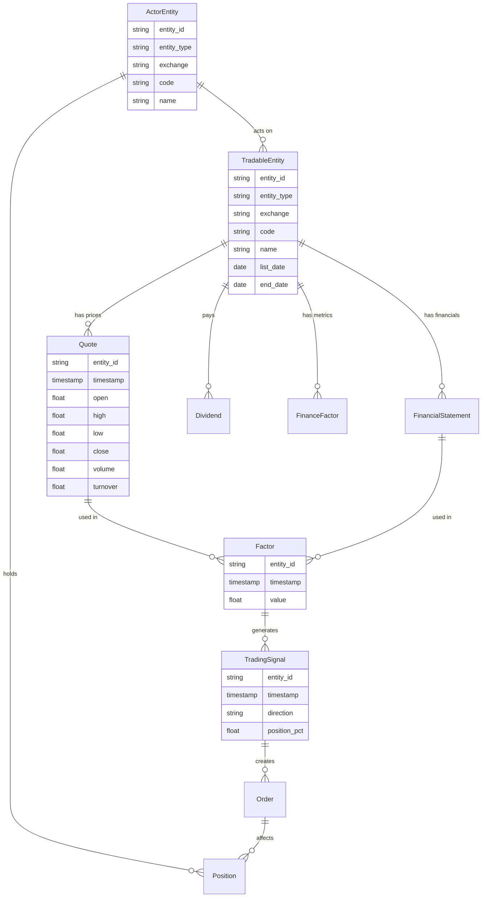

# ZVT (Zero-Value Trading) Overview

ZVT (Zero-Value Trading) is an open-source Python framework for quantitative trading, focusing on data persistence, factor calculation, and algorithmic trading. It provides a comprehensive ecosystem for market data collection, storage, analysis, and trading strategy development with a strong emphasis on simplicity and extensibility.

## Purpose and Design Philosophy

ZVT was designed with the following principles in mind:

- **Simplicity**: Use the most basic programming concepts to make the system easy to understand and extend
- **Concise Abstraction**: Provide a clear and concise abstraction of the market
- **Correctness**: Make correctness obvious through clean design and clear interfaces
- **Persistence**: Emphasize data persistence and incremental updates to build a comprehensive market database
- **Extensibility**: Allow easy extension to different markets, data sources, and trading strategies

The framework is particularly well-suited for:
- Building and maintaining a comprehensive financial database
- Developing and testing factor-based trading strategies
- Implementing machine learning approaches to market prediction
- Backtesting trading strategies across multiple markets
- Automating data collection from various sources

## Architecture Overview

```mermaid
graph TD
    subgraph "Core Components"
        Contract[Contract]
        Domain[Domain]
        Recorder[Recorder]
        Factor[Factor]
        Trader[Trader]
    end

    subgraph "Data Layer"
        Schema[Schema]
        EntitySchema[Entity Schema]
        DataSchema[Data Schema]
        Database[Database]
        Persistence[Persistence]
    end

    subgraph "Factor System"
        NormalData[Normal Data]
        Transformer[Transformer]
        Accumulator[Accumulator]
        TargetSelector[Target Selector]
    end

    subgraph "Trading System"
        TradingSignal[Trading Signal]
        Account[Account]
        Position[Position]
        Order[Order]
        Broker[Broker]
    end

    subgraph "Machine Learning"
        MLMachine[ML Machine]
        Tagger[Tagger]
    end

    Contract --> Schema
    Contract --> Factor
    Contract --> Trader
    
    Domain --> EntitySchema
    Domain --> DataSchema
    
    Recorder --> Database
    Recorder --> Persistence
    
    Factor --> NormalData
    Factor --> Transformer
    Factor --> Accumulator
    Factor --> TargetSelector
    
    Trader --> TradingSignal
    Trader --> Account
    Trader --> Position
    Trader --> Order
    Trader --> Broker
    
    MLMachine --> Tagger
    MLMachine --> Factor
    
    classDef core fill:#bbf,stroke:#33f,stroke-width:2px;
    classDef data fill:#dfd,stroke:#3a3,stroke-width:1px;
    classDef factor fill:#fdd,stroke:#d33,stroke-width:1px;
    classDef trading fill:#faf,stroke:#a3a,stroke-width:1px;
    classDef ml fill:#ddf,stroke:#33d,stroke-width:1px;
    
    class Contract,Domain,Recorder,Factor,Trader core;
    class Schema,EntitySchema,DataSchema,Database,Persistence data;
    class NormalData,Transformer,Accumulator,TargetSelector factor;
    class TradingSignal,Account,Position,Order,Broker trading;
    class MLMachine,Tagger ml;
```



The architecture of ZVT follows a modular design where:

1. The **Contract** module defines the core interfaces and abstractions
2. The **Domain** module defines the data schemas for different entities and data types
3. The **Recorder** module handles data collection and persistence
4. The **Factor** module provides tools for calculating trading factors
5. The **Trader** module implements trading strategies and backtesting

## Key Components

### Contract

The `Contract` module defines the core abstractions and interfaces used throughout ZVT:

- **Schema**: Base class for all data schemas
- **EntitySchema**: Base class for tradable entities (stocks, ETFs, etc.)
- **DataSchema**: Base class for data related to entities
- **Recorder**: Interface for data collection and persistence
- **Factor**: Interface for factor calculation
- **Trader**: Interface for trading strategies

### Domain

The `Domain` module defines concrete schemas for different markets and data types:

- **Meta**: Schemas for tradable entities (Stock, ETF, Index, etc.)
- **Quotes**: Schemas for price data (OHLCV)
- **Fundamental**: Schemas for fundamental data (financial statements, etc.)
- **Macro**: Schemas for macroeconomic data
- **Actor**: Schemas for market participants (institutions, funds, etc.)

### Recorder

The `Recorder` module handles data collection from various sources:

- **Eastmoney**: Data from Eastmoney (Chinese financial data provider)
- **JoinQuant**: Data from JoinQuant (Chinese financial data provider)
- **Sina**: Data from Sina Finance
- **Exchange**: Data directly from exchanges
- **Custom**: Support for custom data sources

### Factor

The `Factor` module provides tools for calculating trading factors:

- **NormalData**: Standard data format for factor calculation
- **Transformer**: Transforms input data into factors
- **Accumulator**: Accumulates data over time for factor calculation
- **TargetSelector**: Selects trading targets based on factors

### Trader

The `Trader` module implements trading strategies and backtesting:

- **TradingSignal**: Represents a trading signal
- **Account**: Manages account balance and positions
- **Position**: Represents a trading position
- **Order**: Represents a trading order
- **Broker**: Executes orders

## Entity-Relationship Model

ZVT uses a sophisticated entity-relationship model to represent the market:



## Data Persistence Capabilities

One of ZVT's key strengths is its data persistence system:

- **SQLAlchemy ORM**: Uses SQLAlchemy for object-relational mapping
- **SQLite Storage**: Stores data in SQLite databases by default
- **Incremental Updates**: Supports incremental data updates
- **Multiple Providers**: Stores data from multiple providers separately
- **Schema Versioning**: Handles schema changes gracefully
- **Data Validation**: Validates data before storage
- **Query API**: Provides a simple API for querying data

Data is stored in the following structure:
```
zvt-home/
├── data/
│   ├── stock_meta.db
│   ├── stock_1d_kdata.db
│   ├── stock_1wk_kdata.db
│   ├── finance_factor.db
│   └── ...
```

## Supported Markets and Instruments

ZVT supports a wide range of markets and instruments:

- **Stocks**: China A-shares, US stocks, Hong Kong stocks
- **ETFs**: China ETFs, US ETFs
- **Indices**: China indices, US indices
- **Funds**: China mutual funds
- **Futures**: Commodity futures
- **Cryptocurrencies**: Through custom extensions

## Data Sources

ZVT can obtain data from various sources:

- **Eastmoney**: Chinese financial data provider
- **JoinQuant**: Chinese financial data provider
- **Sina Finance**: Chinese financial news and data provider
- **Exchange APIs**: Direct exchange connections
- **CSV Files**: Import from CSV files
- **Custom Sources**: Support for custom data sources

## Quick Start Guide

### Installation

```bash
pip install zvt
```

### Basic Usage

```python
# Import necessary modules
from zvt.api import init_kdata, get_kdata
from zvt.contract import IntervalLevel
from zvt.domain import Stock, Stock1dKdata
from zvt.factors import MaFactor
from zvt.trader import TradingSignal

# Initialize ZVT
init_kdata('stock', codes=['000001'], provider='em', level=IntervalLevel.LEVEL_1DAY)

# Query stock data
df = Stock.query_data(codes=['000001'])
print(df)

# Query price data
kdata = get_kdata(entity_id='stock_sz_000001', 
                 provider='em', 
                 level=IntervalLevel.LEVEL_1DAY, 
                 start_timestamp='2020-01-01', 
                 end_timestamp='2020-12-31')
print(kdata)

# Calculate a factor
factor = MaFactor(entity_ids=['stock_sz_000001'], 
                 provider='em',
                 windows=[5, 10],
                 start_timestamp='2020-01-01', 
                 end_timestamp='2020-12-31')
print(factor.result_df)

# Generate trading signals
signals = factor.get_trading_signals()
```

### Creating a Custom Factor

```python
from zvt.contract import Factor
from zvt.domain import Stock1dKdata
from zvt.contract.factor import Transformer

class MyMaTransformer(Transformer):
    def transform(self, input_df):
        short_window = input_df['close'].rolling(window=5).mean()
        long_window = input_df['close'].rolling(window=10).mean()
        input_df['short_ma'] = short_window
        input_df['long_ma'] = long_window
        input_df['cross'] = (short_window > long_window)
        return input_df

class MyFactor(Factor):
    def __init__(self, entity_ids, start_timestamp, end_timestamp, **kwargs):
        super().__init__(entity_ids, start_timestamp, end_timestamp, **kwargs)
        self.transformer = MyMaTransformer()
        
    def compute_result(self):
        self.factor_df = self.transformer.transform(self.data_df)
        self.result_df = self.factor_df[['cross']]
```

## Dependencies

ZVT has the following key dependencies:

- Python 3.6+
- SQLAlchemy for database operations
- Pandas for data manipulation
- NumPy for numerical operations
- Plotly for visualization
- scikit-learn for machine learning (optional)

## Advanced Features

- **Machine Learning Integration**: Built-in support for machine learning models
- **Factor Evaluation**: Tools for evaluating factor performance
- **Backtesting**: Comprehensive backtesting framework
- **Visualization**: Interactive visualization of data and results
- **REST API**: REST API for accessing data and results
- **Scheduling**: Task scheduling for data collection and trading

## Further Resources

- [Official Documentation](https://zvt.readthedocs.io/en/latest/)
- [GitHub Repository](https://github.com/zvtvz/zvt)
- [Examples](https://zvt.readthedocs.io/en/latest/samples/)
