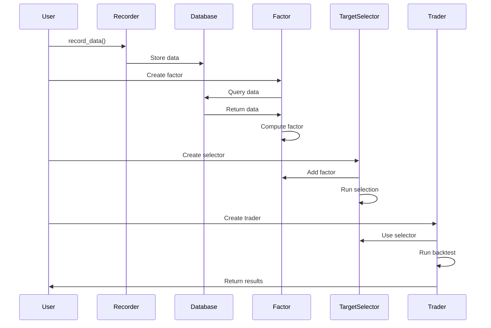
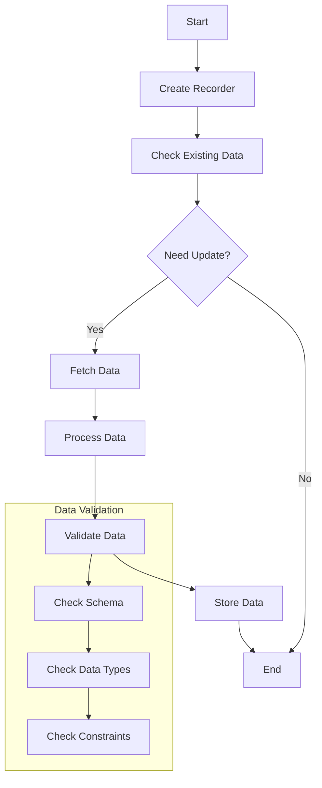
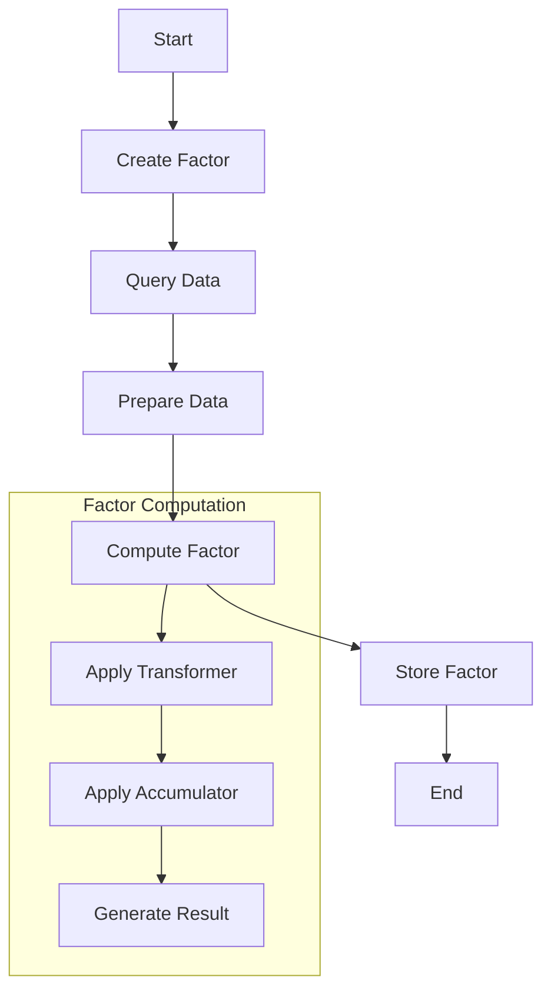
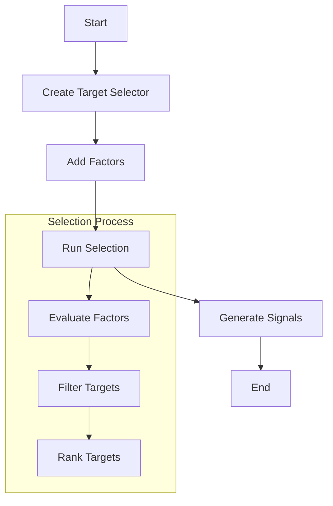
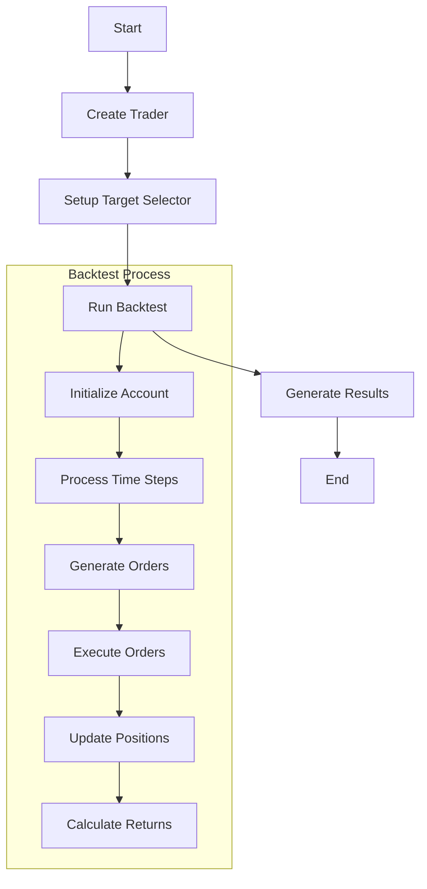
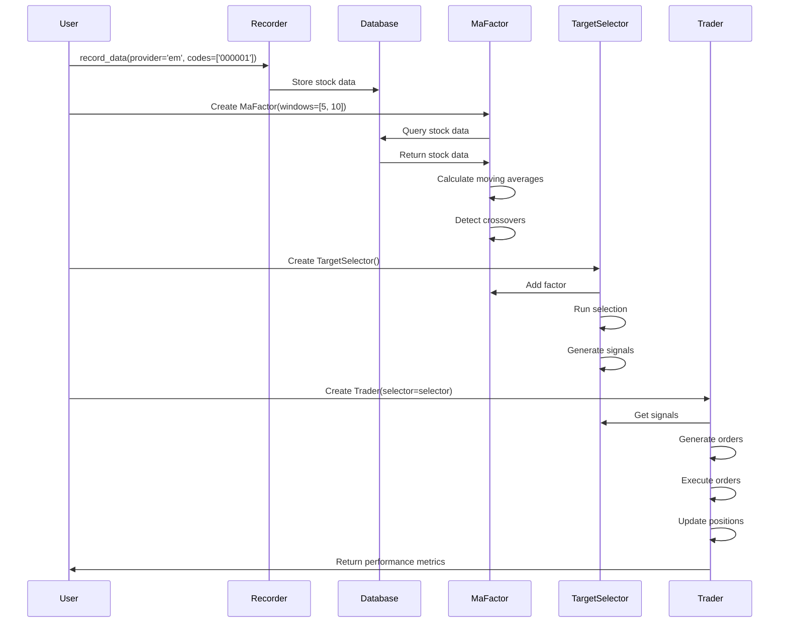
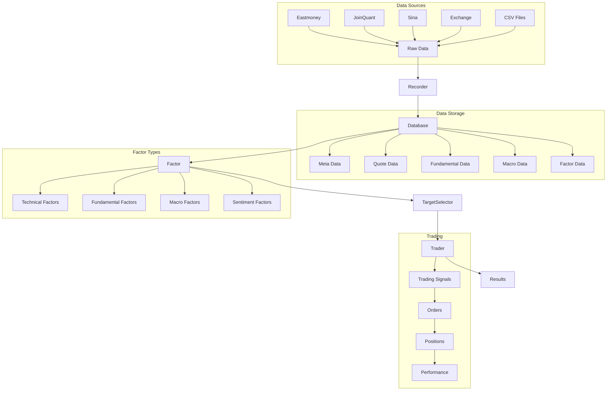

# ZVT Event Flow

This document details the event flow and processing sequence in the ZVT framework. Understanding this flow is crucial for developing effective trading strategies and properly utilizing the framework's capabilities.

## High-Level Event Flow



## Detailed Event Processing Sequence

ZVT follows a data-driven approach where data is first collected and persisted, then processed to generate factors, which are used to select trading targets and generate trading signals. The following sections detail this flow.

### 1. Data Collection and Persistence



The data collection and persistence process follows these steps:

1. Create a `Recorder` instance for a specific data type and provider
2. Check if data already exists in the database and if it needs to be updated
3. If an update is needed, fetch the data from the provider
4. Process the raw data into the appropriate format
5. Validate the data against the schema
6. Store the data in the database

Example:

```python
from zvt.domain import Stock
from zvt.recorders.em.meta.stock_meta_recorder import EmChinaStockRecorder

# Create recorder and record data
recorder = EmChinaStockRecorder()
recorder.run()

# Query the recorded data
stocks = Stock.query_data()
```

### 2. Factor Calculation



The factor calculation process follows these steps:

1. Create a `Factor` instance with specific parameters
2. Query the necessary data from the database
3. Prepare the data for computation (normalization, etc.)
4. Compute the factor using transformers and accumulators
5. Generate the result dataframe
6. Optionally store the factor in the database

Example:

```python
from zvt.factors.ma.ma_factor import MaFactor

# Create factor
factor = MaFactor(
    entity_ids=['stock_sz_000001'],
    provider='em',
    windows=[5, 10],
    start_timestamp='2020-01-01',
    end_timestamp='2020-12-31'
)

# Access factor results
print(factor.factor_df)  # Full factor dataframe
print(factor.result_df)  # Simplified result dataframe
```

### 3. Target Selection



The target selection process follows these steps:

1. Create a `TargetSelector` instance
2. Add one or more factors to the selector
3. Run the selection process
4. Evaluate the factors to generate scores
5. Filter targets based on criteria
6. Rank targets by score
7. Generate trading signals

Example:

```python
from zvt.factors.target_selector import TargetSelector

# Create selector
selector = TargetSelector(
    entity_ids=['stock_sz_000001', 'stock_sz_000002'],
    entity_schema='stock',
    start_timestamp='2020-01-01',
    end_timestamp='2020-12-31'
)

# Add factors
selector.add_factor(factor)

# Run selection
selector.run()

# Get selected targets
targets = selector.get_open_long_targets('2020-06-01')
```

### 4. Trading and Backtesting



The trading and backtesting process follows these steps:

1. Create a `Trader` instance
2. Set up a target selector or trading strategy
3. Run the backtest over a specified time period
4. For each time step:
   - Get trading signals from the selector
   - Generate orders based on signals
   - Execute orders
   - Update positions and account balance
5. Calculate performance metrics

Example:

```python
from zvt.trader import Trader

# Create trader
trader = Trader(
    entity_ids=['stock_sz_000001', 'stock_sz_000002'],
    entity_schema='stock',
    start_timestamp='2020-01-01',
    end_timestamp='2020-12-31',
    target_selector=selector
)

# Run backtest
trader.run()

# Get results
print(trader.account.positions)
print(trader.account.get_returns())
```

## Event Timing Considerations

Understanding the timing of events in ZVT is crucial for accurate strategy development:

1. **Data Recording**: Data is recorded incrementally, with new data appended to existing data. The timing of data recording depends on the provider and data type.

2. **Factor Calculation**: Factors are calculated based on the available data at the time of calculation. Historical factors are calculated using historical data, while real-time factors use the latest available data.

3. **Target Selection**: Targets are selected based on the latest available factors. The selection process can be run at any time, but is typically run at regular intervals (e.g., daily, weekly).

4. **Trading Signals**: Trading signals are generated based on the selected targets. Signals can be generated at any time, but are typically generated at regular intervals.

5. **Order Execution**: Orders are executed based on the trading signals. In backtesting, orders are executed at the next available price, while in live trading, orders are executed through a broker.

## Error Handling in the Event Flow

ZVT implements several error handling mechanisms:

1. **Data Validation**: Data is validated against the schema before being stored in the database. Invalid data is rejected.

2. **Incremental Updates**: Data is updated incrementally, with new data appended to existing data. If an update fails, the existing data remains intact.

3. **Exception Handling**: Exceptions are caught and logged, with appropriate error messages.

4. **Retry Mechanism**: Failed operations can be retried with exponential backoff.

## Example Event Flow

Here's a concrete example of the event flow for a simple moving average crossover strategy:



This example demonstrates how a simple moving average crossover strategy is implemented in ZVT:

1. Stock data is recorded from Eastmoney
2. A moving average factor is created to calculate 5-day and 10-day moving averages
3. The factor detects crossovers between the moving averages
4. A target selector uses the factor to select stocks with recent crossovers
5. A trader uses the selector to generate trading signals
6. The trader executes orders based on the signals
7. The trader calculates performance metrics

## Data Flow in ZVT



This diagram illustrates the flow of data through the ZVT system, from raw data sources to final trading results. The data flows through recorders, databases, factors, target selectors, and traders, with each component adding value to the data.
