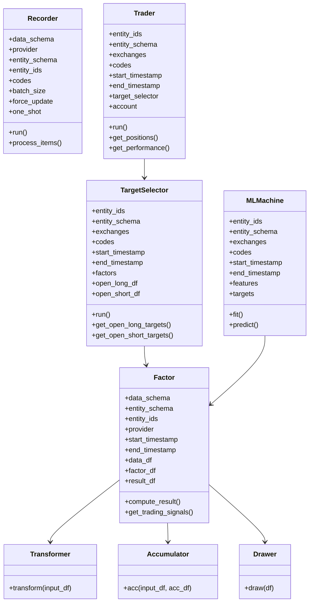
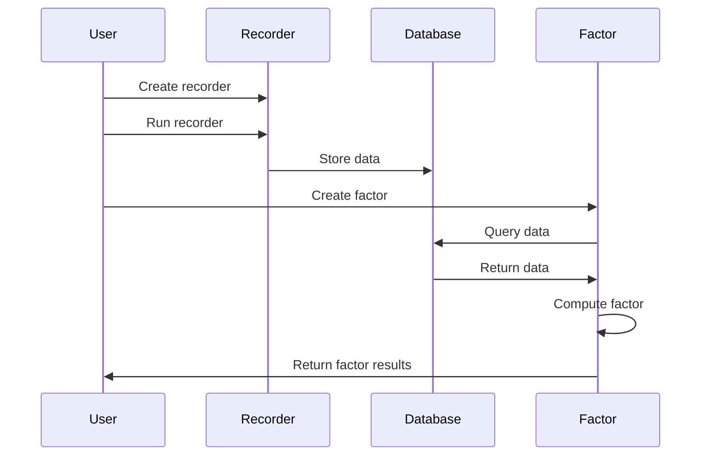
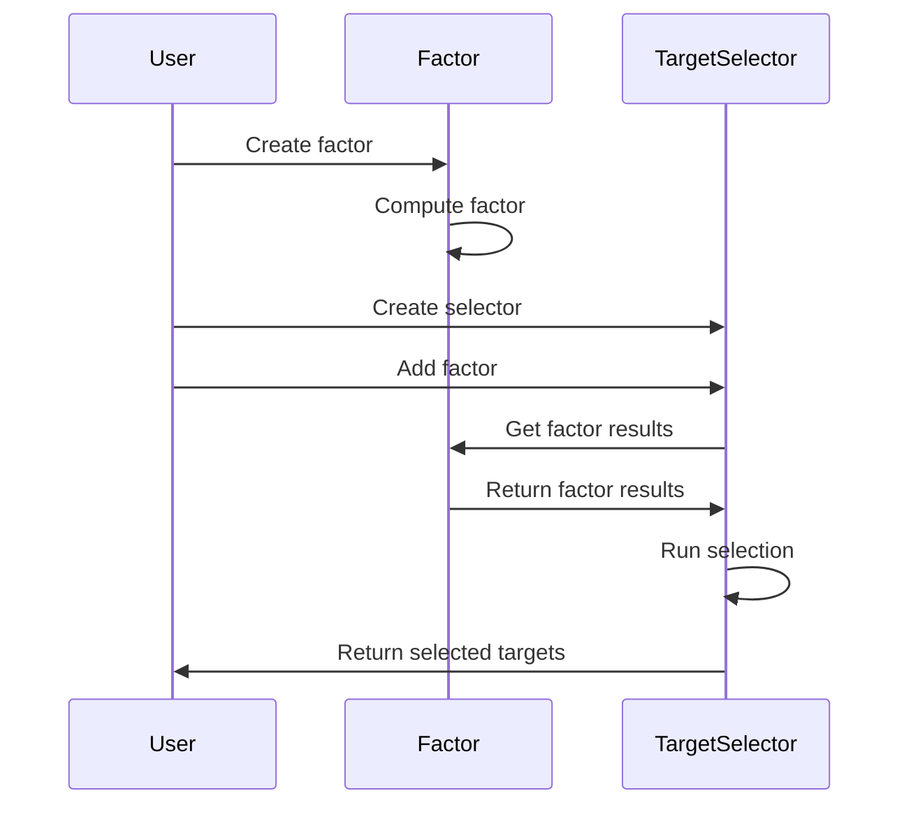
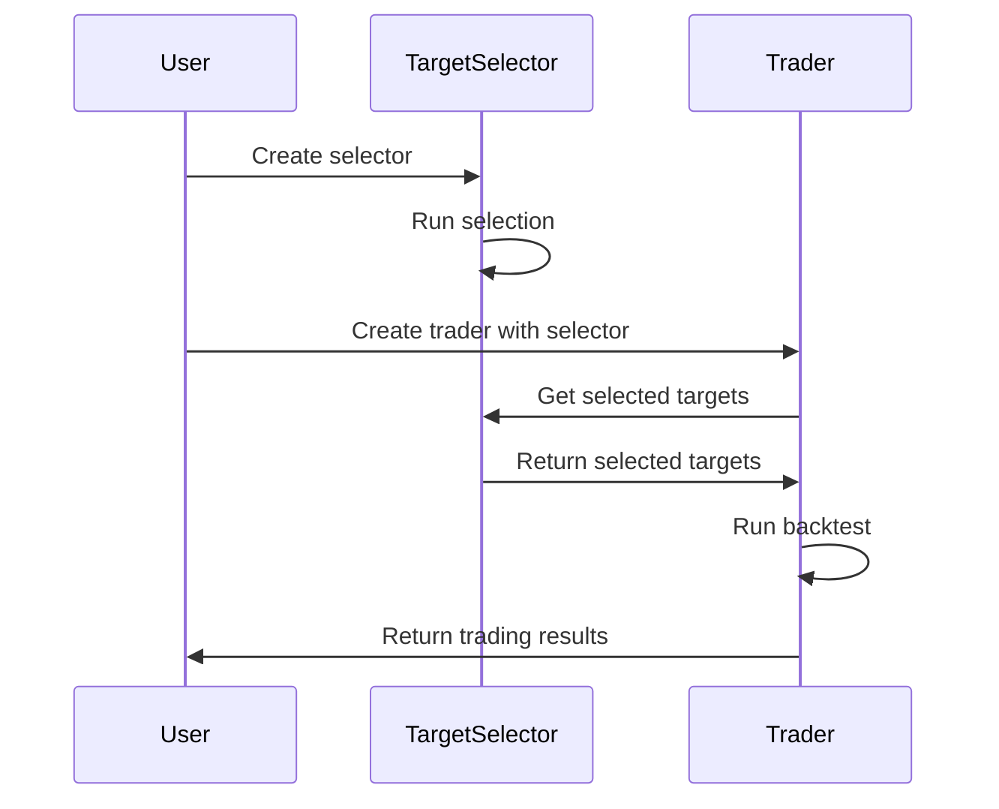

# ZVT Handlers

This document provides comprehensive documentation of the handlers and interfaces in ZVT. Understanding these components is essential for developing effective trading strategies and extending the framework's functionality.

## Handler Overview



## Core Handlers

### Recorder Handler

The `Recorder` class is responsible for collecting data from various sources and persisting it to the database.

#### Interface

```python
class Recorder(object):
    def __init__(self, 
                 data_schema, 
                 provider=None, 
                 entity_schema=None, 
                 entity_ids=None, 
                 exchanges=None, 
                 codes=None, 
                 batch_size=10, 
                 force_update=False, 
                 sleeping_time=5, 
                 default_size=10000, 
                 real_time=False, 
                 fix_duplicate_way='add', 
                 start_timestamp=None, 
                 end_timestamp=None,
                 one_shot=False):
        """Initialize the recorder."""
        pass
        
    def run(self):
        """Run the recorder."""
        pass
        
    def process_items(self, entity, http_session, db_session):
        """Process items for the entity."""
        pass
```

#### Key Properties

- **Data Schema**: Schema for the data to be recorded
- **Provider**: Data provider (Eastmoney, JoinQuant, etc.)
- **Entity Schema**: Schema for the entities
- **Entity IDs**: IDs of the entities to record data for
- **Codes**: Trading codes to record data for
- **Batch Size**: Number of entities to process in each batch
- **Force Update**: Whether to force update existing data

#### Responsibilities

- Collecting data from various sources
- Processing raw data into the appropriate format
- Validating data against the schema
- Persisting data to the database
- Handling incremental updates

#### Example Usage

```python
from zvt.domain import Stock, Stock1dKdata
from zvt.recorders.em.quotes.stock_kdata_recorder import EmChinaStockKdataRecorder

# Create recorder
recorder = EmChinaStockKdataRecorder(
    entity_ids=['stock_sz_000001'],
    data_schema=Stock1dKdata,
    provider='em'
)

# Run recorder
recorder.run()
```

### Factor Handler

The `Factor` class is responsible for calculating trading factors based on input data.

#### Interface

```python
class Factor(object):
    def __init__(self, 
                 data_schema, 
                 entity_schema, 
                 provider=None, 
                 entity_ids=None, 
                 exchanges=None, 
                 codes=None, 
                 start_timestamp=None, 
                 end_timestamp=None, 
                 columns=None, 
                 filters=None, 
                 order=None, 
                 limit=None, 
                 need_persist=False, 
                 factor_name=None, 
                 clear_state=False):
        """Initialize the factor."""
        pass
        
    def compute_result(self):
        """Compute the factor result."""
        pass
        
    def get_trading_signals(self, start_timestamp=None, end_timestamp=None):
        """Get trading signals based on the factor."""
        pass
```

#### Key Properties

- **Data Schema**: Schema for the input data
- **Entity Schema**: Schema for the entities
- **Provider**: Data provider for the input data
- **Entity IDs**: IDs of the entities to calculate factors for
- **Start Timestamp**: Start time for factor calculation
- **End Timestamp**: End time for factor calculation
- **Data DataFrame**: Input data for factor calculation
- **Factor DataFrame**: Full factor calculation results
- **Result DataFrame**: Simplified factor results for trading

#### Responsibilities

- Querying input data from the database
- Calculating factors based on input data
- Generating trading signals based on factors
- Persisting factor results to the database (optional)

#### Example Usage

```python
from zvt.factors.ma.ma_factor import MaFactor

# Create factor
factor = MaFactor(
    entity_ids=['stock_sz_000001'],
    provider='em',
    windows=[5, 10],
    start_timestamp='2020-01-01',
    end_timestamp='2020-12-31'
)

# Access factor results
print(factor.factor_df)
print(factor.result_df)

# Get trading signals
signals = factor.get_trading_signals()
```

### Trader Handler

The `Trader` class is responsible for implementing trading strategies and backtesting.

#### Interface

```python
class Trader(object):
    def __init__(self, 
                 entity_ids=None, 
                 entity_schema=None, 
                 exchanges=None, 
                 codes=None, 
                 start_timestamp=None, 
                 end_timestamp=None, 
                 provider=None, 
                 level=IntervalLevel.LEVEL_1DAY, 
                 trader_name=None, 
                 real_time=False, 
                 kdata_use_begin_time=False, 
                 draw_result=True, 
                 rich_mode=True, 
                 adjust_type=None, 
                 profit_threshold=0.0, 
                 keep_history=False):
        """Initialize the trader."""
        pass
        
    def run(self):
        """Run the trader."""
        pass
        
    def get_positions(self):
        """Get current positions."""
        pass
        
    def get_performance(self):
        """Get performance metrics."""
        pass
```

#### Key Properties

- **Entity IDs**: IDs of the entities to trade
- **Entity Schema**: Schema for the entities
- **Exchanges**: Exchanges to trade on
- **Codes**: Trading codes to trade
- **Start Timestamp**: Start time for the backtest
- **End Timestamp**: End time for the backtest
- **Target Selector**: Selector for trading targets
- **Account**: Trading account
- **Positions**: Current positions
- **Orders**: Order history

#### Responsibilities

- Implementing trading strategies
- Backtesting trading strategies
- Managing trading accounts and positions
- Calculating performance metrics
- Visualizing trading results

#### Example Usage

```python
from zvt.trader import Trader

# Create trader
trader = Trader(
    entity_ids=['stock_sz_000001'],
    start_timestamp='2020-01-01',
    end_timestamp='2020-12-31',
    target_selector=selector
)

# Run backtest
trader.run()

# Get results
print(trader.account.positions)
print(trader.get_performance())
```

### TargetSelector Handler

The `TargetSelector` class is responsible for selecting trading targets based on factors.

#### Interface

```python
class TargetSelector(object):
    def __init__(self, 
                 entity_ids=None, 
                 entity_schema=None, 
                 exchanges=None, 
                 codes=None, 
                 start_timestamp=None, 
                 end_timestamp=None, 
                 long_threshold=0.8, 
                 short_threshold=0.2, 
                 level=IntervalLevel.LEVEL_1DAY, 
                 provider=None, 
                 select_by_volume=False, 
                 adjust_type=None):
        """Initialize the target selector."""
        pass
        
    def add_factor(self, factor):
        """Add a factor to the selector."""
        pass
        
    def run(self):
        """Run the selection process."""
        pass
        
    def get_open_long_targets(self, timestamp):
        """Get open long targets for the timestamp."""
        pass
        
    def get_open_short_targets(self, timestamp):
        """Get open short targets for the timestamp."""
        pass
```

#### Key Properties

- **Entity IDs**: IDs of the entities to select from
- **Entity Schema**: Schema for the entities
- **Exchanges**: Exchanges to select from
- **Codes**: Trading codes to select from
- **Start Timestamp**: Start time for selection
- **End Timestamp**: End time for selection
- **Factors**: Factors used for selection
- **Long Threshold**: Threshold for long signals
- **Short Threshold**: Threshold for short signals

#### Responsibilities

- Adding factors for selection
- Running the selection process
- Evaluating factors to generate scores
- Filtering targets based on criteria
- Ranking targets by score
- Generating trading signals

#### Example Usage

```python
from zvt.factors.target_selector import TargetSelector

# Create selector
selector = TargetSelector(
    entity_ids=['stock_sz_000001', 'stock_sz_000002'],
    entity_schema='stock',
    start_timestamp='2020-01-01',
    end_timestamp='2020-12-31'
)

# Add factors
selector.add_factor(factor)

# Run selection
selector.run()

# Get selected targets
targets = selector.get_open_long_targets('2020-06-01')
```

## Specialized Handlers

### Transformer Handler

The `Transformer` class is responsible for transforming input data into factors.

#### Interface

```python
class Transformer(object):
    def transform(self, input_df):
        """Transform input data into factors."""
        pass
```

#### Responsibilities

- Transforming input data into factors
- Implementing specific transformation logic
- Returning transformed data

#### Example Usage

```python
from zvt.contract.factor import Transformer

class MyTransformer(Transformer):
    def transform(self, input_df):
        # Calculate moving averages
        input_df['ma5'] = input_df['close'].rolling(window=5).mean()
        input_df['ma10'] = input_df['close'].rolling(window=10).mean()
        
        # Calculate crossover
        input_df['cross'] = input_df['ma5'] > input_df['ma10']
        
        return input_df
```

### Accumulator Handler

The `Accumulator` class is responsible for accumulating data over time for factor calculation.

#### Interface

```python
class Accumulator(object):
    def acc(self, input_df, acc_df=None):
        """Accumulate data over time."""
        pass
```

#### Responsibilities

- Accumulating data over time
- Implementing specific accumulation logic
- Returning accumulated data

#### Example Usage

```python
from zvt.contract.factor import Accumulator

class MyAccumulator(Accumulator):
    def acc(self, input_df, acc_df=None):
        # If no accumulated data, return input data
        if acc_df is None:
            return input_df
        
        # Accumulate data
        result_df = acc_df.copy()
        
        # Update accumulated data with new data
        for entity_id, df in input_df.groupby(level=0):
            if entity_id in result_df.index.levels[0]:
                result_df.loc[entity_id] = df
            else:
                result_df = pd.concat([result_df, df])
        
        return result_df
```

### MLMachine Handler

The `MLMachine` class is responsible for implementing machine learning models for trading.

#### Interface

```python
class MLMachine(object):
    def __init__(self, 
                 entity_ids=None, 
                 entity_schema=None, 
                 exchanges=None, 
                 codes=None, 
                 start_timestamp=None, 
                 end_timestamp=None, 
                 features=None, 
                 targets=None, 
                 model=None):
        """Initialize the ML machine."""
        pass
        
    def fit(self):
        """Fit the model to the data."""
        pass
        
    def predict(self, data=None):
        """Make predictions using the model."""
        pass
```

#### Key Properties

- **Entity IDs**: IDs of the entities to model
- **Entity Schema**: Schema for the entities
- **Exchanges**: Exchanges to model
- **Codes**: Trading codes to model
- **Start Timestamp**: Start time for modeling
- **End Timestamp**: End time for modeling
- **Features**: Features for the model
- **Targets**: Targets for the model
- **Model**: Machine learning model

#### Responsibilities

- Preparing data for machine learning
- Training machine learning models
- Making predictions using trained models
- Evaluating model performance

#### Example Usage

```python
from zvt.ml import MLMachine
from sklearn.ensemble import RandomForestClassifier

# Create ML machine
ml_machine = MLMachine(
    entity_ids=['stock_sz_000001'],
    entity_schema='stock',
    start_timestamp='2020-01-01',
    end_timestamp='2020-12-31',
    features=['ma5', 'ma10', 'volume'],
    targets=['close_change_pct'],
    model=RandomForestClassifier()
)

# Fit the model
ml_machine.fit()

# Make predictions
predictions = ml_machine.predict()
```

### Drawer Handler

The `Drawer` class is responsible for visualizing data and results.

#### Interface

```python
class Drawer(object):
    def __init__(self, 
                 main_df=None, 
                 sub_dfs=None, 
                 mode=None, 
                 width=None, 
                 height=None, 
                 title=None, 
                 keep_ui_state=True, 
                 show=False):
        """Initialize the drawer."""
        pass
        
    def draw(self, main_df=None, sub_dfs=None):
        """Draw the data."""
        pass
```

#### Key Properties

- **Main DataFrame**: Main data to visualize
- **Sub DataFrames**: Additional data to visualize
- **Mode**: Visualization mode
- **Width**: Width of the visualization
- **Height**: Height of the visualization
- **Title**: Title of the visualization
- **Show**: Whether to show the visualization

#### Responsibilities

- Visualizing data and results
- Supporting interactive visualization
- Customizing visualization appearance
- Saving visualizations to files

#### Example Usage

```python
from zvt.drawer import Drawer

# Create drawer
drawer = Drawer(
    main_df=factor.factor_df,
    sub_dfs=[factor.result_df],
    title='My Factor',
    show=True
)

# Draw the data
drawer.draw()
```

## Handler Interaction Patterns

### Recorder and Factor Interaction



### Factor and TargetSelector Interaction



### TargetSelector and Trader Interaction



## Edge Cases and Their Handling

### 1. Missing Data

When data is missing, ZVT provides several mechanisms for handling it:

```python
# Check if data exists
if not Stock1dKdata.query_data(entity_id='stock_sz_000001'):
    # Record data if missing
    Stock1dKdata.record_data(entity_ids=['stock_sz_000001'], provider='em')
```

### 2. Data Validation

ZVT validates data against the schema before storing it:

```python
# Define a schema with validation
class Stock1dKdata(DataSchema):
    __tablename__ = 'stock_1d_kdata'
    
    # Define columns with validation
    entity_id = Column(String, primary_key=True)
    timestamp = Column(DateTime, primary_key=True)
    provider = Column(String, primary_key=True)
    
    open = Column(Float)
    close = Column(Float)
    high = Column(Float)
    low = Column(Float)
    volume = Column(Float)
    
    # Validate data
    @validates('open', 'close', 'high', 'low')
    def validate_price(self, key, value):
        assert value > 0, f"Price must be positive: {key}={value}"
        return value
```

### 3. Error Handling

ZVT provides error handling for various scenarios:

```python
try:
    # Try to record data
    Stock1dKdata.record_data(entity_ids=['stock_sz_000001'], provider='em')
except Exception as e:
    # Handle error
    logger.error(f"Error recording data: {e}")
    
    # Try alternative provider
    Stock1dKdata.record_data(entity_ids=['stock_sz_000001'], provider='joinquant')
```

### 4. Incremental Updates

ZVT supports incremental updates to avoid re-downloading all data:

```python
# Record data incrementally
Stock1dKdata.record_data(entity_ids=['stock_sz_000001'], provider='em', force_update=False)
```

## Conclusion

ZVT provides a comprehensive set of handlers that enable the development of sophisticated trading strategies. By understanding these handlers and their interactions, developers can create more effective and realistic trading strategies while leveraging the full capabilities of the framework.
