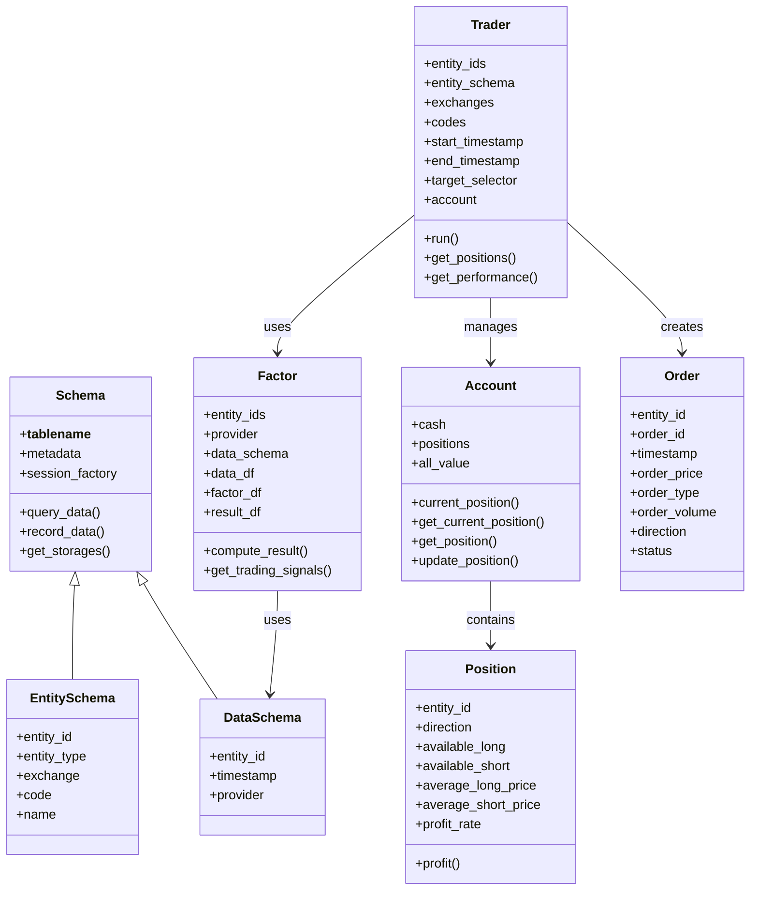
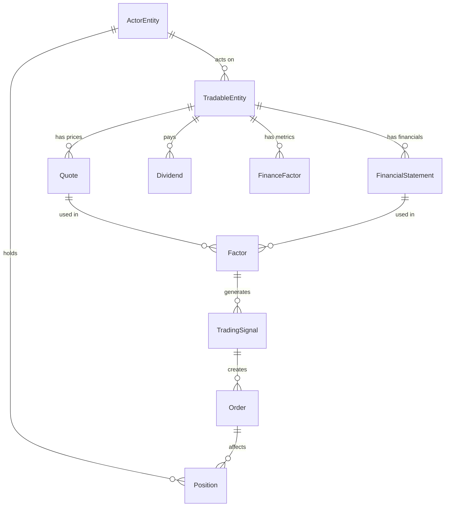

# ZVT State Management

This document details how ZVT manages state throughout the trading process. Understanding the state model is essential for developing effective trading strategies and properly utilizing the framework's capabilities.

## State Model Overview



## Core State Components

ZVT maintains several key state components throughout the trading process:

### 1. Schema State

The `Schema` class is the base class for all data schemas in ZVT. It maintains the following state:

- **Table Name**: The name of the database table
- **Metadata**: SQLAlchemy metadata for the table
- **Session Factory**: Factory for creating database sessions
- **Storage**: Database connection information

Schemas are used to define the structure of data in the database and provide methods for querying and recording data.

### 2. Entity State

The `EntitySchema` class represents tradable entities (stocks, ETFs, etc.) and maintains the following state:

- **Entity ID**: Unique identifier for the entity
- **Entity Type**: Type of entity (stock, ETF, etc.)
- **Exchange**: Exchange where the entity is traded
- **Code**: Trading code for the entity
- **Name**: Name of the entity
- **List Date**: Date when the entity was listed
- **End Date**: Date when the entity was delisted (if applicable)

Entity state is typically static and changes infrequently.

### 3. Data State

The `DataSchema` class represents data related to entities (prices, financials, etc.) and maintains the following state:

- **Entity ID**: ID of the entity the data relates to
- **Timestamp**: Time when the data was recorded
- **Provider**: Data provider (Eastmoney, JoinQuant, etc.)

Data state is typically updated incrementally as new data becomes available.

### 4. Factor State

The `Factor` class represents trading factors and maintains the following state:

- **Entity IDs**: IDs of the entities the factor is calculated for
- **Provider**: Data provider for the input data
- **Data Schema**: Schema for the input data
- **Data DataFrame**: Input data for factor calculation
- **Factor DataFrame**: Full factor calculation results
- **Result DataFrame**: Simplified factor results for trading

Factor state is typically calculated on-demand and may be persisted for future use.

### 5. Trader State

The `Trader` class represents a trading strategy and maintains the following state:

- **Entity IDs**: IDs of the entities to trade
- **Entity Schema**: Schema for the entities
- **Exchanges**: Exchanges to trade on
- **Codes**: Trading codes to trade
- **Start Timestamp**: Start time for the backtest
- **End Timestamp**: End time for the backtest
- **Target Selector**: Selector for trading targets
- **Account**: Trading account
- **Positions**: Current positions
- **Orders**: Order history

Trader state is updated as the backtest progresses.

### 6. Account State

The `Account` class represents a trading account and maintains the following state:

- **Cash**: Available cash
- **Positions**: Current positions
- **All Value**: Total account value
- **Position History**: History of positions
- **Cash History**: History of cash balance

Account state is updated as trades are executed.

### 7. Position State

The `Position` class represents a trading position and maintains the following state:

- **Entity ID**: ID of the entity
- **Direction**: Long or short
- **Available Long**: Available long position
- **Available Short**: Available short position
- **Average Long Price**: Average price for long position
- **Average Short Price**: Average price for short position
- **Profit Rate**: Current profit rate

Position state is updated as trades are executed.

### 8. Order State

The `Order` class represents a trading order and maintains the following state:

- **Entity ID**: ID of the entity
- **Order ID**: Unique ID for the order
- **Timestamp**: Time when the order was created
- **Order Price**: Price for the order
- **Order Type**: Type of order (market, limit, etc.)
- **Order Volume**: Volume for the order
- **Direction**: Buy or sell
- **Status**: Order status (pending, filled, cancelled, etc.)

Order state is updated as orders are processed.

## State Transitions

```mermaid
stateDiagram-v2
    [*] --> DataCollection: Start
    DataCollection --> FactorCalculation: Data Collected
    FactorCalculation --> TargetSelection: Factors Calculated
    TargetSelection --> Trading: Targets Selected
    Trading --> [*]: Trading Complete
    
    state DataCollection {
        [*] --> CheckExistingData
        CheckExistingData --> FetchNewData: Need Update
        CheckExistingData --> [*]: No Update Needed
        FetchNewData --> ProcessData
        ProcessData --> StoreData
        StoreData --> [*]
    }
    
    state FactorCalculation {
        [*] --> QueryData
        QueryData --> PrepareData
        PrepareData --> ComputeFactor
        ComputeFactor --> StoreFactorResult
        StoreFactorResult --> [*]
    }
    
    state TargetSelection {
        [*] --> EvaluateFactors
        EvaluateFactors --> FilterTargets
        FilterTargets --> RankTargets
        RankTargets --> GenerateSignals
        GenerateSignals --> [*]
    }
    
    state Trading {
        [*] --> InitializeAccount
        InitializeAccount --> ProcessTimeSteps
        ProcessTimeSteps --> GenerateOrders
        GenerateOrders --> ExecuteOrders
        ExecuteOrders --> UpdatePositions
        UpdatePositions --> CalculateReturns
        CalculateReturns --> ProcessTimeSteps: More Time Steps
        CalculateReturns --> [*]: No More Time Steps
    }
```



### Key State Transitions

1. **Data Collection to Factor Calculation**:
   - Data is collected from various sources and stored in the database
   - Factors are calculated based on the collected data

2. **Factor Calculation to Target Selection**:
   - Factors are used to select trading targets
   - Targets are ranked and filtered based on factor values

3. **Target Selection to Trading**:
   - Trading signals are generated based on selected targets
   - Orders are generated based on trading signals
   - Positions are updated based on executed orders

4. **Trading to Completion**:
   - Performance metrics are calculated based on trading results
   - Results are returned to the user

## State Persistence Mechanisms

ZVT provides several mechanisms for state persistence:

### 1. Database Persistence

ZVT uses SQLAlchemy to persist data in SQLite databases. Each schema has its own database file, and data is stored in tables within these databases.

```python
# Define a schema
class Stock(EntitySchema):
    __tablename__ = 'stock'
    
    # Define columns
    entity_id = Column(String, primary_key=True)
    entity_type = Column(String)
    exchange = Column(String)
    code = Column(String)
    name = Column(String)
    
    # Define storage
    @classmethod
    def get_storages(cls):
        return [zvt_context.stocks_storage]
```

Data is persisted using the `record_data` method:

```python
# Record data
Stock.record_data(provider='em')

# Query persisted data
stocks = Stock.query_data()
```

### 2. Factor Persistence

Factors can be persisted to the database for future use:

```python
# Create a factor with persistence
factor = MaFactor(
    entity_ids=['stock_sz_000001'],
    provider='em',
    windows=[5, 10],
    need_persist=True
)

# Query persisted factor
persisted_factor = MaFactor.query_data()
```

### 3. State Recovery

ZVT provides mechanisms for recovering state from the database:

```python
# Recover data state
stocks = Stock.query_data()

# Recover factor state
factor = MaFactor(
    entity_ids=['stock_sz_000001'],
    provider='em',
    windows=[5, 10],
    need_persist=True
)
factor.load_data()
```

## Thread Safety and Concurrency

ZVT is designed to be thread-safe for most operations:

1. **Database Operations**: SQLAlchemy handles thread safety for database operations
2. **Data Collection**: Recorders can run in parallel for different data types
3. **Factor Calculation**: Factors can be calculated in parallel for different entities
4. **Trading Simulation**: Trading simulations are typically single-threaded

## State Access Patterns

### Accessing Entity State

```python
# Query all stocks
stocks = Stock.query_data()

# Query specific stocks
stocks = Stock.query_data(codes=['000001', '000002'])

# Query stocks by exchange
stocks = Stock.query_data(exchanges=['sh', 'sz'])
```

### Accessing Data State

```python
# Query price data
kdata = Stock1dKdata.query_data(entity_id='stock_sz_000001')

# Query price data for a specific time period
kdata = Stock1dKdata.query_data(
    entity_id='stock_sz_000001',
    start_timestamp='2020-01-01',
    end_timestamp='2020-12-31'
)

# Query price data with specific columns
kdata = Stock1dKdata.query_data(
    entity_id='stock_sz_000001',
    columns=['timestamp', 'open', 'close', 'high', 'low']
)
```

### Accessing Factor State

```python
# Create a factor
factor = MaFactor(
    entity_ids=['stock_sz_000001'],
    provider='em',
    windows=[5, 10]
)

# Access factor state
factor_df = factor.factor_df
result_df = factor.result_df

# Get trading signals
signals = factor.get_trading_signals()
```

### Accessing Trader State

```python
# Create a trader
trader = Trader(
    entity_ids=['stock_sz_000001'],
    start_timestamp='2020-01-01',
    end_timestamp='2020-12-31',
    target_selector=selector
)

# Run the trader
trader.run()

# Access trader state
account = trader.account
positions = trader.account.positions
performance = trader.get_performance()
```

## State Management Examples

### Managing Multiple Entities

```python
# Query multiple entities
stocks = Stock.query_data(codes=['000001', '000002', '000003'])

# Calculate factors for multiple entities
factor = MaFactor(
    entity_ids=['stock_sz_000001', 'stock_sz_000002', 'stock_sz_000003'],
    provider='em',
    windows=[5, 10]
)

# Trade multiple entities
trader = Trader(
    entity_ids=['stock_sz_000001', 'stock_sz_000002', 'stock_sz_000003'],
    start_timestamp='2020-01-01',
    end_timestamp='2020-12-31',
    target_selector=selector
)
```

### Managing State Across Time

```python
# Query data for a specific time period
kdata = Stock1dKdata.query_data(
    entity_id='stock_sz_000001',
    start_timestamp='2020-01-01',
    end_timestamp='2020-12-31'
)

# Calculate factors for a specific time period
factor = MaFactor(
    entity_ids=['stock_sz_000001'],
    provider='em',
    windows=[5, 10],
    start_timestamp='2020-01-01',
    end_timestamp='2020-12-31'
)

# Trade for a specific time period
trader = Trader(
    entity_ids=['stock_sz_000001'],
    start_timestamp='2020-01-01',
    end_timestamp='2020-12-31',
    target_selector=selector
)
```

### Managing State with Multiple Providers

```python
# Query data from a specific provider
kdata = Stock1dKdata.query_data(
    entity_id='stock_sz_000001',
    provider='em'
)

# Calculate factors using data from a specific provider
factor = MaFactor(
    entity_ids=['stock_sz_000001'],
    provider='em',
    windows=[5, 10]
)

# Trade using data from a specific provider
trader = Trader(
    entity_ids=['stock_sz_000001'],
    start_timestamp='2020-01-01',
    end_timestamp='2020-12-31',
    target_selector=selector,
    provider='em'
)
```

## Entity-Relationship Model and State Management

ZVT's entity-relationship model is a key part of its state management system. The model defines the relationships between different entities and data types, and these relationships are used to manage state throughout the system.



This model is implemented in the database schema and is used to manage state throughout the system. For example, when a factor is calculated, it uses data from the `Quote` table, and when a trading signal is generated, it uses data from the `Factor` table.

## Conclusion

ZVT provides a comprehensive state management system that enables the development of sophisticated trading strategies. By understanding how the framework manages and transitions state, developers can create more effective and realistic trading strategies while leveraging the full capabilities of the framework.
