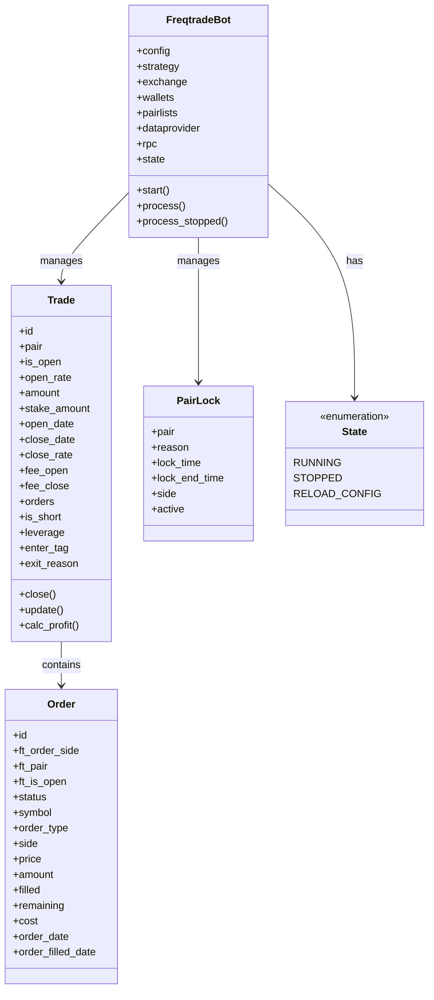
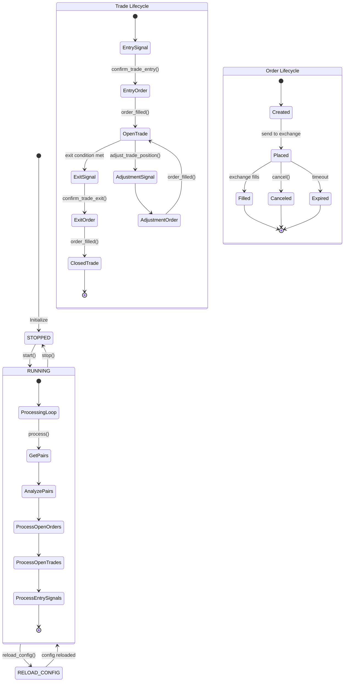
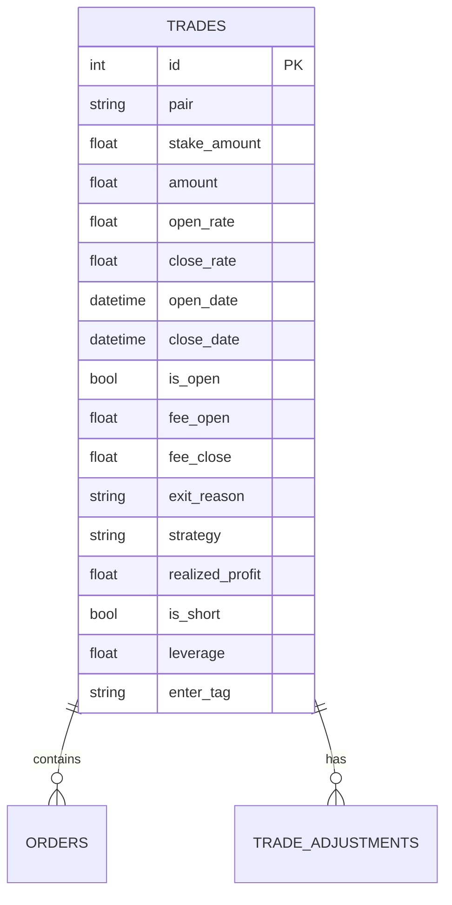
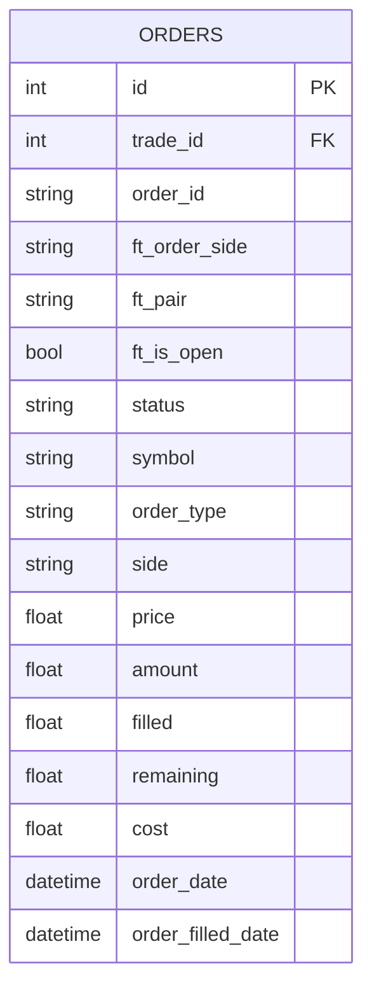
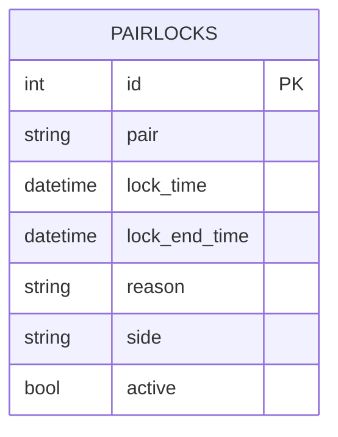
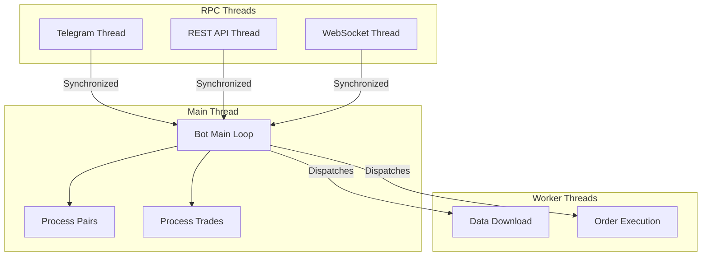

# Freqtrade State Management

This document details how Freqtrade manages state throughout the trading process. Understanding the state model is essential for developing effective trading strategies and properly utilizing the framework's capabilities.

## State Model Overview



## Core State Components

Freqtrade maintains several key state components throughout the trading process:

### 1. Bot State

The `FreqtradeBot` class maintains the overall state of the trading bot, including:

- **State Enum**: The current operational state of the bot (RUNNING, STOPPED, RELOAD_CONFIG)
- **Configuration**: The loaded configuration parameters
- **Component References**: References to all major components (strategy, exchange, etc.)
- **Runtime Data**: Data that changes during operation (open trades, balances, etc.)

### 2. Trade State

The `Trade` class represents individual trading positions with states including:

- **Open**: Trade has been entered but not yet exited
- **Closed**: Trade has been fully exited
- **Partially Filled**: Entry order has been partially filled
- **Partially Exited**: Some portion of the trade has been exited

Each trade object contains comprehensive information about the trade, including:

- Entry and exit prices, dates, and fees
- Current profit/loss
- Associated orders
- Tags and metadata
- Leverage information (for margin/futures trading)

### 3. Order State

The `Order` class represents orders placed on the exchange with states including:

- **Open**: Order has been placed but not yet filled
- **Closed**: Order has been fully filled
- **Canceled**: Order has been canceled
- **Expired**: Order has expired without being filled
- **Partially Filled**: Order has been partially filled

Each order contains detailed information about:

- Order type (market, limit, etc.)
- Side (buy/sell)
- Price and amount
- Fill status
- Timestamps

### 4. PairLock State

The `PairLock` class represents temporary locks on trading pairs with states:

- **Active**: The lock is currently in effect
- **Inactive**: The lock has expired

PairLocks prevent trading on specific pairs for a defined period and can be created by:

- Protection components
- Failed trades
- Manual intervention

### 5. Wallet State

The `Wallets` class tracks the current balance state:

- Available balances for each currency
- Reserved balances (for open orders)
- Total balance (available + reserved)
- Starting balance (for performance tracking)

## State Transitions



### Key State Transitions

1. **Bot State Transitions**:
   - STOPPED → RUNNING: Bot is started
   - RUNNING → STOPPED: Bot is stopped
   - RUNNING → RELOAD_CONFIG: Configuration reload is requested
   - RELOAD_CONFIG → RUNNING: Configuration has been reloaded

2. **Trade State Transitions**:
   - Entry Signal → Entry Order: A buy/sell signal is confirmed
   - Entry Order → Open Trade: The entry order is filled
   - Open Trade → Exit Signal: An exit condition is met
   - Exit Signal → Exit Order: The exit is confirmed
   - Exit Order → Closed Trade: The exit order is filled
   - Open Trade → Adjustment Signal: A position adjustment is requested
   - Adjustment Signal → Adjustment Order: The adjustment is executed
   - Adjustment Order → Open Trade: The adjustment order is filled

3. **Order State Transitions**:
   - Created → Placed: Order is sent to the exchange
   - Placed → Filled: Order is executed on the exchange
   - Placed → Canceled: Order is canceled
   - Placed → Expired: Order expires without being filled

## State Persistence Mechanisms

Freqtrade uses SQLAlchemy for database operations and persists the following state components:

### 1. Trade Persistence

Trades are stored in the database with all relevant information:



The trade table contains all information about trades, including:
- Entry and exit details
- Profit/loss information
- Strategy metadata
- Leverage and direction

### 2. Order Persistence

Orders are stored in the database with their status and details:



The order table tracks all orders placed by the bot, including:
- Order status and type
- Fill information
- Price and amount
- Timestamps

### 3. PairLock Persistence

PairLocks are stored to prevent trading on specific pairs:



The pairlock table tracks temporary trading restrictions:
- Which pair is locked
- Duration of the lock
- Reason for the lock
- Trading side that is locked (long, short, or both)

### 4. Configuration Persistence

Some configuration elements are persisted to allow for stateful operation:

- Strategy parameters
- Exchange API keys (encrypted)
- Telegram settings
- Custom state variables

## State Recovery Procedures

Freqtrade implements several mechanisms for state recovery:

### 1. Database Recovery

When the bot starts, it loads the current state from the database:

```python
# Pseudocode for state recovery
def startup(self):
    # Load open trades from database
    self.trades = Trade.get_open_trades()
    
    # Sync open orders with exchange
    for trade in self.trades:
        self.update_trade_state(trade)
    
    # Load pair locks
    self.pairlocks = PairLock.get_active_pairlocks()
```

This allows the bot to recover its state after a restart or crash.

### 2. Exchange Synchronization

Freqtrade synchronizes its internal state with the exchange:

```python
# Pseudocode for exchange synchronization
def update_trade_state(self, trade):
    # Get order status from exchange
    order_status = self.exchange.fetch_order(trade.open_order_id)
    
    # Update trade based on order status
    if order_status['status'] == 'closed':
        trade.open_order_id = None
        trade.amount = order_status['filled']
        # Update other trade properties
    
    # Save updated trade to database
    trade.save()
```

This ensures that the bot's internal state matches the actual state on the exchange.

### 3. Forced Cleanup

In case of inconsistencies, Freqtrade provides commands to force state cleanup:

```bash
# Force-exit all open trades
freqtrade forceexit

# Cancel all open orders
freqtrade cancel_open_orders
```

These commands can be used to reset the bot's state in case of issues.

## Thread Safety and Concurrency

Freqtrade is designed to be thread-safe for its core operations:

1. **Main Bot Loop**: Runs in a single thread to avoid race conditions
2. **Exchange Communication**: Uses locks to prevent concurrent API calls
3. **Database Operations**: Uses SQLAlchemy's session management for thread safety
4. **RPC Interfaces**: Run in separate threads but synchronize access to the bot



The main bot loop runs in a single thread, while RPC interfaces and worker tasks run in separate threads. Access to shared state is synchronized to prevent race conditions.

## State Access Patterns

### Accessing State in Strategy

Strategies can access the bot's state through several methods:

```python
# Access current open trades
def populate_indicators(self, dataframe: pd.DataFrame, metadata: dict) -> pd.DataFrame:
    # Get all open trades for this pair
    trades = Trade.get_trades_proxy(pair=metadata['pair'], is_open=True)
    
    # Use trade information in indicator calculation
    if trades:
        # Do something with trade information
        pass
    
    return dataframe

# Access wallet information
def confirm_trade_entry(self, pair: str, order_type: str, amount: float, rate: float,
                        time_in_force: str, current_time, **kwargs) -> bool:
    # Get available balance
    balance = self.wallets.get_free(self.config['stake_currency'])
    
    # Make decision based on balance
    if balance < self.min_balance:
        return False
    
    return True
```

### Accessing State in Plugins

Plugins can access the bot's state through the provided interfaces:

```python
# Example pairlist plugin accessing state
def filter_pairlist(self, pairlist: List[str], tickers: Dict) -> List[str]:
    # Get open trades
    open_trades = Trade.get_open_trades()
    
    # Filter out pairs that already have open trades
    open_pairs = [trade.pair for trade in open_trades]
    return [pair for pair in pairlist if pair not in open_pairs]
```

## State Management Examples

### Managing Multiple Positions

```python
# Strategy with position management
def adjust_trade_position(self, trade: Trade, current_time: datetime,
                         current_rate: float, current_profit: float,
                         min_stake: float, max_stake: float, **kwargs) -> Optional[float]:
    # Example: Add to position if price drops 5% from entry
    if current_rate < trade.open_rate * 0.95 and current_profit < 0:
        # Calculate additional stake amount (e.g., 50% of initial stake)
        return trade.stake_amount * 0.5
    
    return None  # No adjustment needed
```

### Managing Stop-Loss and Take-Profit

```python
# Dynamic stop-loss based on indicators
def custom_stoploss(self, pair: str, trade: Trade, current_time: datetime,
                   current_rate: float, current_profit: float, **kwargs) -> float:
    # Get dataframe for this pair
    dataframe, _ = self.dp.get_analyzed_dataframe(pair, self.timeframe)
    
    # Get latest candle
    last_candle = dataframe.iloc[-1]
    
    # Set stoploss at recent low minus some margin
    return (last_candle['low'] / current_rate) - 1
```

### State Management with Multiple Timeframes

```python
# Strategy using multiple timeframes
def populate_indicators(self, dataframe: pd.DataFrame, metadata: dict) -> pd.DataFrame:
    # Get data from a higher timeframe
    informative = self.dp.get_pair_dataframe(metadata['pair'], '1d')
    
    # Calculate indicators on higher timeframe
    informative['sma200'] = ta.SMA(informative, timeperiod=200)
    
    # Merge with original dataframe
    dataframe = merge_informative_pair(dataframe, informative, self.timeframe, '1d')
    
    return dataframe
```

## Conclusion

Freqtrade provides a comprehensive state management system that tracks trades, orders, and other important information throughout the trading process. By understanding how this state is managed and persisted, developers can create more effective strategies and plugins that leverage the full capabilities of the framework.
