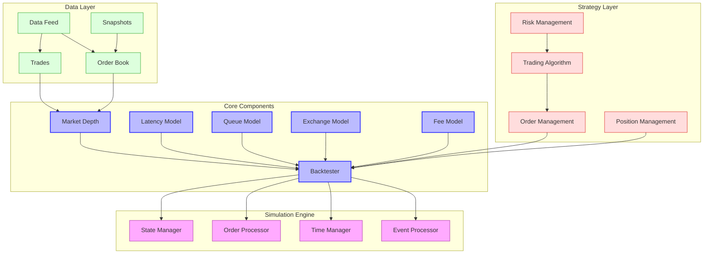

# HFTBacktest Overview

HFTBacktest is a high-performance framework designed specifically for high-frequency trading (HFT) and market making strategy development and backtesting. It focuses on providing accurate market replay-based backtesting with full order book reconstruction, accounting for both feed and order latencies, as well as order queue position for realistic order fill simulation.

## Purpose and Design Philosophy

HFTBacktest was designed with the following principles in mind:

- **Accuracy**: Provide realistic simulation of high-frequency trading environments by accounting for latencies and order queue positions
- **Performance**: Deliver high-speed backtesting through Rust implementation and Numba JIT compilation support
- **Flexibility**: Support customizable latency models, order fill models, and exchange models
- **Realism**: Simulate tick-by-tick market data with full order book reconstruction
- **Extensibility**: Allow for custom models and strategies through a well-defined API

The framework is particularly well-suited for:
- Developing and testing high-frequency trading strategies
- Market making strategy development and optimization
- Analyzing the impact of latency on trading performance
- Simulating order queue position dynamics
- Backtesting multi-asset and multi-exchange strategies

## Architecture Overview



The architecture of HFTBacktest follows a modular design where:

1. The **Core Components** provide the fundamental functionality:
   - **Backtester**: Central component that coordinates the simulation
   - **Market Depth**: Represents the order book state
   - **Latency Model**: Simulates feed and order latencies
   - **Queue Model**: Simulates order queue position dynamics
   - **Exchange Model**: Simulates exchange behavior for order execution
   - **Fee Model**: Calculates trading fees

2. The **Data Layer** handles market data:
   - **Data Feed**: Provides tick-by-tick market data
   - **Order Book**: Reconstructs the full order book
   - **Trades**: Processes market trades
   - **Snapshots**: Provides initial order book state

3. The **Strategy Layer** implements trading logic:
   - **Trading Algorithm**: Implements the trading strategy
   - **Order Management**: Manages order submission and tracking
   - **Position Management**: Tracks positions and exposure
   - **Risk Management**: Implements risk controls

4. The **Simulation Engine** drives the backtesting process:
   - **Event Processor**: Processes market events
   - **Time Manager**: Manages simulation time
   - **Order Processor**: Processes order events
   - **State Manager**: Maintains simulation state

## Key Components

### Backtester

The `Backtester` is the central component that coordinates the simulation. It provides methods for:

- Initializing the backtesting environment
- Processing market data
- Submitting and canceling orders
- Tracking positions and P&L
- Advancing simulation time
- Accessing market depth information

HFTBacktest provides several implementations of the backtester with different market depth implementations:

- **HashMapMarketDepthBacktest**: Uses a HashMap-based market depth implementation
- **ROIVectorMarketDepthBacktest**: Uses a ROI (Region of Interest) vector-based market depth implementation

### Market Depth

The `MarketDepth` component represents the order book state and provides methods for:

- Accessing the best bid and ask prices
- Retrieving the quantity at a specific price level
- Calculating the total quantity up to a specific price level
- Tracking order queue positions

### Latency Models

HFTBacktest provides several latency models to simulate feed and order latencies:

- **ConstantLatency**: Applies constant latency to feed and order events
- **IntpOrderLatency**: Interpolates order latency based on historical data

### Queue Models

The `QueueModel` component simulates order queue position dynamics, which is crucial for accurate order fill simulation. HFTBacktest provides several queue models:

- **RiskAverseQueueModel**: Conservative model where queue position advances only with trades
- **ProbQueueModel**: Probabilistic model based on queue position
- **PowerProbQueueModel**: Uses power function for probability distribution
- **LogProbQueueModel**: Uses logarithmic function for probability distribution

### Exchange Models

The `ExchangeModel` component simulates exchange behavior for order execution. HFTBacktest provides two exchange models:

- **NoPartialFillExchange**: Orders are either fully filled or not filled
- **PartialFillExchange**: Orders can be partially filled

### Fee Models

The `FeeModel` component calculates trading fees. HFTBacktest provides several fee models:

- **TradingValueFeeModel**: Fees based on trading value
- **TradingQtyFeeModel**: Fees based on trading quantity
- **FlatPerTradeFeeModel**: Flat fee per trade

## Order Book Simulation

HFTBacktest provides detailed order book simulation with:

- Full order book reconstruction based on market data
- Support for both L2 (Market-by-Price) and L3 (Market-by-Order) data
- Accurate order queue position tracking
- Realistic order fill simulation

The order book simulation accounts for:

- Order additions and cancellations
- Price level changes
- Trade executions
- Order queue dynamics

## Latency Simulation

HFTBacktest simulates both feed latency and order latency:

- **Feed Latency**: The delay between an event occurring in the market and the strategy receiving the information
- **Order Latency**: The delay between the strategy submitting an order and the exchange receiving it

The latency simulation is crucial for realistic high-frequency trading backtesting, as latency can significantly impact strategy performance.

## Supported Markets and Instruments

HFTBacktest primarily focuses on cryptocurrency markets but can be extended to other markets:

- **Cryptocurrencies**: Bitcoin, Ethereum, and other digital assets on exchanges like Binance and Bybit
- **Futures**: Cryptocurrency futures contracts
- **Extensible**: Can be extended to support other markets like equities, forex, etc.

## Data Format and Sources

HFTBacktest requires tick-by-tick market data in a specific format:

- **Market Depth Updates**: Changes to the order book
- **Trade Data**: Executed trades
- **Initial Snapshots**: Initial state of the order book

Data can be obtained from:
- Cryptocurrency exchanges (Binance, Bybit, etc.)
- Data providers
- Custom data sources

## Quick Start Guide

### Installation

```bash
pip install hftbacktest
```

### Basic Usage

```python
from numba import njit
from hftbacktest import BacktestAsset, HashMapMarketDepthBacktest
from hftbacktest import LIMIT, GTC, BUY, SELL

@njit
def simple_market_making(hbt):
    asset_no = 0
    tick_size = hbt.depth(asset_no).tick_size
    lot_size = hbt.depth(asset_no).lot_size
    
    # Run for 1 hour (in nanoseconds)
    while hbt.elapse(3600 * 1e9) == 0:
        hbt.clear_inactive_orders(asset_no)
        
        depth = hbt.depth(asset_no)
        mid_price = (depth.best_bid + depth.best_ask) / 2.0
        
        # Place orders 5 ticks away from mid price
        spread = 5 * tick_size
        bid_price = mid_price - spread
        ask_price = mid_price + spread
        
        # Round to valid price ticks
        bid_tick = round(bid_price / tick_size)
        ask_tick = round(ask_price / tick_size)
        
        # Order quantity
        order_qty = round(100 / mid_price / lot_size) * lot_size
        
        # Submit orders
        hbt.submit_buy_order(asset_no, 1, bid_tick * tick_size, order_qty, GTC, LIMIT, False)
        hbt.submit_sell_order(asset_no, 2, ask_tick * tick_size, order_qty, GTC, LIMIT, False)
        
    return True

# Create asset configuration
asset = (
    BacktestAsset()
    .data(['btcusdt_20230101.npz'])
    .initial_snapshot('btcusdt_20221231_eod.npz')
    .linear_asset(1.0)
    .constant_latency(10_000_000, 10_000_000)  # 10ms latency
    .risk_adverse_queue_model()
    .no_partial_fill_exchange()
    .trading_value_fee_model(0.0002, 0.0007)  # 0.02% maker, 0.07% taker
    .tick_size(0.1)
    .lot_size(0.001)
)

# Create backtester
hbt = HashMapMarketDepthBacktest([asset])

# Run strategy
simple_market_making(hbt)

# Close backtester
hbt.close()
```

### Advanced Features

HFTBacktest provides advanced features for realistic backtesting:

- **Multi-asset backtesting**: Test strategies across multiple assets
- **Multi-exchange backtesting**: Test strategies across multiple exchanges
- **Custom latency models**: Implement your own latency models
- **Custom queue models**: Implement your own queue position models
- **Custom exchange models**: Implement your own exchange behavior
- **Performance analysis**: Analyze strategy performance with built-in tools

## Performance Characteristics

HFTBacktest is designed for high-performance backtesting:

- **Rust Implementation**: Core components implemented in Rust for maximum performance
- **Numba JIT Compilation**: Python interface uses Numba for fast execution
- **Efficient Data Structures**: Optimized data structures for order book operations
- **Minimal Memory Footprint**: Efficient memory usage for large datasets
- **Lazy Loading**: Support for lazy loading of large datasets

## Dependencies

HFTBacktest has the following key dependencies:

- Python 3.10+
- Numba for JIT compilation
- NumPy for numerical operations
- Rust (optional, for custom models)

## Further Resources

- [Official Documentation](https://hftbacktest.readthedocs.io/)
- [GitHub Repository](https://github.com/nkaz001/hftbacktest)
- [Examples](https://github.com/nkaz001/hftbacktest/tree/master/examples)
