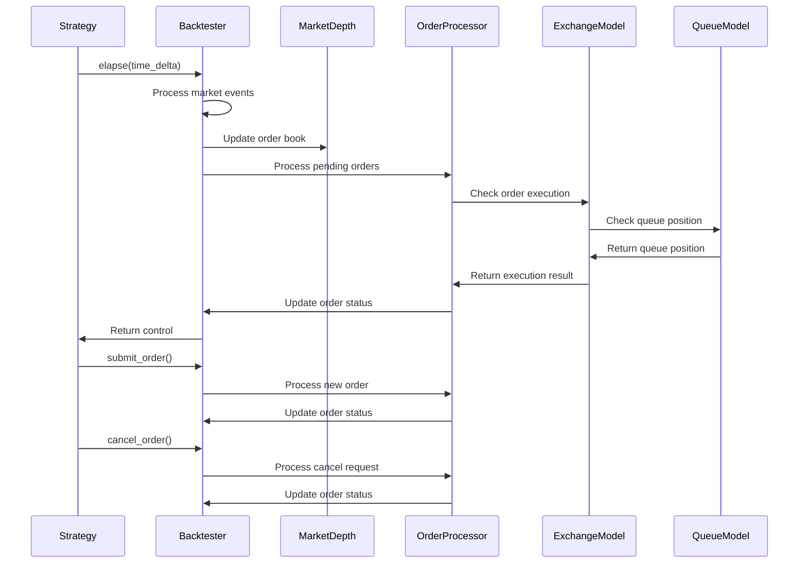
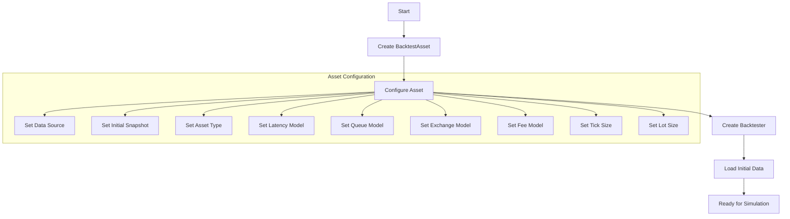
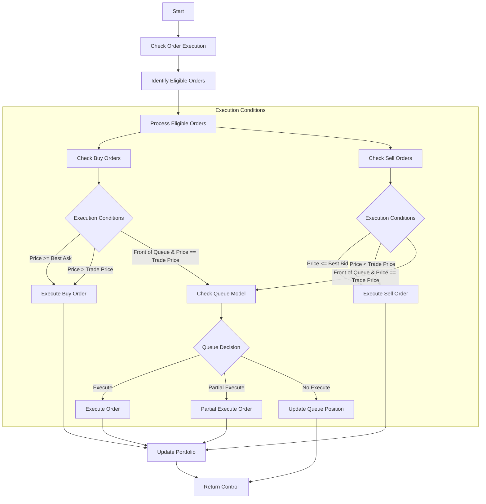
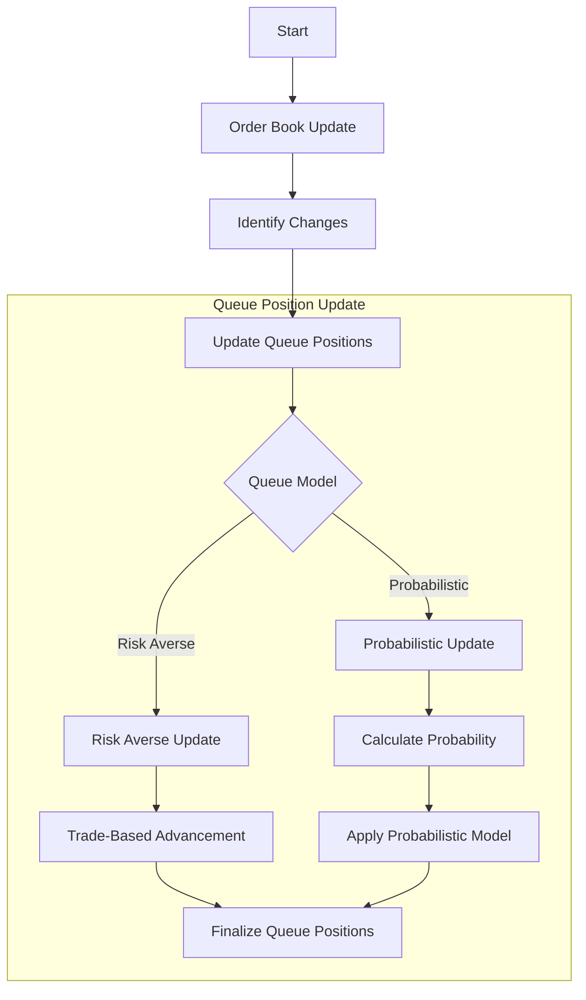
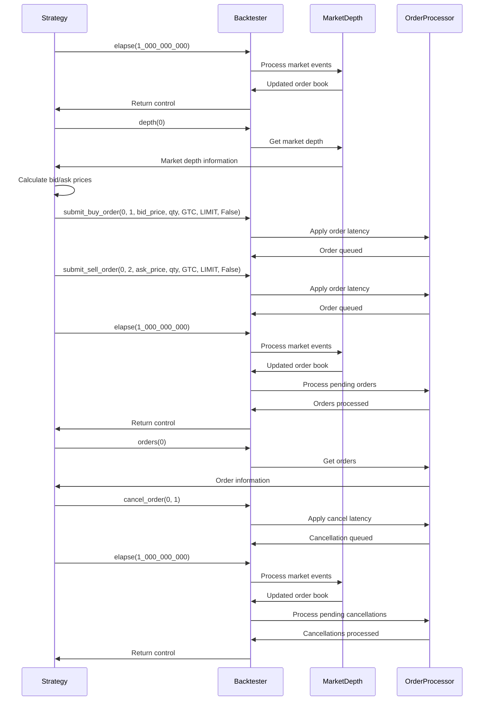
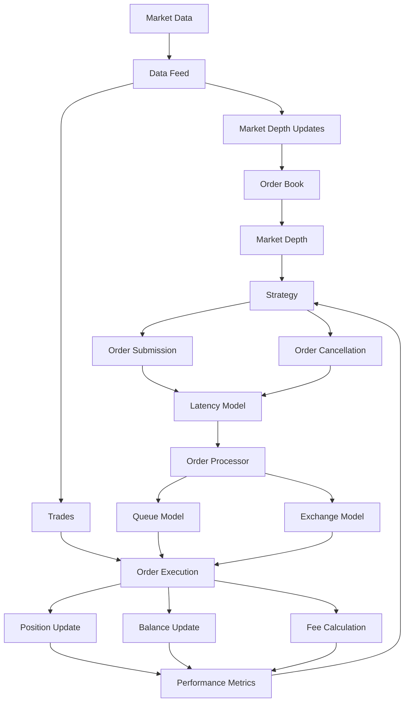

# HFTBacktest Event Flow

This document details the event flow and processing sequence in the HFTBacktest framework. Understanding this flow is crucial for developing effective high-frequency trading strategies and properly utilizing the framework's capabilities.

## High-Level Event Flow



## Detailed Event Processing Sequence

HFTBacktest follows a market replay-based approach where historical market data is replayed tick-by-tick to simulate the market environment. The following sections detail this flow.

### 1. Initialization Phase



During initialization:

1. Create a `BacktestAsset` instance for each asset to be simulated
2. Configure each asset with appropriate parameters:
   - Data source (market data files)
   - Initial snapshot (starting order book state)
   - Asset type (linear or inverse)
   - Latency model (constant or interpolated)
   - Queue model (risk-averse or probabilistic)
   - Exchange model (no partial fill or partial fill)
   - Fee model (trading value, trading quantity, or flat)
   - Tick size (minimum price increment)
   - Lot size (minimum trading unit)
3. Create a backtester instance with the configured assets
4. Load initial data and prepare for simulation

### 2. Time Advancement and Event Processing

```mermaid
flowchart TD
    Start[Start] --> ElapseTime[elapse(time_delta)]
    ElapseTime --> ProcessEvents[Process Events Until Target Time]
    ProcessEvents --> CheckEndOfData{End of Data?}
    CheckEndOfData -->|Yes| ReturnEndOfData[Return End of Data]
    CheckEndOfData -->|No| ReturnContinue[Return Continue]
    
    subgraph "Event Processing"
        ProcessEvents --> ProcessMarketDepthUpdates[Process Market Depth Updates]
        ProcessEvents --> ProcessTrades[Process Trades]
        ProcessEvents --> ProcessOrderResponses[Process Order Responses]
        ProcessEvents --> CheckOrderExecution[Check Order Execution]
        
        ProcessMarketDepthUpdates --> UpdateOrderBook[Update Order Book]
        ProcessTrades --> UpdateTradeHistory[Update Trade History]
        ProcessTrades --> CheckTradeBasedExecution[Check Trade-Based Execution]
        ProcessOrderResponses --> UpdateOrderStatus[Update Order Status]
        CheckOrderExecution --> ExecuteEligibleOrders[Execute Eligible Orders]
    end
```

The time advancement and event processing flow follows these steps:

1. The strategy calls `elapse(time_delta)` to advance simulation time
2. The backtester processes all events until the target time:
   - Market depth updates (changes to the order book)
   - Trades (executed market trades)
   - Order responses (confirmations, fills, cancellations)
3. For each market depth update:
   - Update the order book state
   - Check if any orders should be executed based on the new state
4. For each trade:
   - Update the trade history
   - Check if any orders should be executed based on the trade
5. For each order response:
   - Update the order status
   - Notify the strategy if necessary
6. Return control to the strategy after processing all events

### 3. Order Submission Flow

```mermaid
flowchart TD
    Start[Start] --> SubmitOrder[submit_order()]
    SubmitOrder --> ApplyOrderLatency[Apply Order Latency]
    ApplyOrderLatency --> QueueOrder[Queue Order for Processing]
    QueueOrder --> ReturnControl[Return Control to Strategy]
    
    subgraph "Order Processing (Later)"
        QueueOrder --> ProcessOrder[Process Order at Appropriate Time]
        ProcessOrder --> ValidateOrder[Validate Order]
        ValidateOrder --> CheckOrderType{Order Type}
        
        CheckOrderType -->|Market| ExecuteMarketOrder[Execute Market Order]
        CheckOrderType -->|Limit| PlaceLimitOrder[Place Limit Order]
        CheckOrderType -->|Stop| PlaceStopOrder[Place Stop Order]
        
        ExecuteMarketOrder --> UpdatePortfolio[Update Portfolio]
        PlaceLimitOrder --> AddToOrderBook[Add to Order Book]
        PlaceStopOrder --> AddToStopOrders[Add to Stop Orders]
        
        AddToOrderBook --> AssignQueuePosition[Assign Queue Position]
    end
```

The order submission flow follows these steps:

1. The strategy calls `submit_buy_order()` or `submit_sell_order()`
2. The backtester applies order latency based on the configured latency model
3. The order is queued for processing at the appropriate time
4. When the order processing time is reached:
   - The order is validated
   - Depending on the order type, it is either executed immediately (market order) or placed in the order book (limit order)
   - For limit orders, a queue position is assigned based on the configured queue model
5. The order status is updated and made available to the strategy

### 4. Order Execution Flow



The order execution flow follows these steps:

1. For each market event (depth update or trade), the backtester checks if any orders should be executed
2. Buy orders are executed if:
   - The order price is greater than or equal to the best ask price
   - The order price is greater than the trade price
   - The order is at the front of the queue and the order price equals the trade price (subject to queue model)
3. Sell orders are executed if:
   - The order price is less than or equal to the best bid price
   - The order price is less than the trade price
   - The order is at the front of the queue and the order price equals the trade price (subject to queue model)
4. The queue model determines if an order at the front of the queue should be executed, partially executed, or have its queue position updated
5. When an order is executed, the portfolio is updated with the new position and balance

### 5. Order Cancellation Flow

```mermaid
flowchart TD
    Start[Start] --> CancelOrder[cancel_order()]
    CancelOrder --> ApplyCancelLatency[Apply Cancel Latency]
    ApplyCancelLatency --> QueueCancellation[Queue Cancellation for Processing]
    QueueCancellation --> ReturnControl[Return Control to Strategy]
    
    subgraph "Cancellation Processing (Later)"
        QueueCancellation --> ProcessCancellation[Process Cancellation at Appropriate Time]
        ProcessCancellation --> FindOrder[Find Order]
        FindOrder --> CheckOrderStatus{Order Status}
        
        CheckOrderStatus -->|Active| CancelActiveOrder[Cancel Active Order]
        CheckOrderStatus -->|Pending| CancelPendingOrder[Cancel Pending Order]
        CheckOrderStatus -->|Inactive| IgnoreCancellation[Ignore Cancellation]
        
        CancelActiveOrder --> RemoveFromOrderBook[Remove from Order Book]
        CancelPendingOrder --> RemoveFromPendingOrders[Remove from Pending Orders]
        IgnoreCancellation --> ReturnError[Return Error]
        
        RemoveFromOrderBook --> UpdateOrderStatus[Update Order Status]
        RemoveFromPendingOrders --> UpdateOrderStatus
    end
```

The order cancellation flow follows these steps:

1. The strategy calls `cancel_order()`
2. The backtester applies cancel latency based on the configured latency model
3. The cancellation request is queued for processing at the appropriate time
4. When the cancellation processing time is reached:
   - The order is located in the system
   - If the order is active, it is removed from the order book
   - If the order is pending, it is removed from the pending orders
   - If the order is already inactive, the cancellation is ignored
5. The order status is updated and made available to the strategy

### 6. Queue Position Management



The queue position management flow follows these steps:

1. When the order book is updated (due to a market depth update or trade), queue positions are updated
2. The queue model determines how queue positions are updated:
   - Risk-averse model: Queue positions advance only when trades occur at the price level
   - Probabilistic model: Queue positions advance based on a probability distribution when quantity decreases at the price level
3. The updated queue positions affect order execution decisions

## Event Timing Considerations

Understanding the timing of events in HFTBacktest is crucial for accurate strategy development:

1. **Market Data Timing**: Market data events are processed in the order they appear in the data feed, with timestamps determining their sequence.

2. **Order Latency**: Order submission and cancellation are subject to latency, which can be constant or variable based on the configured latency model.

3. **Event Processing Sequence**: Events are processed in the following sequence:
   - Market depth updates
   - Trades
   - Order responses
   - Order executions

4. **Time Advancement**: The `elapse()` method advances simulation time and processes all events up to the target time.

5. **Order Queue Position**: Order queue position affects execution priority and is managed by the queue model.

## Error Handling in the Event Flow

HFTBacktest implements several error handling mechanisms:

1. **Order Validation**: Orders are validated before submission to ensure they meet basic requirements (valid asset, valid price, valid quantity).

2. **Latency Handling**: Order latency is applied to all order operations, ensuring realistic simulation of high-frequency trading environments.

3. **Queue Position Modeling**: Queue position is modeled to ensure realistic order fill simulation, especially in liquid markets.

4. **Exception Handling**: Exceptions during execution are caught and handled to prevent the simulation from crashing.

## Example Event Flow

Here's a concrete example of the event flow for a simple market making strategy:



This example demonstrates how a simple market making strategy interacts with the HFTBacktest framework:

1. The strategy advances simulation time by 1 second
2. The strategy retrieves market depth information
3. The strategy calculates bid and ask prices based on the market depth
4. The strategy submits buy and sell orders
5. The strategy advances simulation time by 1 second
6. The strategy retrieves order information
7. The strategy cancels the buy order
8. The strategy advances simulation time by 1 second

## Data Flow in HFTBacktest



This diagram illustrates the flow of data through the HFTBacktest system:

1. Market data (depth updates and trades) flows into the system through the data feed
2. The order book is updated based on market depth updates
3. The strategy accesses market depth information and makes trading decisions
4. Order submissions and cancellations are subject to latency
5. The order processor handles order execution based on the queue model and exchange model
6. Order execution results in position, balance, and fee updates
7. Performance metrics are calculated and made available to the strategy
