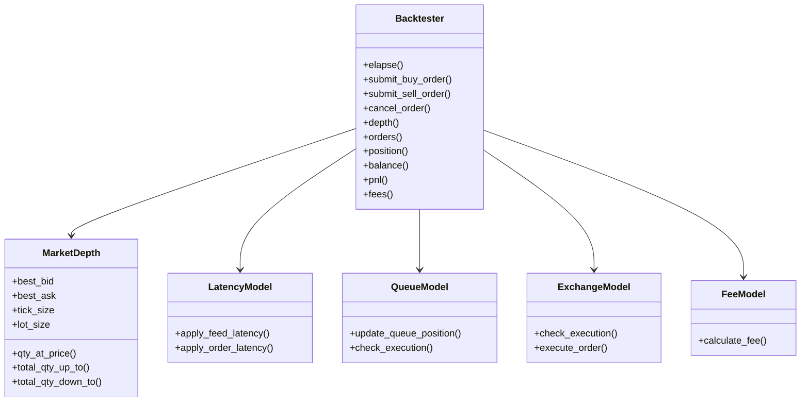
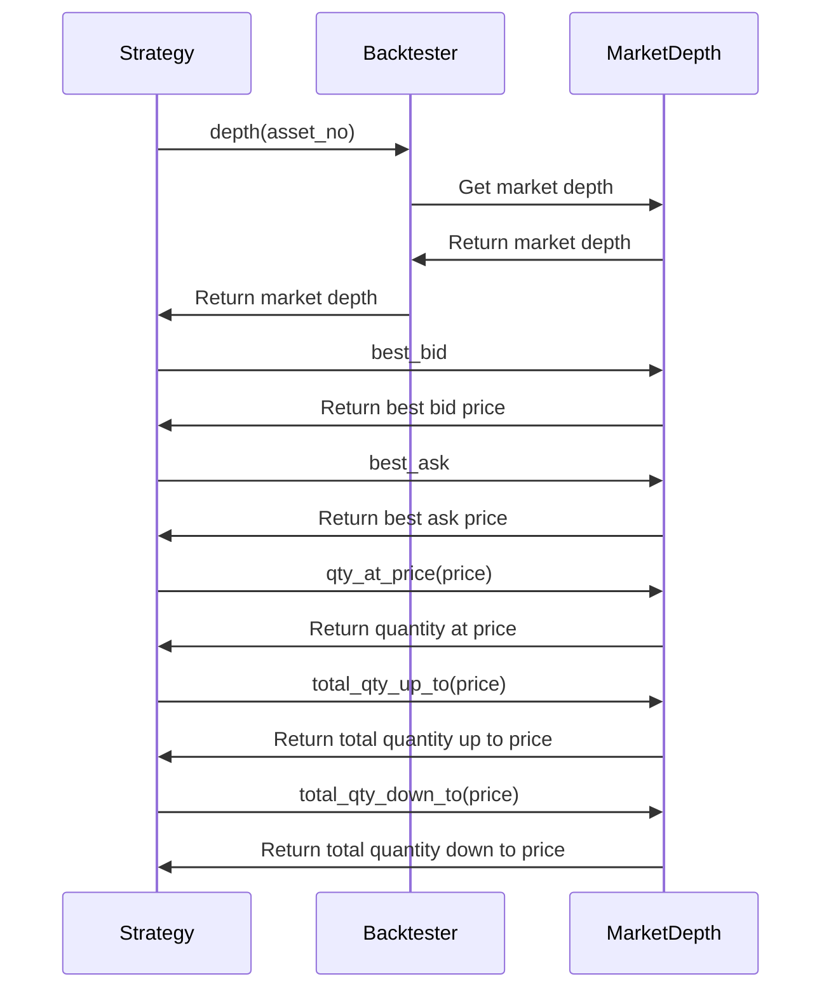
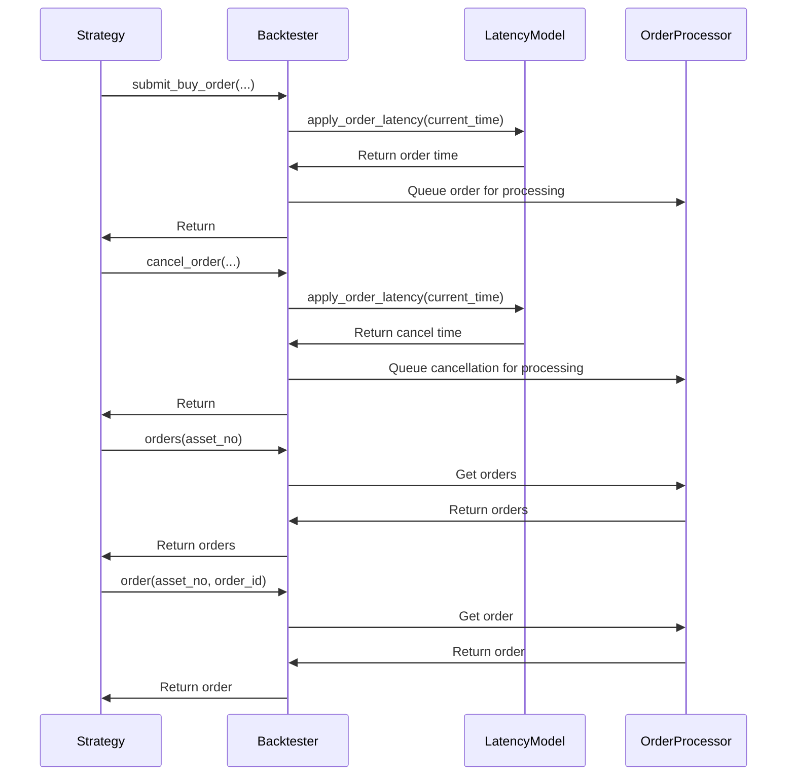
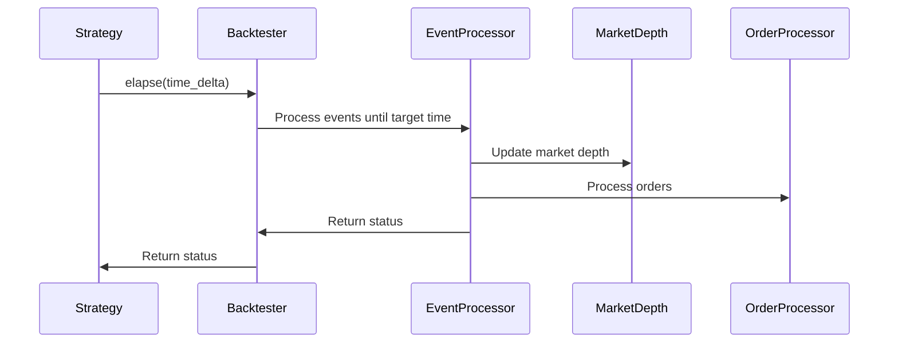

# HFTBacktest Handlers

This document provides comprehensive documentation of the handlers and interfaces in HFTBacktest. Understanding these components is essential for developing effective high-frequency trading strategies and extending the framework's functionality.

## Handler Overview



## Core Handlers

### Backtester Handler

The `Backtester` class is the primary interface for interacting with the HFTBacktest framework. It provides methods for advancing simulation time, submitting and canceling orders, and accessing market data and account information.

#### Interface

```python
class Backtester:
    def elapse(self, time_delta: int) -> int:
        """Advance simulation time by time_delta nanoseconds."""
        pass
        
    def submit_buy_order(self, asset_no: int, order_id: int, price: float, qty: float, 
                         time_in_force: int, order_type: int, immediate_or_cancel: bool) -> None:
        """Submit a buy order."""
        pass
        
    def submit_sell_order(self, asset_no: int, order_id: int, price: float, qty: float, 
                          time_in_force: int, order_type: int, immediate_or_cancel: bool) -> None:
        """Submit a sell order."""
        pass
        
    def cancel_order(self, asset_no: int, order_id: int) -> None:
        """Cancel an order."""
        pass
        
    def depth(self, asset_no: int) -> MarketDepth:
        """Get market depth for an asset."""
        pass
        
    def orders(self, asset_no: int) -> List[Order]:
        """Get all orders for an asset."""
        pass
        
    def order(self, asset_no: int, order_id: int) -> Order:
        """Get a specific order."""
        pass
        
    def position(self, asset_no: int) -> Position:
        """Get position for an asset."""
        pass
        
    def balance(self) -> float:
        """Get account balance."""
        pass
        
    def pnl(self) -> float:
        """Get total profit and loss."""
        pass
        
    def fees(self) -> float:
        """Get total fees paid."""
        pass
        
    def clear_inactive_orders(self, asset_no: int) -> None:
        """Clear inactive orders for an asset."""
        pass
        
    def current_time(self) -> int:
        """Get current simulation time in nanoseconds."""
        pass
        
    def close(self) -> None:
        """Close the backtester and release resources."""
        pass
```

#### Key Properties

- **Assets**: The assets being simulated
- **Current Time**: The current simulation time in nanoseconds
- **Orders**: The orders submitted to the market
- **Positions**: The current positions in each asset
- **Balance**: The current account balance
- **PnL**: The profit and loss (realized and unrealized)
- **Fees**: The trading fees paid

#### Responsibilities

- Advancing simulation time
- Processing market events
- Submitting and canceling orders
- Tracking positions and P&L
- Providing access to market data
- Managing simulation state

#### Example Usage

```python
from numba import njit
from hftbacktest import BacktestAsset, HashMapMarketDepthBacktest
from hftbacktest import LIMIT, GTC, BUY, SELL

@njit
def simple_strategy(hbt):
    asset_no = 0
    
    # Run for 1 hour
    while hbt.elapse(3600 * 1e9) == 0:
        # Clear inactive orders
        hbt.clear_inactive_orders(asset_no)
        
        # Get market depth
        depth = hbt.depth(asset_no)
        
        # Calculate mid price
        mid_price = (depth.best_bid + depth.best_ask) / 2.0
        
        # Submit orders
        hbt.submit_buy_order(asset_no, 1, depth.best_bid, 1.0, GTC, LIMIT, False)
        hbt.submit_sell_order(asset_no, 2, depth.best_ask, 1.0, GTC, LIMIT, False)
    
    return True

# Create asset configuration
asset = (
    BacktestAsset()
    .data(['btcusdt_20230101.npz'])
    .initial_snapshot('btcusdt_20221231_eod.npz')
    .linear_asset(1.0)
    .constant_latency(10_000_000, 10_000_000)
    .risk_adverse_queue_model()
    .no_partial_fill_exchange()
    .trading_value_fee_model(0.0002, 0.0007)
    .tick_size(0.1)
    .lot_size(0.001)
)

# Create backtester
hbt = HashMapMarketDepthBacktest([asset])

# Run strategy
simple_strategy(hbt)

# Close backtester
hbt.close()
```

### MarketDepth Handler

The `MarketDepth` class provides access to the current state of the order book for an asset. It allows strategies to query the best bid and ask prices, the quantity available at each price level, and the total quantity available up to or down to a specific price.

#### Interface

```python
class MarketDepth:
    @property
    def best_bid(self) -> float:
        """Get the best bid price."""
        pass
        
    @property
    def best_ask(self) -> float:
        """Get the best ask price."""
        pass
        
    @property
    def tick_size(self) -> float:
        """Get the tick size."""
        pass
        
    @property
    def lot_size(self) -> float:
        """Get the lot size."""
        pass
        
    def qty_at_price(self, price: float) -> float:
        """Get the quantity available at a specific price."""
        pass
        
    def total_qty_up_to(self, price: float) -> float:
        """Get the total quantity available up to a specific price."""
        pass
        
    def total_qty_down_to(self, price: float) -> float:
        """Get the total quantity available down to a specific price."""
        pass
```

#### Key Properties

- **Best Bid**: The highest bid price
- **Best Ask**: The lowest ask price
- **Tick Size**: The minimum price increment
- **Lot Size**: The minimum trading unit

#### Responsibilities

- Providing access to the current state of the order book
- Calculating quantities at specific price levels
- Calculating total quantities up to or down to specific price levels

#### Example Usage

```python
@njit
def market_depth_example(hbt):
    asset_no = 0
    
    # Get market depth
    depth = hbt.depth(asset_no)
    
    # Access basic properties
    best_bid = depth.best_bid
    best_ask = depth.best_ask
    tick_size = depth.tick_size
    lot_size = depth.lot_size
    
    # Calculate mid price
    mid_price = (best_bid + best_ask) / 2.0
    
    # Get quantity at specific price levels
    bid_qty = depth.qty_at_price(best_bid)
    ask_qty = depth.qty_at_price(best_ask)
    
    # Calculate total quantities
    total_bid_qty = depth.total_qty_up_to(best_bid - 10 * tick_size)
    total_ask_qty = depth.total_qty_down_to(best_ask + 10 * tick_size)
    
    # Calculate order book imbalance
    imbalance = total_bid_qty / (total_bid_qty + total_ask_qty) if (total_bid_qty + total_ask_qty) > 0 else 0.5
    
    return imbalance
```

### LatencyModel Handler

The `LatencyModel` class simulates feed and order latencies in the backtesting environment. It determines when market events are processed and when orders are submitted or canceled.

#### Interface

```python
class LatencyModel:
    def apply_feed_latency(self, timestamp: int) -> int:
        """Apply feed latency to a timestamp."""
        pass
        
    def apply_order_latency(self, timestamp: int) -> int:
        """Apply order latency to a timestamp."""
        pass
```

#### Key Properties

- **Feed Latency**: The latency for market data
- **Order Latency**: The latency for order submission and cancellation

#### Responsibilities

- Simulating feed latency for market data
- Simulating order latency for order submission and cancellation
- Providing realistic latency simulation for high-frequency trading

#### Example Usage

```python
# Create asset with constant latency
asset = (
    BacktestAsset()
    .data(['btcusdt_20230101.npz'])
    .constant_latency(10_000_000, 10_000_000)  # 10ms feed latency, 10ms order latency
)

# Create asset with interpolated order latency
asset = (
    BacktestAsset()
    .data(['btcusdt_20230101.npz'])
    .intp_order_latency('latency_data.npz', 10_000_000)  # Interpolated order latency, 10ms feed latency
)
```

### QueueModel Handler

The `QueueModel` class simulates order queue position dynamics, which is crucial for accurate order fill simulation. It determines when orders are executed based on their position in the queue.

#### Interface

```python
class QueueModel:
    def update_queue_position(self, price: float, qty_change: float, is_trade: bool) -> None:
        """Update queue positions based on quantity change at a price level."""
        pass
        
    def check_execution(self, price: float, qty: float) -> bool:
        """Check if an order at a specific price and quantity should be executed."""
        pass
```

#### Key Properties

- **Queue Positions**: The position of orders in the queue at each price level

#### Responsibilities

- Simulating order queue position dynamics
- Determining when orders are executed based on queue position
- Providing realistic order fill simulation

#### Example Usage

```python
# Create asset with risk-averse queue model
asset = (
    BacktestAsset()
    .data(['btcusdt_20230101.npz'])
    .risk_adverse_queue_model()
)

# Create asset with probabilistic queue model
asset = (
    BacktestAsset()
    .data(['btcusdt_20230101.npz'])
    .power_prob_queue_model()
)
```

### ExchangeModel Handler

The `ExchangeModel` class simulates exchange behavior for order execution. It determines how orders are executed based on market conditions.

#### Interface

```python
class ExchangeModel:
    def check_execution(self, order: Order, market_depth: MarketDepth, trade_price: float, trade_qty: float) -> bool:
        """Check if an order should be executed based on market conditions."""
        pass
        
    def execute_order(self, order: Order, market_depth: MarketDepth, trade_price: float, trade_qty: float) -> float:
        """Execute an order and return the executed quantity."""
        pass
```

#### Key Properties

- **Execution Rules**: The rules for order execution

#### Responsibilities

- Simulating exchange behavior for order execution
- Determining when and how orders are executed
- Providing realistic order execution simulation

#### Example Usage

```python
# Create asset with no partial fill exchange model
asset = (
    BacktestAsset()
    .data(['btcusdt_20230101.npz'])
    .no_partial_fill_exchange()
)

# Create asset with partial fill exchange model
asset = (
    BacktestAsset()
    .data(['btcusdt_20230101.npz'])
    .partial_fill_exchange()
)
```

### FeeModel Handler

The `FeeModel` class calculates trading fees based on the configured fee model. It determines how much fee is charged for each trade.

#### Interface

```python
class FeeModel:
    def calculate_fee(self, price: float, qty: float, is_maker: bool) -> float:
        """Calculate the fee for a trade."""
        pass
```

#### Key Properties

- **Fee Rates**: The fee rates for maker and taker orders

#### Responsibilities

- Calculating trading fees based on the configured fee model
- Providing realistic fee simulation

#### Example Usage

```python
# Create asset with trading value fee model
asset = (
    BacktestAsset()
    .data(['btcusdt_20230101.npz'])
    .trading_value_fee_model(0.0002, 0.0007)  # 0.02% maker fee, 0.07% taker fee
)

# Create asset with trading quantity fee model
asset = (
    BacktestAsset()
    .data(['btcusdt_20230101.npz'])
    .trading_qty_fee_model(0.0001, 0.0003)  # 0.01% maker fee, 0.03% taker fee
)

# Create asset with flat per trade fee model
asset = (
    BacktestAsset()
    .data(['btcusdt_20230101.npz'])
    .flat_per_trade_fee_model(0.1, 0.2)  # $0.1 maker fee, $0.2 taker fee
)
```

## Specialized Handlers

### BacktestAsset Handler

The `BacktestAsset` class is used to configure assets for backtesting. It provides a fluent interface for setting various parameters.

#### Interface

```python
class BacktestAsset:
    def data(self, data_files: List[str]) -> 'BacktestAsset':
        """Set data files for the asset."""
        pass
        
    def initial_snapshot(self, snapshot_file: str) -> 'BacktestAsset':
        """Set initial snapshot file for the asset."""
        pass
        
    def linear_asset(self, contract_value: float) -> 'BacktestAsset':
        """Configure as a linear asset."""
        pass
        
    def inverse_asset(self, contract_value: float) -> 'BacktestAsset':
        """Configure as an inverse asset."""
        pass
        
    def constant_latency(self, feed_latency: int, order_latency: int) -> 'BacktestAsset':
        """Set constant latency model."""
        pass
        
    def intp_order_latency(self, latency_file: str, feed_latency: int) -> 'BacktestAsset':
        """Set interpolated order latency model."""
        pass
        
    def risk_adverse_queue_model(self) -> 'BacktestAsset':
        """Set risk-averse queue model."""
        pass
        
    def power_prob_queue_model(self) -> 'BacktestAsset':
        """Set power probabilistic queue model."""
        pass
        
    def log_prob_queue_model(self) -> 'BacktestAsset':
        """Set logarithmic probabilistic queue model."""
        pass
        
    def no_partial_fill_exchange(self) -> 'BacktestAsset':
        """Set no partial fill exchange model."""
        pass
        
    def partial_fill_exchange(self) -> 'BacktestAsset':
        """Set partial fill exchange model."""
        pass
        
    def trading_value_fee_model(self, maker_fee: float, taker_fee: float) -> 'BacktestAsset':
        """Set trading value fee model."""
        pass
        
    def trading_qty_fee_model(self, maker_fee: float, taker_fee: float) -> 'BacktestAsset':
        """Set trading quantity fee model."""
        pass
        
    def flat_per_trade_fee_model(self, maker_fee: float, taker_fee: float) -> 'BacktestAsset':
        """Set flat per trade fee model."""
        pass
        
    def tick_size(self, tick_size: float) -> 'BacktestAsset':
        """Set tick size."""
        pass
        
    def lot_size(self, lot_size: float) -> 'BacktestAsset':
        """Set lot size."""
        pass
```

#### Key Properties

- **Data Files**: The market data files for the asset
- **Initial Snapshot**: The initial order book snapshot
- **Asset Type**: Linear or inverse
- **Latency Model**: The latency model for the asset
- **Queue Model**: The queue position model for the asset
- **Exchange Model**: The exchange model for the asset
- **Fee Model**: The fee model for the asset
- **Tick Size**: The minimum price increment
- **Lot Size**: The minimum trading unit

#### Responsibilities

- Configuring assets for backtesting
- Providing a fluent interface for setting parameters
- Ensuring all required parameters are set

#### Example Usage

```python
# Create asset configuration
asset = (
    BacktestAsset()
    .data(['btcusdt_20230101.npz'])
    .initial_snapshot('btcusdt_20221231_eod.npz')
    .linear_asset(1.0)
    .constant_latency(10_000_000, 10_000_000)
    .risk_adverse_queue_model()
    .no_partial_fill_exchange()
    .trading_value_fee_model(0.0002, 0.0007)
    .tick_size(0.1)
    .lot_size(0.001)
)
```

### HashMapMarketDepthBacktest Handler

The `HashMapMarketDepthBacktest` class is a backtester implementation that uses a HashMap-based market depth implementation. It is suitable for most backtesting scenarios.

#### Interface

```python
class HashMapMarketDepthBacktest(Backtester):
    def __init__(self, assets: List[BacktestAsset]):
        """Initialize the backtester with the given assets."""
        pass
```

#### Key Properties

- **Assets**: The assets being simulated
- **Market Depth Implementation**: HashMap-based

#### Responsibilities

- Implementing the backtester interface
- Using a HashMap-based market depth implementation
- Providing efficient backtesting for most scenarios

#### Example Usage

```python
# Create backtester with HashMap-based market depth
hbt = HashMapMarketDepthBacktest([asset])
```

### ROIVectorMarketDepthBacktest Handler

The `ROIVectorMarketDepthBacktest` class is a backtester implementation that uses a ROI (Region of Interest) vector-based market depth implementation. It is suitable for scenarios where only a small region of the order book is of interest.

#### Interface

```python
class ROIVectorMarketDepthBacktest(Backtester):
    def __init__(self, assets: List[BacktestAsset], roi_range: int):
        """Initialize the backtester with the given assets and ROI range."""
        pass
```

#### Key Properties

- **Assets**: The assets being simulated
- **Market Depth Implementation**: ROI vector-based
- **ROI Range**: The range of interest in the order book

#### Responsibilities

- Implementing the backtester interface
- Using a ROI vector-based market depth implementation
- Providing efficient backtesting for scenarios where only a small region of the order book is of interest

#### Example Usage

```python
# Create backtester with ROI vector-based market depth
hbt = ROIVectorMarketDepthBacktest([asset], 10)  # 10 price levels on each side
```

## Handler Interaction Patterns

### Backtester and MarketDepth Interaction



### Backtester and Order Interaction



### Backtester and Time Advancement Interaction



## Edge Cases and Their Handling

### 1. Order Execution Edge Cases

HFTBacktest handles various order execution edge cases:

```python
# Example of handling order execution edge cases
@njit
def handle_execution_edge_cases(hbt):
    asset_no = 0
    
    # Get market depth
    depth = hbt.depth(asset_no)
    
    # Edge case 1: Order price is outside the current market
    # This order will not be executed immediately
    hbt.submit_buy_order(asset_no, 1, depth.best_bid - 10 * depth.tick_size, 1.0, GTC, LIMIT, False)
    
    # Edge case 2: Order price is at the market but quantity is too large
    # This order may be partially filled or not filled at all, depending on the exchange model
    hbt.submit_buy_order(asset_no, 2, depth.best_ask, 1000.0, GTC, LIMIT, False)
    
    # Edge case 3: Immediate or cancel order
    # This order will be canceled if not immediately filled
    hbt.submit_buy_order(asset_no, 3, depth.best_ask, 1.0, GTC, LIMIT, True)
    
    # Edge case 4: Market order
    # This order will be executed at the current market price
    hbt.submit_buy_order(asset_no, 4, 0.0, 1.0, GTC, MARKET, False)
```

### 2. Latency Edge Cases

HFTBacktest handles various latency edge cases:

```python
# Example of handling latency edge cases
@njit
def handle_latency_edge_cases(hbt):
    asset_no = 0
    
    # Edge case 1: High feed latency
    # Market data will be delayed, affecting strategy decisions
    
    # Edge case 2: High order latency
    # Orders will be delayed, affecting execution
    
    # Edge case 3: Variable order latency
    # Order latency may vary based on market conditions
    
    # Edge case 4: Latency spikes
    # Sudden increases in latency may affect strategy performance
    
    # Mitigate latency issues by using more conservative strategies
    depth = hbt.depth(asset_no)
    mid_price = (depth.best_bid + depth.best_ask) / 2.0
    
    # Use wider spreads to account for latency
    spread = 10 * depth.tick_size
    
    # Place orders with wider spreads
    hbt.submit_buy_order(asset_no, 1, mid_price - spread, 1.0, GTC, LIMIT, False)
    hbt.submit_sell_order(asset_no, 2, mid_price + spread, 1.0, GTC, LIMIT, False)
```

### 3. Queue Position Edge Cases

HFTBacktest handles various queue position edge cases:

```python
# Example of handling queue position edge cases
@njit
def handle_queue_position_edge_cases(hbt):
    asset_no = 0
    
    # Edge case 1: Order at the front of the queue
    # This order has the highest priority for execution
    
    # Edge case 2: Order at the back of the queue
    # This order has the lowest priority for execution
    
    # Edge case 3: Queue position changes due to cancellations
    # Queue position may advance due to cancellations
    
    # Edge case 4: Queue position changes due to trades
    # Queue position may advance due to trades
    
    # Mitigate queue position issues by using more aggressive pricing
    depth = hbt.depth(asset_no)
    
    # Place buy order at a slightly better price to get better queue position
    hbt.submit_buy_order(asset_no, 1, depth.best_bid + depth.tick_size, 1.0, GTC, LIMIT, False)
    
    # Place sell order at a slightly better price to get better queue position
    hbt.submit_sell_order(asset_no, 2, depth.best_ask - depth.tick_size, 1.0, GTC, LIMIT, False)
```

## Conclusion

HFTBacktest provides a comprehensive set of handlers that enable the development of sophisticated high-frequency trading strategies. By understanding these handlers and their interactions, developers can create more effective and realistic trading strategies while leveraging the full capabilities of the framework.
