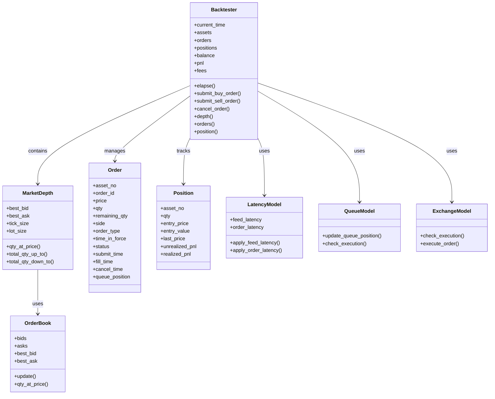
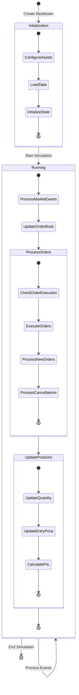

# HFTBacktest State Management

This document details how HFTBacktest manages state throughout the backtesting process. Understanding the state model is essential for developing effective high-frequency trading strategies and properly utilizing the framework's capabilities.

## State Model Overview



## Core State Components

HFTBacktest maintains several key state components throughout the backtesting process:

### 1. Backtester State

The `Backtester` class maintains the overall state of the backtesting simulation, including:

- **Current Time**: The current simulation time in nanoseconds
- **Assets**: The assets being simulated
- **Orders**: The orders submitted to the market
- **Positions**: The current positions in each asset
- **Balance**: The current account balance
- **PnL**: The profit and loss (realized and unrealized)
- **Fees**: The trading fees paid

The backtester state is updated as the simulation progresses, with each event potentially affecting multiple state components.

### 2. Market Depth State

The `MarketDepth` class represents the current state of the order book for an asset, including:

- **Best Bid**: The highest bid price
- **Best Ask**: The lowest ask price
- **Tick Size**: The minimum price increment
- **Lot Size**: The minimum trading unit
- **Price Levels**: The quantity available at each price level

The market depth state is updated based on market depth updates and trades from the data feed.

### 3. Order State

The `Order` class represents an order submitted to the market, including:

- **Asset Number**: The asset the order is for
- **Order ID**: The unique identifier for the order
- **Price**: The order price
- **Quantity**: The order quantity
- **Remaining Quantity**: The unfilled quantity
- **Side**: Buy or sell
- **Order Type**: Market, limit, etc.
- **Time in Force**: GTC, IOC, etc.
- **Status**: Active, filled, canceled, etc.
- **Submit Time**: When the order was submitted
- **Fill Time**: When the order was filled
- **Cancel Time**: When the order was canceled
- **Queue Position**: The order's position in the queue

The order state transitions as the order is processed by the market.

### 4. Position State

The `Position` class represents a position in an asset, including:

- **Asset Number**: The asset the position is in
- **Quantity**: The position quantity (positive for long, negative for short)
- **Entry Price**: The average entry price
- **Entry Value**: The value at entry
- **Last Price**: The last traded price
- **Unrealized PnL**: The unrealized profit and loss
- **Realized PnL**: The realized profit and loss

The position state is updated when orders are filled, affecting the quantity, entry price, and PnL.

### 5. Order Book State

The `OrderBook` class represents the full order book for an asset, including:

- **Bids**: The buy orders in the book
- **Asks**: The sell orders in the book
- **Best Bid**: The highest bid price
- **Best Ask**: The lowest ask price

The order book state is updated based on market depth updates from the data feed.

### 6. Latency Model State

The `LatencyModel` class represents the latency model for the simulation, including:

- **Feed Latency**: The latency for market data
- **Order Latency**: The latency for order submission and cancellation

The latency model state affects when market events are processed and when orders are submitted or canceled.

### 7. Queue Model State

The `QueueModel` class represents the queue position model for the simulation, including:

- **Queue Positions**: The position of orders in the queue at each price level

The queue model state affects when orders are executed based on their position in the queue.

## State Transitions



### Key State Transitions

1. **Initialization to Running**:
   - Configure assets with appropriate parameters
   - Load market data and initial snapshots
   - Initialize backtester state
   - Start the simulation

2. **Market Event Processing**:
   - Process market depth updates
   - Process trades
   - Update the order book
   - Check for order executions

3. **Order State Transitions**:
   - New: Order is created but not yet submitted
   - Pending: Order is submitted but not yet active due to latency
   - Active: Order is active in the market
   - Partially Filled: Order is partially filled
   - Filled: Order is fully filled
   - Canceled: Order is canceled
   - Rejected: Order is rejected

4. **Position State Transitions**:
   - No Position: No position in the asset
   - Long: Positive position in the asset
   - Short: Negative position in the asset
   - Flat: Position is closed

## State Persistence Mechanisms

HFTBacktest provides several mechanisms for state persistence:

### 1. In-Memory State

During backtesting, all state is maintained in memory for maximum performance. This includes:

- Order book state
- Order state
- Position state
- Balance and PnL

### 2. State Snapshots

HFTBacktest allows for taking snapshots of the current state, which can be used for:

- Analyzing the state at specific points in time
- Debugging strategy behavior
- Comparing different strategy configurations

### 3. State Serialization

While not directly supported by the framework, state can be serialized for persistence:

```python
# Example of state serialization
def save_state(hbt, filename):
    state = {
        'current_time': hbt.current_time(),
        'positions': [hbt.position(i) for i in range(len(hbt.assets))],
        'balance': hbt.balance(),
        'pnl': hbt.pnl(),
        'fees': hbt.fees()
    }
    with open(filename, 'wb') as f:
        pickle.dump(state, f)

def load_state(filename):
    with open(filename, 'rb') as f:
        return pickle.load(f)
```

## Thread Safety and Concurrency

HFTBacktest is designed for single-threaded operation, as the backtesting process is inherently sequential. However, the framework is implemented in Rust with Python bindings, allowing for efficient execution.

The Rust implementation provides:

- Memory safety
- Efficient data structures
- High performance

The Python bindings provide:

- Easy integration with Python code
- Numba JIT compilation for performance
- Familiar API for Python developers

## State Access Patterns

### Accessing Market Depth

```python
@njit
def strategy(hbt):
    asset_no = 0
    
    # Get market depth
    depth = hbt.depth(asset_no)
    
    # Access market depth information
    best_bid = depth.best_bid
    best_ask = depth.best_ask
    bid_qty = depth.qty_at_price(best_bid)
    ask_qty = depth.qty_at_price(best_ask)
    
    # Calculate mid price
    mid_price = (best_bid + best_ask) / 2.0
    
    # Calculate total quantity up to a price
    total_bid_qty = depth.total_qty_up_to(best_bid - 10 * depth.tick_size)
    total_ask_qty = depth.total_qty_down_to(best_ask + 10 * depth.tick_size)
    
    # Calculate order book imbalance
    imbalance = total_bid_qty / (total_bid_qty + total_ask_qty)
```

### Accessing Orders

```python
@njit
def strategy(hbt):
    asset_no = 0
    
    # Get all orders for an asset
    orders = hbt.orders(asset_no)
    
    # Check if we have active orders
    has_active_orders = False
    for order in orders:
        if order.status == ACTIVE:
            has_active_orders = True
            break
    
    # Clear inactive orders
    hbt.clear_inactive_orders(asset_no)
    
    # Get a specific order
    order_id = 1
    order = hbt.order(asset_no, order_id)
    
    # Check order status
    if order.status == FILLED:
        print(f"Order {order_id} filled at {order.fill_time}")
    elif order.status == CANCELED:
        print(f"Order {order_id} canceled at {order.cancel_time}")
```

### Accessing Positions

```python
@njit
def strategy(hbt):
    asset_no = 0
    
    # Get position for an asset
    position = hbt.position(asset_no)
    
    # Check if we have a position
    if position.qty > 0:
        print(f"Long position: {position.qty} @ {position.entry_price}")
    elif position.qty < 0:
        print(f"Short position: {position.qty} @ {position.entry_price}")
    else:
        print("No position")
    
    # Calculate position value
    position_value = position.qty * hbt.depth(asset_no).best_bid
    
    # Calculate unrealized PnL
    unrealized_pnl = position.unrealized_pnl
    
    # Calculate realized PnL
    realized_pnl = position.realized_pnl
```

### Accessing Balance and PnL

```python
@njit
def strategy(hbt):
    # Get account balance
    balance = hbt.balance()
    
    # Get total PnL
    pnl = hbt.pnl()
    
    # Get trading fees
    fees = hbt.fees()
    
    # Calculate net PnL
    net_pnl = pnl - fees
```

## State Management Examples

### Managing Multiple Assets

```python
@njit
def multi_asset_strategy(hbt):
    # Number of assets
    num_assets = 2
    
    # Run for 1 hour
    while hbt.elapse(3600 * 1e9) == 0:
        # Process each asset
        for asset_no in range(num_assets):
            # Clear inactive orders
            hbt.clear_inactive_orders(asset_no)
            
            # Get market depth
            depth = hbt.depth(asset_no)
            
            # Calculate mid price
            mid_price = (depth.best_bid + depth.best_ask) / 2.0
            
            # Get position
            position = hbt.position(asset_no)
            
            # Implement strategy logic
            if position.qty == 0:
                # No position, place new orders
                hbt.submit_buy_order(asset_no, asset_no * 100 + 1, depth.best_bid, 1.0, GTC, LIMIT, False)
                hbt.submit_sell_order(asset_no, asset_no * 100 + 2, depth.best_ask, 1.0, GTC, LIMIT, False)
            elif position.qty > 0:
                # Long position, place sell order
                hbt.submit_sell_order(asset_no, asset_no * 100 + 3, mid_price + 5 * depth.tick_size, position.qty, GTC, LIMIT, False)
            elif position.qty < 0:
                # Short position, place buy order
                hbt.submit_buy_order(asset_no, asset_no * 100 + 4, mid_price - 5 * depth.tick_size, -position.qty, GTC, LIMIT, False)
```

### Managing Order State

```python
@njit
def order_management_strategy(hbt):
    asset_no = 0
    
    # Run for 1 hour
    while hbt.elapse(3600 * 1e9) == 0:
        # Clear inactive orders
        hbt.clear_inactive_orders(asset_no)
        
        # Get market depth
        depth = hbt.depth(asset_no)
        
        # Get all orders
        orders = hbt.orders(asset_no)
        
        # Check for active buy orders
        active_buy_order = False
        for order in orders:
            if order.status == ACTIVE and order.side == BUY:
                active_buy_order = True
                
                # Check if order is too far from market
                if depth.best_bid > order.price + 5 * depth.tick_size:
                    # Cancel old order
                    hbt.cancel_order(asset_no, order.order_id)
                    
                    # Submit new order at better price
                    hbt.submit_buy_order(asset_no, order.order_id + 1000, depth.best_bid, order.qty, GTC, LIMIT, False)
                
                break
        
        # If no active buy order, place a new one
        if not active_buy_order:
            hbt.submit_buy_order(asset_no, 1, depth.best_bid, 1.0, GTC, LIMIT, False)
        
        # Similar logic for sell orders
        # ...
```

### Managing Position State

```python
@njit
def position_management_strategy(hbt):
    asset_no = 0
    
    # Maximum position size
    max_position = 10.0
    
    # Run for 1 hour
    while hbt.elapse(3600 * 1e9) == 0:
        # Clear inactive orders
        hbt.clear_inactive_orders(asset_no)
        
        # Get market depth
        depth = hbt.depth(asset_no)
        
        # Get position
        position = hbt.position(asset_no)
        
        # Calculate order book imbalance
        bid_qty = depth.total_qty_up_to(depth.best_bid - 5 * depth.tick_size)
        ask_qty = depth.total_qty_down_to(depth.best_ask + 5 * depth.tick_size)
        imbalance = bid_qty / (bid_qty + ask_qty) if (bid_qty + ask_qty) > 0 else 0.5
        
        # Determine target position based on imbalance
        target_position = (imbalance - 0.5) * 2 * max_position
        
        # Calculate position adjustment
        adjustment = target_position - position.qty
        
        # Place orders to adjust position
        if adjustment > 0:
            # Need to buy
            hbt.submit_buy_order(asset_no, 1, depth.best_bid, adjustment, GTC, LIMIT, False)
        elif adjustment < 0:
            # Need to sell
            hbt.submit_sell_order(asset_no, 2, depth.best_ask, -adjustment, GTC, LIMIT, False)
```

## Conclusion

HFTBacktest provides a comprehensive state management system that enables the development of sophisticated high-frequency trading strategies. By understanding how the framework manages and transitions state, developers can create more effective and realistic trading strategies while leveraging the full capabilities of the framework.
