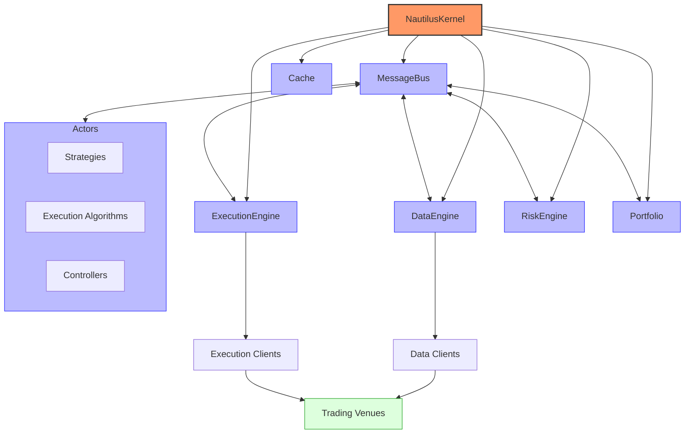

# NautilusTrader Trading System

## Overview

NautilusTrader is an open-source, high-performance, production-grade algorithmic trading platform. It provides quantitative traders with the ability to backtest portfolios of automated trading strategies on historical data with an event-driven engine, and also deploy those same strategies live, with no code changes.

NautilusTrader's design, architecture, and implementation philosophy prioritizes software correctness and safety at the highest level, with the aim of supporting mission-critical trading system backtesting and live deployment workloads.

## Architecture



NautilusTrader's architecture consists of several key components:

1. **System Kernel** - The core system that coordinates all components
2. **Data Engine** - Handles market data ingestion and processing
3. **Execution Engine** - Manages order execution and position tracking
4. **Risk Engine** - Enforces risk management rules
5. **Portfolio** - Tracks positions, balances, and performance
6. **Trader** - Coordinates trading activities and strategy execution
7. **Actors** - Pluggable components that implement trading logic

## Key Components and Relationships

### System Kernel

The `NautilusKernel` is the central component that initializes and coordinates all system components. It:
- Starts and stops the system
- Connects to data and execution venues
- Initializes the portfolio and cache
- Manages the message bus and actors
- Provides a common core between backtest, sandbox, and live trading environments

### Message Bus

The `MessageBus` is the core communication system that enables decoupled messaging patterns between components:
- Provides point-to-point, publish/subscribe, and request/response patterns
- Ensures efficient message routing with minimal overhead
- Maintains message ordering and delivery guarantees
- Supports both synchronous and asynchronous communication

### Cache

The `Cache` is a central in-memory data store for managing all trading-related data:
- Stores instruments, orders, positions, and account information
- Provides fast O(1) lookups for trading state
- Supports persistence to disk for recovery
- Maintains a consistent view of the trading system state

### Data Engine

The `DataEngine` is responsible for:
- Ingesting market data from various sources (exchanges, data providers)
- Processing and normalizing data across different formats
- Distributing data to interested components via the message bus
- Managing data caching and persistence
- Supporting different data types (ticks, quotes, bars, order books)

### Execution Engine

The `ExecutionEngine` handles:
- Order submission to execution venues
- Order tracking and management throughout the order lifecycle
- Position tracking and reconciliation
- Execution reporting and event generation
- Order emulation for advanced order types
- Support for different Order Management System (OMS) types

### Risk Engine

The `RiskEngine` enforces risk management rules:
- Pre-trade risk checks for all orders
- Position limits and exposure monitoring
- Order size and notional value limits
- Price and quantity precision validation
- Trading state management (active, halted, reducing)
- Custom risk rule implementation

### Portfolio

The `Portfolio` serves as the central hub for position management:
- Tracks positions across all instruments and strategies
- Manages account balances and margin requirements
- Calculates performance metrics (PnL, returns, drawdowns)
- Monitors risk exposures and correlations
- Provides portfolio-level analytics

### Actors

`Actors` are pluggable components that implement trading logic:
- **Strategies**: Core trading algorithms that generate signals and manage positions
- **Execution Algorithms**: Specialized components for optimal order execution (e.g., TWAP)
- **Controllers**: Components that can control and coordinate multiple strategies
- **Risk Models**: Custom risk management implementations

Actors can:
- Subscribe to market data
- Submit and manage orders
- Access the cache and portfolio
- Communicate with other components via the message bus

## Supported Markets and Instruments

NautilusTrader supports a wide range of markets and instruments through its adapter system:

- **Spot Markets**: Cryptocurrency (Binance, Coinbase, etc.), FX (FXCM, Interactive Brokers), Equities
- **Futures Markets**: Index futures, Commodity futures, Currency futures, Perpetual contracts
- **Options Markets**: Equity options, Index options, Cryptocurrency options
- **Custom Instruments**: User-defined custom instruments with flexible specification

The platform provides built-in adapters for popular exchanges and brokers, including:
- Binance (Spot and Futures)
- Coinbase
- FXCM
- Interactive Brokers
- Bybit
- FTX (historical)
- And more through the extensible adapter framework

## Performance Characteristics

- **Execution Speed**: Microsecond-level response times with critical paths implemented in Rust and Cython
- **Memory Efficiency**: Optimized memory usage with custom data structures and memory management
- **Type Safety**: Strong type checking at both compile-time and runtime for reliability
- **Concurrency**: Efficient single-threaded event processing with asynchronous I/O
- **Scalability**: Distributed architecture for scaling across multiple machines
- **Reliability**: Crash-only design with robust error handling and recovery mechanisms

## Dependencies and Requirements

- Python 3.11-3.13
- Cython for performance-critical components
- Rust for core system components (pre-compiled, no Rust installation needed)
- pandas for data analysis
- numpy for numerical operations
- msgspec for high-performance serialization
- pyo3 for Python/Rust interoperability
- uvloop for improved async performance (optional)
- redis for distributed deployment (optional)

## Operational Modes

NautilusTrader operates in three distinct environment contexts:

### Backtesting

The backtesting environment allows you to test strategies on historical data with high fidelity:
- Supports both high-level and low-level APIs for different use cases
- Processes various data types (bars, ticks, quotes, order books) with appropriate simulation
- Provides realistic order matching and execution simulation
- Includes configurable fill models for simulating queue position and slippage
- Generates comprehensive performance analytics

### Sandbox

The sandbox environment provides a real-time simulation with live market data:
- Uses real-time data feeds but simulated execution
- Allows testing of strategies in real market conditions without financial risk
- Maintains the same code path as live trading for accurate behavior

### Live Trading

The live trading environment connects to real exchanges and brokers:
- Supports both paper trading and real money trading
- Provides robust reconciliation mechanisms to ensure state consistency
- Includes configurable risk controls and circuit breakers
- Offers advanced order management and execution capabilities

## Quick Start Guide

### Installation

```bash
pip install nautilus_trader
```

### Backtesting Example

```python
from nautilus_trader.backtest.node import BacktestNode
from nautilus_trader.config import BacktestRunConfig, BacktestDataConfig, BacktestVenueConfig
from nautilus_trader.examples.strategies import EMACross

# Create backtest configurations
backtest_config = BacktestRunConfig(
    engine_id="001",
    strategies=[{"strategy": "EMACross", "config": {"instrument_id": "BTC-USDT", "fast_period": 10, "slow_period": 20}}],
    venues=[BacktestVenueConfig(venue="BINANCE", oms_type="NETTING", account_type="CASH")],
    data=[BacktestDataConfig(catalog="csv", catalog_path="/path/to/data")],
)

# Create and run backtest node
node = BacktestNode(configs=[backtest_config])
results = node.run()
```

### Live Trading Example

```python
from nautilus_trader.live.node import TradingNode
from nautilus_trader.config import LiveConfig

# Create configuration
config = LiveConfig(
    trader_id="TRADER-001",
    environment="LIVE",  # Options: BACKTEST, SANDBOX, LIVE
    data_clients=[
        {"venue": "BINANCE", "api_key": "your_api_key", "api_secret": "your_api_secret"},
    ],
    exec_clients=[
        {"venue": "BINANCE", "api_key": "your_api_key", "api_secret": "your_api_secret"},
    ],
    actors=[
        {"strategy": "EMACross", "config": {"instrument_id": "BTC-USDT", "fast_period": 10, "slow_period": 20}},
    ],
    exec_engine={
        "reconciliation": True,
        "reconciliation_lookback_mins": 1440,  # 24 hours
        "inflight_check_interval_ms": 2000,
    },
)

# Create and run trading node
node = TradingNode(config=config)
node.run()
```

For more detailed examples, see the [event-flow.md](./event-flow.md), [state-management.md](./state-management.md), and [handlers.md](./handlers.md) documentation.
