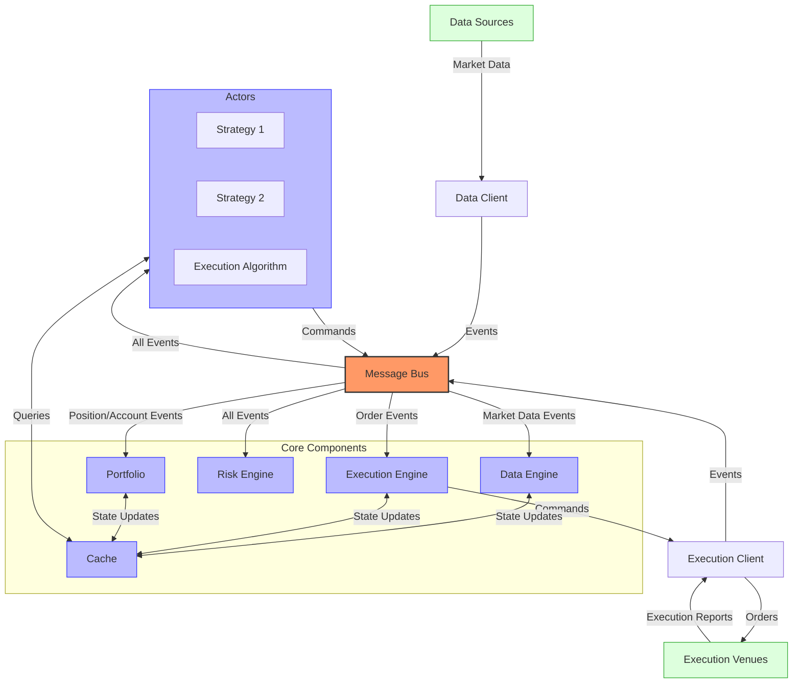
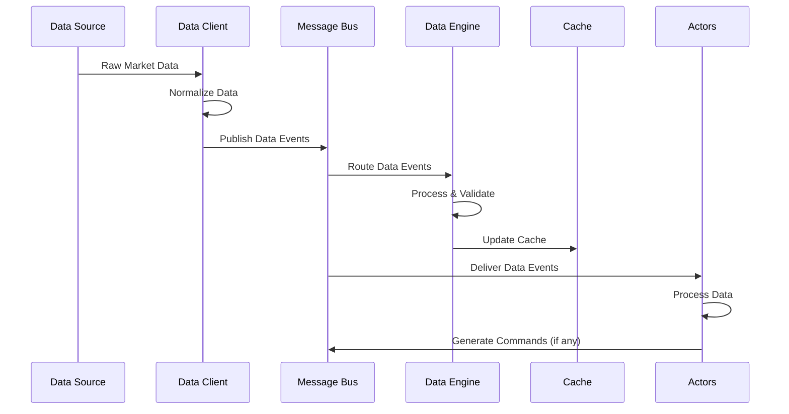
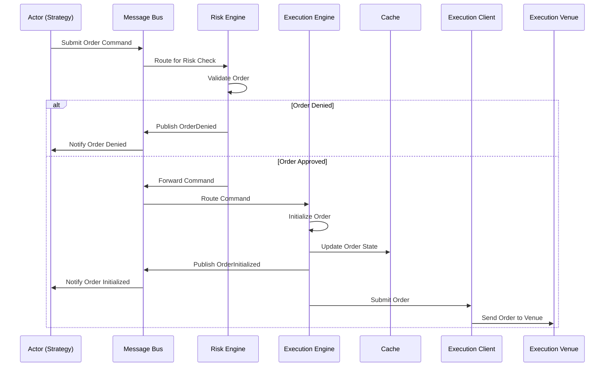
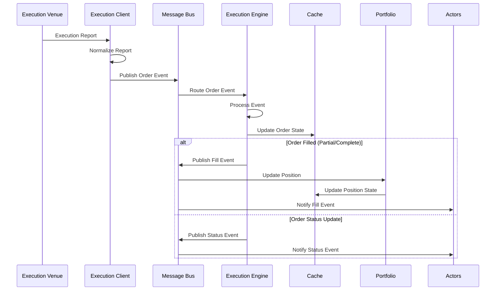
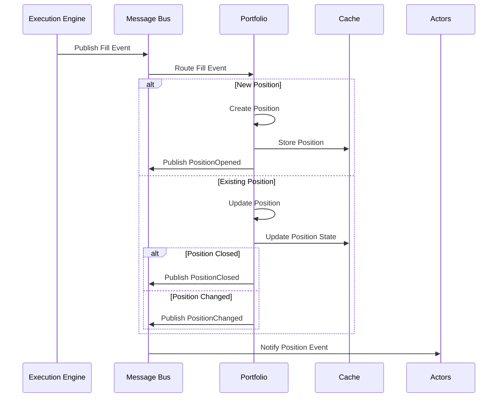
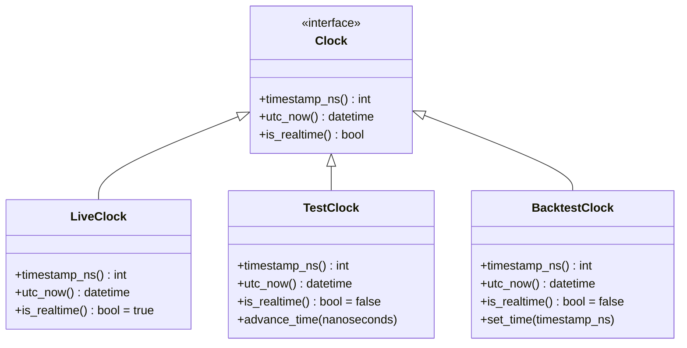
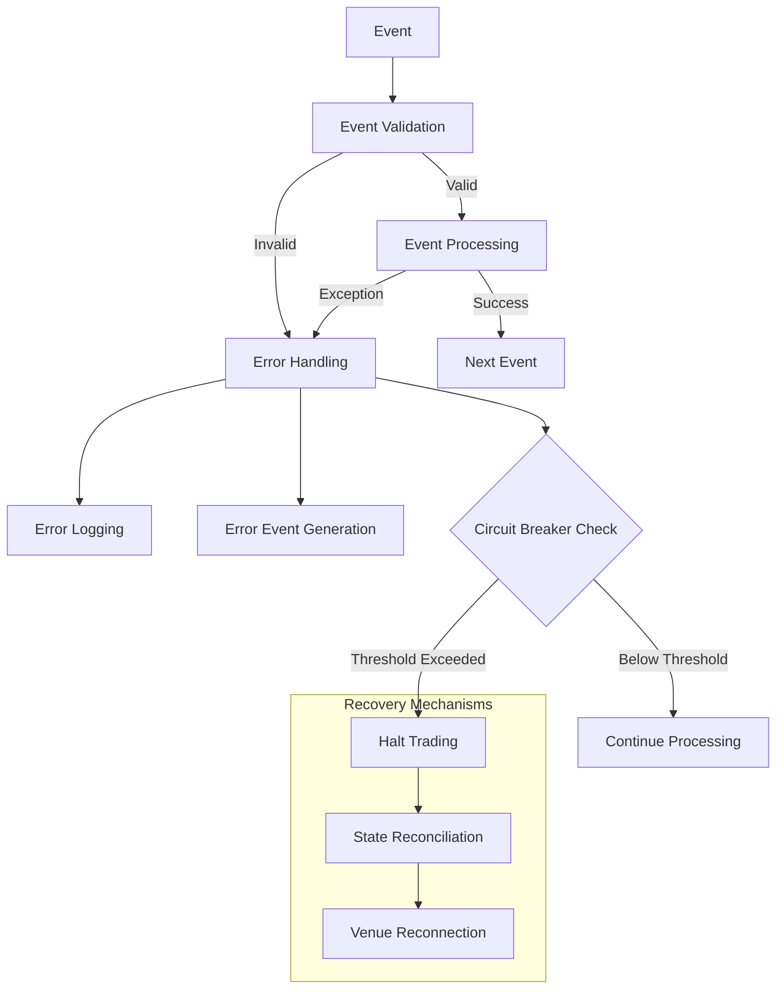
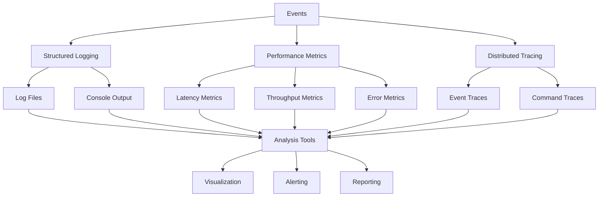

# NautilusTrader Event Flow

## Event Flow Overview

NautilusTrader uses a sophisticated event-driven architecture where events flow through a message bus to various components. This document details the event types, their flow through the system, and how they are processed.



## Event Types

NautilusTrader defines a comprehensive set of event types that represent different aspects of the trading system. All events are immutable and timestamped with nanosecond precision.

### Market Data Events

- **Tick**: A price tick representing the latest trade with price, size, and timestamp
- **QuoteTick**: A quote tick representing the latest bid/ask prices and sizes
- **Bar**: A time-based or tick-based bar (OHLCV) with various aggregation options
- **Instrument**: Information about a tradable instrument including specifications and metadata
- **OrderBookDelta**: An incremental update to an order book (adds, updates, or removes)
- **OrderBookSnapshot**: A complete snapshot of an order book at a specific point in time
- **VenueStatusUpdate**: Status information about a trading venue (online, offline, etc.)
- **DataType**: Metadata about available data types for an instrument

### Order Events

- **OrderInitialized**: An order has been initialized in the system but not yet submitted
- **OrderSubmitted**: An order has been submitted to the exchange
- **OrderAccepted**: An order has been accepted by the exchange
- **OrderRejected**: An order has been rejected by the exchange with reason
- **OrderCanceled**: An order has been canceled
- **OrderExpired**: An order has expired (e.g., due to time in force)
- **OrderFilled**: An order has been filled (partially or completely)
- **OrderTriggered**: A conditional order has been triggered
- **OrderPendingUpdate**: An order update has been requested but not yet confirmed
- **OrderPendingCancel**: An order cancellation has been requested but not yet confirmed
- **OrderUpdated**: An order has been updated (e.g., price or quantity changed)
- **OrderDenied**: An order has been denied by the risk engine

### Position Events

- **PositionOpened**: A new position has been opened
- **PositionChanged**: An existing position has changed (size, avg price, etc.)
- **PositionClosed**: A position has been closed
- **PositionEvent**: A generic position event with position state information

### Account Events

- **AccountState**: The current state of an account including balances and margins
- **AccountInquiry**: A request for account information
- **BalanceUpdate**: An update to an account balance
- **MarginUpdate**: An update to account margin requirements

### System Events

- **TimeEvent**: A time-based event (e.g., for scheduled actions)
- **ComponentStateChanged**: A component's state has changed
- **TradingStateChanged**: The trading state has changed (active, halted, reducing)
- **SessionStatus**: Information about a trading session (open, closed, etc.)
- **ConnectionStateChanged**: Connection state to a venue has changed
- **CommandAck**: Acknowledgment of a command
- **CommandDenied**: A command has been denied
- **CommandRejected**: A command has been rejected
- **LogEvent**: A log message event
- **AlertEvent**: An alert notification

## Event Processing Sequence

### Market Data Processing Pipeline



1. **Data Source** (exchange, historical data) produces raw market data
2. **Data Client** receives and normalizes the data into platform-specific events
3. Events are published to the **Message Bus**
4. **Message Bus** routes events to the **Data Engine** and subscribed components
5. **Data Engine** processes, validates, and enriches the events
6. **Data Engine** updates the **Cache** with the latest market data
7. Subscribed **Actors** (strategies, risk models) receive and process the events
8. **Actors** may generate commands based on the received data
9. Commands are sent back to the **Message Bus** for routing

### Order Submission Workflow



1. **Actor** (strategy, execution algorithm) generates an order command
2. Command is sent to the **Message Bus**
3. **Message Bus** routes the command to the **Risk Engine**
4. **Risk Engine** validates the order against risk rules
5. If denied, an **OrderDenied** event is published
6. If approved, the command is forwarded to the **Execution Engine**
7. **Execution Engine** initializes the order and updates the **Cache**
8. **Execution Engine** publishes an **OrderInitialized** event
9. **Execution Engine** submits the order to the appropriate **Execution Client**
10. **Execution Client** sends the order to the **Execution Venue**

### Execution Report Handling



1. **Execution Venue** sends an execution report
2. **Execution Client** receives and normalizes the report into platform events
3. Events are published to the **Message Bus**
4. **Message Bus** routes events to the **Execution Engine**
5. **Execution Engine** processes the events and updates the **Cache**
6. For fills, the **Execution Engine** publishes fill events
7. **Portfolio** receives fill events and updates positions
8. **Actors** receive notifications and update their internal state

### Position Update Mechanisms



1. **Execution Engine** publishes fill events to the **Message Bus**
2. **Message Bus** routes fill events to the **Portfolio**
3. **Portfolio** processes the fill and determines position impact
4. For new positions, a **PositionOpened** event is published
5. For existing positions, the position is updated
6. If a position is closed, a **PositionClosed** event is published
7. If a position is modified, a **PositionChanged** event is published
8. **Actors** receive position events and update their strategies accordingly

## Timing Considerations

NautilusTrader's event processing is designed to handle high-frequency trading scenarios with precise timing control:

### Time Model

NautilusTrader uses a unified time model based on nanosecond precision across all components:



Different clock implementations are used for different scenarios:
- **LiveClock**: Uses system time for live trading with high-precision timestamps
- **TestClock**: Uses simulated time for testing with manual time advancement
- **BacktestClock**: Uses historical time for backtesting with data-driven time progression

### Event Timing Features

1. **Nanosecond Precision**: All events are timestamped with nanosecond precision
2. **Event Ordering**: Events are processed in timestamp order, ensuring causal consistency
3. **Event Prioritization**: Critical events (e.g., fills, cancellations) are prioritized in processing queues
4. **Asynchronous Processing**: Events are processed asynchronously to avoid blocking
5. **Time Synchronization**: The system maintains a consistent time model across components
6. **Latency Monitoring**: Event processing latency is monitored and logged

### Time-Based Triggers

NautilusTrader supports various time-based triggers and scheduling mechanisms:

1. **TimeEvents**: Generated at specific intervals for periodic processing
2. **Scheduled Commands**: Commands that execute at specific times
3. **Time-Based Order Expiry**: Orders with GTD (Good Till Date) time in force
4. **Trading Session Awareness**: System is aware of trading sessions and can schedule actions accordingly

## Error Handling in the Event Flow

NautilusTrader implements robust error handling throughout the event flow to ensure system stability and reliability:

### Error Handling Architecture



### Key Error Handling Features

1. **Event Validation**: All events are validated before processing with strong type checking
2. **Error Events**: Errors during processing generate specific error events that can be monitored
3. **Component Isolation**: Errors in one component don't affect others due to message-based architecture
4. **Structured Logging**: All errors are logged with context information for diagnosis
5. **Circuit Breakers**: Automatic circuit breakers can halt trading when error rates exceed thresholds
6. **Graceful Degradation**: System can continue operating with reduced functionality when components fail
7. **State Reconciliation**: Automatic reconciliation with venues after errors or disconnections
8. **Crash Recovery**: System can recover from crashes and resume operation with minimal data loss

### Error Handling Implementation

```python
try:
    # Process event
    self._process_event(event)
except Exception as e:
    # Log error with context
    self._log.exception(
        f"Error processing event {event.type}: {e}",
        event_id=event.id,
        component=self.id,
        severity="ERROR",
    )

    # Create error event
    error_event = ComponentError(
        component_id=self.id,
        event_id=event.id,
        error_type=type(e).__name__,
        error_message=str(e),
        stack_trace=traceback.format_exc(),
        timestamp_ns=self._clock.timestamp_ns(),
    )

    # Publish error event
    self._msgbus.publish(error_event)

    # Update error metrics
    self._metrics.increment_error_count(type(e).__name__)

    # Check if circuit breaker should be triggered
    self._error_count += 1
    if self._error_count > self._max_errors:
        self._trigger_circuit_breaker()
        self._log.warning(
            "Circuit breaker triggered",
            component=self.id,
            error_count=self._error_count,
            max_errors=self._max_errors,
        )
```

### Recovery Procedures

NautilusTrader implements several recovery procedures for handling errors:

1. **Automatic Reconnection**: Clients automatically attempt to reconnect to venues after connection loss
2. **Order State Reconciliation**: The system reconciles local order state with venue state after reconnection
3. **Position Reconciliation**: Positions are reconciled with venue positions to ensure consistency
4. **Event Replay**: Critical events can be replayed to recover state after a crash
5. **Checkpoint Recovery**: State can be recovered from checkpoints stored in the database

## Event Flow Monitoring and Debugging

NautilusTrader provides comprehensive tools for monitoring and debugging the event flow:

### Monitoring Capabilities



### Key Monitoring Features

1. **Structured Logging**: Comprehensive logging of events with context information
2. **Performance Metrics**: Detailed metrics for event processing latency and throughput
3. **Distributed Tracing**: Trace events through the entire system with correlation IDs
4. **Event Journaling**: Record all events for later analysis and replay
5. **Component State Monitoring**: Monitor the state of all system components
6. **Health Checks**: Regular health checks for all components and connections

### Debugging Tools

1. **Event Replay**: Ability to replay events for debugging and testing
2. **State Inspection**: Tools to inspect the current state of the system
3. **Interactive Console**: Interactive console for debugging and manual intervention
4. **Diagnostic Commands**: Special commands for diagnosing system issues
5. **Profiling**: Performance profiling tools for identifying bottlenecks

### Enabling Detailed Logging

```python
from nautilus_trader.common.logging import LogLevel

# Configure logging
config = LiveConfig(
    trader_id="TRADER-001",
    logging={
        "level": LogLevel.DEBUG,  # Log level (DEBUG, INFO, WARNING, ERROR)
        "log_to_file": True,     # Write logs to file
        "log_file_path": "/path/to/logs",  # Log file directory
        "log_file_format": "json",  # Log format (json or text)
        "console_prints": True,  # Print logs to console
        "bypass_logging": False,  # Bypass logging for performance testing
    },
    # Other configuration...
)
```

### Performance Monitoring

```python
from nautilus_trader.config import LiveConfig

# Configure metrics
config = LiveConfig(
    trader_id="TRADER-001",
    metrics={
        "enabled": True,  # Enable metrics collection
        "output_path": "/path/to/metrics",  # Metrics output directory
        "interval_ms": 1000,  # Collection interval in milliseconds
        "include_system_metrics": True,  # Include system metrics (CPU, memory)
    },
    # Other configuration...
)
```

These configurations enable comprehensive monitoring and debugging capabilities, which are essential for developing, testing, and operating trading systems in production environments.
