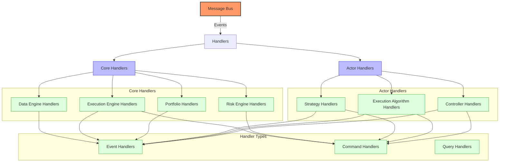
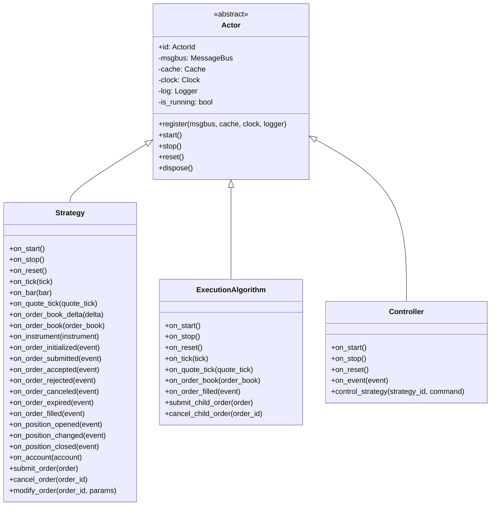
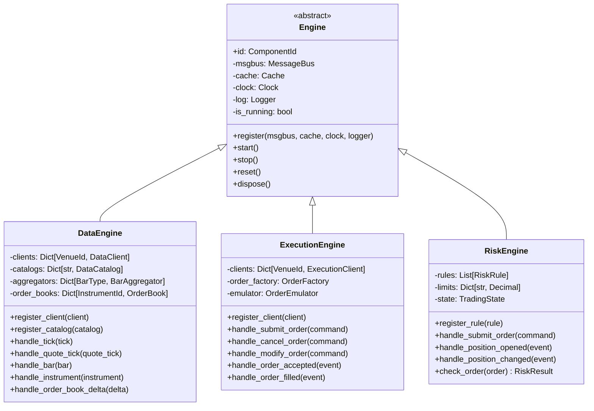
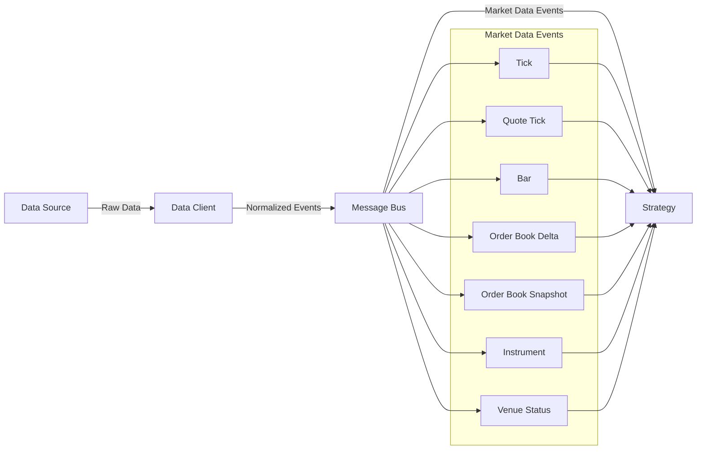
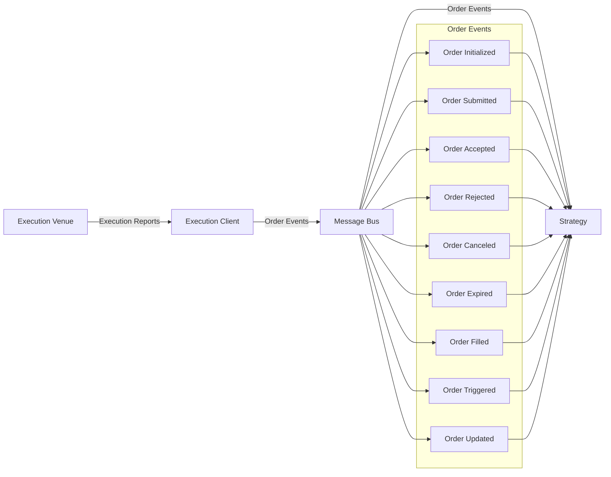
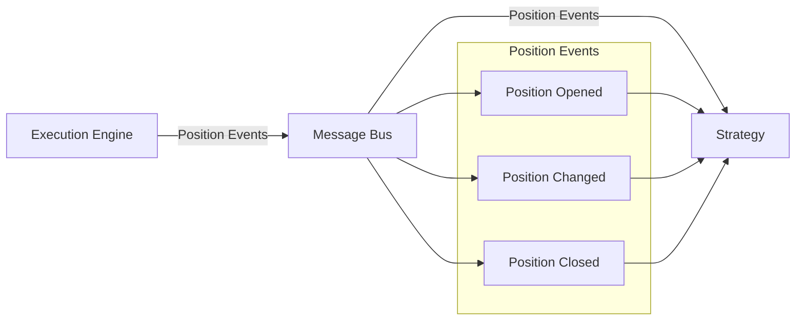
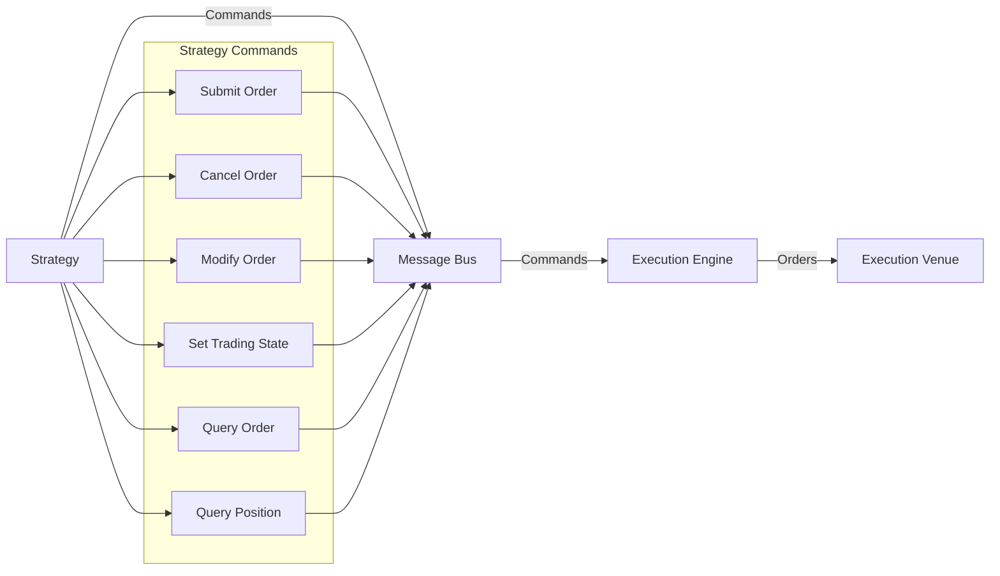
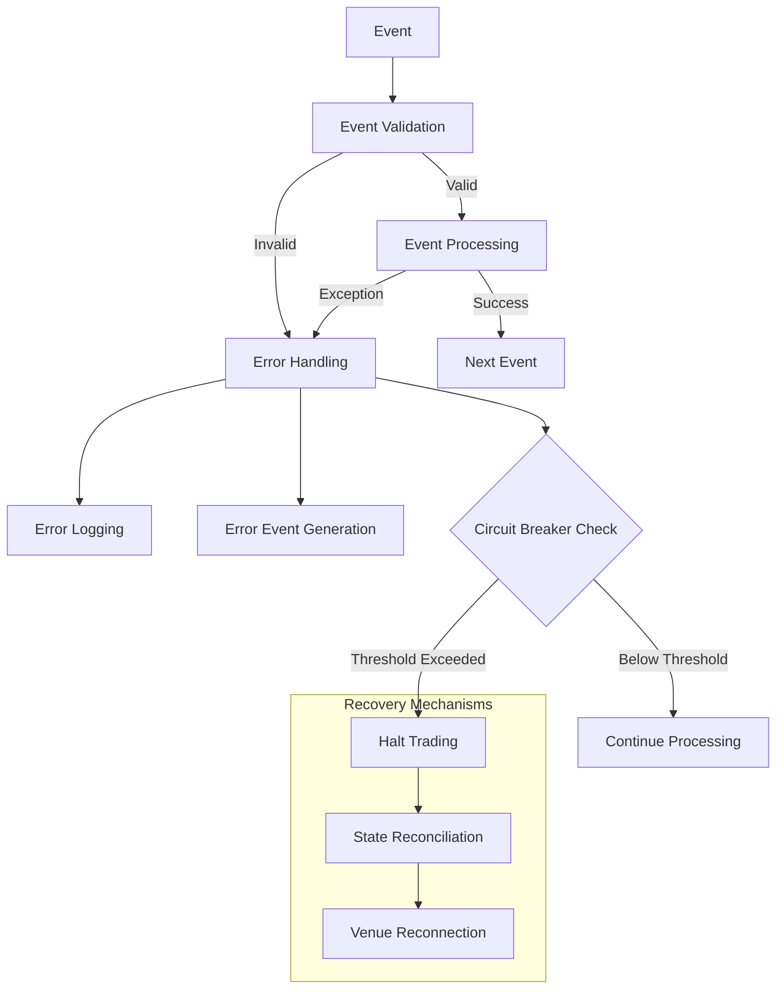
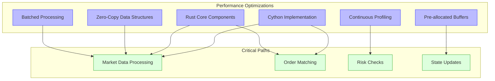

# NautilusTrader Handlers

## Handler Overview

NautilusTrader uses a handler-based architecture where different components handle specific types of events. This document details the handler interfaces, their responsibilities, and how they interact with the rest of the system.



NautilusTrader's handler architecture is designed around a message-based system where components communicate through a central message bus. Handlers are organized into two main categories:

1. **Core Handlers**: Built-in system components that handle fundamental trading operations
2. **Actor Handlers**: User-defined components that implement trading strategies and algorithms

Each handler can process different types of messages:

1. **Events**: Notifications about something that has happened (e.g., market data updates, order fills)
2. **Commands**: Instructions to perform an action (e.g., submit an order, cancel an order)
3. **Queries**: Requests for information (e.g., get current position, get order status)

## Actor Handlers



### Actor Base Class

The `Actor` class is the base class for all components that handle events in NautilusTrader. It provides the foundation for strategies, execution algorithms, and controllers.

```python
class Actor:
    """
    The base class for all actors in the trading system.
    """

    def __init__(self, actor_id: ActorId):
        self.id = actor_id
        self._msgbus = None
        self._cache = None
        self._clock = None
        self._log = None
        self._is_running = False
        self._config = {}
        self._state = {}

    def register(
        self,
        msgbus: MessageBus,
        cache: Cache,
        clock: Clock,
        logger: Logger,
    ):
        """
        Register the actor with the trading system.
        """
        self._msgbus = msgbus
        self._cache = cache
        self._clock = clock
        self._log = logger

    def start(self):
        """
        Start the actor.
        """
        self._is_running = True
        self._log.info(f"Actor {self.id} started")

    def stop(self):
        """
        Stop the actor.
        """
        self._is_running = False
        self._log.info(f"Actor {self.id} stopped")

    def reset(self):
        """
        Reset the actor to its initial state.
        """
        self._state = {}
        self._log.info(f"Actor {self.id} reset")

    def dispose(self):
        """
        Dispose of the actor.
        """
        self._msgbus = None
        self._cache = None
        self._clock = None
        self._log = None
        self._config = {}
        self._state = {}

    def save_state(self) -> Dict[str, Any]:
        """
        Save the actor's state for persistence.
        """
        return self._state.copy()

    def load_state(self, state: Dict[str, Any]) -> None:
        """
        Load the actor's state from persistence.
        """
        self._state = state.copy()
```

The Actor base class provides:

1. **Lifecycle Management**: Methods for starting, stopping, resetting, and disposing of actors
2. **System Integration**: Registration with core system components (message bus, cache, clock, logger)
3. **State Management**: Mechanisms for saving and loading actor state
4. **Configuration**: Support for actor configuration parameters

### Strategy Handler

The `Strategy` class extends `Actor` and provides the interface for implementing trading strategies. It includes a comprehensive set of event handlers and methods for order management.

```python
class Strategy(Actor):
    """
    The base class for all trading strategies.
    """

    def __init__(self, strategy_id: StrategyId):
        super().__init__(actor_id=strategy_id)
        self._instruments = {}
        self._orders = {}
        self._positions = {}
        self._indicators = {}
        self._trading_state = TradingState.ACTIVE

    # Lifecycle handlers

    def on_start(self):
        """
        Actions to be performed when the strategy starts.
        """
        pass

    def on_stop(self):
        """
        Actions to be performed when the strategy stops.
        """
        pass

    def on_reset(self):
        """
        Actions to be performed when the strategy resets.
        """
        pass

    # Market data handlers

    def on_tick(self, tick: Tick):
        """
        Actions to be performed when a tick is received.
        """
        pass

    def on_bar(self, bar: Bar):
        """
        Actions to be performed when a bar is received.
        """
        pass

    def on_quote_tick(self, quote_tick: QuoteTick):
        """
        Actions to be performed when a quote tick is received.
        """
        pass

    def on_order_book_delta(self, delta: OrderBookDelta):
        """
        Actions to be performed when an order book delta is received.
        """
        pass

    def on_order_book(self, order_book: OrderBook):
        """
        Actions to be performed when an order book is received.
        """
        pass

    def on_instrument(self, instrument: Instrument):
        """
        Actions to be performed when an instrument is received.
        """
        pass

    # Order event handlers

    def on_order_initialized(self, event: OrderInitialized):
        """
        Actions to be performed when an order is initialized.
        """
        pass

    def on_order_submitted(self, event: OrderSubmitted):
        """
        Actions to be performed when an order is submitted.
        """
        pass

    def on_order_accepted(self, event: OrderAccepted):
        """
        Actions to be performed when an order is accepted.
        """
        pass

    def on_order_rejected(self, event: OrderRejected):
        """
        Actions to be performed when an order is rejected.
        """
        pass

    def on_order_canceled(self, event: OrderCanceled):
        """
        Actions to be performed when an order is canceled.
        """
        pass

    def on_order_expired(self, event: OrderExpired):
        """
        Actions to be performed when an order is expired.
        """
        pass

    def on_order_filled(self, event: OrderFilled):
        """
        Actions to be performed when an order is filled.
        """
        pass

    # Position event handlers

    def on_position_opened(self, event: PositionOpened):
        """
        Actions to be performed when a position is opened.
        """
        pass

    def on_position_changed(self, event: PositionChanged):
        """
        Actions to be performed when a position is changed.
        """
        pass

    def on_position_closed(self, event: PositionClosed):
        """
        Actions to be performed when a position is closed.
        """
        pass

    # Account event handlers

    def on_account(self, account: Account):
        """
        Actions to be performed when an account update is received.
        """
        pass

    # Order management methods

    def submit_order(self, order: Order) -> None:
        """
        Submit an order to the execution engine.
        """
        self._msgbus.publish(
            SubmitOrder(
                trader_id=self.trader_id,
                strategy_id=self.id,
                order=order,
                command_id=UUID4(),
                ts_init=self._clock.timestamp_ns(),
            )
        )

    def cancel_order(self, order_id: OrderId) -> None:
        """
        Cancel an order.
        """
        self._msgbus.publish(
            CancelOrder(
                trader_id=self.trader_id,
                strategy_id=self.id,
                order_id=order_id,
                command_id=UUID4(),
                ts_init=self._clock.timestamp_ns(),
            )
        )

    def modify_order(self, order_id: OrderId, modify_params: OrderModifyParams) -> None:
        """
        Modify an order.
        """
        self._msgbus.publish(
            ModifyOrder(
                trader_id=self.trader_id,
                strategy_id=self.id,
                order_id=order_id,
                modify_params=modify_params,
                command_id=UUID4(),
                ts_init=self._clock.timestamp_ns(),
            )
        )
```

The Strategy class provides:

1. **Event Handlers**: Methods for handling various market data and trading events
2. **Order Management**: Methods for submitting, canceling, and modifying orders
3. **Position Tracking**: Mechanisms for tracking and managing positions
4. **Indicator Management**: Support for technical indicators and analysis
5. **State Management**: Persistence of strategy state for recovery

### Strategy Implementation Example

```python
class EMACross(Strategy):
    """
    A simple EMA crossover strategy.
    """

    def __init__(
        self,
        strategy_id: StrategyId,
        instrument_id: InstrumentId,
        bar_type: BarType,
        fast_period: int = 10,
        slow_period: int = 20,
        trade_size: Decimal = Decimal("1.0"),
        position_size_limit: Decimal = Decimal("10.0"),
    ):
        super().__init__(strategy_id=strategy_id)
        self.instrument_id = instrument_id
        self.bar_type = bar_type
        self.fast_period = fast_period
        self.slow_period = slow_period
        self.trade_size = trade_size
        self.position_size_limit = position_size_limit

        # Initialize indicators
        self.fast_ema = ExponentialMovingAverage(fast_period)
        self.slow_ema = ExponentialMovingAverage(slow_period)

        # Initialize state
        self._position_id = None
        self._instrument = None
        self._is_crossed_above = False
        self._is_crossed_below = False

    def on_start(self):
        """
        Actions to be performed when the strategy starts.
        """
        # Log strategy parameters
        self._log.info(
            "Strategy starting",
            strategy_id=self.id,
            instrument_id=self.instrument_id,
            bar_type=self.bar_type,
            fast_period=self.fast_period,
            slow_period=self.slow_period,
            trade_size=self.trade_size,
        )

        # Subscribe to instrument data
        self._msgbus.request(
            endpoint="data.instruments",
            data={"venue": self.instrument_id.venue, "symbol": self.instrument_id.symbol},
            callback=self.on_instrument,
        )

        # Subscribe to bar data
        self._msgbus.subscribe(
            topic=f"data.bar.{self.instrument_id}.{self.bar_type}",
            handler=self.on_bar,
        )

        # Subscribe to order events
        self._msgbus.subscribe(
            topic=f"order.filled.{self.id}.*",
            handler=self.on_order_filled,
        )

        # Subscribe to position events
        self._msgbus.subscribe(
            topic=f"position.opened.{self.id}.*",
            handler=self.on_position_opened,
        )
        self._msgbus.subscribe(
            topic=f"position.changed.{self.id}.*",
            handler=self.on_position_changed,
        )
        self._msgbus.subscribe(
            topic=f"position.closed.{self.id}.*",
            handler=self.on_position_closed,
        )

    def on_instrument(self, instrument: Instrument):
        """
        Actions to be performed when an instrument is received.
        """
        self._log.info(
            "Instrument received",
            instrument_id=instrument.id,
            price_precision=instrument.price_precision,
            size_precision=instrument.size_precision,
        )

        self._instrument = instrument

    def on_bar(self, bar: Bar):
        """
        Actions to be performed when a bar is received.
        """
        # Update indicators
        self.fast_ema.update(bar.close.as_double())
        self.slow_ema.update(bar.close.as_double())

        # Log indicator values
        self._log.debug(
            "Indicators updated",
            bar_timestamp=bar.ts_event,
            close_price=bar.close,
            fast_ema=self.fast_ema.value,
            slow_ema=self.slow_ema.value,
        )

        # Check if we have enough data
        if not self.fast_ema.initialized or not self.slow_ema.initialized:
            return

        # Get current position
        position = self._get_position()

        # Check for crossover (fast EMA crosses above slow EMA)
        if self.fast_ema.value > self.slow_ema.value and self.fast_ema.previous <= self.slow_ema.previous:
            self._is_crossed_above = True
            self._is_crossed_below = False

            # Generate buy signal if no position or short position
            if position is None or position.side == PositionSide.SHORT:
                self._log.info(
                    "BUY signal generated",
                    fast_ema=self.fast_ema.value,
                    slow_ema=self.slow_ema.value,
                    bar_timestamp=bar.ts_event,
                )
                self._execute_buy(bar)

        # Check for crossunder (fast EMA crosses below slow EMA)
        elif self.fast_ema.value < self.slow_ema.value and self.fast_ema.previous >= self.slow_ema.previous:
            self._is_crossed_above = False
            self._is_crossed_below = True

            # Generate sell signal if no position or long position
            if position is None or position.side == PositionSide.LONG:
                self._log.info(
                    "SELL signal generated",
                    fast_ema=self.fast_ema.value,
                    slow_ema=self.slow_ema.value,
                    bar_timestamp=bar.ts_event,
                )
                self._execute_sell(bar)

    def _execute_buy(self, bar: Bar):
        """
        Execute a buy order based on the current market conditions.
        """
        if self._instrument is None:
            self._log.warning("Cannot execute buy: instrument not available")
            return

        # Check if we have a position already
        position = self._get_position()

        # Calculate order quantity
        quantity = self._calculate_buy_quantity(position)
        if quantity <= 0:
            self._log.info("Buy quantity is zero or negative, no order generated")
            return

        # Create and submit the order
        order = order_factory.market(
            instrument_id=self.instrument_id,
            order_side=OrderSide.BUY,
            quantity=quantity,
            time_in_force=TimeInForce.GTC,
            position_id=self._position_id,
            tags=["EMA_CROSS"],
        )

        self._log.info(
            "Submitting BUY order",
            order_id=order.id,
            quantity=quantity,
            price=bar.close,
        )

        self.submit_order(order)

    def _execute_sell(self, bar: Bar):
        """
        Execute a sell order based on the current market conditions.
        """
        if self._instrument is None:
            self._log.warning("Cannot execute sell: instrument not available")
            return

        # Check if we have a position already
        position = self._get_position()

        # Calculate order quantity
        quantity = self._calculate_sell_quantity(position)
        if quantity <= 0:
            self._log.info("Sell quantity is zero or negative, no order generated")
            return

        # Create and submit the order
        order = order_factory.market(
            instrument_id=self.instrument_id,
            order_side=OrderSide.SELL,
            quantity=quantity,
            time_in_force=TimeInForce.GTC,
            position_id=self._position_id,
            tags=["EMA_CROSS"],
        )

        self._log.info(
            "Submitting SELL order",
            order_id=order.id,
            quantity=quantity,
            price=bar.close,
        )

        self.submit_order(order)

    def _calculate_buy_quantity(self, position: Optional[Position]) -> Decimal:
        """
        Calculate the quantity to buy based on the current position.
        """
        if position is None:
            # No position, use standard trade size
            return self.trade_size

        if position.side == PositionSide.SHORT:
            # Close short position and potentially open long position
            return min(abs(position.quantity) + self.trade_size, self.position_size_limit)

        # Already long, potentially increase position
        remaining_size = self.position_size_limit - position.quantity
        if remaining_size <= 0:
            return Decimal(0)  # Already at position limit

        return min(self.trade_size, remaining_size)

    def _calculate_sell_quantity(self, position: Optional[Position]) -> Decimal:
        """
        Calculate the quantity to sell based on the current position.
        """
        if position is None:
            # No position, use standard trade size
            return self.trade_size

        if position.side == PositionSide.LONG:
            # Close long position and potentially open short position
            return min(position.quantity + self.trade_size, self.position_size_limit)

        # Already short, potentially increase position
        remaining_size = self.position_size_limit - abs(position.quantity)
        if remaining_size <= 0:
            return Decimal(0)  # Already at position limit

        return min(self.trade_size, remaining_size)

    def _get_position(self) -> Optional[Position]:
        """
        Get the current position for this strategy and instrument.
        """
        if self._position_id is None:
            return None

        return self._cache.position(self._position_id)

    def on_position_opened(self, event: PositionOpened):
        """
        Actions to be performed when a position is opened.
        """
        self._log.info(
            "Position opened",
            position_id=event.position_id,
            instrument_id=event.instrument_id,
            side=event.side,
            quantity=event.quantity,
            price=event.price,
        )

        self._position_id = event.position_id

    def on_position_changed(self, event: PositionChanged):
        """
        Actions to be performed when a position is changed.
        """
        self._log.info(
            "Position changed",
            position_id=event.position_id,
            quantity=event.quantity,
            price=event.price,
        )

    def on_position_closed(self, event: PositionClosed):
        """
        Actions to be performed when a position is closed.
        """
        self._log.info(
            "Position closed",
            position_id=event.position_id,
            instrument_id=event.instrument_id,
            realized_pnl=event.realized_pnl,
        )

        self._position_id = None

    def on_order_filled(self, event: OrderFilled):
        """
        Actions to be performed when an order is filled.
        """
        self._log.info(
            "Order filled",
            order_id=event.order_id,
            instrument_id=event.instrument_id,
            price=event.price,
            quantity=event.quantity,
            commission=event.commission,
        )
```

This example demonstrates a complete implementation of a moving average crossover strategy with:

1. **Initialization**: Setting up strategy parameters and indicators
2. **Event Subscription**: Subscribing to relevant market data and trading events
3. **Signal Generation**: Detecting crossover signals from indicator values
4. **Order Management**: Creating and submitting orders based on signals
5. **Position Management**: Tracking and managing positions
6. **Risk Management**: Limiting position sizes and managing exposure
7. **Logging**: Comprehensive logging for monitoring and debugging

## Engine Handlers



### DataEngine Handlers

The `DataEngine` handles market data events and is responsible for data processing, normalization, and distribution:

```python
class DataEngine(Engine):
    """
    The data engine component for processing and distributing market data.
    """

    def __init__(self, msgbus, cache, clock, logger, config=None):
        super().__init__()
        self._msgbus = msgbus
        self._cache = cache
        self._clock = clock
        self._log = logger
        self._config = config or {}

        # Initialize components
        self._clients = {}  # Dict[VenueId, DataClient]
        self._catalogs = {}  # Dict[str, DataCatalog]
        self._aggregators = {}  # Dict[BarType, BarAggregator]
        self._order_books = {}  # Dict[InstrumentId, OrderBook]
        self._instruments = {}  # Dict[InstrumentId, Instrument]

        # Register handlers
        self._msgbus.subscribe("data.tick.*", self.handle_tick)
        self._msgbus.subscribe("data.quote_tick.*", self.handle_quote_tick)
        self._msgbus.subscribe("data.bar.*", self.handle_bar)
        self._msgbus.subscribe("data.instrument.*", self.handle_instrument)
        self._msgbus.subscribe("data.order_book_delta.*", self.handle_order_book_delta)
        self._msgbus.subscribe("data.order_book.*", self.handle_order_book)

    def register_client(self, client: DataClient) -> None:
        """
        Register a data client with the engine.
        """
        self._clients[client.venue_id] = client
        self._log.info(f"Registered data client for venue {client.venue_id}")

    def register_catalog(self, catalog: DataCatalog, name: str) -> None:
        """
        Register a data catalog with the engine.
        """
        self._catalogs[name] = catalog
        self._log.info(f"Registered data catalog {name}")

    def handle_tick(self, tick: Tick) -> None:
        """
        Handle a tick event.
        """
        # Validate tick
        if not self._validate_tick(tick):
            self._log.warning(
                "Invalid tick received",
                instrument_id=tick.instrument_id,
                price=tick.price,
                size=tick.size,
                ts_event=tick.ts_event,
            )
            return

        # Update cache
        self._cache.add_tick(tick)

        # Update bar aggregators
        for bar_type, aggregator in self._aggregators.items():
            if bar_type.instrument_id == tick.instrument_id:
                aggregator.update_tick(tick)

        # Publish tick to subscribers with specific topic
        self._msgbus.publish(
            topic=f"data.tick.{tick.instrument_id}",
            message=tick,
        )

        # Log tick (debug level)
        self._log.debug(
            "Tick processed",
            instrument_id=tick.instrument_id,
            price=tick.price,
            size=tick.size,
            ts_event=tick.ts_event,
        )

    def handle_quote_tick(self, quote_tick: QuoteTick) -> None:
        """
        Handle a quote tick event.
        """
        # Validate quote tick
        if not self._validate_quote_tick(quote_tick):
            self._log.warning(
                "Invalid quote tick received",
                instrument_id=quote_tick.instrument_id,
                bid_price=quote_tick.bid_price,
                ask_price=quote_tick.ask_price,
                ts_event=quote_tick.ts_event,
            )
            return

        # Update cache
        self._cache.add_quote_tick(quote_tick)

        # Publish quote tick to subscribers with specific topic
        self._msgbus.publish(
            topic=f"data.quote_tick.{quote_tick.instrument_id}",
            message=quote_tick,
        )

        # Log quote tick (debug level)
        self._log.debug(
            "Quote tick processed",
            instrument_id=quote_tick.instrument_id,
            bid_price=quote_tick.bid_price,
            ask_price=quote_tick.ask_price,
            ts_event=quote_tick.ts_event,
        )

    def handle_bar(self, bar: Bar) -> None:
        """
        Handle a bar event.
        """
        # Validate bar
        if not self._validate_bar(bar):
            self._log.warning(
                "Invalid bar received",
                instrument_id=bar.instrument_id,
                bar_type=bar.bar_type,
                open=bar.open,
                high=bar.high,
                low=bar.low,
                close=bar.close,
                volume=bar.volume,
                ts_event=bar.ts_event,
            )
            return

        # Update cache
        self._cache.add_bar(bar)

        # Publish bar to subscribers with specific topic
        self._msgbus.publish(
            topic=f"data.bar.{bar.instrument_id}.{bar.bar_type}",
            message=bar,
        )

        # Log bar (debug level)
        self._log.debug(
            "Bar processed",
            instrument_id=bar.instrument_id,
            bar_type=bar.bar_type,
            close=bar.close,
            volume=bar.volume,
            ts_event=bar.ts_event,
        )

    def handle_instrument(self, instrument: Instrument) -> None:
        """
        Handle an instrument event.
        """
        # Validate instrument
        if not self._validate_instrument(instrument):
            self._log.warning(
                "Invalid instrument received",
                instrument_id=instrument.id,
            )
            return

        # Update cache
        self._cache.add_instrument(instrument)

        # Store locally
        self._instruments[instrument.id] = instrument

        # Publish instrument to subscribers
        self._msgbus.publish(
            topic=f"data.instrument.{instrument.id}",
            message=instrument,
        )

        # Log instrument
        self._log.info(
            "Instrument processed",
            instrument_id=instrument.id,
            symbol=instrument.symbol,
            asset_class=instrument.asset_class,
            asset_type=instrument.asset_type,
        )

    def handle_order_book_delta(self, delta: OrderBookDelta) -> None:
        """
        Handle an order book delta event.
        """
        # Get or create order book
        order_book = self._order_books.get(delta.instrument_id)
        if order_book is None:
            # Create new order book
            order_book = OrderBook(delta.instrument_id)
            self._order_books[delta.instrument_id] = order_book

        # Apply delta to order book
        updated_order_book = order_book.apply_delta(delta)

        # Update local cache
        self._order_books[delta.instrument_id] = updated_order_book

        # Update global cache
        self._cache.update_order_book(updated_order_book)

        # Publish updated order book
        self._msgbus.publish(
            topic=f"data.order_book.{delta.instrument_id}",
            message=updated_order_book,
        )

        # Log order book delta (debug level)
        self._log.debug(
            "Order book delta processed",
            instrument_id=delta.instrument_id,
            action=delta.action,
            price=delta.price,
            size=delta.size,
            ts_event=delta.ts_event,
        )
```

The DataEngine provides:

1. **Data Processing**: Validates and processes market data events
2. **Data Normalization**: Ensures consistent data formats across venues
3. **Data Distribution**: Publishes processed data to subscribers
4. **Bar Aggregation**: Aggregates tick data into time-based or tick-based bars
5. **Order Book Management**: Maintains order books for instruments
6. **Data Persistence**: Stores data in catalogs for later retrieval

### ExecutionEngine Handlers

The `ExecutionEngine` handles order and execution events, managing the complete order lifecycle from submission to execution:

```python
class ExecutionEngine(Engine):
    """
    The execution engine component for order management and execution.
    """

    def __init__(self, msgbus, cache, clock, logger, risk_engine=None, config=None):
        super().__init__()
        self._msgbus = msgbus
        self._cache = cache
        self._clock = clock
        self._log = logger
        self._risk_engine = risk_engine
        self._config = config or {}

        # Initialize components
        self._clients = {}  # Dict[VenueId, ExecutionClient]
        self._order_factory = OrderFactory()
        self._emulator = OrderEmulator()
        self._inflight_orders = {}  # Dict[OrderId, Order]
        self._pending_fills = {}  # Dict[OrderId, List[OrderFilled]]

        # Configure reconciliation
        self._reconciliation_enabled = self._config.get("reconciliation", True)
        self._reconciliation_lookback_mins = self._config.get("reconciliation_lookback_mins", 1440)  # 24 hours
        self._inflight_check_interval_ms = self._config.get("inflight_check_interval_ms", 2000)  # 2 seconds

        # Register handlers
        self._msgbus.subscribe("command.submit_order", self.handle_submit_order)
        self._msgbus.subscribe("command.cancel_order", self.handle_cancel_order)
        self._msgbus.subscribe("command.modify_order", self.handle_modify_order)
        self._msgbus.subscribe("event.order_accepted", self.handle_order_accepted)
        self._msgbus.subscribe("event.order_rejected", self.handle_order_rejected)
        self._msgbus.subscribe("event.order_filled", self.handle_order_filled)
        self._msgbus.subscribe("event.order_canceled", self.handle_order_canceled)
        self._msgbus.subscribe("event.order_expired", self.handle_order_expired)

    def register_client(self, client: ExecutionClient) -> None:
        """
        Register an execution client with the engine.
        """
        self._clients[client.venue_id] = client
        self._log.info(f"Registered execution client for venue {client.venue_id}")

    def handle_submit_order(self, command: SubmitOrder) -> None:
        """
        Handle a submit order command.
        """
        # Extract order from command
        order = command.order

        # Validate order
        if not self._validate_order(order):
            self._log.warning(
                "Invalid order",
                order_id=order.id,
                instrument_id=order.instrument_id,
                side=order.side,
                type=order.type,
                quantity=order.quantity,
            )

            # Create rejection event
            rejection = OrderRejected(
                trader_id=command.trader_id,
                strategy_id=command.strategy_id,
                order_id=order.id,
                client_order_id=order.client_order_id,
                reason="Invalid order parameters",
                ts_init=command.ts_init,
                ts_event=self._clock.timestamp_ns(),
            )

            # Publish rejection
            self._msgbus.publish(rejection)
            return

        # Check with risk engine if available
        if self._risk_engine is not None:
            risk_result = self._risk_engine.check_order(order)
            if not risk_result.is_approved():
                self._log.warning(
                    "Order rejected by risk engine",
                    order_id=order.id,
                    reason=risk_result.reason,
                )

                # Create rejection event
                rejection = OrderRejected(
                    trader_id=command.trader_id,
                    strategy_id=command.strategy_id,
                    order_id=order.id,
                    client_order_id=order.client_order_id,
                    reason=risk_result.reason,
                    ts_init=command.ts_init,
                    ts_event=self._clock.timestamp_ns(),
                )

                # Publish rejection
                self._msgbus.publish(rejection)
                return

        # Initialize order
        order.status = OrderStatus.INITIALIZED

        # Add to cache
        self._cache.add_order(order)

        # Create initialization event
        init_event = OrderInitialized(
            trader_id=command.trader_id,
            strategy_id=command.strategy_id,
            order_id=order.id,
            client_order_id=order.client_order_id,
            instrument_id=order.instrument_id,
            ts_init=command.ts_init,
            ts_event=self._clock.timestamp_ns(),
        )

        # Publish initialization
        self._msgbus.publish(init_event)

        # Check if order should be emulated
        if order.is_emulated:
            self._log.info(
                "Order will be emulated",
                order_id=order.id,
                emulation_trigger=order.emulation_trigger,
            )

            # Add to emulator
            self._emulator.add_order(order)

            # Create submitted event
            submitted_event = OrderSubmitted(
                trader_id=command.trader_id,
                strategy_id=command.strategy_id,
                order_id=order.id,
                client_order_id=order.client_order_id,
                instrument_id=order.instrument_id,
                ts_init=command.ts_init,
                ts_event=self._clock.timestamp_ns(),
            )

            # Publish submitted event
            self._msgbus.publish(submitted_event)
            return

        # Get execution client for venue
        venue_id = order.instrument_id.venue_id
        client = self._clients.get(venue_id)
        if client is None:
            self._log.error(
                "No execution client for venue",
                venue_id=venue_id,
                order_id=order.id,
            )

            # Create rejection event
            rejection = OrderRejected(
                trader_id=command.trader_id,
                strategy_id=command.strategy_id,
                order_id=order.id,
                client_order_id=order.client_order_id,
                reason=f"No execution client for venue {venue_id}",
                ts_init=command.ts_init,
                ts_event=self._clock.timestamp_ns(),
            )

            # Publish rejection
            self._msgbus.publish(rejection)
            return

        # Create submitted event
        submitted_event = OrderSubmitted(
            trader_id=command.trader_id,
            strategy_id=command.strategy_id,
            order_id=order.id,
            client_order_id=order.client_order_id,
            instrument_id=order.instrument_id,
            ts_init=command.ts_init,
            ts_event=self._clock.timestamp_ns(),
        )

        # Publish submitted event
        self._msgbus.publish(submitted_event)

        # Add to inflight orders
        self._inflight_orders[order.id] = order

        # Submit order to venue
        try:
            client.submit_order(order)
            self._log.info(
                "Order submitted to venue",
                order_id=order.id,
                client_order_id=order.client_order_id,
                venue_id=venue_id,
            )
        except Exception as e:
            self._log.error(
                "Error submitting order to venue",
                order_id=order.id,
                venue_id=venue_id,
                error=str(e),
            )

            # Create rejection event
            rejection = OrderRejected(
                trader_id=command.trader_id,
                strategy_id=command.strategy_id,
                order_id=order.id,
                client_order_id=order.client_order_id,
                reason=f"Error submitting order: {e}",
                ts_init=command.ts_init,
                ts_event=self._clock.timestamp_ns(),
            )

            # Publish rejection
            self._msgbus.publish(rejection)

            # Remove from inflight orders
            self._inflight_orders.pop(order.id, None)

    def handle_order_filled(self, event: OrderFilled) -> None:
        """
        Handle an order filled event.
        """
        # Get order from cache
        order = self._cache.order(event.order_id)
        if order is None:
            self._log.warning(
                "Order not found in cache for fill event",
                order_id=event.order_id,
                client_order_id=event.client_order_id,
            )

            # Store fill for later processing
            if event.order_id not in self._pending_fills:
                self._pending_fills[event.order_id] = []
            self._pending_fills[event.order_id].append(event)
            return

        # Apply fill to order
        updated_order = order.apply(event)

        # Update cache
        self._cache.update_order(updated_order)

        # Remove from inflight orders if completely filled
        if updated_order.status == OrderStatus.FILLED:
            self._inflight_orders.pop(updated_order.id, None)

        # Publish fill event with specific topics
        self._msgbus.publish(
            topic=f"order.filled.{event.strategy_id}.{event.instrument_id}",
            message=event,
        )

        # Update position
        self._update_position(updated_order, event)

        # Log fill
        self._log.info(
            "Order filled",
            order_id=event.order_id,
            client_order_id=event.client_order_id,
            instrument_id=event.instrument_id,
            price=event.price,
            quantity=event.quantity,
            commission=event.commission,
            liquidity_side=event.liquidity_side,
        )

    def _update_position(self, order: Order, fill_event: OrderFilled) -> None:
        """
        Update position based on order fill.
        """
        # Determine position ID
        if order.position_id is not None:
            # Use existing position ID
            position_id = order.position_id
        else:
            # Generate position ID from order
            position_id = PositionId.from_order(order)

        # Get position from cache
        position = self._cache.position(position_id)

        # Process fill based on current position
        if position is None:
            # Create new position
            new_position = Position.from_order_filled(
                position_id=position_id,
                order_id=order.id,
                instrument_id=order.instrument_id,
                strategy_id=order.strategy_id,
                side=PositionSide.from_order_side(order.side),
                quantity=fill_event.quantity,
                price=fill_event.price,
                timestamp=fill_event.ts_event,
            )

            # Add to cache
            self._cache.add_position(new_position)

            # Create position opened event
            opened_event = PositionOpened(
                trader_id=order.trader_id,
                strategy_id=order.strategy_id,
                position_id=new_position.id,
                instrument_id=new_position.instrument_id,
                side=new_position.side,
                quantity=new_position.quantity,
                price=new_position.avg_price,
                ts_init=fill_event.ts_init,
                ts_event=fill_event.ts_event,
            )

            # Publish position opened event
            self._msgbus.publish(opened_event)
        else:
            # Update existing position
            updated_position = position.apply(fill_event)

            # Update cache
            self._cache.update_position(updated_position)

            # Create appropriate position event
            if updated_position.is_closed():
                # Position closed
                closed_event = PositionClosed(
                    trader_id=order.trader_id,
                    strategy_id=order.strategy_id,
                    position_id=updated_position.id,
                    instrument_id=updated_position.instrument_id,
                    quantity=updated_position.quantity,
                    price=updated_position.avg_price,
                    realized_pnl=updated_position.realized_pnl,
                    ts_init=fill_event.ts_init,
                    ts_event=fill_event.ts_event,
                )

                # Publish position closed event
                self._msgbus.publish(closed_event)
            else:
                # Position changed
                changed_event = PositionChanged(
                    trader_id=order.trader_id,
                    strategy_id=order.strategy_id,
                    position_id=updated_position.id,
                    instrument_id=updated_position.instrument_id,
                    side=updated_position.side,
                    quantity=updated_position.quantity,
                    price=updated_position.avg_price,
                    ts_init=fill_event.ts_init,
                    ts_event=fill_event.ts_event,
                )

                # Publish position changed event
                self._msgbus.publish(changed_event)
```

The ExecutionEngine provides:

1. **Order Management**: Handles the complete order lifecycle
2. **Order Routing**: Routes orders to appropriate execution venues
3. **Order Emulation**: Emulates advanced order types not supported by venues
4. **Position Tracking**: Maintains position state based on order executions
5. **Reconciliation**: Reconciles local state with exchange state
6. **Error Handling**: Handles order rejections and execution errors

### RiskEngine Handlers

The `RiskEngine` handles risk checks and enforces risk management rules:

```python
class RiskEngine(Engine):
    """
    The risk engine component for enforcing risk management rules.
    """

    def __init__(self, msgbus, cache, clock, logger, config=None):
        super().__init__()
        self._msgbus = msgbus
        self._cache = cache
        self._clock = clock
        self._log = logger
        self._config = config or {}

        # Initialize state
        self._trading_state = TradingState.ACTIVE
        self._rules = []  # List[RiskRule]
        self._limits = {}  # Dict[str, Decimal]
        self._position_limits = {}  # Dict[InstrumentId, Decimal]
        self._notional_limits = {}  # Dict[Currency, Decimal]
        self._drawdown_limits = {}  # Dict[AccountId, Decimal]

        # Configure limits from config
        self._configure_limits()

        # Register handlers
        self._msgbus.subscribe("command.submit_order", self.handle_submit_order)
        self._msgbus.subscribe("event.position_opened", self.handle_position_opened)
        self._msgbus.subscribe("event.position_changed", self.handle_position_changed)
        self._msgbus.subscribe("event.account", self.handle_account)

    def _configure_limits(self) -> None:
        """
        Configure risk limits from config.
        """
        # Set default limits
        self._limits["max_order_size"] = self._config.get("max_order_size", Decimal("1000000"))
        self._limits["max_position_size"] = self._config.get("max_position_size", Decimal("1000000"))
        self._limits["max_notional"] = self._config.get("max_notional", Decimal("1000000"))
        self._limits["max_drawdown_pct"] = self._config.get("max_drawdown_pct", Decimal("10"))  # 10%

        # Set instrument-specific limits
        instrument_limits = self._config.get("instrument_limits", {})
        for instrument_id_str, limits in instrument_limits.items():
            instrument_id = InstrumentId.from_string(instrument_id_str)
            self._position_limits[instrument_id] = Decimal(str(limits.get("max_position_size", 0)))

        # Set currency-specific limits
        currency_limits = self._config.get("currency_limits", {})
        for currency_str, limits in currency_limits.items():
            currency = Currency.from_string(currency_str)
            self._notional_limits[currency] = Decimal(str(limits.get("max_notional", 0)))

        # Set account-specific limits
        account_limits = self._config.get("account_limits", {})
        for account_id_str, limits in account_limits.items():
            account_id = AccountId.from_string(account_id_str)
            self._drawdown_limits[account_id] = Decimal(str(limits.get("max_drawdown_pct", 0)))

    def register_rule(self, rule: RiskRule) -> None:
        """
        Register a risk rule with the engine.
        """
        self._rules.append(rule)
        self._log.info(f"Registered risk rule: {rule.name}")

    def handle_submit_order(self, command: SubmitOrder) -> None:
        """
        Handle a submit order command for pre-trade risk checks.
        """
        # Extract order from command
        order = command.order

        # Check order against risk rules
        result = self.check_order(order)

        # If rejected, create and publish rejection event
        if not result.is_approved():
            self._log.warning(
                "Order rejected by risk engine",
                order_id=order.id,
                reason=result.reason,
            )

            # Create rejection event
            rejection = OrderRejected(
                trader_id=command.trader_id,
                strategy_id=command.strategy_id,
                order_id=order.id,
                client_order_id=order.client_order_id,
                reason=result.reason,
                ts_init=command.ts_init,
                ts_event=self._clock.timestamp_ns(),
            )

            # Publish rejection
            self._msgbus.publish(rejection)
        else:
            # Forward command to execution engine
            self._msgbus.publish(command)

    def check_order(self, order: Order) -> RiskResult:
        """
        Check if an order is allowed based on risk parameters.
        """
        # Check trading state
        if self._trading_state == TradingState.HALTED:
            return RiskResult.rejected("Trading is halted")

        if self._trading_state == TradingState.REDUCING:
            # Check if order reduces position
            position = self._get_position_for_order(order)
            if position is not None and not self._is_reducing_position(order, position):
                return RiskResult.rejected("Only reducing orders are allowed")

        # Check order size
        if not self._check_order_size(order):
            return RiskResult.rejected(f"Order size {order.quantity} exceeds maximum {self._limits['max_order_size']}")

        # Check position size
        if not self._check_position_size(order):
            max_size = self._get_max_position_size(order.instrument_id)
            return RiskResult.rejected(f"Position size would exceed maximum {max_size}")

        # Check notional value
        if not self._check_notional_value(order):
            instrument = self._cache.instrument(order.instrument_id)
            if instrument is not None:
                notional = order.quantity * order.price * instrument.multiplier
                max_notional = self._get_max_notional(instrument.quote_currency)
                return RiskResult.rejected(f"Notional value {notional} exceeds maximum {max_notional}")
            else:
                return RiskResult.rejected("Cannot calculate notional value: instrument not found")

        # Check account balance
        if not self._check_account_balance(order):
            return RiskResult.rejected("Insufficient account balance")

        # Check custom rules
        for rule in self._rules:
            result = rule.check_order(order, self._cache)
            if not result.is_approved():
                return result

        # All checks passed
        return RiskResult.approved()

    def _check_order_size(self, order: Order) -> bool:
        """
        Check if an order size is within limits.
        """
        # Get instrument-specific limit if available
        instrument_limit = self._position_limits.get(order.instrument_id)
        if instrument_limit is not None and instrument_limit > 0:
            return abs(order.quantity) <= instrument_limit

        # Fall back to global limit
        return abs(order.quantity) <= self._limits["max_order_size"]

    def _check_position_size(self, order: Order) -> bool:
        """
        Check if a position size would be within limits.
        """
        # Get current position
        position = self._get_position_for_order(order)
        if position is None:
            # No existing position, just check order size
            return self._check_order_size(order)

        # Calculate new position size
        new_size = self._calculate_new_position_size(position, order)

        # Get max position size
        max_size = self._get_max_position_size(order.instrument_id)

        # Check if new size is within limits
        return abs(new_size) <= max_size

    def _check_notional_value(self, order: Order) -> bool:
        """
        Check if an order's notional value is within limits.
        """
        # Get instrument
        instrument = self._cache.instrument(order.instrument_id)
        if instrument is None:
            # Cannot calculate notional without instrument
            return False

        # Calculate notional value
        price = order.price if order.price is not None else self._get_last_price(order.instrument_id)
        if price is None:
            # Cannot calculate notional without price
            return False

        notional = abs(order.quantity) * price * instrument.multiplier

        # Get max notional
        max_notional = self._get_max_notional(instrument.quote_currency)

        # Check if notional is within limits
        return notional <= max_notional

    def _check_account_balance(self, order: Order) -> bool:
        """
        Check if an account has sufficient balance for an order.
        """
        # Get instrument
        instrument = self._cache.instrument(order.instrument_id)
        if instrument is None:
            # Cannot calculate margin without instrument
            return False

        # Get account
        account = self._get_account_for_order(order)
        if account is None:
            # Cannot check balance without account
            return False

        # Calculate required margin
        price = order.price if order.price is not None else self._get_last_price(order.instrument_id)
        if price is None:
            # Cannot calculate margin without price
            return False

        # Calculate based on account type
        if account.account_type == AccountType.CASH:
            # Cash account: check if enough cash for full purchase
            if order.side == OrderSide.BUY:
                cost = abs(order.quantity) * price * instrument.multiplier
                return account.balances.get(instrument.quote_currency, Money.zero()) >= cost
            else:
                # For sell orders, check if enough position to sell
                position = self._get_position_for_order(order)
                return position is not None and position.quantity >= abs(order.quantity)
        elif account.account_type == AccountType.MARGIN:
            # Margin account: check if enough margin available
            margin_req = self._calculate_margin_requirement(order, instrument, price)
            return account.balances.get(instrument.quote_currency, Money.zero()) >= margin_req

        # Unknown account type
        return False
```

The RiskEngine provides:

1. **Pre-Trade Risk Checks**: Validates orders before submission
2. **Position Limits**: Enforces maximum position sizes
3. **Notional Value Limits**: Restricts the notional value of orders
4. **Account Balance Checks**: Ensures sufficient funds for orders
5. **Custom Risk Rules**: Supports pluggable custom risk rules
6. **Trading State Management**: Controls the overall trading state (active, halted, reducing)

## Input/Output Specifications

### Market Data Input



Market data events come from external sources (exchanges, historical data) and include:

- **Tick**: A price tick representing the latest trade with nanosecond timestamp
  ```python
  class Tick:
      instrument_id: InstrumentId
      price: Price
      size: Quantity
      aggressor_side: AggressorSide  # BUY or SELL
      trade_id: str
      ts_event: uint64_t  # Nanosecond timestamp
  ```

- **QuoteTick**: Latest bid and ask prices and sizes with nanosecond timestamp
  ```python
  class QuoteTick:
      instrument_id: InstrumentId
      bid_price: Price
      ask_price: Price
      bid_size: Quantity
      ask_size: Quantity
      ts_event: uint64_t  # Nanosecond timestamp
  ```

- **Bar**: OHLCV data for a specific time period or tick count
  ```python
  class Bar:
      bar_type: BarType  # Includes instrument_id, bar_spec
      open: Price
      high: Price
      low: Price
      close: Price
      volume: Quantity
      ts_event: uint64_t  # Nanosecond timestamp
  ```

- **OrderBookDelta**: Incremental update to an order book
  ```python
  class OrderBookDelta:
      instrument_id: InstrumentId
      action: OrderBookAction  # ADD, UPDATE, DELETE
      side: OrderSide  # BUY or SELL
      price: Price
      size: Quantity
      order_id: str
      ts_event: uint64_t  # Nanosecond timestamp
  ```

- **OrderBookSnapshot**: Complete snapshot of an order book
  ```python
  class OrderBookSnapshot:
      instrument_id: InstrumentId
      bids: List[PriceLevel]  # Sorted by price (descending)
      asks: List[PriceLevel]  # Sorted by price (ascending)
      ts_event: uint64_t  # Nanosecond timestamp
  ```

- **Instrument**: Detailed instrument specifications
  ```python
  class Instrument:
      id: InstrumentId
      symbol: str
      asset_class: AssetClass
      asset_type: AssetType
      quote_currency: Currency
      price_precision: int
      size_precision: int
      # Other specifications...
  ```

### Order Events



Order events represent the lifecycle of an order:

- **OrderInitialized**: An order has been initialized in the system
  ```python
  class OrderInitialized:
      trader_id: TraderId
      strategy_id: StrategyId
      order_id: OrderId
      client_order_id: ClientOrderId
      instrument_id: InstrumentId
      ts_init: uint64_t
      ts_event: uint64_t
  ```

- **OrderSubmitted**: An order has been submitted to the exchange
  ```python
  class OrderSubmitted:
      trader_id: TraderId
      strategy_id: StrategyId
      order_id: OrderId
      client_order_id: ClientOrderId
      instrument_id: InstrumentId
      ts_init: uint64_t
      ts_event: uint64_t
  ```

- **OrderAccepted**: An order has been accepted by the exchange
  ```python
  class OrderAccepted:
      trader_id: TraderId
      strategy_id: StrategyId
      order_id: OrderId
      client_order_id: ClientOrderId
      instrument_id: InstrumentId
      venue_order_id: str
      ts_init: uint64_t
      ts_event: uint64_t
  ```

- **OrderFilled**: An order has been filled (partially or completely)
  ```python
  class OrderFilled:
      trader_id: TraderId
      strategy_id: StrategyId
      order_id: OrderId
      client_order_id: ClientOrderId
      instrument_id: InstrumentId
      venue_order_id: str
      venue_position_id: str
      trade_id: str
      price: Price
      quantity: Quantity
      commission: Money
      liquidity_side: LiquiditySide
      ts_init: uint64_t
      ts_event: uint64_t
  ```

### Position Events



Position events represent changes to positions:

- **PositionOpened**: A new position has been opened
  ```python
  class PositionOpened:
      trader_id: TraderId
      strategy_id: StrategyId
      position_id: PositionId
      instrument_id: InstrumentId
      side: PositionSide
      quantity: Quantity
      price: Price
      ts_init: uint64_t
      ts_event: uint64_t
  ```

- **PositionChanged**: An existing position has changed
  ```python
  class PositionChanged:
      trader_id: TraderId
      strategy_id: StrategyId
      position_id: PositionId
      instrument_id: InstrumentId
      side: PositionSide
      quantity: Quantity
      price: Price
      ts_init: uint64_t
      ts_event: uint64_t
  ```

- **PositionClosed**: A position has been closed
  ```python
  class PositionClosed:
      trader_id: TraderId
      strategy_id: StrategyId
      position_id: PositionId
      instrument_id: InstrumentId
      quantity: Quantity
      price: Price
      realized_pnl: Money
      ts_init: uint64_t
      ts_event: uint64_t
  ```

### Commands



Commands are instructions to perform actions:

- **SubmitOrder**: Submit an order to the exchange
  ```python
  class SubmitOrder:
      trader_id: TraderId
      strategy_id: StrategyId
      order: Order
      command_id: UUID4
      ts_init: uint64_t
  ```

- **CancelOrder**: Cancel an existing order
  ```python
  class CancelOrder:
      trader_id: TraderId
      strategy_id: StrategyId
      order_id: OrderId
      venue_order_id: str
      command_id: UUID4
      ts_init: uint64_t
  ```

- **ModifyOrder**: Modify an existing order
  ```python
  class ModifyOrder:
      trader_id: TraderId
      strategy_id: StrategyId
      order_id: OrderId
      venue_order_id: str
      modify_params: OrderModifyParams
      command_id: UUID4
      ts_init: uint64_t
  ```

- **QueryOrder**: Query information about an order
  ```python
  class QueryOrder:
      trader_id: TraderId
      strategy_id: StrategyId
      order_id: OrderId
      command_id: UUID4
      ts_init: uint64_t
  ```

## Error Handling Strategies



NautilusTrader implements comprehensive error handling strategies:

1. **Exception Handling**: All handlers catch and handle exceptions with specific error types
2. **Structured Logging**: Errors are logged with detailed context information for diagnosis
3. **Event Publishing**: Error events are published to the message bus for monitoring and alerting
4. **Graceful Degradation**: Components attempt to continue operation when possible
5. **Circuit Breakers**: Automatic circuit breakers halt trading when error rates exceed thresholds
6. **State Reconciliation**: Automatic reconciliation with venues after errors or disconnections
7. **Crash Recovery**: System can recover from crashes and resume operation with minimal data loss

### Error Handling Implementation

```python
def handle_tick(self, tick: Tick) -> None:
    """
    Handle a tick event.
    """
    try:
        # Validate tick
        if not self._validate_tick(tick):
            self._log.warning(
                "Invalid tick received",
                instrument_id=tick.instrument_id,
                price=tick.price,
                size=tick.size,
                ts_event=tick.ts_event,
            )
            return

        # Process tick
        # ...
    except ValidationError as e:
        # Log validation error
        self._log.warning(
            "Tick validation error",
            instrument_id=tick.instrument_id,
            error=str(e),
            severity="WARNING",
        )
    except ConnectionError as e:
        # Log connection error
        self._log.error(
            "Connection error processing tick",
            instrument_id=tick.instrument_id,
            error=str(e),
            severity="ERROR",
        )

        # Trigger reconnection
        self._trigger_reconnection()
    except Exception as e:
        # Log unexpected error
        self._log.exception(
            "Unexpected error processing tick",
            instrument_id=tick.instrument_id,
            error=str(e),
            severity="ERROR",
        )

        # Create error event with detailed context
        error_event = ComponentError(
            component_id=self.id,
            event_id=tick.id,
            error_type=type(e).__name__,
            error_message=str(e),
            stack_trace=traceback.format_exc(),
            timestamp_ns=self._clock.timestamp_ns(),
        )

        # Publish error event
        self._msgbus.publish(error_event)

        # Update error metrics
        self._metrics.increment_error_count(type(e).__name__)

        # Check if circuit breaker should be triggered
        self._error_count += 1
        if self._error_count > self._max_errors:
            self._trigger_circuit_breaker()
            self._log.warning(
                "Circuit breaker triggered",
                component=self.id,
                error_count=self._error_count,
                max_errors=self._max_errors,
            )
```

### Recovery Procedures

NautilusTrader implements several recovery procedures for handling errors:

1. **Automatic Reconnection**: Clients automatically attempt to reconnect to venues after connection loss
2. **Order State Reconciliation**: The system reconciles local order state with venue state after reconnection
3. **Position Reconciliation**: Positions are reconciled with venue positions to ensure consistency
4. **Event Replay**: Critical events can be replayed to recover state after a crash
5. **Checkpoint Recovery**: State can be recovered from checkpoints stored in the database
```

## Performance Considerations



NautilusTrader's handlers are designed for ultra-low latency performance:

1. **Cython Implementation**: Performance-critical handlers are implemented in Cython for near-C performance
2. **Rust Core Components**: Core components are implemented in Rust for maximum performance and safety
3. **Zero-Copy Data Structures**: Data structures are designed to minimize copying and memory allocations
4. **Pre-allocated Buffers**: Memory is pre-allocated for high-frequency operations
5. **Batched Processing**: Events can be processed in batches for improved throughput
6. **Single-Threaded Event Loop**: Core event processing occurs on a single thread to avoid synchronization overhead
7. **Lock-Free Algorithms**: Lock-free algorithms are used where possible to minimize contention
8. **Continuous Profiling**: Critical paths are continuously profiled and optimized

### Performance Optimization Example

```python
# Cython implementation of a critical handler
cdef class OrderBookHandler:
    """
    Cython implementation of an order book handler for maximum performance.
    """

    cdef:
        dict _order_books      # Pre-allocated dictionary for order books
        object _msgbus         # Message bus reference
        object _cache          # Cache reference
        object _log            # Logger reference
        uint64_t[:] _timestamps  # Pre-allocated buffer for timestamps
        double[:] _prices      # Pre-allocated buffer for prices
        double[:] _sizes       # Pre-allocated buffer for sizes
        int _buffer_size       # Size of pre-allocated buffers
        int _buffer_position   # Current position in buffers

    def __init__(self, msgbus, cache, logger, buffer_size=1000):
        self._order_books = {}
        self._msgbus = msgbus
        self._cache = cache
        self._log = logger

        # Pre-allocate buffers for high-frequency operations
        self._buffer_size = buffer_size
        self._buffer_position = 0
        self._timestamps = np.zeros(buffer_size, dtype=np.uint64)
        self._prices = np.zeros(buffer_size, dtype=np.float64)
        self._sizes = np.zeros(buffer_size, dtype=np.float64)

    @cython.boundscheck(False)  # Disable bounds checking for performance
    @cython.wraparound(False)   # Disable negative indexing for performance
    cpdef void handle_order_book_delta(self, OrderBookDelta delta) nogil:
        """
        Handle an order book delta event.
        """
        # Get order book
        cdef OrderBook order_book = self._order_books.get(delta.instrument_id)
        if order_book is None:
            # Create new order book
            order_book = OrderBook(delta.instrument_id)
            self._order_books[delta.instrument_id] = order_book

        # Apply delta
        order_book.apply_delta(delta)

        # Update cache
        self._cache.update_order_book(order_book)

        # Publish update
        self._msgbus.publish(
            topic=f"data.order_book.{delta.instrument_id}",
            message=order_book,
        )
```

## Edge Cases and Their Handling

NautilusTrader's handlers are designed to handle various edge cases:

1. **Partial Fills**: Orders may be partially filled, requiring special handling
2. **Order Rejections**: Exchanges may reject orders for various reasons
3. **Connection Loss**: Connections to exchanges may be lost temporarily
4. **Invalid Data**: Market data may contain errors or inconsistencies
5. **Race Conditions**: Events may arrive out of order

### Edge Case Handling Example

```python
def _handle_order_filled(self, event: OrderFilled):
    """
    Handle an order filled event.
    """
    # Get order
    order = self._cache.order(event.order_id)
    if order is None:
        # Order not found, could be a race condition
        self._log.warning(f"Order {event.order_id} not found in cache, caching fill event")
        self._pending_fills[event.order_id] = event
        return

    # Check if fill quantity is valid
    remaining_qty = order.quantity - order.filled_qty
    if event.fill_qty > remaining_qty:
        self._log.warning(
            f"Fill quantity {event.fill_qty} exceeds remaining quantity {remaining_qty} "
            f"for order {order.id}, adjusting fill quantity"
        )
        event.fill_qty = remaining_qty

    # Apply fill to order
    order.apply_fill(event)

    # Update cache
    self._cache.update_order(order)

    # Update position
    self._update_position(order, event)

    # Check if order is complete
    if order.is_filled():
        self._log.info(f"Order {order.id} is completely filled")
    elif order.is_partially_filled():
        self._log.info(f"Order {order.id} is partially filled ({order.filled_qty}/{order.quantity})")

    # Publish fill event
    self._msgbus.publish(event)
```

These handlers form the core of NautilusTrader's event processing system, enabling efficient and robust trading operations.
