# NautilusTrader State Management

## State Model Overview

NautilusTrader implements a comprehensive state management system that maintains the current state of orders, positions, accounts, and other critical components. The state model is designed to be consistent, thread-safe, and easily accessible.

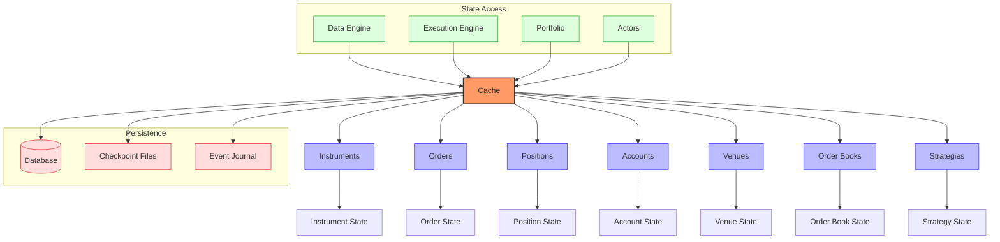

The state management system in NautilusTrader is built around a central `Cache` component that provides fast, thread-safe access to all trading-related state. The system follows an event-sourced architecture where state is derived from events, ensuring consistency and traceability.

## Core State Components

### Cache

The `Cache` is the central state repository that holds all trading-related state with O(1) constant-time lookups:

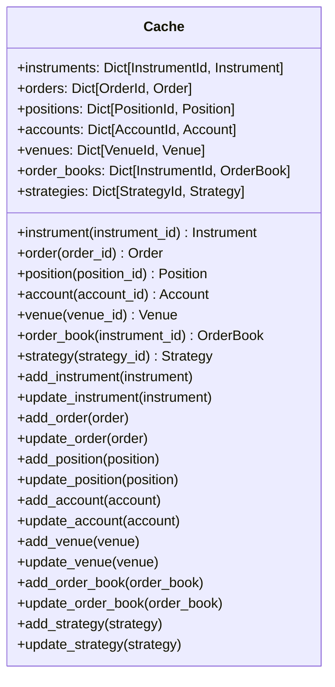

The `Cache` provides a comprehensive API for accessing and updating state:

```python
class Cache:
    """
    Provides a thread-safe in-memory cache for the trading system.
    """

    def __init__(self):
        # Core state collections
        self._instruments = {}      # Dict[InstrumentId, Instrument]
        self._orders = {}           # Dict[OrderId, Order]
        self._positions = {}        # Dict[PositionId, Position]
        self._accounts = {}         # Dict[AccountId, Account]
        self._venues = {}           # Dict[VenueId, Venue]
        self._order_books = {}      # Dict[InstrumentId, OrderBook]
        self._strategies = {}       # Dict[StrategyId, Strategy]

        # Index collections for efficient lookups
        self._orders_by_instrument = defaultdict(set)  # Dict[InstrumentId, Set[OrderId]]
        self._orders_by_strategy = defaultdict(set)    # Dict[StrategyId, Set[OrderId]]
        self._positions_by_instrument = defaultdict(set)  # Dict[InstrumentId, Set[PositionId]]
        self._positions_by_strategy = defaultdict(set)    # Dict[StrategyId, Set[PositionId]]

        # Locks for thread safety
        self._instruments_lock = RLock()
        self._orders_lock = RLock()
        self._positions_lock = RLock()
        self._accounts_lock = RLock()
        # Other locks...
```

### Cache Features

1. **Thread Safety**: All cache operations are thread-safe with fine-grained locking
2. **O(1) Lookups**: Constant-time lookups for all state objects
3. **Indexing**: Multiple indices for efficient querying by different criteria
4. **Atomic Updates**: State updates are atomic and consistent
5. **Event Sourcing**: State is derived from events, ensuring traceability
6. **Persistence**: State can be persisted to disk or database
7. **Snapshots**: Support for creating and restoring state snapshots
8. **Querying**: Rich query API for filtering and aggregating state

### Instrument State

Each instrument has its associated state with comprehensive specifications:

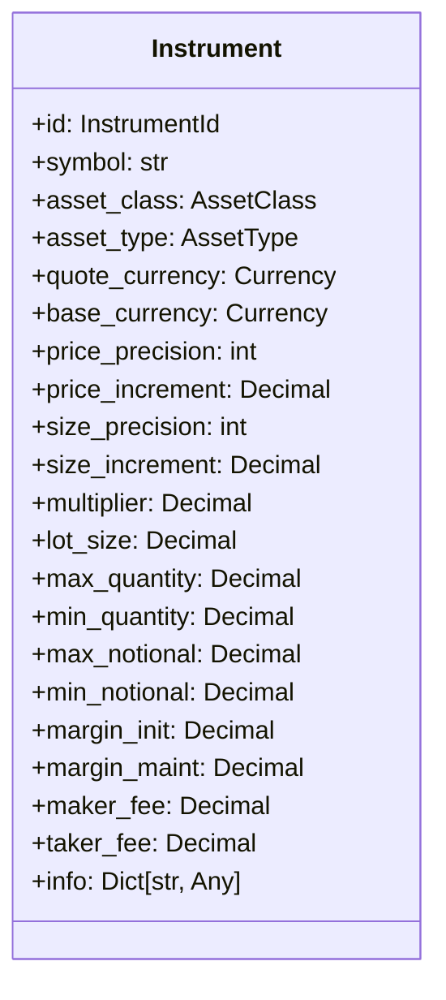

```python
class Instrument:
    """
    Represents a tradable instrument with comprehensive specifications.
    """

    def __init__(
        self,
        instrument_id: InstrumentId,
        symbol: str,
        asset_class: AssetClass,
        asset_type: AssetType,
        quote_currency: Currency,
        base_currency: Currency = None,
        price_precision: int = None,
        price_increment: Decimal = None,
        size_precision: int = None,
        size_increment: Decimal = None,
        multiplier: Decimal = Decimal(1),
        lot_size: Decimal = Decimal(1),
        max_quantity: Decimal = None,
        min_quantity: Decimal = None,
        max_notional: Decimal = None,
        min_notional: Decimal = None,
        margin_init: Decimal = None,
        margin_maint: Decimal = None,
        maker_fee: Decimal = None,
        taker_fee: Decimal = None,
        info: Dict[str, Any] = None,
    ):
        # Initialize attributes
        # ...
```

### Order State

Orders have a comprehensive state model that tracks their complete lifecycle:

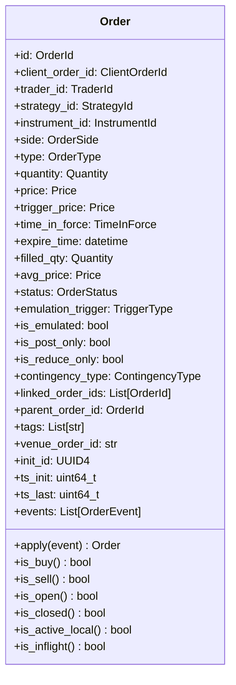

```python
class Order:
    """
    Represents an order in the trading system with comprehensive state tracking.
    """

    def __init__(
        self,
        order_id: OrderId,
        client_order_id: ClientOrderId,
        trader_id: TraderId,
        strategy_id: StrategyId,
        instrument_id: InstrumentId,
        order_side: OrderSide,
        order_type: OrderType,
        quantity: Quantity,
        price: Price = None,
        trigger_price: Price = None,
        time_in_force: TimeInForce = TimeInForce.GTC,
        expire_time: datetime = None,
        init_id: UUID4 = None,
        ts_init: uint64_t = 0,
        # Other parameters...
    ):
        # Initialize attributes
        # ...

    def apply(self, event: OrderEvent) -> Order:
        """
        Apply an order event to this order, returning a new updated order.
        """
        # Create a copy of this order
        updated = copy(self)

        # Apply the event based on its type
        if isinstance(event, OrderSubmitted):
            updated.status = OrderStatus.SUBMITTED
            updated.ts_last = event.ts_event
        elif isinstance(event, OrderAccepted):
            updated.status = OrderStatus.ACCEPTED
            updated.venue_order_id = event.venue_order_id
            updated.ts_last = event.ts_event
        # Handle other event types...

        # Add event to history
        updated.events.append(event)

        return updated
```

### Position State

Positions track holdings with comprehensive performance metrics:

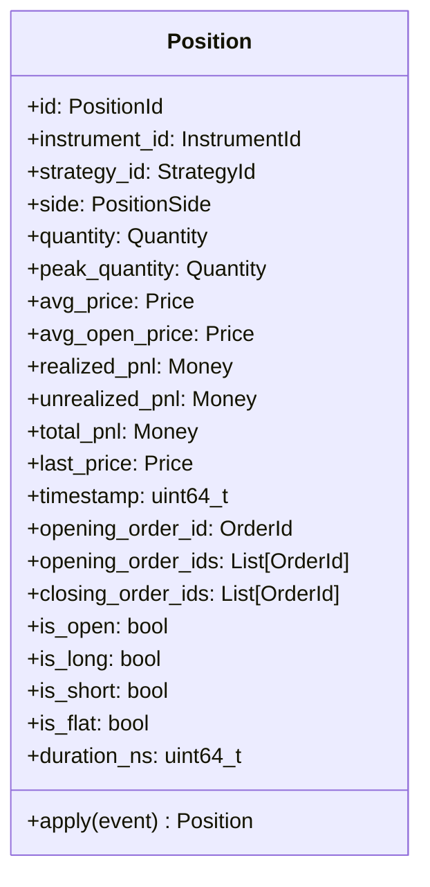

```python
class Position:
    """
    Represents a position in the trading system with comprehensive metrics.
    """

    def __init__(
        self,
        position_id: PositionId,
        instrument_id: InstrumentId,
        strategy_id: StrategyId,
        side: PositionSide,
        quantity: Quantity,
        avg_price: Price,
        # Other parameters...
    ):
        self.id = position_id
        self.instrument_id = instrument_id
        self.strategy_id = strategy_id
        self.side = side
        self.quantity = quantity
        self.peak_quantity = quantity  # Track maximum position size
        self.avg_price = avg_price
        self.avg_open_price = avg_price
        self.realized_pnl = Money.zero()
        self.unrealized_pnl = Money.zero()
        self.last_price = None
        self.timestamp = 0
        self.opening_order_id = None
        self.opening_order_ids = []
        self.closing_order_ids = []
        # Other attributes...

    def apply(self, event: PositionEvent) -> Position:
        """
        Apply a position event to this position, returning a new updated position.
        """
        # Create a copy of this position
        updated = copy(self)

        # Apply the event based on its type
        if isinstance(event, PositionChanged):
            updated.quantity = event.quantity
            updated.avg_price = event.avg_price
            updated.timestamp = event.ts_event
            # Update peak quantity if needed
            if abs(event.quantity) > abs(updated.peak_quantity):
                updated.peak_quantity = event.quantity
        # Handle other event types...

        return updated
```

### Account State

Accounts track balances, margins, and other account-related information:

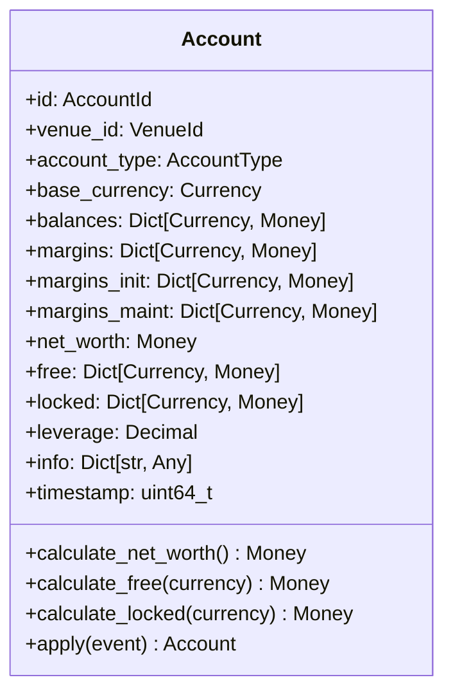

```python
class Account:
    """
    Represents a trading account with comprehensive balance and margin tracking.
    """

    def __init__(
        self,
        account_id: AccountId,
        venue_id: VenueId,
        account_type: AccountType,
        base_currency: Currency,
        balances: Dict[Currency, Money] = None,
        margins: Dict[Currency, Money] = None,
        # Other parameters...
    ):
        self.id = account_id
        self.venue_id = venue_id
        self.account_type = account_type
        self.base_currency = base_currency
        self.balances = balances or {}
        self.margins = margins or {}
        self.margins_init = {}
        self.margins_maint = {}
        self.free = {}
        self.locked = {}
        self.leverage = Decimal(1)
        self.info = {}
        self.timestamp = 0
        # Other attributes...

    def apply(self, event: AccountEvent) -> Account:
        """
        Apply an account event to this account, returning a new updated account.
        """
        # Create a copy of this account
        updated = copy(self)

        # Apply the event based on its type
        if isinstance(event, BalanceUpdate):
            updated.balances[event.currency] = event.balance
            updated.timestamp = event.ts_event
        elif isinstance(event, MarginUpdate):
            updated.margins[event.currency] = event.margin
            updated.timestamp = event.ts_event
        # Handle other event types...

        return updated
```

### Order Book State

Order books track the current market depth for instruments:

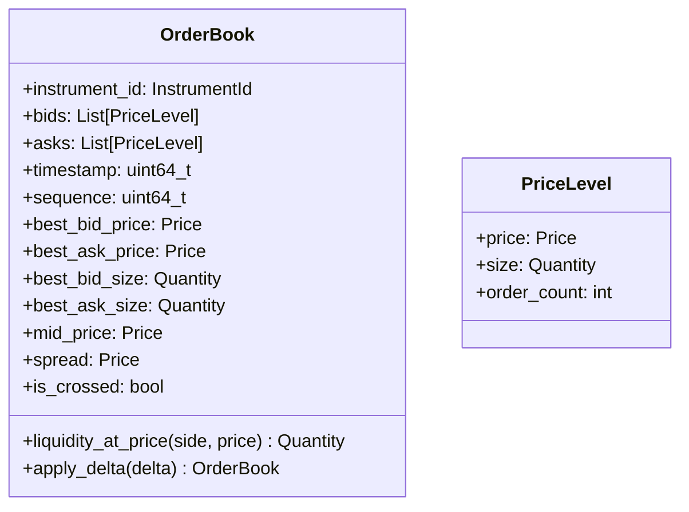

## State Transitions and Triggers

### Order State Transitions

Orders go through a well-defined lifecycle represented by the `OrderStatus` enum:

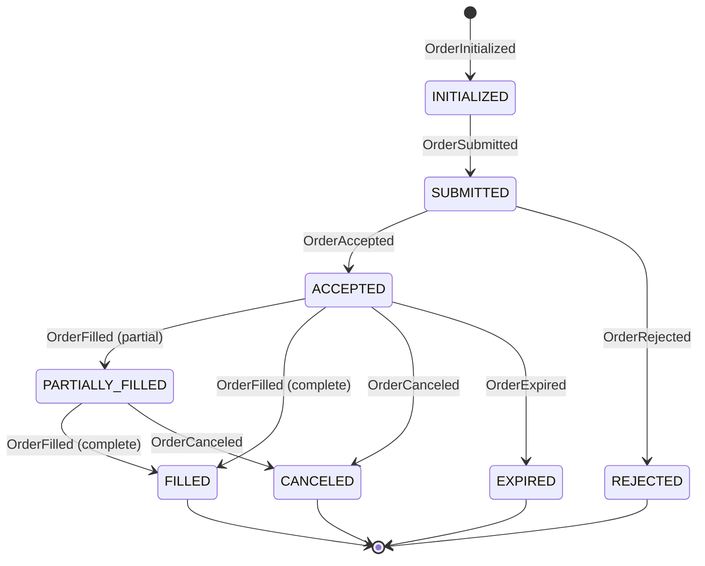

```python
class OrderStatus(Enum):
    """
    Represents the status of an order.
    """
    INITIALIZED = 0      # Order has been initialized in the system
    SUBMITTED = 1        # Order has been submitted to the exchange
    ACCEPTED = 2         # Order has been accepted by the exchange
    PARTIALLY_FILLED = 3  # Order has been partially filled
    FILLED = 4           # Order has been completely filled
    CANCELED = 5         # Order has been canceled
    REJECTED = 6         # Order has been rejected by the exchange
    EXPIRED = 7          # Order has expired
    PENDING_UPDATE = 8   # Order update has been requested
    PENDING_CANCEL = 9   # Order cancellation has been requested
    TRIGGERED = 10       # Conditional order has been triggered
```

Transitions between these states are triggered by order events, each carrying specific information:

- **OrderInitialized**: Initial order creation with core order parameters
- **OrderSubmitted**: Order has been sent to the venue with client_order_id
- **OrderAccepted**: Venue has accepted the order and assigned venue_order_id
- **OrderRejected**: Venue has rejected the order with a specific reason
- **OrderCanceled**: Order has been canceled (by request or by venue)
- **OrderExpired**: Order has expired due to time in force constraints
- **OrderFilled**: Order has been filled with specific fill price and quantity
- **OrderPendingUpdate**: Order update has been requested but not yet confirmed
- **OrderPendingCancel**: Order cancellation has been requested but not yet confirmed
- **OrderUpdated**: Order has been updated with new parameters
- **OrderTriggered**: Conditional order has been triggered

### Position State Transitions

Positions follow a lifecycle with well-defined state transitions:

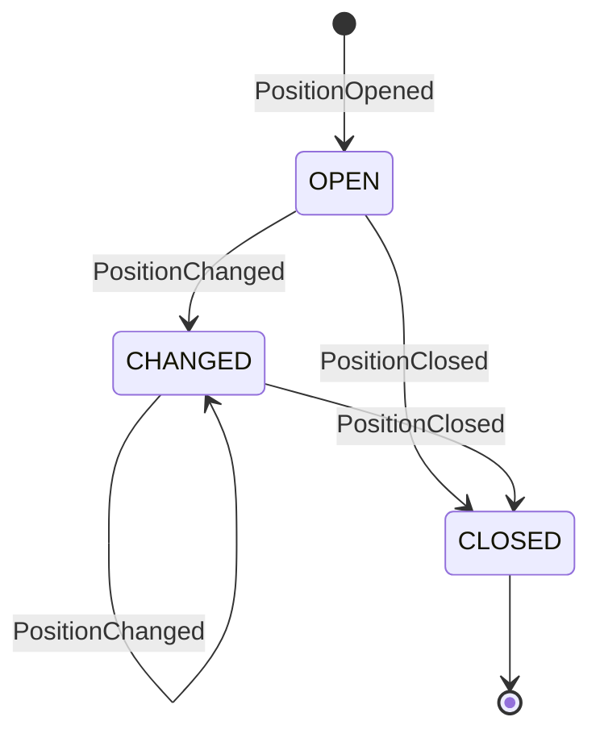

Position state transitions are triggered by these events:

- **PositionOpened**: A new position has been opened with initial quantity and price
- **PositionChanged**: Position quantity, price, or PnL has been updated
- **PositionClosed**: Position quantity has become zero

Each position event carries detailed information about the position state, including:
- Current quantity and side
- Average entry price
- Realized and unrealized PnL
- Last price used for valuation
- Opening and closing order IDs

### Trading State Transitions

The trading system as a whole has a state represented by the `TradingState` enum:

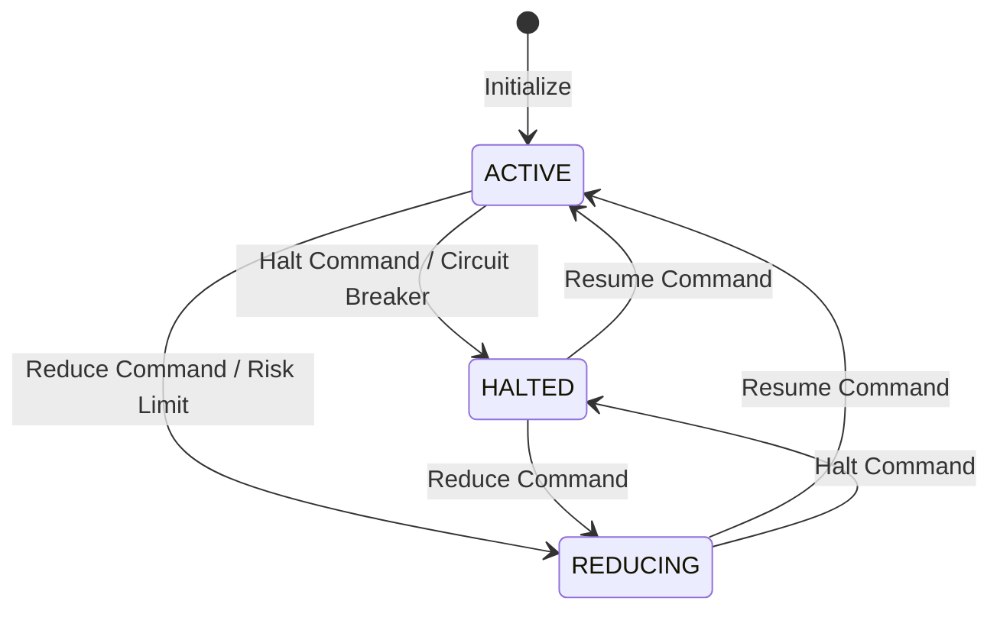

```python
class TradingState(Enum):
    """
    Represents the trading state of the system.
    """
    ACTIVE = 1     # Normal trading operations
    HALTED = 2     # Trading is completely halted
    REDUCING = 3   # Only reducing positions is allowed
```

Transitions between these states are triggered by:
- **Command Events**: Explicit commands to change the trading state
- **Risk Management Decisions**: Automatic state changes based on risk limits
- **Circuit Breakers**: Automatic halting based on error rates or market conditions
- **System Events**: State changes due to system conditions (e.g., disconnection)

### Venue Connection State

Venue connections also have state transitions:

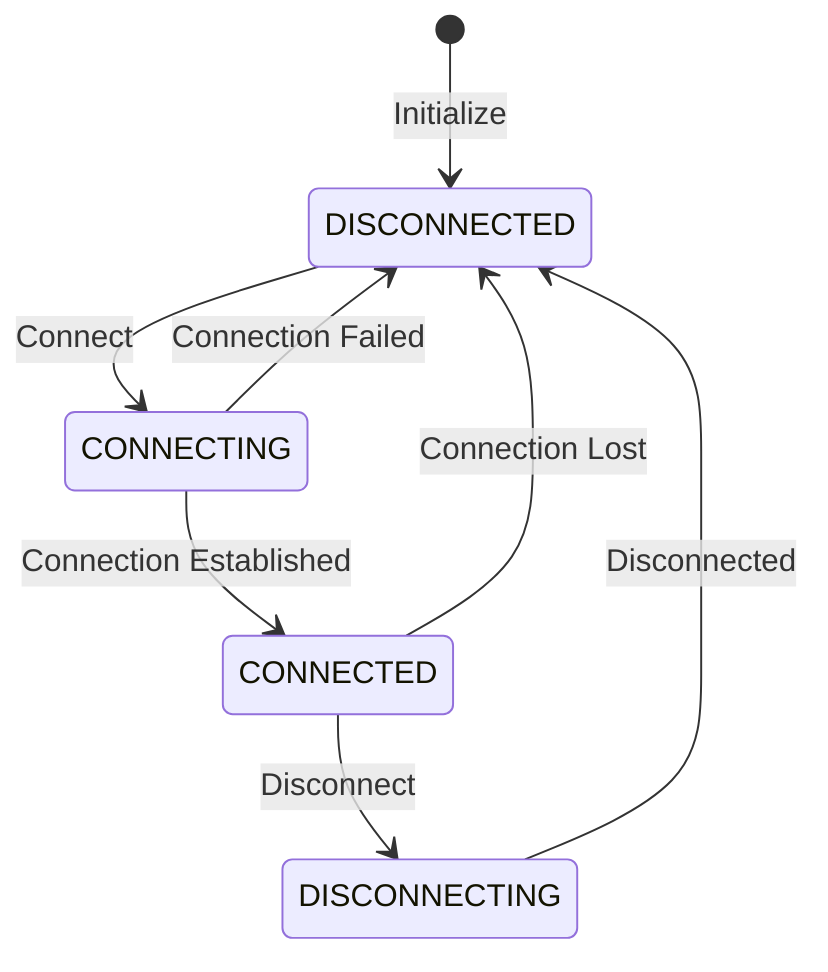

These state transitions affect the system's ability to receive market data and execute orders.

## Persistence Mechanisms

NautilusTrader provides comprehensive mechanisms for persisting state, ensuring data integrity and recovery capabilities:

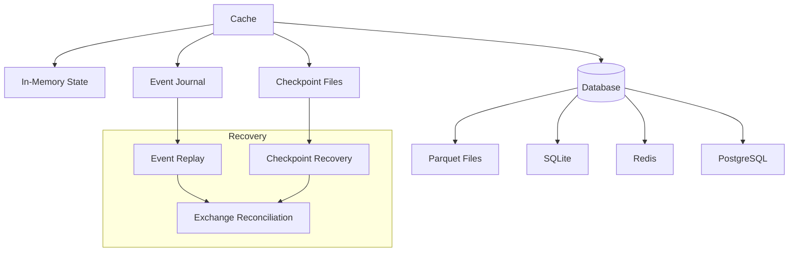

### In-Memory State

The default state is maintained in memory for maximum performance:

- All state objects are stored in the `Cache` component
- Optimized data structures for fast access and updates
- Thread-safe with fine-grained locking
- Immutable objects for consistent state representation

### Database Persistence

NautilusTrader supports persisting state to various databases and storage formats:

```python
from nautilus_trader.persistence.catalog import ParquetDataCatalog

# Create a data catalog for Parquet files
catalog = ParquetDataCatalog(
    path="/path/to/data",
    fs_protocol="file",  # Local filesystem
    # Alternative protocols: "s3", "gcs", "azure", etc.
)

# Register the catalog with the data engine
data_engine.register_catalog(catalog, "main")

# Save state to the catalog
data_engine.save_state(
    catalog_name="main",
    component_id="EXEC-ENGINE-001",  # Optional component filter
    data_type=DataType.ORDER,  # Optional data type filter
)
```

Supported storage formats and databases include:

1. **Parquet Files**: Efficient columnar storage format
2. **SQLite**: Embedded SQL database for local storage
3. **Redis**: In-memory data structure store for distributed deployments
4. **PostgreSQL**: Relational database for enterprise deployments
5. **Custom Adapters**: Extensible adapter system for custom storage solutions

### Event Journal

NautilusTrader implements event sourcing through an event journal:

```python
from nautilus_trader.persistence.journal import Journal

# Create a journal
journal = Journal(
    trader_id="TRADER-001",
    path="/path/to/journal",
    serializer="msgpack",  # or "json", "pickle"
)

# Register the journal with the message bus
message_bus.register_journal(journal)

# Events are automatically journaled as they flow through the system
```

The event journal provides:

1. **Complete Audit Trail**: All events are recorded with timestamps
2. **State Reconstruction**: State can be reconstructed by replaying events
3. **Debugging**: Events can be analyzed for troubleshooting
4. **Compliance**: Complete record of all system activity

### Checkpoint Files

State can be saved to checkpoint files for efficient recovery:

```python
# Save kernel state to a checkpoint file
kernel.save(
    path="/path/to/checkpoints",
    include_strategies=True,  # Include strategy state
    include_order_books=False,  # Exclude order books to save space
)

# Load kernel state from a checkpoint file
kernel.load(
    path="/path/to/checkpoints",
    reconcile=True,  # Reconcile with exchange after loading
)
```

Checkpoint files provide:

1. **Efficient Recovery**: Fast system restoration without event replay
2. **Selective State**: Can include or exclude specific state components
3. **Versioned Checkpoints**: Multiple checkpoints can be maintained

## Recovery Procedures

NautilusTrader implements sophisticated recovery procedures to ensure system reliability:

### Checkpoint Recovery

Restore system state from a saved checkpoint:

```python
# Initialize the system
kernel = NautilusKernel(config=config)

# Load state from checkpoint
kernel.load(
    path="/path/to/checkpoints",
    checkpoint_id="latest",  # or specific checkpoint ID
)

# Start the system
await kernel.start()
```

### Event Replay

Reconstruct state by replaying events from the journal:

```python
# Initialize the system
kernel = NautilusKernel(config=config)

# Replay events from journal
await kernel.replay_events(
    journal_path="/path/to/journal",
    from_timestamp=1625097600000000000,  # Optional start timestamp (ns)
    to_timestamp=1625184000000000000,    # Optional end timestamp (ns)
)

# Start the system
await kernel.start()
```

### Exchange Reconciliation

Reconcile local state with exchange state to ensure consistency:

```python
# Initialize the system
kernel = NautilusKernel(config=config)

# Start the system
await kernel.start()

# Reconcile with exchange
await kernel.reconcile(
    venue_id="BINANCE",  # Optional venue filter
    instrument_id="BTC-USDT",  # Optional instrument filter
    account_id="ACCOUNT-001",  # Optional account filter
    orders=True,  # Reconcile orders
    positions=True,  # Reconcile positions
    balances=True,  # Reconcile balances
)
```

The reconciliation process:

1. **Queries Exchange**: Retrieves current state from the exchange
2. **Compares States**: Compares local and exchange states
3. **Resolves Discrepancies**: Updates local state to match exchange state
4. **Generates Events**: Creates events to represent state changes
5. **Updates Cache**: Updates the cache with reconciled state

### Graceful Degradation

NautilusTrader is designed to continue operation with reduced functionality when full recovery is not possible:

1. **Component Isolation**: Failures in one component don't affect others
2. **Fallback Mechanisms**: Alternative data sources and execution paths
3. **Circuit Breakers**: Automatic protection against cascading failures
4. **Partial Recovery**: System can operate with partially recovered state

## Thread Safety and Concurrency Considerations

NautilusTrader is designed with a sophisticated concurrency model that ensures thread safety and efficient state management:

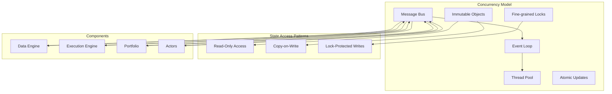

### Key Concurrency Features

1. **Message-Based Architecture**: Components communicate through a message bus rather than direct state access
2. **Single-Threaded Event Loop**: Core event processing occurs on a single thread to avoid race conditions
3. **Thread Pool**: I/O operations are offloaded to a thread pool for non-blocking performance
4. **Immutable State Objects**: State objects are immutable, preventing concurrent modification issues
5. **Copy-on-Write Pattern**: State updates create new objects rather than modifying existing ones
6. **Fine-Grained Locking**: When locks are necessary, they are fine-grained to minimize contention
7. **Atomic Updates**: State updates are atomic operations
8. **Event Sourcing**: State is derived from events, which simplifies concurrency management

### Concurrency Implementation

```python
class ExecutionEngine:
    """
    The execution engine component.
    """

    def __init__(self, msgbus, cache, clock, ...):
        self._msgbus = msgbus
        self._cache = cache
        self._clock = clock
        self._log = LoggerAdapter("ExecutionEngine")
        self._lock = RLock()  # Reentrant lock for thread safety
        # Other initialization...

    async def _handle_order_filled(self, event: OrderFilled) -> None:
        """
        Handle an order filled event.
        """
        # Thread-safe access to order state
        order = self._cache.order(event.order_id)
        if order is None:
            self._log.error(
                "Order not found in cache",
                order_id=event.order_id,
                client_order_id=event.client_order_id,
            )
            return

        # Create updated order (immutable copy-on-write pattern)
        updated_order = order.apply(event)

        # Update cache atomically with lock protection
        with self._lock:
            self._cache.update_order(updated_order)

        # Determine position ID
        position_id = PositionId.from_order(order)

        # Thread-safe access to position state
        position = self._cache.position(position_id)

        # Process position update
        if position is None:
            # Create new position
            new_position = Position.from_order_filled(
                order_id=order.id,
                instrument_id=order.instrument_id,
                strategy_id=order.strategy_id,
                side=PositionSide.from_order_side(order.side),
                quantity=event.fill_qty,
                price=event.fill_price,
                timestamp=event.ts_event,
            )

            # Update cache atomically
            with self._lock:
                self._cache.add_position(new_position)

            # Publish position opened event
            self._msgbus.publish(
                PositionOpened(
                    position_id=new_position.id,
                    instrument_id=new_position.instrument_id,
                    strategy_id=new_position.strategy_id,
                    side=new_position.side,
                    quantity=new_position.quantity,
                    price=new_position.avg_price,
                    timestamp=self._clock.timestamp_ns(),
                )
            )
        else:
            # Update existing position (immutable copy-on-write pattern)
            updated_position = position.apply(event)

            # Update cache atomically
            with self._lock:
                self._cache.update_position(updated_position)

            # Publish appropriate position event
            if updated_position.is_closed():
                self._msgbus.publish(
                    PositionClosed(
                        position_id=updated_position.id,
                        instrument_id=updated_position.instrument_id,
                        strategy_id=updated_position.strategy_id,
                        quantity=updated_position.quantity,
                        price=updated_position.avg_price,
                        realized_pnl=updated_position.realized_pnl,
                        timestamp=self._clock.timestamp_ns(),
                    )
                )
            else:
                self._msgbus.publish(
                    PositionChanged(
                        position_id=updated_position.id,
                        instrument_id=updated_position.instrument_id,
                        strategy_id=updated_position.strategy_id,
                        quantity=updated_position.quantity,
                        price=updated_position.avg_price,
                        timestamp=self._clock.timestamp_ns(),
                    )
                )
```

### Concurrency Benefits

This concurrency model provides several benefits:

1. **Predictable Behavior**: Single-threaded event processing ensures deterministic behavior
2. **Minimal Contention**: Fine-grained locking and immutable objects minimize lock contention
3. **Scalability**: The system can handle high event rates without degradation
4. **Debuggability**: Clear event flow makes debugging concurrent issues easier
5. **Resilience**: Isolation between components prevents cascading failures

This approach ensures that state updates are atomic and consistent, even in a highly concurrent environment with multiple data sources and execution venues.
